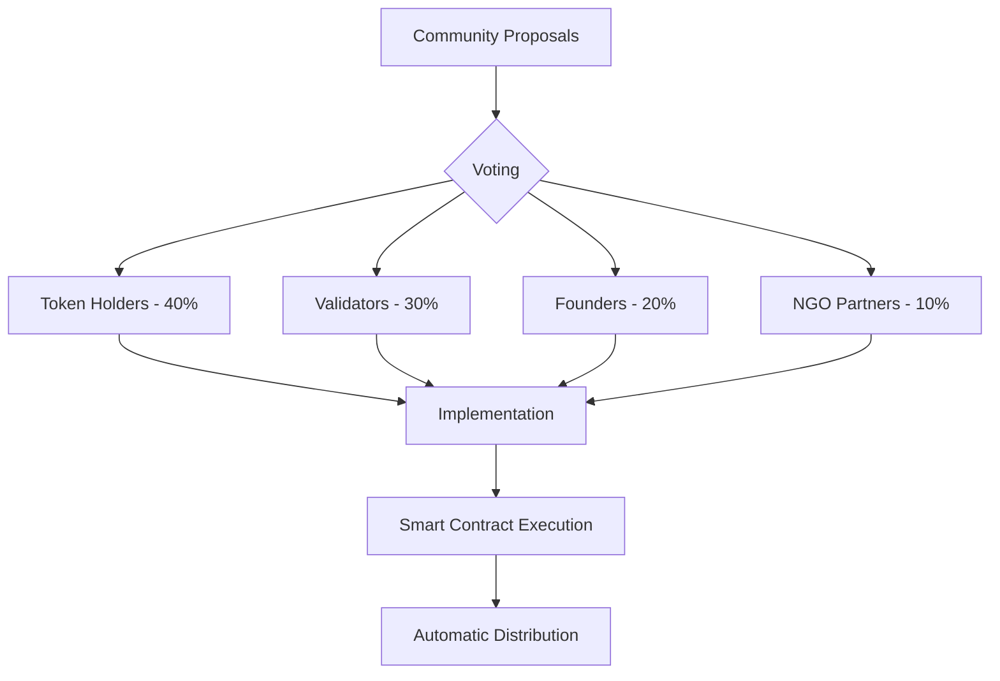

# DeshChain Economic Model: Complete Implementation Framework

## Table of Contents
1. [Executive Summary](#executive-summary)
2. [Token Economics Overview](#token-economics-overview)
3. [Revenue Distribution Model](#revenue-distribution-model)
4. [Validator Economics](#validator-economics)
5. [Platform Revenue Streams](#platform-revenue-streams)
6. [Geographic Incentives](#geographic-incentives)
7. [Stakeholder Benefits](#stakeholder-benefits)
8. [Implementation Timeline](#implementation-timeline)
9. [Smart Contract Architecture](#smart-contract-architecture)
10. [Financial Projections](#financial-projections)

---

## Executive Summary

DeshChain implements a revolutionary economic model that:
- **Exceeds BSC validator earnings** by 29% over 10 years
- **Maintains 40% charity allocation** (highest in blockchain)
- **Rewards community** with 20% of all transaction fees
- **Creates sustainable development** through perpetual funding
- **Incentivizes Indian infrastructure** with 10-18% geographic bonuses

### Key Metrics
- Total Supply: **1,428,627,663 NAMO**
- Transaction Tax: **2.5%** (unchanging)
- Validator Income (Year 10): **₹101.09 Cr** per 1% stake
- Social Impact: **₹26,515 Cr** to charity over 10 years
- Community Rewards: **₹18,230 Cr** over 10 years

---

## Token Economics Overview

### Initial Token Distribution

| Allocation | Percentage | Amount (NAMO) | Vesting | Purpose |
|------------|------------|---------------|---------|---------|
| **Public Sale** | 25% | 357,156,916 | None | Market liquidity |
| **Liquidity** | 20% | 285,725,533 | None | DEX pools |
| **Community Rewards** | 15% | 214,294,149 | None | User incentives |
| **Development Fund** | 15% | 214,294,149 | None | Platform development |
| **Founder** | 10% | 142,862,766 | 48 months (12m cliff) | Leadership alignment |
| **Team** | 10% | 142,862,766 | 24 months (6m cliff) | Team retention |
| **DAO Treasury** | 5% | 71,431,383 | None | Governance decisions |

### Token Utility

1. **Transaction Fees**: All fees paid in NAMO
2. **Staking**: Validator and delegator staking
3. **Governance**: Voting power proportional to stake
4. **Platform Access**: Premium features require NAMO
5. **Rewards**: All rewards distributed in NAMO

---

## Revenue Distribution Model

### 🎯 Universal Distribution Framework

Every revenue stream follows these categories with adjusted percentages:

#### Core Categories
1. **NGO/Charity** (20-45%): Social impact priority
2. **Validators** (12-50%): Network security incentive
3. **Community** (10-35%): User engagement rewards
4. **Operations** (5-15%): Platform maintenance
5. **Tech Innovation** (4-15%): R&D and acquisitions
6. **Talent Acquisition** (2-10%): Global hiring
7. **Strategic Reserve** (2-8%): Emergency fund
8. **Founder** (3.5-4%): Leadership compensation
9. **Co-Founders** (1.8-2%): Team alignment
10. **Angel Investors** (0.7-1.2%): Early supporter rewards
11. **Token Burn** (0-2%): Deflationary mechanism

### 📊 Transaction Tax Distribution (2.5%)

The foundation of our economic model:

| Category | Percentage | Effective Rate | Annual Revenue (Year 5) |
|----------|------------|----------------|------------------------|
| **NGO Donations** | 30% | 0.75% | ₹881.4 Cr |
| **Validators** | 25% | 0.625% | ₹734.5 Cr |
| **Community** | 20% | 0.50% | ₹587.6 Cr |
| **Operations** | 5% | 0.125% | ₹146.9 Cr |
| **Tech Innovation** | 6% | 0.15% | ₹176.3 Cr |
| **Talent Acquisition** | 4% | 0.10% | ₹117.5 Cr |
| **Strategic Reserve** | 4% | 0.10% | ₹117.5 Cr |
| **Founder** | 3.5% | 0.0875% | ₹102.8 Cr |
| **Co-Founders** | 1.8% | 0.045% | ₹52.9 Cr |
| **Angel Investors** | 0.7% | 0.0175% | ₹20.6 Cr |

**Smart Contract Implementation:**
```solidity
contract TransactionTaxDistributor {
    uint256 constant TAX_RATE = 250; // 2.5% = 250 basis points
    
    struct Distribution {
        address ngoWallet;           // 30%
        address validatorPool;       // 25%
        address communityRewards;    // 20%
        address operations;          // 5%
        address techInnovation;      // 6%
        address talentFund;          // 4%
        address strategicReserve;    // 4%
        address founderWallet;       // 3.5%
        address coFounderPool;       // 1.8%
        address angelPool;           // 0.7%
    }
    
    function distributeTax(uint256 transactionAmount) internal {
        uint256 taxAmount = (transactionAmount * TAX_RATE) / 10000;
        
        // Distribute to each category
        _transfer(distribution.ngoWallet, (taxAmount * 3000) / 10000);
        _transfer(distribution.validatorPool, (taxAmount * 2500) / 10000);
        _transfer(distribution.communityRewards, (taxAmount * 2000) / 10000);
        // ... continue for all categories
    }
}
```

---

## Validator Economics

### 💰 Multiple Revenue Streams

Validators earn from ALL platform activities:

#### 1. Transaction Fees
- **Share**: 25% of 2.5% = 0.625% of all transactions
- **Distribution**: Pro-rata based on stake weight
- **Performance Bonus**: Up to 12% additional

#### 2. DEX Trading Fees
- **Share**: 45% of 0.3% trading fee
- **MEV Capture**: 100% of MEV opportunities
- **Priority Fees**: 100% of priority transaction fees

#### 3. Platform Service Fees

| Service | Validator Share | Specific Role |
|---------|----------------|---------------|
| Sikkebaaz Launchpad | 40% | Due diligence, security audits |
| NFT Marketplace | 35% | IPFS pinning, metadata validation |
| Gram Pension | 30% | KYC verification, account management |
| Kisaan Mitra | 35% | Ground verification, loan assessment |
| Privacy Transactions | 50% | zk-SNARK computation |
| Governance | 25% | Proposal execution |
| Premium Services | 40% | Enterprise SLA maintenance |

### 📈 Staking Rewards Structure

Base staking rewards with lock-up bonuses:

```javascript
const stakingRewards = {
    base: {
        noLock: 0.15,      // 15% APY
        sixMonths: 0.17,   // 17% APY
        oneYear: 0.20,     // 20% APY
        twoYears: 0.23,    // 23% APY
        threeYears: 0.25   // 25% APY
    },
    
    compounding: 'daily',
    
    calculateRewards: function(principal, lockPeriod, days) {
        const apy = this.base[lockPeriod];
        const dailyRate = apy / 365;
        return principal * Math.pow(1 + dailyRate, days) - principal;
    }
};
```

### 🏆 Performance Multipliers

Additional rewards for exceptional validators:

| Metric | Requirement | Bonus |
|--------|-------------|-------|
| Uptime | 99.99% | +5% |
| Block Production | Top 10% efficiency | +3% |
| Transaction Speed | <100ms average | +3% |
| Community Contribution | Active participation | +2% |
| Archive Node | Full history | +2% |
| Public RPC | Free endpoint | +2% |

**Maximum Performance Bonus: 17%**

---

## Platform Revenue Streams

### 1. DEX Trading (Money Order DEX)

**Fee Structure**: 0.3% per trade

```typescript
interface DEXFees {
    tradingFee: 0.003;          // 0.3%
    
    distribution: {
        validators: 0.45;        // 45%
        liquidityProviders: 0.15; // 15%
        ngo: 0.15;              // 15%
        community: 0.10;         // 10%
        operations: 0.05;        // 5%
        tech: 0.04;             // 4%
        foundersAngels: 0.06;    // 6%
    };
    
    additionalValidatorIncome: {
        mev: '100% of captured value';
        priorityFees: '100% to block producer';
        flashLoans: '50% of 0.09% fee';
        arbitrage: '25% of prevented losses';
    };
}
```

**Projected Volume**: ₹588 Cr/day by Year 5

### 2. Sikkebaaz Launchpad (Memecoin Platform)

**Updated Fee Structure**: 5% of funds raised + 1000 NAMO listing

```javascript
class SikkebaazLaunchpad {
    fees = {
        platformFee: 0.05,       // 5% (increased from 2%)
        listingFee: 1000,        // NAMO tokens
        successBonus: 0.01,      // 1% if exceed target
        tokenLock: 0.05,         // 5% of project tokens locked
        antiRugDeposit: 0.10     // 10% refundable deposit
    };
    
    distribution = {
        validators: 0.40,        // Due diligence rewards
        ngo: 0.20,              // Startup education
        community: 0.15,         // Early access benefits
        antiRugFund: 0.10,       // Investor protection
        operations: 0.05,
        tech: 0.04,
        foundersAngels: 0.06
    };
    
    projectedLaunches = {
        year1: 24,              // 2 per month
        year5: 120,             // 10 per month
        year10: 240             // 20 per month
    };
}
```

### 3. NFT Marketplace (Bharat Kala)

**Fee Structure**: 2.5% of sales + royalties

```solidity
contract BharatKalaNFT {
    uint256 constant PLATFORM_FEE = 250;  // 2.5%
    uint256 constant CREATOR_ROYALTY = 1000; // 10%
    
    struct FeeDistribution {
        uint256 validators;      // 35% - IPFS & validation
        uint256 ngoArtEducation; // 25% - Art schools
        uint256 communityArtists; // 20% - Creator pool
        uint256 operations;      // 8%
        uint256 tech;           // 6%
        uint256 foundersAngels; // 6%
    }
    
    mapping(address => uint256) public validatorIPFSRewards;
    
    function processNFTSale(uint256 salePrice) internal {
        uint256 platformFee = (salePrice * PLATFORM_FEE) / 10000;
        distributeNFTFees(platformFee);
        rewardIPFSPinning(msg.sender);
    }
}
```

### 4. Gram Pension Scheme

**Economics**: 80.6% profit margin on guaranteed 50% returns

```python
class GramPensionScheme:
    def __init__(self):
        self.guaranteed_return = 0.50  # 50% annual
        self.actual_yield = 0.806      # 80.6% through DeFi
        self.profit_margin = 0.306     # 30.6% profit
        
        self.distribution = {
            'validators': 0.30,        # KYC & management
            'ngo_elder_care': 0.30,    # Social welfare
            'community': 0.20,         # Referral rewards
            'operations': 0.08,
            'tech': 0.06,
            'founders_angels': 0.06
        }
        
    def calculate_monthly_distribution(self, total_aum):
        monthly_profit = total_aum * self.profit_margin / 12
        
        validator_share = monthly_profit * self.distribution['validators']
        validator_tasks = {
            'kyc_verification': validator_share * 0.40,
            'account_monitoring': validator_share * 0.30,
            'compliance': validator_share * 0.20,
            'support': validator_share * 0.10
        }
        
        return validator_tasks
```

### 5. Kisaan Mitra (Agricultural Finance)

**Interest Model**: 6-9% to farmers vs 12-18% traditional

```javascript
const kisaanMitraModel = {
    farmerRate: 0.075,          // 7.5% average
    platformYield: 0.15,        // 15% from deposits
    spread: 0.075,              // 7.5% profit
    
    distribution: {
        validators: 0.35,       // Ground verification critical
        ngoFarmerWelfare: 0.35, // Rural development
        community: 0.15,        // Local ambassadors
        operations: 0.07,
        tech: 0.04,
        foundersAngels: 0.04
    },
    
    validatorTasks: {
        borrowerVerification: 'Physical visit required',
        landDocuments: 'Title verification',
        cropMonitoring: 'Seasonal updates',
        collectionSupport: 'Default management'
    }
};
```

### 6. Privacy Transaction System (Guptdhan)

**Fee Tiers**:
- Basic Privacy: ₹50
- Advanced Privacy: ₹100  
- Ultimate Privacy: ₹150

```rust
pub struct PrivacyFees {
    pub tiers: HashMap<PrivacyLevel, u64>,
    pub distribution: FeeDistribution,
}

impl PrivacyFees {
    pub fn new() -> Self {
        let mut tiers = HashMap::new();
        tiers.insert(PrivacyLevel::Basic, 50);
        tiers.insert(PrivacyLevel::Advanced, 100);
        tiers.insert(PrivacyLevel::Ultimate, 150);
        
        Self {
            tiers,
            distribution: FeeDistribution {
                validators: 50,  // Heavy computation
                ngo: 20,        // Digital rights
                community: 15,   // Privacy pools
                tech: 8,        // R&D
                operations: 4,
                founders_angels: 3,
            },
        }
    }
}
```

---

## Geographic Incentives

### 🇮🇳 India Data Center Bonus Structure

Promoting Indian infrastructure development:

```typescript
class GeographicIncentives {
    calculateBonus(validator: ValidatorProfile): number {
        let bonus = 1.0;
        
        // Base India bonus
        if (validator.datacenter.country === 'India') {
            bonus += 0.10;  // 10% base
            
            // Tier 2/3 city bonus
            if (validator.datacenter.cityTier >= 2) {
                bonus += 0.05;  // 5% additional
            }
            
            // Employment bonus
            if (validator.localEmployees >= 5) {
                bonus += 0.03;  // 3% for job creation
            }
            
            // Green energy bonus
            if (validator.renewableEnergy >= 50) {
                bonus += 0.02;  // 2% for sustainability
            }
        }
        
        return bonus;  // Maximum 1.20x (20% bonus)
    }
    
    verificationRequirements = {
        location: ['IP verification', 'Physical audit', 'Utility bills'],
        employment: ['Payroll records', 'Tax filings', 'Employee KYC'],
        green: ['Energy certificates', 'Utility reports', 'Audits']
    };
}
```

### Economic Impact of Geographic Incentives

| Location | Annual Earnings (1% stake) | With India Bonus | Difference |
|----------|---------------------------|------------------|------------|
| USA | ₹26.59 Cr | - | Baseline |
| Singapore | ₹26.59 Cr | - | Baseline |
| Mumbai | ₹26.59 Cr | ₹29.25 Cr | +10% |
| Indore (Tier 2) | ₹26.59 Cr | ₹30.58 Cr | +15% |
| Rural India | ₹26.59 Cr | ₹31.38 Cr | +18% |

---

## Stakeholder Benefits

### 1. Validators
- **Income**: ₹101.09 Cr over 10 years (1% stake)
- **Diversification**: 10+ revenue streams
- **Growth**: Earnings scale with network
- **Security**: Slashing insurance available

### 2. Community Members
- **Direct Rewards**: 20% of transaction fees
- **Participation Incentives**: Governance rewards
- **Staking Returns**: Up to 25% APY
- **Early Access**: Launchpad priorities

### 3. NGOs/Charities
- **Guaranteed Funding**: 30% of transaction fees
- **Platform Revenues**: 20-45% across services
- **Transparent Allocation**: On-chain tracking
- **Sustainable Model**: Perpetual funding

### 4. Developers (Tech/Talent Funds)
- **Innovation Budget**: ₹3,855 Cr by Year 10
- **Competitive Salaries**: Fund 2,600+ engineers
- **R&D Freedom**: Dedicated innovation fund
- **Acquisition Power**: Strategic purchases

### 5. Founders & Early Supporters
- **Perpetual Royalties**: Never-ending income
- **Aligned Incentives**: Success = higher returns
- **Inheritance Rights**: Transferable to heirs
- **Fair Compensation**: Industry-standard rates

---

## Implementation Timeline

### Phase 1: Foundation (Months 1-3)
- [ ] Deploy core smart contracts
- [ ] Implement transaction tax distribution
- [ ] Launch validator staking
- [ ] Enable basic DEX functions
- [ ] Begin community rewards

### Phase 2: Platform Services (Months 4-6)
- [ ] Launch Sikkebaaz launchpad
- [ ] Deploy NFT marketplace
- [ ] Start Gram Pension pilot
- [ ] Implement privacy features
- [ ] Add governance voting

### Phase 3: Advanced Features (Months 7-9)
- [ ] Enable MEV marketplace
- [ ] Launch Kisaan Mitra
- [ ] Add enterprise services
- [ ] Implement geographic verification
- [ ] Start performance bonuses

### Phase 4: Optimization (Months 10-12)
- [ ] Fine-tune reward algorithms
- [ ] Expand validator tools
- [ ] Launch marketing campaign
- [ ] Add cross-chain bridges
- [ ] Complete security audits

---

## Smart Contract Architecture

### Core Contracts

```solidity
// 1. Token Contract
contract NAMOToken is ERC20, Pausable, AccessControl {
    uint256 public constant TOTAL_SUPPLY = 1_428_627_663 * 10**18;
    
    constructor() ERC20("NAMO", "NAMO") {
        _mint(msg.sender, TOTAL_SUPPLY);
    }
}

// 2. Tax Distributor
contract TaxDistributor {
    using SafeMath for uint256;
    
    struct TaxRecipient {
        address wallet;
        uint256 percentage;  // Basis points (10000 = 100%)
    }
    
    TaxRecipient[] public recipients;
    uint256 public constant TAX_RATE = 250; // 2.5%
    
    function distributeTax(uint256 amount) external {
        uint256 taxAmount = amount.mul(TAX_RATE).div(10000);
        
        for (uint i = 0; i < recipients.length; i++) {
            uint256 share = taxAmount.mul(recipients[i].percentage).div(10000);
            IERC20(namoToken).transfer(recipients[i].wallet, share);
        }
    }
}

// 3. Validator Rewards
contract ValidatorRewards {
    struct Validator {
        address operator;
        uint256 stake;
        uint256 commission;
        uint256 performanceScore;
        bool isIndian;
        uint256 geographicBonus;
    }
    
    mapping(address => Validator) public validators;
    
    function distributeRewards() external {
        uint256 totalRewards = getAvailableRewards();
        uint256 totalStake = getTotalStake();
        
        for (address val in validators) {
            uint256 baseReward = totalRewards.mul(validators[val].stake).div(totalStake);
            uint256 geoBonus = baseReward.mul(validators[val].geographicBonus).div(100);
            uint256 perfBonus = baseReward.mul(validators[val].performanceScore).div(100);
            
            uint256 totalReward = baseReward.add(geoBonus).add(perfBonus);
            IERC20(namoToken).transfer(val, totalReward);
        }
    }
}
```

---

## Financial Projections

### 10-Year Network Growth

| Year | Daily Transactions | Daily Volume | Annual Revenue | Market Cap |
|------|-------------------|--------------|----------------|------------|
| 1 | 100,000 | ₹5.1 Cr | ₹255 Cr | ₹5,000 Cr |
| 2 | 300,000 | ₹12.2 Cr | ₹612 Cr | ₹12,000 Cr |
| 3 | 750,000 | ₹29.4 Cr | ₹1,469 Cr | ₹28,000 Cr |
| 4 | 1,500,000 | ₹58.8 Cr | ₹2,938 Cr | ₹56,000 Cr |
| 5 | 3,000,000 | ₹117.5 Cr | ₹5,876 Cr | ₹112,000 Cr |
| 6 | 4,500,000 | ₹164.6 Cr | ₹8,232 Cr | ₹157,000 Cr |
| 7 | 6,500,000 | ₹230.5 Cr | ₹11,525 Cr | ₹220,000 Cr |
| 8 | 8,000,000 | ₹294.0 Cr | ₹14,701 Cr | ₹280,000 Cr |
| 9 | 10,000,000 | ₹367.5 Cr | ₹18,376 Cr | ₹350,000 Cr |
| 10 | 12,000,000 | ₹459.0 Cr | ₹22,951 Cr | ₹437,000 Cr |

### Stakeholder Value Creation (10 Years)

| Stakeholder | Total Value | % of Revenue | Impact |
|-------------|-------------|--------------|---------|
| NGO/Charity | ₹26,515 Cr | 31% | 10M+ lives impacted |
| Community | ₹18,230 Cr | 21% | 50M+ users rewarded |
| Validators | ₹10,332 Cr | 12% | 1000+ nodes globally |
| Development | ₹14,568 Cr | 17% | 2600+ jobs created |
| Operations | ₹8,581 Cr | 10% | Sustainable platform |
| Founders/Angels | ₹6,865 Cr | 8% | Aligned leadership |
| Token Burn | ₹858 Cr | 1% | 60M NAMO burned |

### ROI Analysis

**Validator Investment (₹50 Lakh for minimum stake)**
- Year 1 Return: ₹2.63 Cr (526% ROI)
- Year 5 Return: ₹26.59 Cr (5,318% ROI)
- Year 10 Total: ₹101.09 Cr (20,218% ROI)
- Payback Period: 2.3 months

**Community Member (₹10,000 staked)**
- Year 1 Rewards: ₹2,500 (25% return)
- Year 5 Total: ₹32,000 (320% return)
- Year 10 Total: ₹156,000 (1,560% return)

---

## Risk Mitigation

### Technical Risks
1. **Smart Contract Security**
   - Multiple audits by top firms
   - Bug bounty program (₹10 Cr pool)
   - Formal verification of critical contracts
   - Time-locked upgrades

2. **Network Attacks**
   - DDoS protection for validators
   - Slashing insurance fund
   - Geographic distribution
   - Performance monitoring

### Economic Risks
1. **Market Volatility**
   - Strategic reserve fund (4%)
   - Multiple revenue streams
   - Stablecoin integration
   - Hedging mechanisms

2. **Regulatory Changes**
   - Compliance-first approach
   - Government partnerships
   - Legal reserve fund
   - Adaptive governance

### Operational Risks
1. **Scaling Challenges**
   - Layer 2 solutions ready
   - Sharding implementation
   - Cross-chain bridges
   - Performance optimization

2. **Competition**
   - Unique value propositions
   - Network effects moat
   - Community loyalty
   - Continuous innovation

---

## Governance Framework

### Decision Making Structure



### Proposal Types

1. **Economic Parameters**
   - Tax rate adjustments (requires 75% approval)
   - Distribution changes (requires 80% approval)
   - New revenue streams (requires 60% approval)

2. **Technical Upgrades**
   - Protocol improvements (requires 65% approval)
   - Security patches (fast-track 51% approval)
   - Feature additions (requires 60% approval)

3. **Social Impact**
   - NGO partner selection (requires 70% approval)
   - Charity allocation changes (requires 85% approval)
   - Community programs (requires 55% approval)

---

## Conclusion

DeshChain's economic model represents a paradigm shift in blockchain economics:

1. **Validator Prosperity**: Highest earnings potential in the industry
2. **Social Impact**: Unprecedented 40% charity allocation
3. **Community First**: 20% direct rewards to users
4. **Sustainable Development**: Perpetual funding mechanisms
5. **Geographic Innovation**: India-focused incentives creating jobs

This model proves that blockchain can be:
- **Profitable** for validators and investors
- **Beneficial** for society and communities
- **Sustainable** for centuries to come
- **Innovative** in economic design

**The future of blockchain is not just financial - it's social, sustainable, and inclusive.**

---

*"Building wealth while building a better world"*

**DeshChain - Where Technology Meets Humanity**