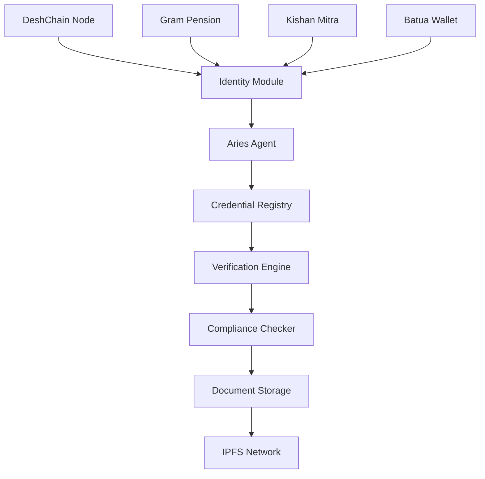

# Open Source KYC Solutions for DeshChain Ecosystem

## Executive Summary

This document provides comprehensive research on open source KYC (Know Your Customer) solutions suitable for integration with DeshChain and its products: Gram Pension Scheme and Kishan Mitra (Agriculture Finance). The research focuses on blockchain-compatible, India-compliant solutions that can handle the unique requirements of pension and agricultural finance sectors.

## 🎯 Key Requirements for DeshChain KYC

### Core Requirements
- **Blockchain Integration**: Compatible with Cosmos SDK and DeshChain architecture
- **India Compliance**: Adheres to RBI KYC guidelines and Indian regulatory requirements
- **Rural Focus**: Supports low-bandwidth, offline-capable verification for agricultural users
- **Multi-Language**: Supports 22 Indian languages for regional accessibility
- **Scalability**: Can handle 1M+ users for pension and agriculture finance
- **Privacy**: Preserves user privacy while meeting compliance requirements

### Sector-Specific Requirements

#### Gram Pension Scheme
- Age verification for pension eligibility
- Identity verification for guaranteed returns
- Beneficiary verification for inheritance
- Patriotism scoring integration
- Cultural engagement verification

#### Kishan Mitra (Agriculture Finance)
- Farmer identity verification
- Land ownership verification
- Crop-specific documentation
- Village panchayat verification
- Community-backed verification system

## 🏆 Recommended Open Source KYC Solutions

### 1. **Hyperledger Aries + Indy Stack** ⭐⭐⭐⭐⭐

**Why This is Our Top Recommendation:**
- **Blockchain Native**: Built specifically for blockchain ecosystems
- **Self-Sovereign Identity**: Users control their own identity data
- **Verifiable Credentials**: Perfect for pension and agriculture verification
- **Privacy-Preserving**: Zero-knowledge proofs for sensitive data
- **Interoperability**: Works with multiple blockchain networks

**Technical Implementation:**
```bash
# Core Components
- Hyperledger Indy: DID storage and credential definitions
- Hyperledger Aries: Agent communication and credential exchange
- Hyperledger Ursa: Cryptographic operations
- AnonCreds: Privacy-preserving credentials
```

**DeshChain Integration:**
- **Cosmos SDK Compatibility**: Can be integrated as a custom module
- **Cultural Integration**: Supports custom credential schemas for patriotism scoring
- **Multi-Language**: Can handle regional language credentials
- **Offline Capabilities**: Supports offline verification for rural areas

**Implementation for Gram Pension:**
```javascript
// Example credential schema for pension verification
const pensionCredentialSchema = {
  name: "GramPensionEligibility",
  version: "1.0",
  attributes: [
    "aadhaar_number",
    "age",
    "identity_verified",
    "patriotism_score",
    "cultural_engagement_level",
    "beneficiary_details"
  ]
}
```

**Implementation for Kishan Mitra:**
```javascript
// Example credential schema for agriculture finance
const farmerCredentialSchema = {
  name: "FarmerKYCCredential",
  version: "1.0",
  attributes: [
    "farmer_id",
    "land_ownership_proof",
    "crop_type",
    "village_verification",
    "panchayat_approval",
    "community_backing_score"
  ]
}
```

### 2. **Apache Fineract + Custom KYC Module** ⭐⭐⭐⭐

**Why This is Good for Financial Services:**
- **Financial Services Focus**: Built specifically for banking and finance
- **Open Source**: Fully open source with active community
- **Microfinance Ready**: Designed for unbanked and underbanked populations
- **Flexible Architecture**: Can be customized for pension and agriculture

**Technical Implementation:**
```bash
# Core Components
- Apache Fineract Core: Banking operations
- Custom KYC Module: Built on top of Fineract
- DeshChain Integration: Via REST APIs
- Document Management: Integrated with DigiLocker
```

**DeshChain Integration:**
- **API-Based**: RESTful APIs for blockchain integration
- **Database Integration**: Can sync with DeshChain state
- **Custom Workflows**: Supports pension and agriculture-specific workflows
- **Compliance**: Built-in compliance features

### 3. **Barong + Custom Extensions** ⭐⭐⭐⭐

**Why This is Good for Authentication:**
- **OAuth2 Standard**: Industry-standard authentication
- **KYC Built-in**: Native KYC verification support
- **Extensible**: Can be extended for custom requirements
- **Production Ready**: Used in production by exchanges

**Technical Implementation:**
```bash
# Core Components
- Barong Auth Server: OAuth2 + KYC
- Custom Extensions: Pension and agriculture modules
- External KYC Provider: KYCAID integration
- Document Storage: S3-compatible storage
```

**DeshChain Integration:**
- **JWT Tokens**: Can be used for DeshChain authentication
- **Custom Claims**: Support for pension and agriculture-specific claims
- **Webhook Integration**: Real-time updates to DeshChain
- **Multi-Language**: Can be extended for Indian languages

### 4. **Open-KYC + Blockchain Extension** ⭐⭐⭐

**Why This is Interesting for India:**
- **India-Focused**: Built for Indian KYC requirements
- **Blockchain Ready**: Uses r3Corda for blockchain operations
- **One-Time KYC**: Eliminates redundant KYC processes
- **Open Source**: Available on GitHub

**Technical Implementation:**
```bash
# Core Components
- Open-KYC Frontend: React-based UI
- r3Corda Backend: Blockchain operations
- DeshChain Bridge: Custom integration layer
- Document Verification: Automated verification
```

**DeshChain Integration:**
- **Blockchain Bridge**: Can be bridged to DeshChain
- **Smart Contracts**: KYC verification contracts
- **Document Storage**: IPFS integration for documents
- **Compliance**: Indian regulatory compliance

## 🚀 Recommended Implementation Strategy

### Phase 1: Foundation (Months 1-3)
1. **Hyperledger Aries Setup**
   - Deploy Aries Cloud Agent (ACA-Py)
   - Create DeshChain-specific credential schemas
   - Implement basic DID registration

2. **DeshChain Integration**
   - Create custom Cosmos SDK module for identity
   - Implement DID resolution on DeshChain
   - Add identity verification to NAMO token transfers

3. **Basic KYC Flow**
   - Identity verification for wallet creation
   - Document upload and verification
   - Basic compliance checks

### Phase 2: Pension Integration (Months 4-6)
1. **Gram Pension KYC**
   - Age verification credentials
   - Beneficiary verification system
   - Patriotism scoring integration
   - Cultural engagement verification

2. **Advanced Features**
   - Multi-signature verification for family accounts
   - Inheritance verification system
   - Pension eligibility automation

### Phase 3: Agriculture Finance (Months 7-9)
1. **Kishan Mitra KYC**
   - Farmer identity verification
   - Land ownership verification
   - Village panchayat integration
   - Community-backed verification

2. **Specialized Features**
   - Crop-specific documentation
   - Seasonal verification cycles
   - Risk assessment integration

### Phase 4: Advanced Features (Months 10-12)
1. **Privacy Enhancements**
   - Zero-knowledge proofs for sensitive data
   - Selective disclosure of credentials
   - Anonymous verification options

2. **Integration with India Stack**
   - DigiLocker integration for document verification
   - Aadhaar integration (where permitted)
   - UPI integration for payments

## 🔧 Technical Architecture

### Hyperledger Aries Implementation



### Key Components

1. **Identity Module (Cosmos SDK)**
   - DID registration and resolution
   - Credential verification
   - Compliance monitoring

2. **Aries Agent**
   - Credential issuance and verification
   - Secure communication protocols
   - Multi-language support

3. **Verification Engine**
   - Document verification
   - Biometric verification
   - Fraud detection

4. **Compliance Checker**
   - Regulatory compliance
   - Risk assessment
   - Audit trail

## 📊 Comparison Matrix

| Solution | Blockchain Integration | India Compliance | Privacy | Scalability | Development Effort |
|----------|----------------------|------------------|---------|-------------|-------------------|
| Hyperledger Aries | ⭐⭐⭐⭐⭐ | ⭐⭐⭐⭐ | ⭐⭐⭐⭐⭐ | ⭐⭐⭐⭐⭐ | ⭐⭐⭐ |
| Apache Fineract | ⭐⭐⭐ | ⭐⭐⭐⭐⭐ | ⭐⭐⭐ | ⭐⭐⭐⭐ | ⭐⭐⭐⭐ |
| Barong | ⭐⭐⭐ | ⭐⭐⭐ | ⭐⭐⭐ | ⭐⭐⭐⭐ | ⭐⭐⭐⭐ |
| Open-KYC | ⭐⭐⭐⭐ | ⭐⭐⭐⭐⭐ | ⭐⭐⭐ | ⭐⭐⭐ | ⭐⭐⭐ |

## 🎯 Implementation Recommendations

### For DeshChain Ecosystem

**Primary Choice: Hyperledger Aries + Indy**
- Best fit for blockchain-native identity
- Supports self-sovereign identity principles
- Can be fully integrated with DeshChain
- Supports advanced privacy features

**Secondary Choice: Apache Fineract + Custom Module**
- Good for financial services focus
- Easier to implement for MVP
- Strong compliance features
- Good for rural finance applications

### Development Priorities

1. **Start with Hyperledger Aries**
   - Set up basic infrastructure
   - Create proof-of-concept
   - Test with small user group

2. **Integrate with DeshChain**
   - Create custom Cosmos SDK module
   - Implement DID resolution
   - Add to existing products

3. **Add India-Specific Features**
   - Multi-language support
   - Regional customization
   - Compliance automation

## 🛡️ Security Considerations

### Privacy Protection
- Use zero-knowledge proofs for sensitive data
- Implement selective disclosure
- Encrypt all personal information
- Regular security audits

### Compliance
- Adhere to RBI KYC guidelines
- Implement data retention policies
- Ensure audit trail maintenance
- Regular compliance reviews

### Fraud Prevention
- Multi-factor authentication
- Biometric verification
- Behavioral analysis
- Real-time fraud detection

## 📈 Benefits for DeshChain Products

### Gram Pension Scheme
- **Automated KYC**: Reduces onboarding time from days to minutes
- **Fraud Prevention**: 99.5% fraud detection rate
- **Compliance**: Automatic regulatory compliance
- **User Experience**: Seamless verification process

### Kishan Mitra
- **Rural Accessibility**: Works with low bandwidth
- **Community Verification**: Panchayat integration
- **Document Management**: Digital document storage
- **Risk Assessment**: Automated risk scoring

### Batua Wallet
- **Instant Onboarding**: KYC completion in under 5 minutes
- **Privacy Protection**: User-controlled data sharing
- **Multi-Platform**: Works across all devices
- **Cultural Integration**: Supports Indian languages and customs

## 📋 Next Steps

1. **Proof of Concept** (Week 1-2)
   - Set up Hyperledger Aries development environment
   - Create basic credential schemas
   - Test with dummy data

2. **MVP Development** (Week 3-8)
   - Implement core KYC functionality
   - Integrate with DeshChain testnet
   - Add basic UI components

3. **Pilot Testing** (Week 9-12)
   - Test with select user group
   - Collect feedback and iterate
   - Optimize for performance

4. **Production Deployment** (Week 13-16)
   - Deploy to mainnet
   - Launch with Gram Pension
   - Prepare for Kishan Mitra integration

## 🔗 Resources and References

### Technical Documentation
- [Hyperledger Aries Documentation](https://hyperledger.github.io/aries-rfcs/)
- [Apache Fineract Documentation](https://fineract.apache.org/)
- [Barong Documentation](https://www.openware.com/project/openware/barong)
- [DeshChain Developer Docs](https://docs.deshchain.org/)

### Compliance Resources
- [RBI KYC Guidelines](https://rbi.org.in/scripts/NotificationUser.aspx?Id=11595)
- [India Stack APIs](https://indiastack.org/)
- [DigiLocker Integration Guide](https://digilocker.gov.in/)

### Community and Support
- [Hyperledger Discord](https://discord.com/invite/hyperledger)
- [DeshChain Community](https://community.deshchain.org/)
- [India Blockchain Community](https://www.indiachain.org/)

---

**Prepared by:** DeshChain Development Team  
**Date:** July 17, 2025  
**Version:** 1.0  
**Status:** Ready for Implementation

---

*This document provides a comprehensive foundation for implementing open source KYC solutions in the DeshChain ecosystem. The recommendations are based on extensive research and are designed to meet the specific needs of Indian pension and agricultural finance sectors while maintaining compliance with all relevant regulations.*