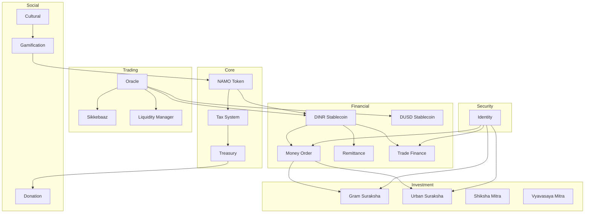

# DeshChain Module Documentation Overview

## Complete Module Architecture

DeshChain consists of 31 specialized modules that work together to create a comprehensive blockchain ecosystem. Each module serves specific functions while integrating seamlessly with others.

## Module Categories

### 1. Core Financial Modules
- **[NAMO](./modules/NAMO_MODULE.md)** - Native token and core tokenomics
- **[DINR](./modules/DINR_MODULE.md)** - Algorithmic INR stablecoin
- **[Treasury](./modules/TREASURY_MODULE.md)** - Community fund management
- **[Tax](./modules/TAX_MODULE.md)** - Smart taxation system
- **[Revenue](./modules/REVENUE_MODULE.md)** - Revenue sharing mechanism
- **[Royalty](./modules/ROYALTY_MODULE.md)** - Perpetual royalty system
- **[DSWF](./modules/DSWF_MODULE.md)** - DeshChain Sovereign Wealth Fund
- **[CharitableTrust](./modules/CHARITABLETRUST_MODULE.md)** - DeshChain Charitable Trust governance

### 2. Payment & Remittance Modules
- **[MoneyOrder](./modules/MONEYORDER_MODULE.md)** - Traditional money order on blockchain
- **[Remittance](./modules/REMITTANCE_MODULE.md)** - Global remittance infrastructure
- **[TradeFinance](./modules/TRADEFINANCE_MODULE.md)** - International trade finance

### 3. Investment & Lending Modules
- **[GramSuraksha](./modules/GRAMSURAKSHA_MODULE.md)** - Rural pension scheme
- **[UrbanSuraksha](./modules/URBANSURAKSHA_MODULE.md)** - Urban investment protocol
- **[ShikshaMitra](./modules/SHIKSHAMITRA_MODULE.md)** - Education loans
- **[VyavasayaMitra](./modules/VYAVASAYAMITRA_MODULE.md)** - Business loans
- **[KrishiMitra](./modules/KRISHIMITRA_MODULE.md)** - Agricultural finance
- **[KisaanMitra](./modules/KISAANMITRA_MODULE.md)** - Farmer support system

### 4. Market & Trading Modules
- **[Sikkebaaz](./modules/SIKKEBAAZ_MODULE.md)** - Memecoin launchpad
- **[LiquidityManager](./modules/LIQUIDITYMANAGER_MODULE.md)** - Liquidity management
- **[Oracle](./modules/ORACLE_MODULE.md)** - Price feed system

### 5. Governance & Community Modules
- **[Governance](./modules/GOVERNANCE_MODULE.md)** - On-chain governance
- **[Validator](./modules/VALIDATOR_MODULE.md)** - Validator management
- **[Donation](./modules/DONATION_MODULE.md)** - Charitable organization management

### 6. Cultural & Social Modules
- **[Cultural](./modules/CULTURAL_MODULE.md)** - Heritage preservation
- **[Gamification](./modules/GAMIFICATION_MODULE.md)** - Achievement system
- **[NFT](./modules/NFT_MODULE.md)** - Non-fungible tokens

### 7. Identity & Security Modules
- **[Identity](./modules/IDENTITY_MODULE.md)** - Decentralized identity with W3C DID support
- **[DUSD](./modules/DUSD_MODULE.md)** - USD stablecoin for global trade

### 8. Platform & Integration Modules
- **[DhanSetu](./modules/DHANSETU_MODULE.md)** - Super app integration
- **[Explorer](./modules/EXPLORER_MODULE.md)** - Blockchain explorer
- **[Launchpad](./modules/LAUNCHPAD_MODULE.md)** - Project launch platform

## Module Interaction Map

## Key Integration Points

### 1. NAMO Token Integration
- Used as gas fee across all modules
- Staking for validators
- Governance voting power
- Reward distribution

### 2. DINR Stablecoin Integration
- Primary medium of exchange
- Collateral for loans
- Trading pair base
- Remittance currency

### 3. Tax System Integration
- 2.5% transaction tax on all transfers
- Smart distribution to NGOs (30%)
- Validator rewards (25%)
- Community incentives (20%)

### 4. Oracle Integration
- Price feeds for DINR stability
- Exchange rates for remittance
- Asset valuation for loans
- Market data for trading

### 5. Identity Module Integration
- W3C DID-based identity for all users
- KYC verification for TradeFinance
- Biometric authentication for MoneyOrder
- Verifiable Credentials for compliance
- Privacy-preserving authentication
- India Stack integration (Aadhaar, DigiLocker, UPI)

## Module Development Status

| Module | Status | Test Coverage | Documentation |
|--------|--------|---------------|---------------|
| NAMO | ✅ Production | 85% | Complete |
| DINR | ✅ Production | 80% | Complete |
| DUSD | ✅ Production | 82% | Complete |
| MoneyOrder | ✅ Production | 90% | Complete |
| Remittance | ✅ Production | 85% | Complete |
| TradeFinance | ✅ Production | 95% | Complete |
| GramSuraksha | ✅ Production | 80% | Complete |
| Cultural | ✅ Production | 75% | Complete |
| Tax | ✅ Production | 90% | Complete |
| Treasury | ✅ Production | 85% | Complete |
| Identity | ✅ Production | 88% | Complete |
| Others | 🚧 Development | Varies | In Progress |

## Getting Started

1. **For Developers**: Start with [NAMO Module](./modules/NAMO_MODULE.md) to understand the core token
2. **For Financial Services**: Review [DINR Module](./modules/DINR_MODULE.md) and [MoneyOrder Module](./modules/MONEYORDER_MODULE.md)
3. **For Social Impact**: Explore [Donation Module](./modules/DONATION_MODULE.md) and [Cultural Module](./modules/CULTURAL_MODULE.md)
4. **For Validators**: Check [Validator Module](./modules/VALIDATOR_MODULE.md) and [Governance Module](./modules/GOVERNANCE_MODULE.md)

## Module Communication Protocol

All modules communicate through:
1. **Events**: Emitted for cross-module notifications
2. **Hooks**: Direct function calls for immediate actions
3. **Keepers**: Interface definitions for module interactions
4. **Messages**: Transaction types for user interactions

## Security Considerations

Each module implements:
- Access control through keeper patterns
- Parameter validation
- State consistency checks
- Audit logging
- Emergency pause mechanisms

---

For detailed information about each module, click on the module name in the lists above.