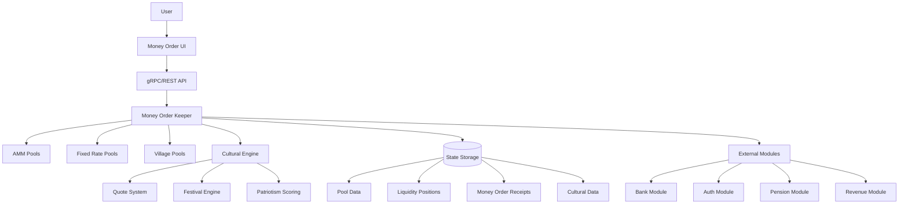
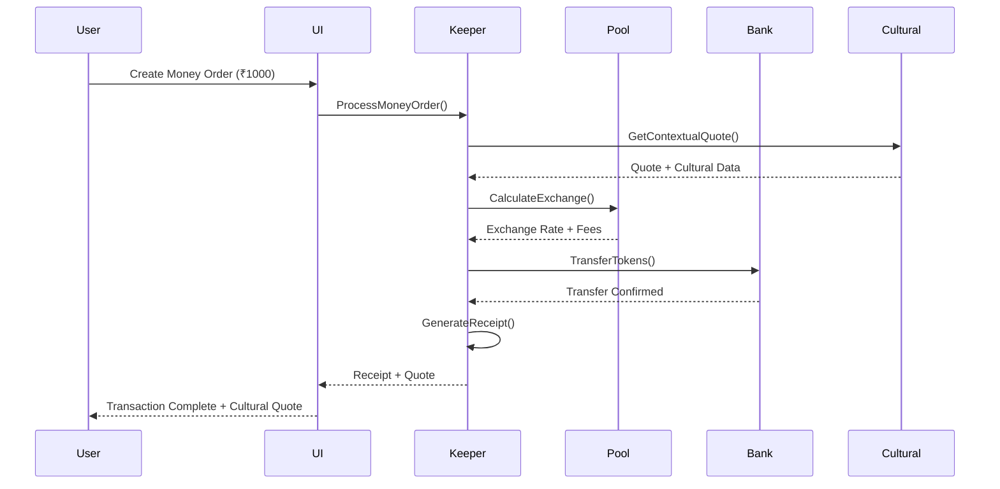
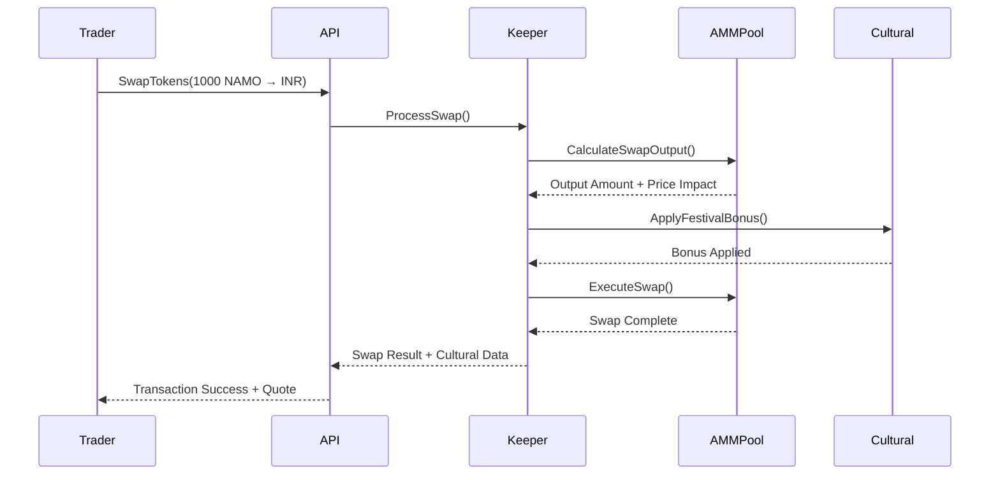

# Money Order Module Architecture Documentation

## Overview

The Money Order module (`x/moneyorder`) is a revolutionary blockchain-based financial exchange system that transforms traditional money orders into culturally-aware, transparent, and efficient digital transactions. Built on Cosmos SDK, it combines DEX functionality with Indian cultural heritage and social impact features.

## Table of Contents

1. [Architecture Overview](#architecture-overview)
2. [Core Components](#core-components)
3. [Pool Types](#pool-types)
4. [Cultural Integration](#cultural-integration)
5. [Transaction Flow](#transaction-flow)
6. [Data Structures](#data-structures)
7. [State Management](#state-management)
8. [API Endpoints](#api-endpoints)
9. [Integration Points](#integration-points)
10. [Security Considerations](#security-considerations)

## Architecture Overview



## Core Components

### 1. Keeper Layer
The keeper is the central component managing all Money Order operations:

```go
type Keeper struct {
    cdc        codec.BinaryCodec
    storeKey   storetypes.StoreKey
    paramstore paramtypes.Subspace
    bankKeeper types.BankKeeper
    authKeeper types.AccountKeeper
    
    // Cultural integration
    culturalEngine CulturalEngine
    
    // Cross-module integration
    pensionKeeper  types.PensionKeeper
    revenueKeeper  types.RevenueKeeper
}
```

**Responsibilities:**
- Pool management (AMM, Fixed Rate, Village)
- Transaction processing and validation
- Cultural feature integration
- Fee distribution and revenue sharing
- Cross-module communication

### 2. Pool Management System

#### AMM Pools
Traditional automated market maker pools with cultural enhancements:

```go
type AMMPool struct {
    PoolId              uint64
    TokenA, TokenB      string
    ReserveA, ReserveB  sdk.Coin
    SwapFee             sdk.Dec
    CulturalTheme       string
    FestivalMultiplier  sdk.Dec
    PatriotismScore     sdk.Dec
}
```

#### Fixed Rate Pools
Stable exchange rate pools for predictable transactions:

```go
type FixedRatePool struct {
    PoolId              uint64
    TokenA, TokenB      string
    ExchangeRate        sdk.Dec
    PriceStability      sdk.Dec
    TrustScore          sdk.Dec
    PatriotismQuote     string
}
```

#### Village Pools
Community-driven pools with local governance:

```go
type VillagePool struct {
    PoolId              uint64
    VillageName         string
    PostalCode          string
    Members             []string
    Coordinator         sdk.AccAddress
    TrustScore          sdk.Dec
    CommunityImpact     sdk.Dec
}
```

### 3. Cultural Engine

The cultural engine provides heritage integration:

```go
type CulturalEngine struct {
    QuoteManager     QuoteManager
    FestivalManager  FestivalManager
    PatriotismScorer PatriotismScorer
    LanguageSupport  LanguageSupport
}
```

**Features:**
- **Quote System**: 10,000+ curated quotes from Indian leaders
- **Festival Integration**: Special bonuses during Indian festivals
- **Patriotism Scoring**: Rewards for socially beneficial transactions
- **Language Support**: 22 Indian languages with cultural context

## Pool Types

### 1. AMM (Automated Market Maker) Pools

**Purpose**: Provide liquidity for token swaps with dynamic pricing

**Key Features:**
- Constant product formula (x * y = k)
- Dynamic fee structure based on volatility
- Cultural bonus rewards
- Festival multipliers during special occasions

**Use Cases:**
- NAMO ↔ INR trading
- Cross-token liquidity provision
- Yield farming with cultural rewards

### 2. Fixed Rate Pools

**Purpose**: Offer stable exchange rates for predictable transactions

**Key Features:**
- Fixed exchange rates (e.g., 1 NAMO = 0.075 INR)
- High price stability (99%+)
- Trust score system
- Cultural quote integration

**Use Cases:**
- Traditional money order replacements
- Merchant payment processing
- Remittance services

### 3. Village Pools

**Purpose**: Community-driven liquidity with local governance

**Key Features:**
- Community member verification
- Reduced fees for local transactions
- Village coordinator oversight
- Social impact tracking

**Use Cases:**
- Local economic development
- Community savings and lending
- Rural financial inclusion

### 4. Concentrated Liquidity Pools

**Purpose**: Capital-efficient liquidity provision

**Key Features:**
- Price range-based liquidity
- Higher capital efficiency
- Cultural integration with NFT positions
- Performance-based rewards

**Use Cases:**
- Professional trading
- Advanced yield strategies
- Market making operations

## Cultural Integration

### Quote System Architecture

```go
type CulturalQuote struct {
    QuoteId    uint64
    Text       string
    Author     string
    Category   string  // "motivation", "wisdom", "patriotism"
    Language   string  // "hindi", "english", "sanskrit"
    Occasion   string  // "general", "festival", "independence_day"
    Weight     uint32  // Selection probability weight
}
```

**Selection Algorithm:**
1. Context-aware filtering (amount, time, user preferences)
2. Weighted random selection
3. Cultural occasion matching
4. Language preference consideration

### Festival Engine

```go
type FestivalPeriod struct {
    FestivalId    uint64
    Name          string
    StartDate     string
    EndDate       string
    BonusRate     sdk.Dec
    CulturalTheme string
    Region        string
}
```

**Festival Integration:**
- **Diwali**: 15% transaction bonus
- **Holi**: 10% community bonus
- **Independence Day**: 20% patriotism bonus
- **Regional Festivals**: State-specific bonuses

### Patriotism Scoring

```go
type PatriotismScore struct {
    UserId           string
    Score            sdk.Dec     // 0-100 scale
    SocialImpact     sdk.Dec     // NGO donation percentage
    CommunitySupport sdk.Dec     // Village pool participation
    CulturalEngagement sdk.Dec   // Cultural feature usage
}
```

**Scoring Factors:**
- NGO donation percentage (40% weight)
- Community pool participation (30% weight)
- Cultural feature engagement (20% weight)
- Transaction frequency (10% weight)

## Transaction Flow

### 1. Simple Money Order Flow



### 2. Advanced Trading Flow



## Data Structures

### Core Pool Structure

```go
// Base pool interface
type Pool interface {
    GetId() uint64
    GetTokens() (string, string)
    GetReserves() (sdk.Coin, sdk.Coin)
    CalculateSwap(tokenIn sdk.Coin, tokenOut string) (sdk.Coin, error)
    GetCulturalTheme() string
    GetTrustScore() sdk.Dec
}
```

### Money Order Receipt

```go
type MoneyOrderReceipt struct {
    ReceiptId           string
    OrderId             string
    Sender              sdk.AccAddress
    Receiver            sdk.AccAddress
    Amount              sdk.Coin
    Fee                 sdk.Coin
    ExchangeRate        sdk.Dec
    CulturalQuote       string
    PatriotismBonus     sdk.Coin
    Timestamp           time.Time
    Status              string
    VerificationCode    string
}
```

### Liquidity Position

```go
type LiquidityPosition struct {
    PositionId          uint64
    PoolId              uint64
    Owner               sdk.AccAddress
    Shares              sdk.Int
    TokenAAmount        sdk.Coin
    TokenBAmount        sdk.Coin
    RewardsAccumulated  sdk.Coins
    CulturalBonus       sdk.Coin
    PatriotismReward    sdk.Coin
    CommunityContribution sdk.Dec
}
```

## State Management

### Key Prefixes

```go
var (
    // Pools
    KeyPrefixAMMPool              = []byte{0x01}
    KeyPrefixFixedRatePool        = []byte{0x02}
    KeyPrefixVillagePool          = []byte{0x03}
    KeyPrefixConcentratedPool     = []byte{0x04}
    
    // Orders and Receipts
    KeyPrefixMoneyOrder           = []byte{0x10}
    KeyPrefixReceipt              = []byte{0x11}
    
    // Cultural Features
    KeyPrefixCulturalQuote        = []byte{0x14}
    KeyPrefixFestivalPeriod       = []byte{0x15}
    
    // Unified Pool Integration
    KeyPrefixUnifiedPool          = []byte{0x19}
    KeyPrefixPensionContribution  = []byte{0x1B}
)
```

### Storage Operations

```go
// Pool storage
func (k Keeper) SetAMMPool(ctx sdk.Context, pool AMMPool)
func (k Keeper) GetAMMPool(ctx sdk.Context, poolId uint64) (AMMPool, bool)
func (k Keeper) GetAllAMMPools(ctx sdk.Context) []AMMPool

// Receipt storage
func (k Keeper) SetReceipt(ctx sdk.Context, receipt MoneyOrderReceipt)
func (k Keeper) GetReceipt(ctx sdk.Context, receiptId string) (MoneyOrderReceipt, bool)

// Cultural data storage
func (k Keeper) SetCulturalQuote(ctx sdk.Context, quote CulturalQuote)
func (k Keeper) GetRandomQuote(ctx sdk.Context, category string) CulturalQuote
```

## API Endpoints

### gRPC Services

```protobuf
service Query {
    // Pool queries
    rpc Pool(QueryPoolRequest) returns (QueryPoolResponse);
    rpc Pools(QueryPoolsRequest) returns (QueryPoolsResponse);
    rpc VillagePools(QueryVillagePoolsRequest) returns (QueryVillagePoolsResponse);
    
    // Money Order queries
    rpc Receipt(QueryReceiptRequest) returns (QueryReceiptResponse);
    rpc Receipts(QueryReceiptsRequest) returns (QueryReceiptsResponse);
    
    // Cultural queries
    rpc CulturalQuote(QueryCulturalQuoteRequest) returns (QueryCulturalQuoteResponse);
    rpc FestivalPeriods(QueryFestivalPeriodsRequest) returns (QueryFestivalPeriodsResponse);
    
    // Analytics
    rpc PoolPerformance(QueryPoolPerformanceRequest) returns (QueryPoolPerformanceResponse);
    rpc CommunityStats(QueryCommunityStatsRequest) returns (QueryCommunityStatsResponse);
}

service Msg {
    // Pool operations
    rpc CreatePool(MsgCreatePool) returns (MsgCreatePoolResponse);
    rpc AddLiquidity(MsgAddLiquidity) returns (MsgAddLiquidityResponse);
    rpc RemoveLiquidity(MsgRemoveLiquidity) returns (MsgRemoveLiquidityResponse);
    
    // Money Order operations
    rpc CreateMoneyOrder(MsgCreateMoneyOrder) returns (MsgCreateMoneyOrderResponse);
    rpc SwapTokens(MsgSwapTokens) returns (MsgSwapTokensResponse);
    
    // Cultural operations
    rpc UpdateCulturalPreferences(MsgUpdateCulturalPreferences) returns (MsgUpdateCulturalPreferencesResponse);
}
```

### REST Endpoints

```
GET  /deshchain/moneyorder/v1/pools
GET  /deshchain/moneyorder/v1/pools/{pool_id}
GET  /deshchain/moneyorder/v1/village_pools/{postal_code}
GET  /deshchain/moneyorder/v1/receipts/{receipt_id}
GET  /deshchain/moneyorder/v1/cultural/quotes
GET  /deshchain/moneyorder/v1/cultural/festivals
GET  /deshchain/moneyorder/v1/analytics/pool_performance
POST /deshchain/moneyorder/v1/money_orders
POST /deshchain/moneyorder/v1/swaps
```

## Integration Points

### 1. Bank Module Integration

```go
// Token transfers
k.bankKeeper.SendCoinsFromAccountToModule(ctx, sender, types.ModuleName, coins)
k.bankKeeper.SendCoinsFromModuleToAccount(ctx, types.ModuleName, receiver, coins)

// Fee collection
k.bankKeeper.SendCoinsFromModuleToModule(ctx, types.ModuleName, "fee_collector", fees)
```

### 2. Pension Module Integration

```go
// Hooks for pension contributions
func (h MoneyOrderHooks) AfterPensionContribution(
    ctx sdk.Context,
    pensionAccountID string,
    contributor sdk.AccAddress,
    contribution sdk.Coin,
    villageCode string,
) error {
    return h.keeper.AddPensionLiquidity(ctx, contribution, villageCode)
}
```

### 3. Revenue Module Integration

```go
// Revenue distribution
func (k Keeper) DistributeRevenue(ctx sdk.Context, revenue sdk.Coins) error {
    // 30% to NGOs
    ngoShare := CalculateShare(revenue, sdk.NewDecWithPrec(30, 2))
    k.revenueKeeper.DistributeToNGOs(ctx, ngoShare)
    
    // 25% to validators
    validatorShare := CalculateShare(revenue, sdk.NewDecWithPrec(25, 2))
    k.revenueKeeper.DistributeToValidators(ctx, validatorShare)
    
    // ... continue distribution
}
```

## Security Considerations

### 1. Input Validation

```go
func (k Keeper) ValidateSwapInput(tokenIn sdk.Coin, minOut sdk.Coin) error {
    if !tokenIn.IsPositive() {
        return types.ErrInvalidAmount
    }
    if tokenIn.Amount.GT(types.MaxSwapAmount) {
        return types.ErrAmountTooLarge
    }
    return nil
}
```

### 2. Slippage Protection

```go
func (k Keeper) CalculateSwapWithSlippage(
    pool Pool,
    tokenIn sdk.Coin,
    maxSlippage sdk.Dec,
) (sdk.Coin, error) {
    output := pool.CalculateSwap(tokenIn)
    priceImpact := CalculatePriceImpact(pool, tokenIn, output)
    
    if priceImpact.GT(maxSlippage) {
        return sdk.Coin{}, types.ErrExcessiveSlippage
    }
    
    return output, nil
}
```

### 3. Rate Limiting

```go
func (k Keeper) CheckRateLimit(ctx sdk.Context, user sdk.AccAddress) error {
    dailyVolume := k.GetUserDailyVolume(ctx, user)
    if dailyVolume.GT(types.MaxDailyUserVolume) {
        return types.ErrRateLimitExceeded
    }
    return nil
}
```

### 4. Cultural Data Integrity

```go
func (k Keeper) ValidateCulturalQuote(quote CulturalQuote) error {
    if quote.Text == "" || quote.Author == "" {
        return types.ErrInvalidQuote
    }
    if !IsValidLanguage(quote.Language) {
        return types.ErrUnsupportedLanguage
    }
    return nil
}
```

## Performance Optimizations

### 1. Caching Strategy

```go
type CacheManager struct {
    quoteCache    map[string]CulturalQuote
    festivalCache map[string]FestivalPeriod
    poolCache     map[uint64]Pool
    mutex         sync.RWMutex
}
```

### 2. Batch Operations

```go
func (k Keeper) BatchProcessMoneyOrders(ctx sdk.Context, orders []MoneyOrder) error {
    // Process multiple orders in a single transaction
    for _, order := range orders {
        if err := k.ProcessMoneyOrder(ctx, order); err != nil {
            return err
        }
    }
    return nil
}
```

### 3. Index Optimization

```go
// Compound indexes for efficient queries
func GetUserOrdersWithStatusKey(user sdk.AccAddress, status string) []byte
func GetPoolsByVillageKey(postalCode string) []byte
func GetReceiptsByDateRangeKey(startDate, endDate time.Time) []byte
```

## Module Parameters

```go
type Params struct {
    TradingFee              sdk.Dec  // 0.3% base trading fee
    ProtocolFee             sdk.Dec  // 0.5% protocol fee
    MaxSlippageTolerance    sdk.Dec  // 5% maximum slippage
    MinLiquidityThreshold   sdk.Int  // 1M minimum liquidity
    CulturalBonusRate       sdk.Dec  // 5% cultural bonus
    FestivalBonusMultiplier sdk.Dec  // 15% festival multiplier
    PatriotismThreshold     sdk.Dec  // 70% patriotism threshold
    VillagePoolDiscount     sdk.Dec  // 25% village discount
    MoneyOrderFee           sdk.Dec  // 0.1% money order fee
    MaxDailyVolume          sdk.Int  // 10B daily volume limit
    EnableCulturalFeatures  bool     // Enable cultural integration
    EnableFestivalBonuses   bool     // Enable festival bonuses
    EnablePatriotismRewards bool     // Enable patriotism rewards
}
```

## Conclusion

The Money Order module represents a sophisticated blend of traditional DEX functionality with Indian cultural heritage integration. Its modular architecture allows for scalable operations while maintaining cultural authenticity and social impact focus. The system's design prioritizes transparency, community engagement, and financial inclusion while providing modern DeFi capabilities.