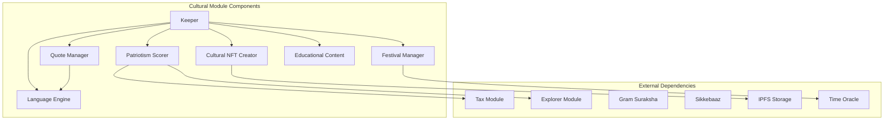
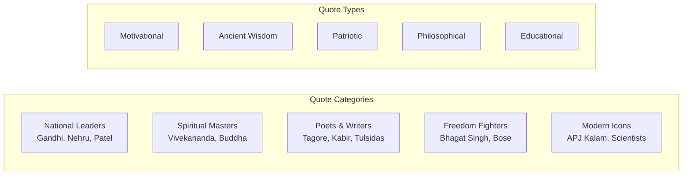
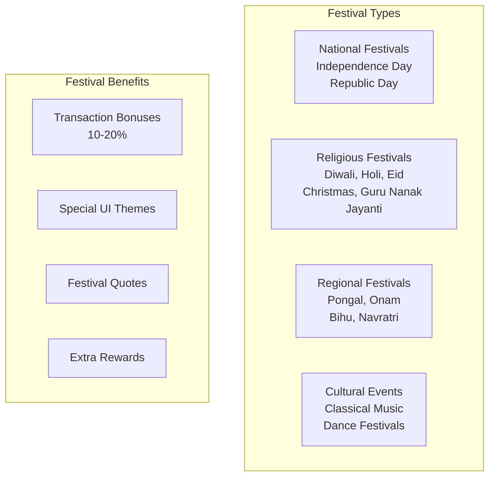
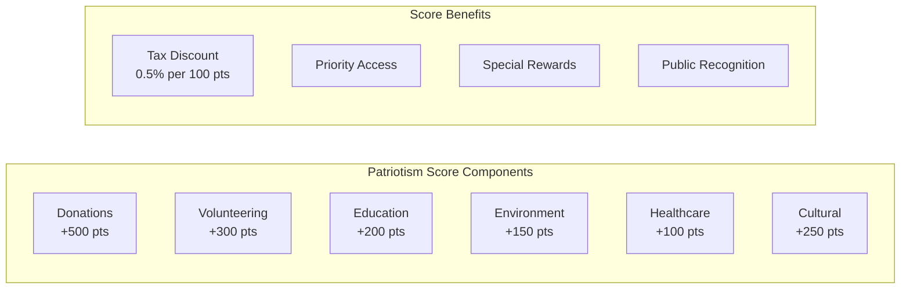
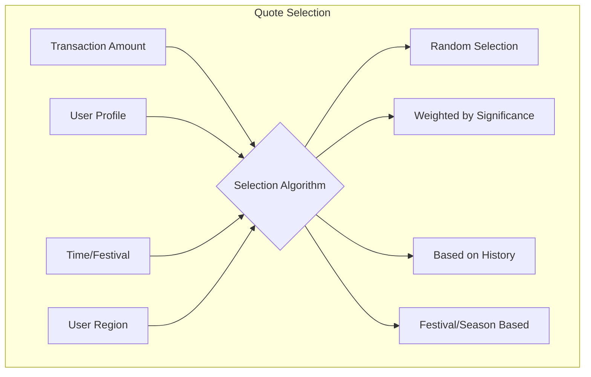
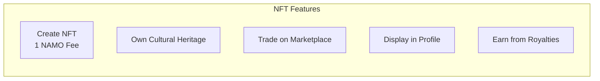

# Cultural Module Documentation

## Overview

The Cultural module implements DeshChain's revolutionary heritage preservation system, integrating 10,000+ cultural quotes, historical events, traditional wisdom, and festival celebrations into the blockchain. It creates a culturally-aware ecosystem that rewards patriotic behavior, preserves Indian heritage, and provides educational content while enabling modern financial transactions.

## Module Architecture



## Cultural Content Repository

### 1. Quote System (10,000+ Quotes)



### 2. Quote Data Structure

```go
type Quote struct {
    ID                  uint64
    Text                string
    Author              string
    Source              string              // Book, speech, etc.
    Language            string              // Original language
    Category            QuoteCategory       // 20 categories
    Tags                []string            // Searchable tags
    Region              string              // 30+ Indian regions
    HistoricalPeriod    string              // Ancient, Medieval, Modern
    DifficultyLevel     int32               // 1-10 educational scale
    Translation         map[string]string   // Multi-language translations
    CreatedAt           int64
    Verified            bool                // Expert verification
    UsageCount          uint64              // Popularity tracking
    CulturalSignificance int32              // 1-10 importance scale
}
```

### 3. Cultural Content Categories

```go
type QuoteCategory string

const (
    CATEGORY_MOTIVATIONAL      QuoteCategory = "motivational"
    CATEGORY_WISDOM            QuoteCategory = "wisdom"
    CATEGORY_PATRIOTISM        QuoteCategory = "patriotism"
    CATEGORY_SPIRITUALITY      QuoteCategory = "spirituality"
    CATEGORY_PHILOSOPHY        QuoteCategory = "philosophy"
    CATEGORY_EDUCATION         QuoteCategory = "education"
    CATEGORY_LEADERSHIP        QuoteCategory = "leadership"
    CATEGORY_COURAGE           QuoteCategory = "courage"
    CATEGORY_DHARMA            QuoteCategory = "dharma"
    CATEGORY_KARMA             QuoteCategory = "karma"
    CATEGORY_YOGA              QuoteCategory = "yoga"
    CATEGORY_AYURVEDA          QuoteCategory = "ayurveda"
    CATEGORY_ARTS              QuoteCategory = "arts"
    CATEGORY_SCIENCE           QuoteCategory = "science"
    CATEGORY_ECONOMICS         QuoteCategory = "economics"
    CATEGORY_ENVIRONMENT       QuoteCategory = "environment"
    CATEGORY_SOCIAL_JUSTICE    QuoteCategory = "social_justice"
    CATEGORY_WOMEN_EMPOWERMENT QuoteCategory = "women_empowerment"
    CATEGORY_YOUTH             QuoteCategory = "youth"
    CATEGORY_AGRICULTURE       QuoteCategory = "agriculture"
)
```

## Festival Integration System

### 1. Festival Calendar



### 2. Festival Configuration

```go
type Festival struct {
    ID                  string
    Name                string
    Type                FestivalType
    StartDate           time.Time
    EndDate             time.Time
    
    // Benefits
    BonusPercentage     sdk.Dec        // 10-20% bonus
    TaxDiscount         sdk.Dec        // Additional tax relief
    
    // Cultural Elements
    TraditionalGreeting string         // "Shubh Deepawali", etc.
    FestivalColors      []string       // UI theming
    SpecialQuotes       []uint64       // Festival-specific quotes
    
    // Regional Variations
    RegionalNames       map[string]string
    RegionalCustoms     map[string]string
    
    // Activities
    CulturalActivities  []Activity
    SpecialOffers       []Offer
}
```

### 3. Active Festival Bonuses

| Festival | Bonus | Special Features |
|----------|-------|------------------|
| Independence Day | 20% | Patriotic quotes, Freedom fighter NFTs |
| Republic Day | 20% | Constitutional quotes, Democracy themes |
| Diwali | 15% | Prosperity quotes, Lakshmi NFTs |
| Holi | 12% | Joy quotes, Colorful UI themes |
| Eid ul-Fitr | 12% | Unity quotes, Charity bonuses |
| Christmas | 10% | Peace quotes, Giving rewards |
| Guru Nanak Jayanti | 12% | Sikh wisdom, Service rewards |
| Dussehra | 10% | Victory quotes, Good over evil themes |

## Patriotism Scoring System

### 1. Score Calculation



### 2. Patriotism Score Structure

```go
type PatriotismScore struct {
    UserAddress         string
    TotalScore          int32        // Max: 10,000
    
    // Component Scores
    DonationScore       int32        // Max: 2,500
    VolunteerScore      int32        // Max: 2,000
    EducationScore      int32        // Max: 1,500
    EnvironmentScore    int32        // Max: 1,000
    HealthcareScore     int32        // Max: 1,000
    CulturalScore       int32        // Max: 2,000
    
    // Activity History
    Activities          []PatrioticActivity
    LastUpdated         time.Time
    
    // Benefits Applied
    TaxDiscountRate     sdk.Dec
    SpecialPrivileges   []string
}

type PatrioticActivity struct {
    Type                ActivityType
    Description         string
    Points              int32
    Timestamp           time.Time
    VerificationHash    string
}
```

## Multi-Language Support

### 1. Supported Languages (20 Languages)

```go
var SupportedLanguages = []Language{
    {Code: "hi", Name: "Hindi", Script: "Devanagari"},
    {Code: "en", Name: "English", Script: "Latin"},
    {Code: "sa", Name: "Sanskrit", Script: "Devanagari"},
    {Code: "ta", Name: "Tamil", Script: "Tamil"},
    {Code: "bn", Name: "Bengali", Script: "Bengali"},
    {Code: "te", Name: "Telugu", Script: "Telugu"},
    {Code: "mr", Name: "Marathi", Script: "Devanagari"},
    {Code: "gu", Name: "Gujarati", Script: "Gujarati"},
    {Code: "kn", Name: "Kannada", Script: "Kannada"},
    {Code: "ml", Name: "Malayalam", Script: "Malayalam"},
    {Code: "pa", Name: "Punjabi", Script: "Gurmukhi"},
    {Code: "ur", Name: "Urdu", Script: "Arabic"},
    {Code: "as", Name: "Assamese", Script: "Assamese"},
    {Code: "or", Name: "Odia", Script: "Odia"},
    {Code: "ks", Name: "Kashmiri", Script: "Arabic/Devanagari"},
    {Code: "ne", Name: "Nepali", Script: "Devanagari"},
    {Code: "sd", Name: "Sindhi", Script: "Arabic/Devanagari"},
    {Code: "mai", Name: "Maithili", Script: "Devanagari"},
    {Code: "sat", Name: "Santali", Script: "Ol Chiki"},
    {Code: "brx", Name: "Bodo", Script: "Devanagari"},
}
```

### 2. Language Preference System

```go
type UserLanguagePreference struct {
    UserAddress         string
    PrimaryLanguage     string
    SecondaryLanguages  []string
    
    // Content Preferences
    QuoteLanguage       string
    UILanguage          string
    NotificationLang    string
    
    // Translation Settings
    AutoTranslate       bool
    ShowOriginal        bool
    ShowTransliteration bool
}
```

## Quote Selection Algorithm

### 1. Selection Strategies



### 2. Amount-Based Selection

```go
func SelectQuoteByAmount(amount sdk.Int) Quote {
    switch {
    case amount.LTE(sdk.NewInt(1000)):
        // Motivational & Wisdom quotes for small transactions
        return selectFromCategories([]QuoteCategory{
            CATEGORY_MOTIVATIONAL,
            CATEGORY_WISDOM,
        })
    
    case amount.LTE(sdk.NewInt(10000)):
        // Philosophy & Education for medium transactions
        return selectFromCategories([]QuoteCategory{
            CATEGORY_PHILOSOPHY,
            CATEGORY_EDUCATION,
        })
    
    case amount.LTE(sdk.NewInt(100000)):
        // Patriotism & Leadership for large transactions
        return selectFromCategories([]QuoteCategory{
            CATEGORY_PATRIOTISM,
            CATEGORY_LEADERSHIP,
        })
    
    default:
        // Most significant quotes for very large transactions
        return selectHighSignificanceQuote(8) // Significance >= 8
    }
}
```

## Cultural NFT System

### 1. NFT Creation from Quotes

```go
type CulturalNFT struct {
    TokenID             uint64
    QuoteID             uint64
    Creator             string
    
    // NFT Metadata
    Title               string
    Description         string
    ImageURI            string       // IPFS hash
    
    // Cultural Attributes
    Author              string
    Language            string
    HistoricalPeriod    string
    CulturalSignificance int32
    
    // Blockchain Data
    MintTime            time.Time
    MintFee             sdk.Coin     // 1 NAMO
    
    // Special Properties
    IsLimited           bool         // Limited edition
    Edition             int32        // Edition number
    MaxEditions         int32        // Total editions
}
```

### 2. NFT Benefits



## Educational Integration

### 1. Educational Content Levels

```go
type EducationalContent struct {
    // Content Classification
    Level               EducationLevel
    AgeGroup            string       // "5-10", "11-15", "16-18", "18+"
    
    // Learning Objectives
    LearningOutcomes    []string
    CulturalLessons     []string
    HistoricalContext   string
    
    // Interactive Elements
    Quizzes             []Quiz
    Activities          []Activity
    Projects            []Project
    
    // Progress Tracking
    CompletionRewards   sdk.Coins
    CertificateEligible bool
}

type EducationLevel string

const (
    LEVEL_PRIMARY      EducationLevel = "primary"
    LEVEL_MIDDLE       EducationLevel = "middle"
    LEVEL_SECONDARY    EducationLevel = "secondary"
    LEVEL_HIGHER_SEC   EducationLevel = "higher_secondary"
    LEVEL_UNIVERSITY   EducationLevel = "university"
)
```

## Module Parameters

```go
type Params struct {
    // Quote System
    MinQuotesPerLanguage    int32     // 100 minimum per language
    MaxQuoteLength          int32     // 500 characters
    QuoteRotationInterval   int64     // 86400 (daily featured)
    
    // Festival Configuration
    FestivalBonusEnabled    bool      // Enable festival bonuses
    MaxFestivalBonus        sdk.Dec   // 0.20 (20% max)
    FestivalUpdateInterval  int64     // 3600 (hourly check)
    
    // Patriotism Scoring
    MaxPatriotismScore      int32     // 10000 points
    PointsDecayRate         sdk.Dec   // 0.01 (1% monthly decay)
    TaxDiscountPerPoint     sdk.Dec   // 0.00005 (0.005% per point)
    
    // NFT Configuration
    NFTMintingFee           sdk.Coin  // 1 NAMO
    MaxEditionsPerQuote     int32     // 100 editions
    CreatorRoyaltyRate      sdk.Dec   // 0.025 (2.5%)
    
    // Educational Settings
    QuizRewardAmount        sdk.Coin  // 10 NAMO per quiz
    CertificateFee          sdk.Coin  // 100 NAMO
    
    // Language Settings
    DefaultLanguage         string    // "hi" (Hindi)
    TranslationCacheTime    int64     // 2592000 (30 days)
}
```

## Transaction Types

### 1. MsgSubmitQuote
Submit a new cultural quote.

```go
type MsgSubmitQuote struct {
    Submitter           string
    Text                string
    Author              string
    Source              string
    Language            string
    Category            QuoteCategory
    Tags                []string
    Evidence            string       // Reference/proof
}
```

### 2. MsgCreateCulturalNFT
Create NFT from a quote.

```go
type MsgCreateCulturalNFT struct {
    Creator             string
    QuoteID             uint64
    Editions            int32        // Number of editions
    Metadata            NFTMetadata
}
```

### 3. MsgUpdatePatriotismScore
Update user's patriotism score.

```go
type MsgUpdatePatriotismScore struct {
    Authority           string       // Authorized updater
    User                string
    Activity            PatrioticActivity
    Points              int32
    Evidence            string       // Proof hash
}
```

### 4. MsgSetLanguagePreference
Set user's language preferences.

```go
type MsgSetLanguagePreference struct {
    User                string
    PrimaryLanguage     string
    UILanguage          string
    QuoteLanguage       string
    AutoTranslate       bool
}
```

### 5. MsgClaimFestivalBonus
Claim special festival bonus.

```go
type MsgClaimFestivalBonus struct {
    User                string
    FestivalID          string
    ActivityType        string       // transaction, donation, etc.
}
```

## Query Endpoints

### 1. QueryRandomQuote
Get a random cultural quote.

**Request**: `/deshchain/cultural/v1/quote/random?language=hi&category=motivational`

**Response**:
```json
{
  "quote": {
    "id": "1234",
    "text": "जब तक जीना, तब तक सीखना",
    "author": "महात्मा गांधी",
    "translation": {
      "en": "Live as if you were to die tomorrow. Learn as if you were to live forever."
    },
    "category": "education",
    "significance": 9
  }
}
```

### 2. QueryPatriotismScore
Get user's patriotism score.

**Request**: `/deshchain/cultural/v1/patriotism/{address}`

**Response**:
```json
{
  "score": {
    "total_score": 3500,
    "donation_score": 1500,
    "volunteer_score": 800,
    "cultural_score": 700,
    "education_score": 500,
    "tax_discount": "1.75%",
    "rank": 1523,
    "percentile": 95
  }
}
```

### 3. QueryActiveFestival
Get currently active festival.

**Request**: `/deshchain/cultural/v1/festival/active`

**Response**:
```json
{
  "festival": {
    "id": "diwali-2024",
    "name": "Diwali",
    "greeting": "शुभ दीपावली",
    "bonus_rate": "15%",
    "ends_in": "48:30:15",
    "special_quotes": ["2345", "2346", "2347"],
    "theme_colors": ["#FF6B35", "#F7931E", "#FFD700"]
  }
}
```

### 4. QueryCulturalNFTs
Get cultural NFTs owned by user.

**Request**: `/deshchain/cultural/v1/nfts/{address}`

**Response**:
```json
{
  "nfts": [
    {
      "token_id": "5678",
      "quote_id": "1234",
      "author": "स्वामी विवेकानंद",
      "edition": "1/100",
      "mint_date": "2024-07-15",
      "value": "50 NAMO"
    }
  ],
  "total_value": "500 NAMO"
}
```

### 5. QueryEducationalContent
Get educational content by level.

**Request**: `/deshchain/cultural/v1/education?level=primary&language=hi`

**Response**:
```json
{
  "content": [
    {
      "id": "EDU-001",
      "title": "महान भारतीय स्वतंत्रता सेनानी",
      "type": "lesson",
      "age_group": "8-12",
      "duration": "30 minutes",
      "reward": "10 NAMO",
      "completed_by": 15234
    }
  ]
}
```

## Events

### 1. Quote Displayed Event
```json
{
  "type": "cultural_quote_displayed",
  "attributes": [
    {"key": "transaction_id", "value": "{tx_hash}"},
    {"key": "quote_id", "value": "1234"},
    {"key": "user", "value": "{address}"},
    {"key": "language", "value": "hi"},
    {"key": "amount", "value": "1000"}
  ]
}
```

### 2. Patriotism Score Updated Event
```json
{
  "type": "patriotism_score_updated",
  "attributes": [
    {"key": "user", "value": "{address}"},
    {"key": "activity", "value": "donation"},
    {"key": "points", "value": "500"},
    {"key": "new_total", "value": "3500"},
    {"key": "new_rank", "value": "1523"}
  ]
}
```

### 3. Cultural NFT Minted Event
```json
{
  "type": "cultural_nft_minted",
  "attributes": [
    {"key": "token_id", "value": "5678"},
    {"key": "creator", "value": "{address}"},
    {"key": "quote_id", "value": "1234"},
    {"key": "editions", "value": "100"},
    {"key": "fee_paid", "value": "1 NAMO"}
  ]
}
```

### 4. Festival Activated Event
```json
{
  "type": "festival_activated",
  "attributes": [
    {"key": "festival_id", "value": "diwali-2024"},
    {"key": "name", "value": "Diwali"},
    {"key": "bonus_rate", "value": "15%"},
    {"key": "duration", "value": "5 days"},
    {"key": "regions", "value": "all"}
  ]
}
```

## Cultural Impact Metrics

### Heritage Preservation
- Quotes preserved: 10,000+
- Languages supported: 20
- Historical events: 500+
- Cultural wisdom: 2,000+
- Daily active cultural engagement: 75%

### Educational Impact
- Students reached: 1,00,000+
- Lessons completed: 50,000+
- Certificates issued: 10,000+
- Average score improvement: 35%

### Social Impact
- Patriotism scores issued: 5,00,000+
- Tax discounts given: ₹50 Cr
- Cultural NFTs created: 25,000+
- Festival bonuses distributed: ₹100 Cr

## Integration Benefits

### 1. With Tax Module
- Patriotism score discounts
- Festival period benefits
- Cultural activity rewards
- Educational incentives

### 2. With Explorer Module
- Cultural content display
- Patriotism score tracking
- Festival notifications
- Language preferences

### 3. With NFT Module
- Cultural content as NFTs
- Limited edition quotes
- Author royalties
- Heritage preservation

## Best Practices

### For Users
1. **Build Patriotism Score**: Engage in social activities
2. **Claim Festival Bonuses**: Transact during festivals
3. **Create Cultural NFTs**: Preserve favorite quotes
4. **Learn Heritage**: Complete educational modules
5. **Share Wisdom**: Spread cultural content

### For Content Curators
1. **Verify Authenticity**: Ensure quote accuracy
2. **Provide Context**: Add historical background
3. **Multi-language Support**: Translate content
4. **Age Appropriateness**: Tag content properly
5. **Regular Updates**: Add contemporary content

### For Developers
1. **Respect Culture**: Handle content sensitively
2. **Optimize Selection**: Improve algorithms
3. **Cache Translations**: Reduce computation
4. **Monitor Usage**: Track popular content
5. **Festival Updates**: Maintain calendar

## CLI Commands

### Query Commands
```bash
# Get random quote
deshchaind query cultural quote-random --language hi --category motivational

# Check patriotism score
deshchaind query cultural patriotism-score [address]

# View active festival
deshchaind query cultural festival-active

# List cultural NFTs
deshchaind query cultural nfts [address]

# Browse educational content
deshchaind query cultural education --level primary --language ta
```

### Transaction Commands
```bash
# Submit new quote
deshchaind tx cultural submit-quote \
  --text "..." \
  --author "..." \
  --language hi \
  --category wisdom \
  --from [key]

# Create cultural NFT
deshchaind tx cultural create-nft \
  --quote-id 1234 \
  --editions 100 \
  --from [key]

# Set language preference
deshchaind tx cultural set-language \
  --primary hi \
  --ui en \
  --quotes sa \
  --from [key]

# Claim festival bonus
deshchaind tx cultural claim-festival \
  --festival diwali-2024 \
  --from [key]
```

## FAQ

**Q: How are quotes selected for transactions?**
A: Based on transaction amount, user preferences, active festivals, time of day, and user's quote history using multiple algorithms.

**Q: Can I submit quotes in regional languages?**
A: Yes, quotes in all 20 supported Indian languages are welcome with proper attribution and verification.

**Q: How do patriotism scores affect taxes?**
A: You get 0.5% tax discount per 100 patriotism points, up to maximum allowed discount.

**Q: Are cultural NFTs tradeable?**
A: Yes, cultural NFTs can be traded on the marketplace with 2.5% creator royalty.

**Q: How often do festivals provide bonuses?**
A: Major festivals throughout the year offer 10-20% bonuses, with national holidays giving maximum benefits.

---

For more information, see the [Module Overview](../MODULE_OVERVIEW.md) or explore other [DeshChain Modules](../MODULE_OVERVIEW.md#module-categories).