# DhanSetu Module Documentation

## Overview

The DhanSetu module serves as DeshChain's revolutionary super app orchestration platform, providing unified virtual addressing through DhanPata addresses, pincode-based community memecoins (Kshetra), enhanced Mitra exchange services, and seamless cross-module integration. It acts as the user-friendly frontend that bridges all DeshChain services into a cohesive experience.

## Module Architecture


## DhanPata Virtual Address System

### 1. Revolutionary UPI-like Experience

```mermaid
sequenceDiagram
    participant U as User
    participant D as DhanSetu App
    participant K as Keeper
    participant B as Blockchain
    
    U->>D: Register username@dhan
    D->>K: ValidateDhanPataName()
    K->>K: Check name availability
    K->>B: Store virtual address mapping
    B->>K: Confirm registration
    K->>D: Return success
    D->>U: ✅ username@dhan registered
    
    Note over U,B: Now user can receive payments via username@dhan
    
    U->>D: Send money to friend@dhan
    D->>K: GetDhanPataAddress(friend@dhan)
    K->>K: Resolve to blockchain address
    K->>D: Return blockchain address
    D->>B: Execute transfer to resolved address
    B->>D: Transfer complete
    D->>U: ✅ Money sent to friend@dhan
```



### 2. DhanPata Address Structure

```go
type DhanPataAddress struct {
    Name           string            // "rajesh@dhan", "mumbaistore@dhan"
    Owner          string            // Blockchain address (owner)
    BlockchainAddr string            // Mapped blockchain address
    AddressType    string            // "personal", "business", "service"
    Metadata       *DhanPataMetadata // Profile information
    CreatedAt      time.Time         // Registration time
    UpdatedAt      time.Time         // Last update time
    IsActive       bool              // Active status
}

type DhanPataMetadata struct {
    DisplayName     string            // "Rajesh Kumar"
    Description     string            // Profile description
    ProfileImageURL string            // Profile picture URL
    QRCodeData      string            // QR code for payments
    Tags            []string          // ["merchant", "individual"]
    SocialLinks     map[string]string // Social media links
    BusinessInfo    *BusinessInfo     // Business-specific data
    Verified        bool              // Verification status
}

// Business-specific metadata
type BusinessInfo struct {
    BusinessType    string   // "restaurant", "grocery", "services"
    Category        string   // Business category
    Location        string   // Physical location
    Pincode         string   // PIN code for Kshetra integration
    GST             string   // GST number
    Licenses        []string // Business licenses
    OperatingHours  string   // "9 AM - 9 PM"
    ContactNumber   string   // Contact number
}
```

### 3. Address Registration & Management

```go
// Register new DhanPata virtual address
func (k Keeper) RegisterDhanPataAddress(
    ctx sdk.Context,
    name, owner, addressType string,
    metadata *DhanPataMetadata,
) error {
    // Validate DhanPata name format (username@dhan)
    if err := ValidateDhanPataName(name); err != nil {
        return err
    }
    
    // Check availability
    if k.HasDhanPataAddress(ctx, name) {
        return ErrDhanPataAlreadyExists
    }
    
    // Create address entry
    dhanpataAddr := DhanPataAddress{
        Name:           name,
        Owner:          owner,
        BlockchainAddr: ownerAddr.String(),
        AddressType:    addressType,
        Metadata:       metadata,
        CreatedAt:      ctx.BlockTime(),
        IsActive:       true,
    }
    
    // Store mapping and reverse mapping
    k.SetDhanPataAddress(ctx, dhanpataAddr)
    k.SetAddressToDhanPata(ctx, owner, name)
    
    return nil
}
```

## Enhanced Mitra Exchange System

### 1. Tiered Mitra System with Trust Scores

```mermaid
graph TB
    subgraph "Mitra Types & Limits"
        INDIVIDUAL[Individual Mitra<br/>₹2L daily base limit<br/>Trust score: 0-100]
        BUSINESS[Business Mitra<br/>₹10L daily base limit<br/>Enhanced KYC required]
        GLOBAL[Global Mitra<br/>Unlimited trading<br/>Advanced verification]
    end
    
    subgraph "Trust Score Multipliers"
        LOW[0-33: 50% of base limit<br/>New/Low trust]
        MED[34-66: 75% of base limit<br/>Moderate trust]
        HIGH[67-100: 100-150% limit<br/>High trust/verified]
    end
    
    INDIVIDUAL --> LOW
    INDIVIDUAL --> MED
    INDIVIDUAL --> HIGH
    BUSINESS --> MED
    BUSINESS --> HIGH
    GLOBAL --> HIGH
```



### 2. Enhanced Mitra Profile Structure

```go
type EnhancedMitraProfile struct {
    MitraId          string         // Unique mitra identifier
    DhanPataName     string         // Associated @dhan address
    MitraType        string         // "individual", "business", "global"
    TrustScore       int64          // 0-100 trust rating
    DailyLimit       sdk.Int        // Dynamic daily limit
    MonthlyLimit     sdk.Int        // Monthly limit (30x daily)
    DailyVolume      sdk.Int        // Current daily volume
    MonthlyVolume    sdk.Int        // Current monthly volume
    TotalTrades      uint64         // Lifetime trade count
    SuccessfulTrades uint64         // Successful trade count
    ActiveEscrows    []string       // Active escrow IDs
    Specializations  []string       // ["crypto-to-fiat", "bulk-orders"]
    OperatingRegions []string       // Supported PIN codes
    PaymentMethods   []PaymentMethod // Supported payment options
    KYCStatus        string         // KYC verification status
    LastActiveAt     time.Time      // Last activity timestamp
    IsActive         bool           // Active status
}

type PaymentMethod struct {
    Type        string // "UPI", "IMPS", "NEFT", "Bank"
    Provider    string // "GPay", "PhonePe", "Paytm"
    Identifier  string // UPI ID or account number
    IsPreferred bool   // Preferred method flag
    IsVerified  bool   // Verification status
}
```

### 3. Dynamic Limit Calculation

```go
// Calculate mitra limits based on type and trust score
func CalculateMitraLimits(mitraType string, trustScore int64) (daily, monthly sdk.Int) {
    var baseDaily sdk.Int
    
    switch mitraType {
    case MitraTypeIndividual:
        baseDaily = sdk.NewInt(200000000000) // ₹2L base limit
    case MitraTypeBusiness:
        baseDaily = sdk.NewInt(1000000000000) // ₹10L base limit  
    case MitraTypeGlobal:
        return sdk.ZeroInt(), sdk.ZeroInt() // No limits
    }
    
    // Apply trust score multiplier (50-150% of base)
    multiplier := sdk.NewDecWithPrec(int64(50+trustScore), 2) // 0.50 to 1.50
    adjustedDaily := multiplier.MulInt(baseDaily).TruncateInt()
    adjustedMonthly := adjustedDaily.MulRaw(30) // 30 days
    
    return adjustedDaily, adjustedMonthly
}
```

## Kshetra Community Memecoins

### 1. Pincode-Based Community Tokens


### 2. Kshetra Coin Structure

```go
type KshetraCoin struct {
    Pincode           string    // "110001", "400001", etc.
    CoinName          string    // "Connaught Place Coin"
    CoinSymbol        string    // "CP110001"
    Creator           string    // DhanPata address of creator
    TotalSupply       sdk.Int   // Total token supply
    CirculatingSupply sdk.Int   // Circulating supply
    MarketCap         sdk.Int   // Current market capitalization
    HolderCount       uint64    // Number of token holders
    CommunityFund     sdk.Int   // Community development fund
    NGOBeneficiary    string    // Local NGO receiving funds
    Description       string    // Coin description
    LocalLandmarks    []string  // ["Red Fort", "India Gate"]
    CreatedAt         time.Time // Creation timestamp
    IsActive          bool      // Active status
}

// Create pincode-based community memecoin
func (k Keeper) CreateKshetraCoin(ctx sdk.Context, coin KshetraCoin) error {
    // Validate Indian PIN code format (6 digits)
    if err := ValidatePincode(coin.Pincode); err != nil {
        return err
    }
    
    // Ensure one coin per PIN code
    if k.HasKshetraCoin(ctx, coin.Pincode) {
        return ErrKshetraCoinExists
    }
    
    // Set creation metadata
    coin.CreatedAt = ctx.BlockTime()
    coin.IsActive = true
    
    // Store the coin
    k.SetKshetraCoin(ctx, coin)
    
    return nil
}
```

## Cross-Module Integration Bridge

### 1. Unified Service Integration

```mermaid
sequenceDiagram
    participant U as User (DhanSetu App)
    participant D as DhanSetu Module
    participant M as MoneyOrder Module
    participant S as Sikkebaaz Module
    participant C as Cultural Module
    
    U->>D: Send money to friend@dhan
    D->>D: Resolve friend@dhan to address
    D->>M: Create money order
    M->>D: Order created (order_id)
    D->>D: Create order bridge mapping
    D->>D: Record in unified trade history
    D->>U: ✅ Money sent via DhanSetu
    
    Note over U,C: All DeshChain services accessible via DhanSetu
    
    U->>D: Launch memecoin for my area
    D->>S: Create token launch
    S->>D: Token launched (token_id)
    D->>D: Create token bridge mapping
    D->>D: Update user's unified portfolio
    D->>U: ✅ Memecoin live on Sikkebaaz
```



### 2. Cross-Module Bridge Structure

```go
type CrossModuleBridge struct {
    BridgeId      string                 // Unique bridge identifier
    SourceModule  string                 // "moneyorder", "sikkebaaz", "cultural"
    TargetModule  string                 // "dhansetu" (always target)
    SourceEntity  string                 // Order ID, token ID, etc.
    TargetEntity  string                 // DhanPata name, mitra ID
    BridgeType    string                 // "order_mapping", "token_bridge", "fee_sharing"
    Metadata      map[string]interface{} // Bridge-specific data
    CreatedAt     time.Time              // Creation time
    IsActive      bool                   // Active status
}

// Create bridge between money order and DhanSetu
func (k Keeper) CreateOrderBridge(ctx sdk.Context, orderId, dhanpataName string) error {
    // Verify DhanPata exists
    if !k.HasDhanPataAddress(ctx, dhanpataName) {
        return ErrDhanPataNotFound
    }
    
    // Create bridge mapping
    bridge := CrossModuleBridge{
        BridgeId:     fmt.Sprintf("order-%s", orderId),
        SourceModule: "moneyorder",
        TargetModule: "dhansetu",
        SourceEntity: orderId,
        TargetEntity: dhanpataName,
        BridgeType:   "order_mapping",
        CreatedAt:    ctx.BlockTime(),
        IsActive:     true,
    }
    
    k.SetCrossModuleBridge(ctx, bridge)
    return nil
}
```

## Unified Trade History & Analytics

### 1. Comprehensive Transaction Tracking

```go
type TradeHistoryEntry struct {
    TradeId       string                 // Unique trade identifier
    UserDhanPata  string                 // User's @dhan address
    TradeType     string                 // "money_order", "token_swap", "memecoin"
    SourceProduct string                 // "moneyorder", "sikkebaaz", "kshetra"
    Amount        sdk.Coin               // Transaction amount
    Fee           sdk.Coin               // Fee paid
    Counterparty  string                 // Other party (DhanPata or address)
    Status        string                 // "completed", "pending", "failed"
    Metadata      map[string]interface{} // Transaction-specific data
    Timestamp     time.Time              // Transaction timestamp
}

// Record unified trade across all DeshChain products
func (k Keeper) RecordTradeHistory(ctx sdk.Context, trade TradeHistoryEntry) {
    store := ctx.KVStore(k.storeKey)
    bz := k.cdc.MustMarshal(&trade)
    key := append(KeyPrefixTradeHistory, []byte(trade.TradeId)...)
    store.Set(key, bz)
}
```

### 2. Fee Distribution System

```go
type DhanSetuFeeSummary struct {
    Period        string   // "daily", "weekly", "monthly"
    TotalFees     sdk.Coin // Total fees collected
    PlatformShare sdk.Coin // 40% to platform development
    NGOShare      sdk.Coin // 40% to charity (revolutionary!)
    FounderShare  sdk.Coin // 20% to founders
    CreatedAt     time.Time // Summary creation time
}
```

## Transaction Types

### 1. MsgRegisterDhanPataAddress
Register a new virtual DhanPata address.

```go
type MsgRegisterDhanPataAddress struct {
    Name        string            // Desired @dhan address
    Owner       string            // Blockchain address
    AddressType string            // "personal", "business"
    Metadata    *DhanPataMetadata // Profile metadata
}
```

### 2. MsgCreateKshetraCoin
Create pincode-based community memecoin.

```go
type MsgCreateKshetraCoin struct {
    Creator         string   // Creator's DhanPata address
    Pincode         string   // 6-digit PIN code
    CoinName        string   // "Connaught Place Coin"
    CoinSymbol      string   // "CP110001"
    TotalSupply     sdk.Int  // Initial supply
    NGOBeneficiary  string   // Local NGO address
    Description     string   // Coin description
    LocalLandmarks  []string // Area landmarks
}
```

### 3. MsgRegisterEnhancedMitra
Register as enhanced Mitra with DhanSetu integration.

```go
type MsgRegisterEnhancedMitra struct {
    MitraId          string         // Mitra identifier
    DhanPataName     string         // Associated @dhan address
    MitraType        string         // "individual", "business", "global"
    Specializations  []string       // Trading specializations
    OperatingRegions []string       // Supported PIN codes
    PaymentMethods   []PaymentMethod // Payment options
}
```

### 4. MsgProcessDhanPataTransfer
Send money using DhanPata virtual addresses.

```go
type MsgProcessDhanPataTransfer struct {
    Sender          string   // Sender's blockchain address
    ReceiverDhanPata string  // Receiver's @dhan address
    Amount          sdk.Coin // Transfer amount
    Note            string   // Transfer note/memo
}
```

## Query Endpoints

### 1. QueryDhanPataAddress
Get DhanPata address information.

**Request**: `/deshchain/dhansetu/v1/dhanpata/{name}`

**Response**:
```json
{
  "dhanpata_address": {
    "name": "rajesh@dhan",
    "owner": "deshchain1abc...",
    "blockchain_addr": "deshchain1abc...",
    "address_type": "personal",
    "metadata": {
      "display_name": "Rajesh Kumar",
      "description": "Software Developer",
      "profile_image_url": "https://...",
      "verified": true
    },
    "created_at": "2024-07-25T10:00:00Z",
    "is_active": true
  }
}
```

### 2. QueryKshetraCoinsByRegion
Get community coins by PIN code or region.

**Request**: `/deshchain/dhansetu/v1/kshetra?pincode=110001`

**Response**:
```json
{
  "kshetra_coins": [
    {
      "pincode": "110001",
      "coin_name": "Connaught Place Coin",
      "coin_symbol": "CP110001",
      "creator": "mumbai@dhan",
      "total_supply": "1000000000000",
      "market_cap": "50000000000",
      "holder_count": 1247,
      "community_fund": "125000000",
      "local_landmarks": ["Red Fort", "India Gate"],
      "created_at": "2024-07-25T10:00:00Z"
    }
  ]
}
```

### 3. QueryMitraProfile
Get enhanced Mitra profile information.

**Request**: `/deshchain/dhansetu/v1/mitra/{mitra_id}`

**Response**:
```json
{
  "mitra_profile": {
    "mitra_id": "mitra_001",
    "dhanpata_name": "exchange@dhan",
    "mitra_type": "business",
    "trust_score": 85,
    "daily_limit": "850000000000",
    "monthly_limit": "25500000000000",
    "total_trades": 2847,
    "successful_trades": 2834,
    "specializations": ["crypto-to-fiat", "bulk-orders"],
    "operating_regions": ["110001", "110002", "110003"],
    "payment_methods": [
      {
        "type": "UPI",
        "provider": "GPay",
        "identifier": "exchange@paytm",
        "is_preferred": true,
        "is_verified": true
      }
    ],
    "kyc_status": "verified"
  }
}
```

### 4. QueryTradeHistory
Get unified trade history for a user.

**Request**: `/deshchain/dhansetu/v1/history/{dhanpata_name}?limit=50`

**Response**:
```json
{
  "trade_history": [
    {
      "trade_id": "mo-1234567",
      "user_dhanpata": "rajesh@dhan",
      "trade_type": "money_order",
      "source_product": "moneyorder",
      "amount": {"denom": "dinr", "amount": "100000000000"},
      "fee": {"denom": "dinr", "amount": "500000000"},
      "counterparty": "friend@dhan",
      "status": "completed",
      "timestamp": "2024-07-25T14:30:00Z"
    }
  ],
  "total_count": 147
}
```

## Events

### 1. DhanPata Registration Events
```json
{
  "type": "dhanpata_registered",
  "attributes": [
    {"key": "dhanpata_name", "value": "rajesh@dhan"},
    {"key": "owner", "value": "deshchain1abc..."},
    {"key": "address_type", "value": "personal"}
  ]
}
```

### 2. Kshetra Coin Creation Events
```json
{
  "type": "kshetra_coin_created",
  "attributes": [
    {"key": "pincode", "value": "110001"},
    {"key": "coin_name", "value": "Connaught Place Coin"},
    {"key": "coin_symbol", "value": "CP110001"},
    {"key": "creator", "value": "mumbai@dhan"}
  ]
}
```

### 3. Cross-Module Transfer Events
```json
{
  "type": "cross_module_transfer",
  "attributes": [
    {"key": "source_module", "value": "moneyorder"},
    {"key": "target_module", "value": "dhansetu"},
    {"key": "sender", "value": "deshchain1abc..."},
    {"key": "receiver_dhanpata", "value": "friend@dhan"},
    {"key": "amount", "value": "100000000000dinr"}
  ]
}
```

## Best Practices

### For Users
1. **Choose Memorable Names**: Pick easy-to-remember @dhan addresses
2. **Complete Profiles**: Add metadata for better discoverability
3. **Verify Identity**: Complete KYC for enhanced features
4. **Community Participation**: Engage with local Kshetra coins
5. **Security First**: Keep backup of blockchain addresses

### For Businesses
1. **Professional Profiles**: Complete business metadata and verification
2. **Local Engagement**: Create/support local Kshetra coins
3. **Multiple Payment Methods**: Support diverse payment options
4. **Trust Building**: Maintain high success rates for better limits
5. **Community Benefits**: Contribute to local NGO funds

### For Developers
1. **Bridge Integration**: Use cross-module bridges for seamless UX
2. **Unified History**: Leverage trade history for analytics
3. **Address Resolution**: Always resolve DhanPata to blockchain addresses
4. **Error Handling**: Handle address not found scenarios gracefully
5. **Event Monitoring**: Track cross-module events for system health

## CLI Commands

### Query Commands
```bash
# Get DhanPata address info
deshchaind query dhansetu dhanpata-address [name]

# List Kshetra coins by pincode
deshchaind query dhansetu kshetra-coins --pincode 110001

# Get mitra profile
deshchaind query dhansetu mitra-profile [mitra-id]

# View trade history
deshchaind query dhansetu trade-history [dhanpata-name] --limit 50

# List all DhanPata addresses
deshchaind query dhansetu all-addresses
```

### Transaction Commands
```bash
# Register DhanPata address
deshchaind tx dhansetu register-dhanpata \
  --name "rajesh@dhan" \
  --address-type "personal" \
  --display-name "Rajesh Kumar" \
  --from [user-key]

# Create Kshetra coin
deshchaind tx dhansetu create-kshetra-coin \
  --pincode "110001" \
  --coin-name "Connaught Place Coin" \
  --coin-symbol "CP110001" \
  --total-supply 1000000000000 \
  --ngo-beneficiary [ngo-address] \
  --from [creator-key]

# Register as Enhanced Mitra
deshchaind tx dhansetu register-mitra \
  --dhanpata-name "exchange@dhan" \
  --mitra-type "business" \
  --specializations "crypto-to-fiat,bulk-orders" \
  --operating-regions "110001,110002" \
  --from [mitra-key]

# Send money via DhanPata
deshchaind tx dhansetu send-to-dhanpata \
  --receiver "friend@dhan" \
  --amount 100000000000dinr \
  --note "Birthday gift" \
  --from [sender-key]
```

## Integration Examples

### DhanPata Address Registration
```javascript
import { DhanSetuClient } from '@deshchain/dhansetu-sdk'

async function registerDhanPataAddress() {
  const client = new DhanSetuClient(rpcEndpoint)
  
  // Register personal DhanPata address
  await client.registerDhanPataAddress({
    name: 'rajesh@dhan',
    owner: userAddress,
    addressType: 'personal',
    metadata: {
      displayName: 'Rajesh Kumar',
      description: 'Software Developer',
      profileImageURL: 'https://example.com/profile.jpg',
      verified: false
    }
  })
  
  console.log('✅ DhanPata address rajesh@dhan registered!')
  console.log('💰 You can now receive payments at rajesh@dhan')
}
```

### Cross-Module Money Transfer
```javascript
async function sendMoneyViaDhanPata() {
  const client = new DhanSetuClient(rpcEndpoint)
  
  // Send money to DhanPata address (seamless UX)
  await client.processDhanPataTransfer({
    sender: senderAddress,
    receiverDhanPata: 'friend@dhan',
    amount: { denom: 'dinr', amount: '100000000000' }, // ₹1L
    note: 'Happy Birthday!'
  })
  
  console.log('✅ Money sent to friend@dhan successfully!')
  console.log('🔄 Transaction recorded in unified history')
}
```

### Community Kshetra Coin Launch
```javascript
async function launchKshetraCoin() {
  const client = new DhanSetuClient(rpcEndpoint)
  
  // Create community coin for specific PIN code
  await client.createKshetraCoin({
    creator: 'mumbai@dhan',
    pincode: '400001', // Mumbai central
    coinName: 'Mumbai Central Coin',
    coinSymbol: 'MC400001',
    totalSupply: '1000000000000',
    ngoAddress: 'mumbai-ngo@dhan',
    description: 'Community token for Mumbai Central residents',
    localLandmarks: ['Chhatrapati Shivaji Terminus', 'Crawford Market']
  })
  
  console.log('✅ Kshetra coin launched for PIN 400001!')
  console.log('🏘️ Community members can now trade MC400001')
  console.log('💝 1% of trades will go to local NGO fund')
}
```

## FAQ

**Q: What makes DhanSetu different from existing super apps?**
A: DhanSetu is the first blockchain-native super app with virtual addresses (@dhan), community memecoins, and seamless integration across DeFi services.

**Q: How do DhanPata addresses work?**
A: Like UPI addresses but for blockchain - register username@dhan and receive payments without sharing complex blockchain addresses.

**Q: What are Kshetra coins?**
A: Pincode-based community memecoins where 1% of trading fees support local NGOs, creating hyperlocal economic ecosystems.

**Q: Can I use existing blockchain addresses with DhanSetu?**
A: Yes! DhanPata addresses map to your existing blockchain addresses while providing user-friendly virtual addressing.

**Q: How does cross-module integration work?**
A: DhanSetu bridges all DeshChain services - use one app for money orders, token swaps, lending, cultural events, and more.

**Q: What are the benefits of Enhanced Mitra status?**
A: Higher trading limits, priority order matching, fee sharing, and integration with DhanPata virtual addresses.

---

For more information, see the [Module Overview](../MODULE_OVERVIEW.md) or explore other [DeshChain Modules](../MODULE_OVERVIEW.md#module-categories).