# DINR Module Documentation

## Overview

The DINR (Desh INR) module implements an algorithmic stablecoin pegged to the Indian Rupee (INR). It provides a decentralized, collateral-backed stable currency for the DeshChain ecosystem, enabling stable value transactions, remittances, and DeFi applications while maintaining the purchasing power of the Indian Rupee.

## Module Architecture

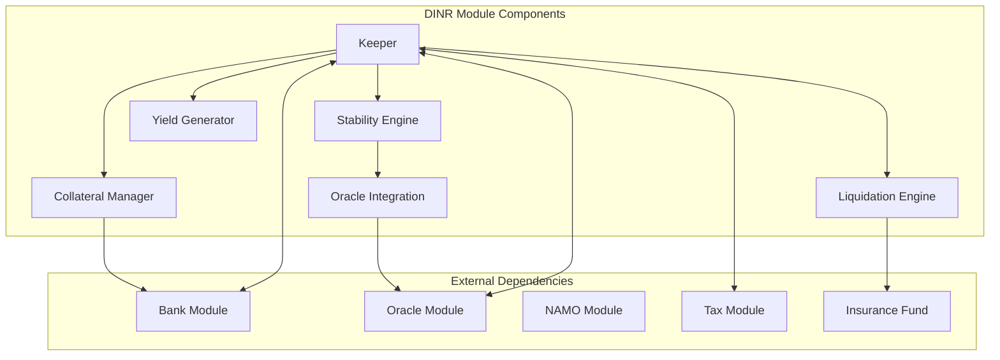

## Stablecoin Mechanism

### Algorithmic Peg Maintenance

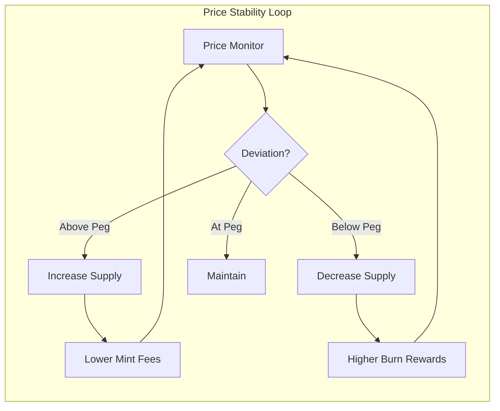

### Collateralization Model

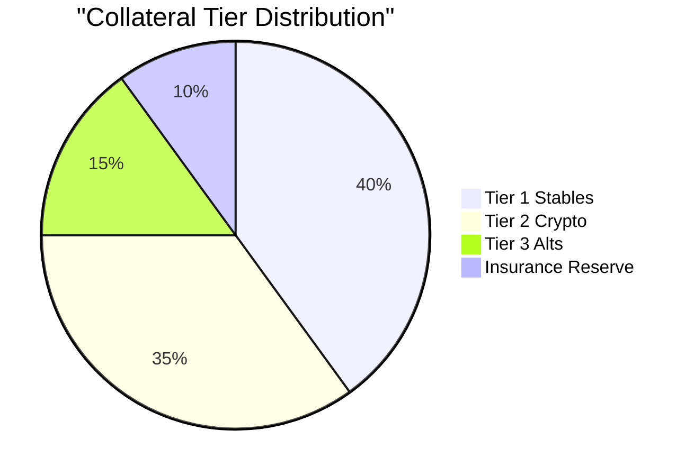

## Collateral Tiers

### Tier 1: Stablecoins (140% Min Ratio)
| Asset | Max Allocation | Oracle Feed | Liquidation |
|-------|----------------|-------------|-------------|
| USDT | 25% | Chainlink | 130% |
| USDC | 25% | Band Protocol | 130% |
| DAI | 15% | DIA | 130% |
| BUSD | 10% | API3 | 130% |

### Tier 2: Major Cryptocurrencies (150% Min Ratio)
| Asset | Max Allocation | Oracle Feed | Liquidation |
|-------|----------------|-------------|-------------|
| BTC | 20% | Multiple | 135% |
| ETH | 20% | Multiple | 135% |
| BNB | 10% | Multiple | 135% |

### Tier 3: Alternative Assets (170% Min Ratio)
| Asset | Max Allocation | Oracle Feed | Liquidation |
|-------|----------------|-------------|-------------|
| MATIC | 5% | Multiple | 140% |
| SOL | 5% | Multiple | 140% |
| NAMO | 10% | Internal | 140% |

## Core Operations

### 1. Minting DINR

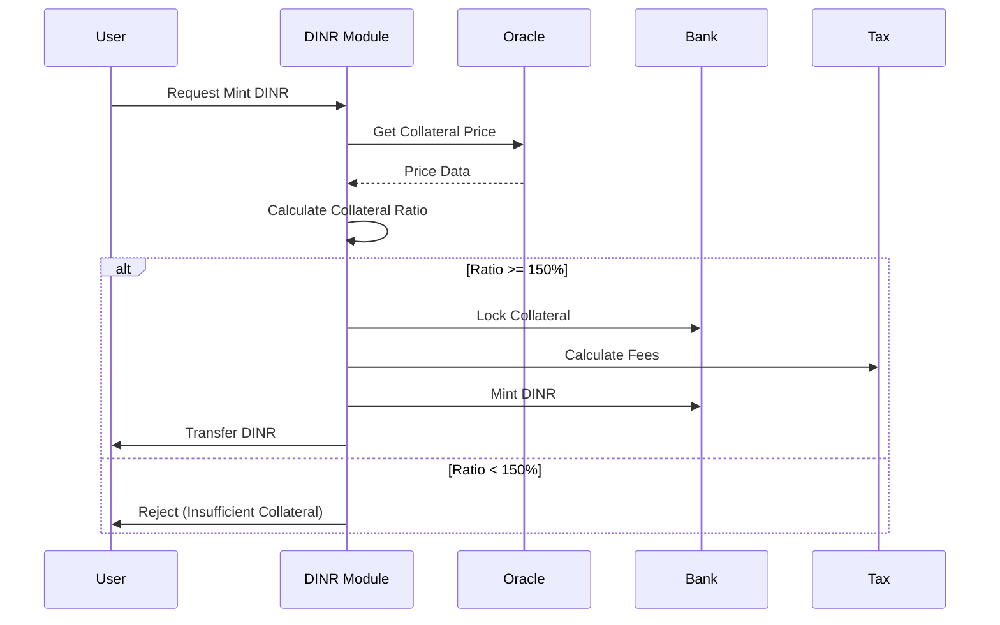

**Process Steps:**
1. User deposits collateral (multi-asset supported)
2. Oracle provides real-time price feeds
3. System calculates collateral value in INR
4. Minimum 150% collateralization enforced
5. 0.1% minting fee applied (capped at ₹100)
6. DINR minted and transferred to user

### 2. Burning DINR

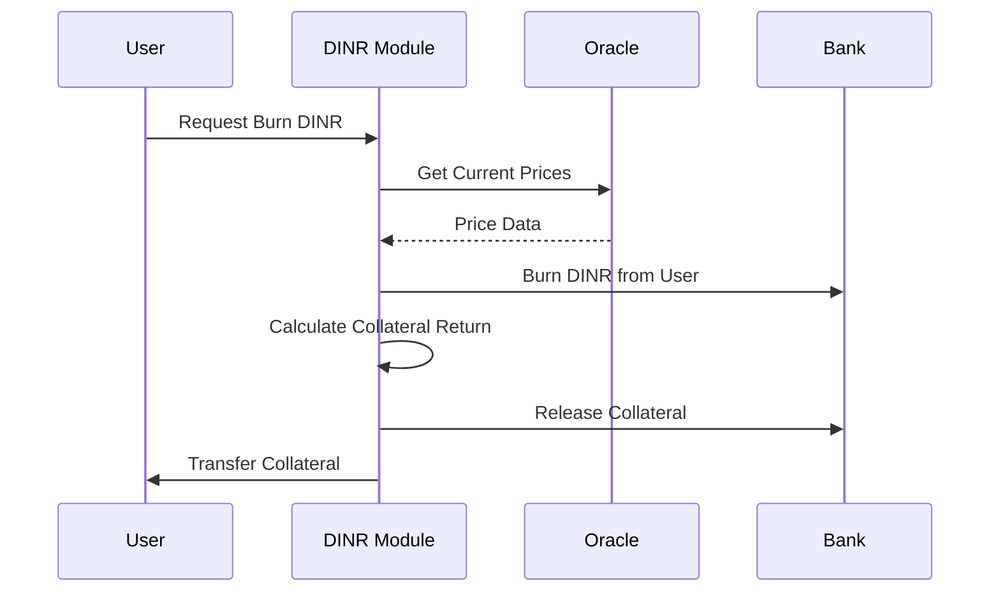

**Process Steps:**
1. User submits DINR for burning
2. System calculates proportional collateral return
3. 0.1% burning fee applied (capped at ₹100)
4. DINR burned from circulation
5. Collateral released to user

### 3. Liquidation Process

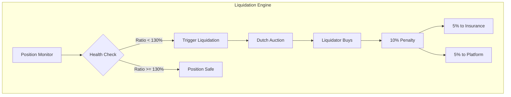

## Module Parameters

```go
type Params struct {
    // Fee Parameters
    MintFee              uint64  // 0.1% (10 basis points)
    MintFeeCap           string  // "100" (₹100 cap)
    BurnFee              uint64  // 0.1% (10 basis points)
    BurnFeeCap           string  // "100" (₹100 cap)
    
    // Collateral Parameters
    MinCollateralRatio   uint64  // 15000 (150%)
    LiquidationThreshold uint64  // 13000 (130%)
    LiquidationPenalty   uint64  // 1000 (10%)
    
    // Stability Parameters
    MaxPriceDeviation    uint64  // 100 (1%)
    RebalanceInterval    int64   // 3600 (1 hour)
    InsuranceFundTarget  uint64  // 500 (5%)
    
    // Yield Parameters
    YieldDeploymentRatio uint64  // 8000 (80%)
    MinYieldThreshold    string  // "1000000" (₹10 lakh)
}
```

## Stability Mechanisms

### 1. Price Oracle System

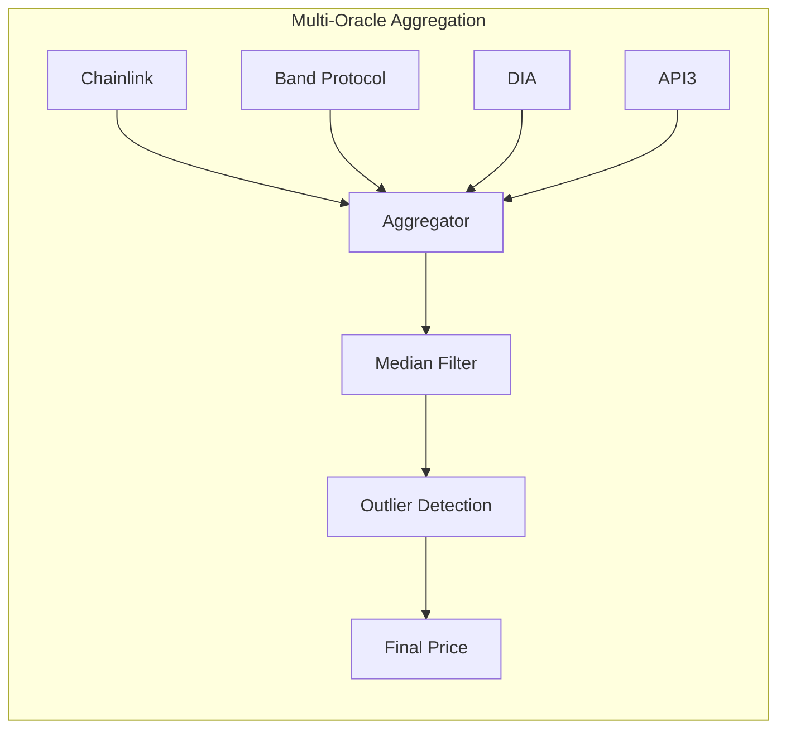

### 2. Stability Fee Adjustment

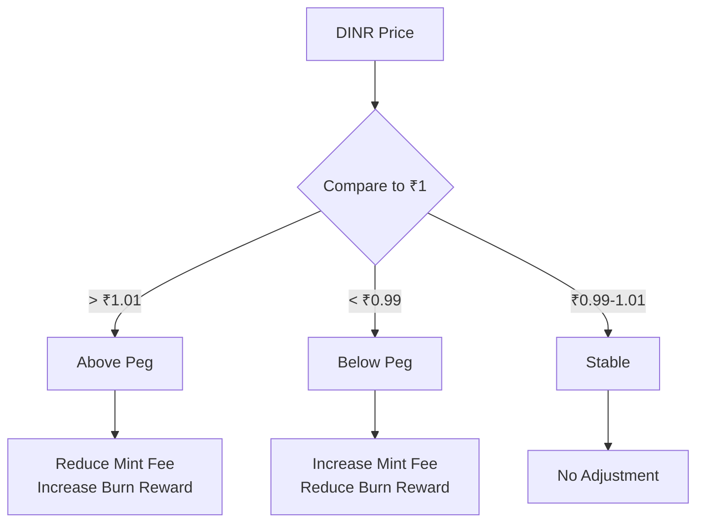

### 3. Insurance Fund

- Target: 5% of total DINR supply
- Funded by:
  - 50% of liquidation penalties
  - Excess yield from strategies
  - Emergency minting (governance approved)
- Used for:
  - Black swan event coverage
  - Bad debt absorption
  - Peg defense operations

## Yield Generation Strategy

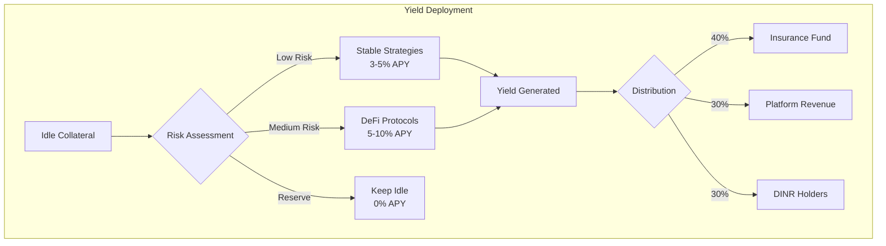

## Transaction Types

### 1. MsgMintDINR
Mints new DINR tokens against collateral.

```go
type MsgMintDINR struct {
    Minter      string
    Collateral  sdk.Coin
    DinrToMint  sdk.Coin
}
```

### 2. MsgBurnDINR
Burns DINR tokens and returns collateral.

```go
type MsgBurnDINR struct {
    Burner           string
    DinrToBurn       sdk.Coin
    CollateralDenom  string
}
```

### 3. MsgAddCollateral
Adds additional collateral to improve position health.

```go
type MsgAddCollateral struct {
    Depositor       string
    AdditionalColl  sdk.Coin
}
```

### 4. MsgLiquidatePosition
Liquidates an undercollateralized position.

```go
type MsgLiquidatePosition struct {
    Liquidator      string
    TargetAddress   string
    MaxDinrToPay    sdk.Coin
}
```

## Query Endpoints

### 1. QueryParams
Returns current module parameters.

**Request**: `/deshchain/dinr/v1/params`

**Response**:
```json
{
  "params": {
    "mint_fee": "10",
    "mint_fee_cap": "100",
    "burn_fee": "10",
    "min_collateral_ratio": "15000",
    "liquidation_threshold": "13000"
  }
}
```

### 2. QueryUserPosition
Returns user's DINR position details.

**Request**: `/deshchain/dinr/v1/position/{address}`

**Response**:
```json
{
  "position": {
    "address": "deshchain1...",
    "collateral": [
      {"denom": "usdt", "amount": "100000000"}
    ],
    "dinr_minted": {"denom": "dinr", "amount": "7000000"},
    "collateral_ratio": "15500",
    "health_factor": "1.19",
    "is_liquidatable": false
  }
}
```

### 3. QueryStabilityData
Returns current stability metrics.

**Request**: `/deshchain/dinr/v1/stability`

**Response**:
```json
{
  "stability_data": {
    "current_price": "1.0023",
    "target_price": "1.0000",
    "price_deviation": "23",
    "total_supply": {"denom": "dinr", "amount": "1000000000000"},
    "total_collateral_value": {"denom": "inr", "amount": "1550000000000"},
    "global_collateral_ratio": "15500"
  }
}
```

### 4. QueryCollateralAssets
Returns supported collateral assets.

**Request**: `/deshchain/dinr/v1/collateral-assets`

**Response**:
```json
{
  "assets": [
    {
      "denom": "usdt",
      "tier": "tier1_stable",
      "min_collateral_ratio": "14000",
      "max_allocation": "2500",
      "is_active": true
    }
  ]
}
```

## Events

### 1. DINR Minted Event
```json
{
  "type": "dinr_minted",
  "attributes": [
    {"key": "minter", "value": "{address}"},
    {"key": "collateral", "value": "{amount}"},
    {"key": "dinr_minted", "value": "{amount}"},
    {"key": "collateral_ratio", "value": "{ratio}"},
    {"key": "fee_paid", "value": "{amount}"}
  ]
}
```

### 2. DINR Burned Event
```json
{
  "type": "dinr_burned",
  "attributes": [
    {"key": "burner", "value": "{address}"},
    {"key": "dinr_burned", "value": "{amount}"},
    {"key": "collateral_returned", "value": "{amount}"},
    {"key": "fee_paid", "value": "{amount}"}
  ]
}
```

### 3. Position Liquidated Event
```json
{
  "type": "position_liquidated",
  "attributes": [
    {"key": "liquidator", "value": "{address}"},
    {"key": "liquidated_user", "value": "{address}"},
    {"key": "dinr_repaid", "value": "{amount}"},
    {"key": "collateral_seized", "value": "{amount}"},
    {"key": "penalty", "value": "{amount}"}
  ]
}
```

## Integration with Other Modules

### 1. Oracle Module Integration
- Real-time price feeds for all collateral assets
- INR/USD exchange rate for stability calculations
- Multi-oracle aggregation for reliability

### 2. Tax Module Integration
- Transaction fees subject to platform tax
- Tax distribution to NGOs and validators

### 3. NAMO Module Integration
- NAMO can be used as Tier 3 collateral
- Platform fees paid in NAMO tokens

### 4. Money Order Module Integration
- DINR used as primary currency for money orders
- Instant settlement without volatility risk

### 5. Remittance Module Integration
- DINR enables stable cross-border transfers
- No FX risk during transaction processing

## Security Considerations

1. **Oracle Manipulation Protection**
   - Multi-oracle aggregation with median pricing
   - Deviation limits and circuit breakers
   - Time-weighted average pricing (TWAP)

2. **Flash Loan Protection**
   - Minimum lock period for collateral
   - Rate limiting on large operations
   - Progressive fee structure

3. **Liquidation Safety**
   - Grace period notifications
   - Partial liquidation support
   - Liquidator incentive caps

4. **Emergency Mechanisms**
   - Pause functionality (governance only)
   - Emergency collateral ratio adjustment
   - Insurance fund deployment

## Risk Management

### Collateral Risk Matrix

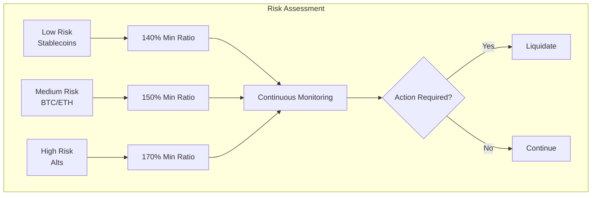

## Best Practices

1. **For Users**
   - Maintain healthy collateral ratios (>150%)
   - Diversify collateral across tiers
   - Monitor position health regularly
   - Use DINR for stable transactions

2. **For Developers**
   - Always check collateral ratios before operations
   - Handle liquidation events gracefully
   - Implement proper error handling for oracle failures
   - Use batch operations for efficiency

3. **For Liquidators**
   - Monitor positions approaching liquidation threshold
   - Prepare sufficient DINR for liquidations
   - Understand gas optimization strategies
   - Calculate profitability including penalties

## Revenue Model

### Fee Structure
- **Minting Fee**: 0.1% (capped at ₹100)
- **Burning Fee**: 0.1% (capped at ₹100)
- **Liquidation Penalty**: 10% of liquidated amount
- **Yield Generation**: 3-10% APY on deployed collateral

### Revenue Distribution
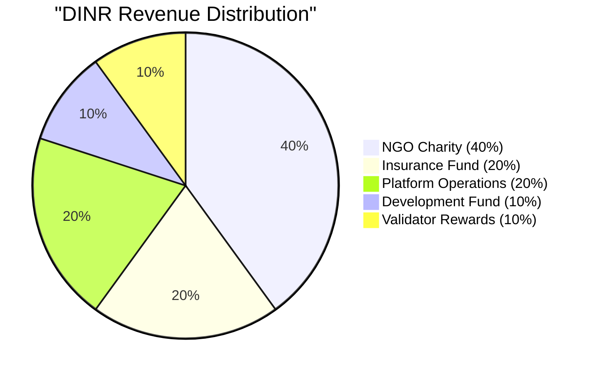

### Projected Revenue
- Year 1: ₹150 Crore
- Year 2: ₹842 Crore  
- Year 3: ₹2,636 Crore
- Year 5: ₹11,866 Crore

## CLI Commands

### Query Commands
```bash
# Query module parameters
deshchaind query dinr params

# Query user position
deshchaind query dinr position [address]

# Query stability data
deshchaind query dinr stability

# Query collateral assets
deshchaind query dinr collateral-assets

# Query total supply
deshchaind query dinr total-supply
```

### Transaction Commands
```bash
# Mint DINR
deshchaind tx dinr mint [collateral-amount] [dinr-amount] --from [key]

# Burn DINR
deshchaind tx dinr burn [dinr-amount] [collateral-denom] --from [key]

# Add collateral
deshchaind tx dinr add-collateral [amount] --from [key]

# Liquidate position
deshchaind tx dinr liquidate [target-address] [max-dinr] --from [key]
```

## FAQ

**Q: How is DINR different from other stablecoins?**
A: DINR is specifically pegged to INR, uses multi-tier collateral system, generates yield on idle collateral, and dedicates 40% of revenue to charity.

**Q: What happens if DINR loses its peg?**
A: The stability mechanism automatically adjusts fees and incentives. If deviation persists, the insurance fund can be deployed to defend the peg.

**Q: Can I use NAMO tokens as collateral?**
A: Yes, NAMO is accepted as Tier 3 collateral with a 170% minimum collateralization ratio.

**Q: How are liquidations handled?**
A: Positions below 130% ratio can be liquidated through a Dutch auction mechanism, with a 10% penalty split between insurance fund and platform.

**Q: Is there a minimum amount to mint DINR?**
A: Yes, the minimum minting amount is ₹100 worth of DINR to ensure economic viability.

---

For more information, see the [Module Overview](../MODULE_OVERVIEW.md) or explore other [DeshChain Modules](../MODULE_OVERVIEW.md#module-categories).