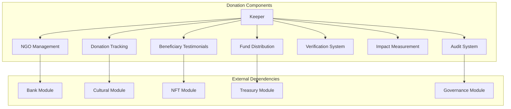
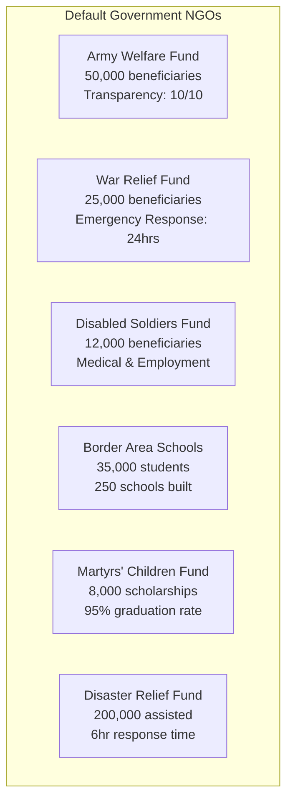
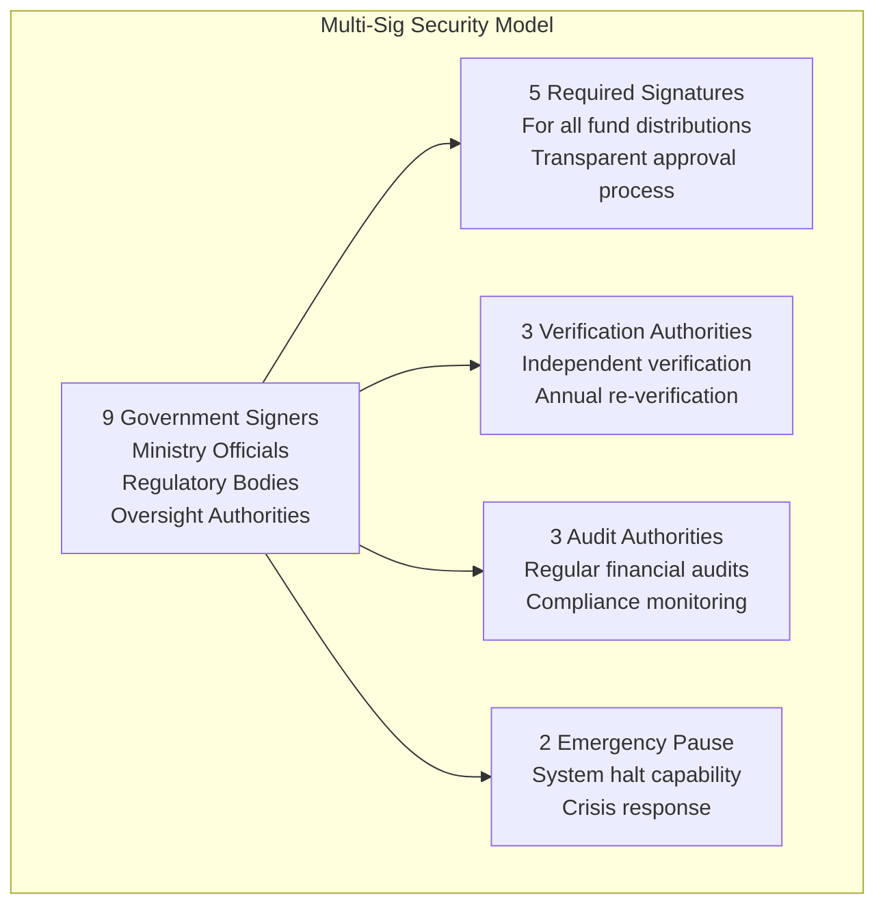
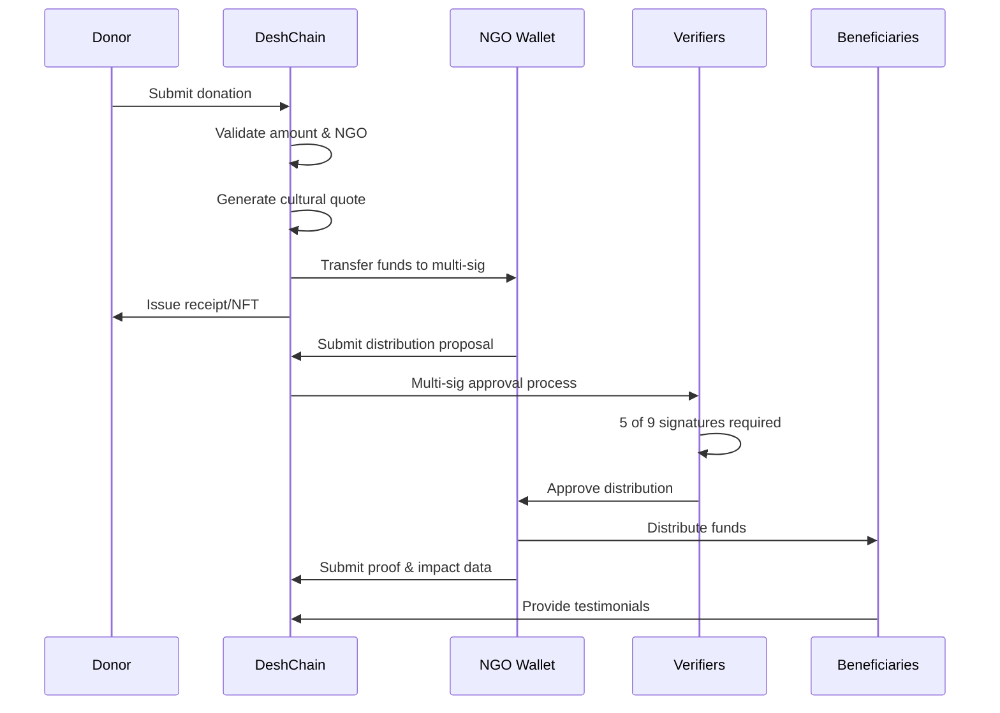
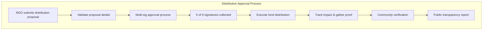
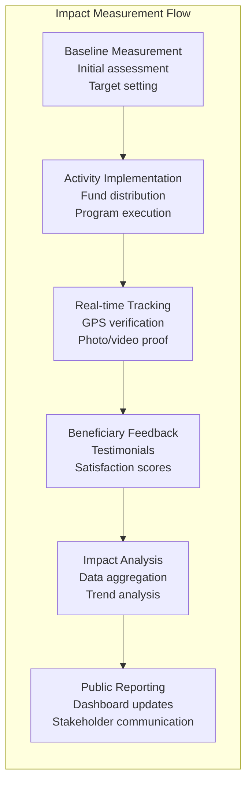
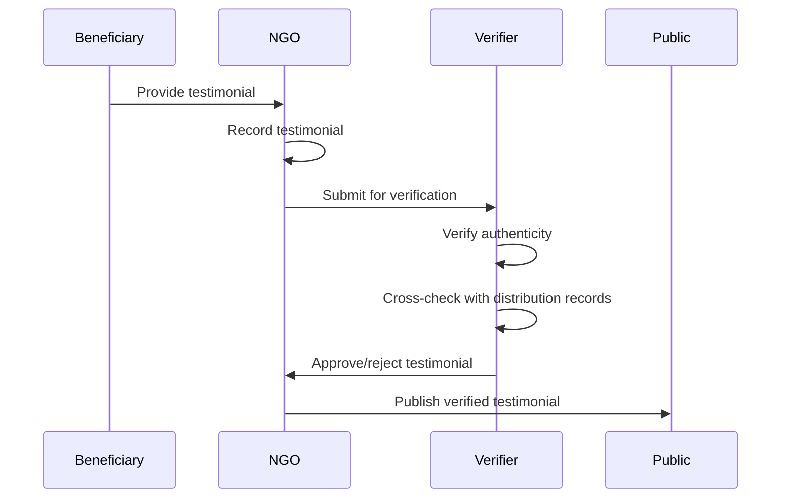
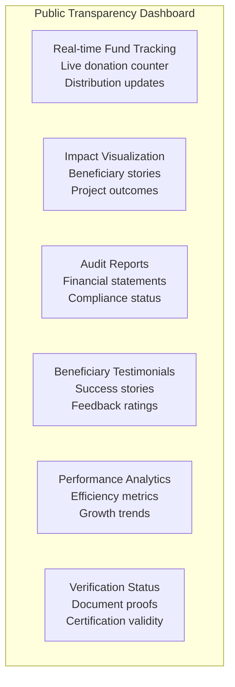

# Donation Module Documentation

## Overview

The Donation module implements DeshChain's comprehensive donation and NGO management system, featuring transparent fund tracking, multi-signature wallets, impact measurement, and cultural integration. It enables secure, auditable donations to verified NGOs while ensuring maximum transparency and social impact through blockchain technology.

## Module Architecture



## Default NGO System

### 1. Pre-Verified Government NGOs

DeshChain launches with 6 pre-verified government NGOs focusing on national priorities:



### 2. NGO Categories and Focus Areas

```go
// Primary Categories
const (
    CategoryArmyWelfare         = "army_welfare"
    CategoryWarRelief          = "war_relief"
    CategoryDisabledSoldiers   = "disabled_soldiers"
    CategoryBorderAreaSchools  = "border_area_schools"
    CategoryMartyrsChildren    = "martyrs_children"
    CategoryDisasterRelief     = "disaster_relief"
    CategoryEducation          = "education"
    CategoryHealthcare         = "healthcare"
    CategoryEnvironment        = "environment"
    CategoryWomenEmpowerment   = "women_empowerment"
    // ... additional categories
)

// NGO Wallet Structure
type NGOWallet struct {
    Id                   uint64
    Name                 string
    Address              string  // Multi-sig wallet address
    Category             string
    Description          string
    RegistrationNumber   string
    Website              string
    ContactEmail         string
    Signers              []string  // Government signers
    RequiredSignatures   uint32    // Default: 5 of 9
    IsVerified           bool
    IsActive             bool
    TotalReceived        sdk.Coin
    TotalDistributed     sdk.Coin
    CurrentBalance       sdk.Coin
    TransparencyScore    int32     // 1-10 scale
    ImpactMetrics        []ImpactMetric
    BeneficiaryCount     uint64
    RegionsServed        []string
    PriorityAreas        []string
}
```

## Multi-Signature Security

### 1. Government Signer Structure



### 2. Default Authority Structure

```go
// Government Signers (9 total)
var DefaultGovernmentSigners = []string{
    "desh1gov1000000000000000000000000000000000000", // Finance Ministry
    "desh1gov2000000000000000000000000000000000000", // Home Ministry
    "desh1gov3000000000000000000000000000000000000", // Defence Ministry
    "desh1gov4000000000000000000000000000000000000", // Social Justice Ministry
    "desh1gov5000000000000000000000000000000000000", // Education Ministry
    "desh1gov6000000000000000000000000000000000000", // Health Ministry
    "desh1gov7000000000000000000000000000000000000", // Rural Development
    "desh1gov8000000000000000000000000000000000000", // Disaster Management
    "desh1gov9000000000000000000000000000000000000", // Comptroller & Auditor General
}

// Multi-signature Configuration
const (
    DefaultRequiredSignatures = 5  // 5 of 9 signatures required
    MaxSigners = 9                 // Maximum signers allowed
    MinSigners = 3                 // Minimum signers required
)
```

## Donation System

### 1. Donation Process Flow



### 2. Donation Record Structure

```go
type DonationRecord struct {
    Id                    uint64
    TransactionHash       string
    DonorAddress          string
    NGOWalletId          uint64
    Amount               sdk.Coin
    Timestamp            int64
    Purpose              string
    IsAnonymous          bool
    TaxBenefitClaimed    bool
    ReceiptGenerated     bool
    ReceiptIPFSHash      string
    DonorMessage         string
    CampaignId           uint64         // Optional campaign
    RecurringDonationId  uint64         // For recurring donations
    MatchingFundsApplied bool
    MatchingAmount       sdk.Coin
    VerificationStatus   string
    CulturalQuoteId      uint64         // Cultural integration
}
```

### 3. Donation Features

```go
// Donation Parameters
type Params struct {
    MinDonationAmount        sdk.Coin   // 1 NAMO minimum
    MaxDonationAmount        sdk.Coin   // 10M NAMO maximum
    EnableAnonymousDonations bool       // Allow anonymous donations
    EnableRecurringDonations bool       // Allow recurring setup
    EnableMatchingFunds      bool       // Corporate matching programs
    TaxBenefitPercentage    string     // 50% tax benefit
    ReceiptGenerationFee    sdk.Coin   // 0.1 NAMO receipt fee
    EnableCulturalIntegration bool     // Cultural quotes
    EnableNFTReceipts       bool       // NFT receipt generation
    DonationFeePercentage   string     // 0% donation fee
}
```

## Fund Distribution System

### 1. Distribution Categories

```go
const (
    DistributionCategoryMedical        = "medical"
    DistributionCategoryEducation      = "education"
    DistributionCategoryFood           = "food"
    DistributionCategoryShelter        = "shelter"
    DistributionCategoryEmergency      = "emergency"
    DistributionCategoryInfrastructure = "infrastructure"
    DistributionCategoryEquipment      = "equipment"
    DistributionCategoryTraining       = "training"
    DistributionCategoryResearch       = "research"
    DistributionCategoryRehabilitation = "rehabilitation"
    // ... additional categories
)
```

### 2. Distribution Record

```go
type DistributionRecord struct {
    Id                      uint64
    TransactionHash         string
    NGOWalletId            uint64
    RecipientAddress       string
    Amount                 sdk.Coin
    Timestamp              int64
    Purpose                string
    Category               string
    BeneficiaryName        string
    BeneficiaryDetails     string
    ProjectName            string
    ProjectDescription     string
    DocumentationIPFSHash  string   // Supporting documents
    PhotosIPFSHash         string   // Photo evidence
    VideoIPFSHash          string   // Video proof
    GPSCoordinates         string   // Location verification
    Region                 string
    ApprovedBy            []string  // Multi-sig approvers
    ApprovalTimestamp     int64
    ExecutionTimestamp    int64
    VerificationStatus    string
    ImpactMeasurement     string
    FollowUpRequired      bool
    FollowUpDate          int64
    BeneficiaryFeedback   string
    PublicVisibility      bool
}
```

### 3. Distribution Approval Flow



## Audit & Verification System

### 1. Audit Types and Frequency

```go
const (
    AuditTypeFinancial    = "financial"    // Annual financial audit
    AuditTypeOperational  = "operational"  // Operational efficiency
    AuditTypeCompliance   = "compliance"   // Regulatory compliance
    AuditTypeImpact       = "impact"       // Impact measurement
    AuditTypeGovernance   = "governance"   // Governance practices
    AuditTypeTransparency = "transparency" // Transparency assessment
    AuditTypeEfficiency   = "efficiency"   // Resource utilization
    AuditTypeRisk         = "risk"         // Risk assessment
    AuditTypeInternal     = "internal"     // Internal audit
    AuditTypeExternal     = "external"     // External audit
    AuditTypeSpecial      = "special"      // Special investigations
)

// Default audit frequency: 12 months
const DefaultAuditFrequency = 12
```

### 2. Audit Report Structure

```go
type AuditReport struct {
    Id                          uint64
    NGOWalletId                uint64
    AuditPeriodStart           int64
    AuditPeriodEnd             int64
    AuditorAddress             string
    AuditorName                string
    AuditorCredentials         string
    AuditType                  string
    Findings                   []AuditFinding
    Recommendations            []string
    OverallRating              int32    // 1-10 scale
    ComplianceScore            int32    // 1-10 scale
    TransparencyScore          int32    // 1-10 scale
    EfficiencyScore            int32    // 1-10 scale
    ImpactScore                int32    // 1-10 scale
    AuditReportIPFSHash        string
    Summary                    string
    IssuesIdentified           []string
    CorrectiveActions          []string
    NextAuditRecommendations   []string
    AuditCompletedAt           int64
    PublishedAt                int64
    IsPublic                   bool
    CertificationValidUntil    int64
}
```

### 3. Audit Finding Classification

```go
type AuditFinding struct {
    Category           string  // Financial, operational, compliance
    Severity          string  // Low, medium, high, critical
    Description       string
    Evidence          string
    Recommendation    string
    Status            string  // Open, in progress, resolved, closed
    DueDate           int64
    ResponsibleParty  string
}

// Severity Levels
const (
    SeverityLow      = "low"       // Minor issues
    SeverityMedium   = "medium"    // Moderate concerns
    SeverityHigh     = "high"      // Significant problems
    SeverityCritical = "critical"  // Urgent action required
)
```

## Impact Measurement System

### 1. Impact Metrics Framework

```go
type ImpactMetric struct {
    MetricName        string  // Name of the metric
    MetricValue       string  // Current value
    MetricUnit        string  // Unit of measurement
    TargetValue       string  // Target/goal value
    MeasurementPeriod string  // Time period (annual, quarterly, etc.)
    LastUpdated       int64   // Last update timestamp
}

// Standard Impact Metrics
const (
    MetricTypeBeneficiaries      = "beneficiaries_served"
    MetricTypeFundsUtilized      = "funds_utilized"
    MetricTypeProjectsCompleted  = "projects_completed"
    MetricTypeGeographicReach    = "geographic_reach"
    MetricTypeVolunteers         = "volunteers_engaged"
    MetricTypePartnerships       = "partnerships_formed"
    MetricTypeTrainingSessions   = "training_sessions"
    MetricTypeInfrastructureBuilt = "infrastructure_built"
    MetricTypeJobs               = "jobs_created"
    MetricTypeScholarships       = "scholarships_provided"
    MetricTypeHealthcareServices = "healthcare_services"
    MetricTypeEnvironmentalImpact = "environmental_impact"
    MetricTypeTechnologyAccess   = "technology_access"
    MetricTypeCommunityDevelopment = "community_development"
    MetricTypeCapacityBuilding   = "capacity_building"
)
```

### 2. Real-Time Impact Tracking



## Beneficiary Testimonial System

### 1. Testimonial Structure

```go
type BeneficiaryTestimonial struct {
    Id                   uint64
    NGOWalletId         uint64
    DistributionId      uint64
    BeneficiaryName     string
    TestimonialText     string
    Rating              int32     // 1-5 stars
    PhotoIPFSHash       string
    VideoIPFSHash       string
    Location            string
    ProgramName         string
    ImpactDescription   string
    Verified            bool
    VerificationMethod  string
    CreatedAt           int64
    IsPublic            bool
    Language            string
    Translation         map[string]string  // Multi-language support
}
```

### 2. Testimonial Verification Process



## Transparency & Public Dashboard

### 1. Real-Time Transparency Metrics

```go
type TransparencyMetrics struct {
    NGOWalletId              uint64
    TotalDonationsReceived   sdk.Coin
    TotalFundsDistributed    sdk.Coin
    CurrentBalance           sdk.Coin
    UtilizationRate         sdk.Dec    // Percentage of funds used
    AverageResponseTime     int64      // Hours to respond to requests
    BeneficiarySatisfaction sdk.Dec    // Average satisfaction score
    TransparencyScore       int32      // 1-10 transparency rating
    ComplianceScore         int32      // 1-10 compliance rating
    LastAuditScore          int32      // Last audit overall score
    ActiveProjects          uint64
    CompletedProjects       uint64
    ProjectSuccessRate      sdk.Dec
    VolunteerCount          uint64
    PartnershipCount        uint64
    RegionalImpact          map[string]uint64  // Impact by region
    MonthlyGrowthRate       sdk.Dec
    DonorRetentionRate      sdk.Dec
}
```

### 2. Public Dashboard Features



## Cultural Integration

### 1. Cultural Quote System

DeshChain integrates cultural elements into the donation experience:

```go
type CulturalIntegration struct {
    QuoteId          uint64
    DonationId       uint64
    Quote            string
    Author           string
    Context          string
    Language         string
    Translation      map[string]string
    Category         string  // Giving, compassion, service
    Era              string  // Ancient, medieval, modern
    Region           string  // Regional origin
    Significance     string  // Cultural/religious significance
}

// Cultural Quote Categories
const (
    CategoryGiving     = "giving"
    CategoryCompassion = "compassion"
    CategoryService    = "service"
    CategoryDharma     = "dharma"
    CategoryKarma      = "karma"
    CategorySeva       = "seva"
    CategoryDaan       = "daan"
)
```

## Transaction Types

### 1. MsgDonate
Submit a donation to an NGO.

```go
type MsgDonate struct {
    Donor         string    // Donor address
    NGOWalletId   uint64    // Target NGO
    Amount        sdk.Coin  // Donation amount
    Purpose       string    // Purpose of donation
    IsAnonymous   bool      // Anonymous flag
    DonorMessage  string    // Optional message
    CampaignId    uint64    // Optional campaign ID
}
```

### 2. MsgDistributeFunds
Distribute funds from NGO wallet (requires multi-sig).

```go
type MsgDistributeFunds struct {
    NGOWalletId        uint64    // NGO wallet ID
    RecipientAddress   string    // Recipient address
    Amount            sdk.Coin  // Distribution amount
    Purpose           string    // Distribution purpose
    Category          string    // Distribution category
    BeneficiaryName   string    // Beneficiary name
    ProjectName       string    // Project name
    Documentation     string    // IPFS hash of documents
    GPSCoordinates    string    // Location coordinates
    Region            string    // Geographic region
}
```

### 3. MsgSubmitAuditReport
Submit an audit report for an NGO.

```go
type MsgSubmitAuditReport struct {
    Auditor            string    // Auditor address
    NGOWalletId       uint64    // NGO being audited
    AuditType         string    // Type of audit
    AuditPeriodStart  int64     // Audit period start
    AuditPeriodEnd    int64     // Audit period end
    OverallRating     int32     // Overall rating 1-10
    ComplianceScore   int32     // Compliance score 1-10
    TransparencyScore int32     // Transparency score 1-10
    EfficiencyScore   int32     // Efficiency score 1-10
    ImpactScore       int32     // Impact score 1-10
    Summary           string    // Audit summary
    ReportHash        string    // IPFS hash of full report
}
```

## Query Endpoints

### 1. QueryNGOWallet
Get NGO wallet details.

**Request**: `/deshchain/donation/v1/ngo/{ngo_id}`

**Response**:
```json
{
  "ngo_wallet": {
    "id": 1,
    "name": "Army Welfare Fund",
    "category": "army_welfare",
    "total_received": "5000000 NAMO",
    "total_distributed": "4500000 NAMO",
    "current_balance": "500000 NAMO",
    "transparency_score": 10,
    "beneficiary_count": 50000,
    "is_verified": true,
    "is_active": true
  }
}
```

### 2. QueryDonations
Get donations by donor or NGO.

**Request**: `/deshchain/donation/v1/donations?donor={address}&ngo_id={id}&limit=20`

**Response**:
```json
{
  "donations": [
    {
      "id": 123,
      "donor_address": "deshchain1...",
      "ngo_wallet_id": 1,
      "amount": "10000 NAMO",
      "purpose": "Education support",
      "timestamp": "2024-07-25T10:30:00Z",
      "is_anonymous": false,
      "receipt_generated": true,
      "cultural_quote_id": 456
    }
  ],
  "total": 1,
  "pagination": {...}
}
```

### 3. QueryDistributions
Get fund distributions by NGO.

**Request**: `/deshchain/donation/v1/distributions/{ngo_id}?category=education&limit=10`

**Response**:
```json
{
  "distributions": [
    {
      "id": 789,
      "ngo_wallet_id": 1,
      "amount": "50000 NAMO",
      "category": "education",
      "beneficiary_name": "Student XYZ",
      "project_name": "School Infrastructure",
      "region": "Kashmir",
      "verification_status": "verified",
      "impact_measurement": "1 school built, 200 students enrolled"
    }
  ]
}
```

### 4. QueryAuditReports
Get audit reports for an NGO.

**Request**: `/deshchain/donation/v1/audits/{ngo_id}?audit_type=financial`

**Response**:
```json
{
  "audit_reports": [
    {
      "id": 101,
      "ngo_wallet_id": 1,
      "audit_type": "financial",
      "overall_rating": 9,
      "transparency_score": 10,
      "efficiency_score": 8,
      "summary": "Excellent financial management and transparency",
      "certification_valid_until": "2025-07-25T00:00:00Z"
    }
  ]
}
```

### 5. QueryImpactMetrics
Get impact metrics for an NGO.

**Request**: `/deshchain/donation/v1/impact/{ngo_id}`

**Response**:
```json
{
  "impact_metrics": [
    {
      "metric_name": "beneficiaries_served",
      "metric_value": "50000",
      "metric_unit": "soldiers_and_families",
      "target_value": "100000",
      "measurement_period": "annual"
    },
    {
      "metric_name": "funds_utilized",
      "metric_value": "85",
      "metric_unit": "percentage",
      "target_value": "90"
    }
  ]
}
```

## Events

### 1. Donation Event
```json
{
  "type": "donate",
  "attributes": [
    {"key": "donor", "value": "deshchain1..."},
    {"key": "ngo_wallet_id", "value": "1"},
    {"key": "amount", "value": "10000 NAMO"},
    {"key": "purpose", "value": "Education support"},
    {"key": "cultural_quote_id", "value": "456"}
  ]
}
```

### 2. Fund Distribution Event
```json
{
  "type": "distribute_funds",
  "attributes": [
    {"key": "ngo_wallet_id", "value": "1"},
    {"key": "amount", "value": "50000 NAMO"},
    {"key": "beneficiary_name", "value": "Student XYZ"},
    {"key": "category", "value": "education"},
    {"key": "region", "value": "Kashmir"}
  ]
}
```

### 3. Audit Report Submitted Event
```json
{
  "type": "submit_audit_report",
  "attributes": [
    {"key": "ngo_wallet_id", "value": "1"},
    {"key": "auditor", "value": "deshchain1..."},
    {"key": "audit_type", "value": "financial"},
    {"key": "overall_rating", "value": "9"},
    {"key": "transparency_score", "value": "10"}
  ]
}
```

## Best Practices

### For Donors
1. **Research NGOs**: Review transparency scores and audit reports
2. **Specify Purpose**: Clearly state donation purpose for better tracking
3. **Regular Monitoring**: Follow up on impact through public dashboard
4. **Cultural Engagement**: Appreciate cultural quotes and context
5. **Tax Benefits**: Claim appropriate tax benefits with proper receipts

### For NGOs
1. **Maintain Transparency**: Regular updates and clear documentation
2. **Impact Measurement**: Consistent tracking and reporting of outcomes
3. **Beneficiary Engagement**: Collect testimonials and feedback
4. **Financial Discipline**: Efficient fund utilization and proper accounting
5. **Multi-sig Compliance**: Ensure all distributions have required approvals

### For Auditors
1. **Comprehensive Assessment**: Cover all aspects (financial, impact, governance)
2. **Evidence-Based**: Support all findings with clear evidence
3. **Actionable Recommendations**: Provide specific, implementable suggestions
4. **Public Accountability**: Maintain independence and objectivity
5. **Follow-up**: Track implementation of recommendations

## CLI Commands

### Query Commands
```bash
# View NGO details
deshchaind query donation ngo [ngo-id]

# List donations
deshchaind query donation donations --donor [address] --ngo-id [id]

# View distributions
deshchaind query donation distributions [ngo-id] --category education

# Check audit reports
deshchaind query donation audits [ngo-id]

# View impact metrics
deshchaind query donation impact [ngo-id]

# Get beneficiary testimonials
deshchaind query donation testimonials [ngo-id]

# Check transparency dashboard
deshchaind query donation transparency [ngo-id]
```

### Transaction Commands
```bash
# Make a donation
deshchaind tx donation donate [ngo-id] [amount] \
  --purpose "Education support" \
  --donor-message "For the children" \
  --from [donor-key]

# Distribute funds (requires multi-sig)
deshchaind tx donation distribute-funds [ngo-id] [recipient] [amount] \
  --purpose "School building" \
  --category "education" \
  --beneficiary "School XYZ" \
  --region "Kashmir" \
  --from [ngo-signer-key]

# Submit audit report
deshchaind tx donation submit-audit [ngo-id] \
  --audit-type "financial" \
  --overall-rating 9 \
  --transparency-score 10 \
  --summary "Excellent management" \
  --from [auditor-key]

# Add beneficiary testimonial
deshchaind tx donation add-testimonial [ngo-id] [distribution-id] \
  --testimonial "Helped my child get education" \
  --rating 5 \
  --beneficiary "Parent ABC" \
  --from [ngo-key]
```

## Integration Examples

### Donation with Cultural Integration
```javascript
import { DonationClient } from '@deshchain/donation-sdk'

async function makeDonation() {
  const client = new DonationClient(rpcEndpoint)
  
  // Make donation with cultural integration
  const result = await client.donate({
    ngoWalletId: 1,
    amount: { denom: 'namo', amount: '10000' },
    purpose: 'Education for underprivileged children',
    donorMessage: 'May this help build a better future',
    isAnonymous: false
  })
  
  console.log(`Donation successful: ${result.transactionHash}`)
  console.log(`Cultural quote: ${result.culturalQuote}`)
  console.log(`Receipt IPFS: ${result.receiptIPFSHash}`)
}
```

### NGO Impact Tracking
```javascript
async function trackNGOImpact(ngoId) {
  const client = new DonationClient(rpcEndpoint)
  
  // Get comprehensive NGO data
  const ngo = await client.getNGOWallet(ngoId)
  const distributions = await client.getDistributions(ngoId)
  const testimonials = await client.getTestimonials(ngoId)
  const auditReports = await client.getAuditReports(ngoId)
  
  // Calculate impact metrics
  const impactSummary = {
    transparencyScore: ngo.transparency_score,
    fundsUtilized: (ngo.total_distributed.amount / ngo.total_received.amount) * 100,
    beneficiaryCount: ngo.beneficiary_count,
    averageRating: testimonials.reduce((sum, t) => sum + t.rating, 0) / testimonials.length,
    lastAuditScore: auditReports[0]?.overall_rating || 0
  }
  
  console.log('NGO Impact Summary:', impactSummary)
}
```

## FAQ

**Q: How are donations tracked for transparency?**
A: Every donation is recorded on-chain with immutable transaction hashes, real-time balance updates, and public dashboard visibility.

**Q: What verification is required for NGOs?**
A: NGOs need government registration, tax exemption certificates, multi-sig wallet setup, and annual audit compliance.

**Q: How does the multi-signature system work?**
A: All fund distributions require 5 of 9 signatures from government officials, ensuring oversight and preventing misuse.

**Q: Can donors track their donation impact?**
A: Yes, donors can view real-time distribution updates, beneficiary testimonials, impact metrics, and project completion status.

**Q: What happens during an audit?**
A: Independent auditors assess financial management, compliance, transparency, efficiency, and impact, publishing public reports.

**Q: How are cultural elements integrated?**
A: Each donation displays relevant quotes from Indian literature/philosophy, available in multiple languages for cultural connection.

---

For more information, see the [Module Overview](../MODULE_OVERVIEW.md) or explore other [DeshChain Modules](../MODULE_OVERVIEW.md#module-categories).