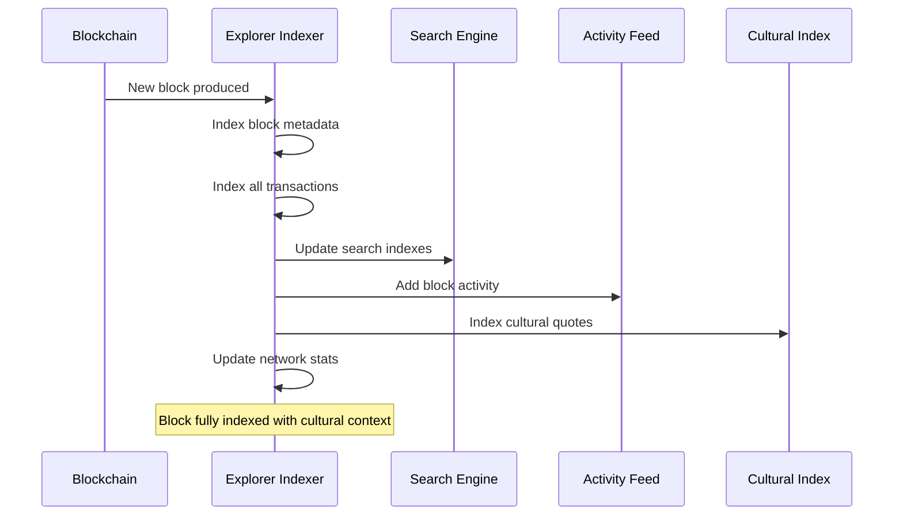
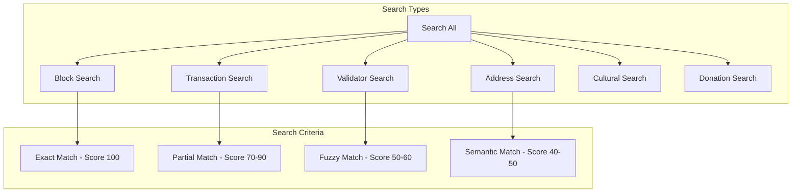

# Explorer Module Documentation

## Overview

The Explorer module provides DeshChain's comprehensive blockchain explorer capabilities with advanced indexing, real-time search, cultural integration, patriotism leaderboards, donation tracking, and network analytics. It offers a rich, user-friendly interface to explore all blockchain activities while highlighting DeshChain's unique cultural and social features.

## Module Architecture

```mermaid
graph TB
    subgraph "Explorer Indexing System"
        INDEXER[Explorer Indexer]
        BLOCKS[Block Index]
        TXS[Transaction Index]
        VALIDATORS[Validator Index]
        ADDRESSES[Address Index]
        SEARCH[Search Engine]
        CULTURAL[Cultural Quote Index]
        PATRIOTISM[Patriotism Leaderboard]
        DONATIONS[Donation Tracker]
        BURNS[Token Burn Index]
        ACTIVITY[Recent Activity Feed]
    end
    
    subgraph "Network Analytics"
        STATS[Network Statistics]
        TAX[Tax Analytics]
        HOLDERS[Holder Rankings]
        GROWTH[Growth Metrics]
    end
    
    subgraph "External Data Sources"
        CHAIN[Blockchain Data]
        CULTURAL_MOD[Cultural Module]
        DONATION_MOD[Donation Module]
        TAX_MOD[Tax Module]
        NAMO_MOD[NAMO Module]
    end
    
    INDEXER --> BLOCKS
    INDEXER --> TXS
    INDEXER --> VALIDATORS
    INDEXER --> ADDRESSES
    INDEXER --> SEARCH
    INDEXER --> CULTURAL
    INDEXER --> PATRIOTISM
    INDEXER --> DONATIONS
    INDEXER --> BURNS
    INDEXER --> ACTIVITY
    
    INDEXER --> STATS
    INDEXER --> TAX
    INDEXER --> HOLDERS
    INDEXER --> GROWTH
    
    CHAIN --> INDEXER
    CULTURAL_MOD --> CULTURAL
    DONATION_MOD --> DONATIONS
    TAX_MOD --> TAX
    NAMO_MOD --> HOLDERS
```



## Advanced Indexing System

### 1. Multi-Dimensional Block Indexing



### 2. Block Information Structure

```go
type BlockInfo struct {
    Height            int64         // Block height
    Hash              string        // Block hash
    ProposerAddress   string        // Block proposer
    Timestamp         int64         // Block timestamp
    TransactionCount  uint64        // Number of transactions
    GasUsed           uint64        // Total gas used
    GasLimit          uint64        // Gas limit
    Size              uint64        // Block size in bytes
    Reward            sdk.Coin      // Block reward
    TaxCollected      sdk.Coin      // Tax collected in block
    TotalDonations    sdk.Coin      // Total donations in block
    DonationsCount    uint64        // Number of donation txs
    BurnedAmount      sdk.Coin      // Amount burned in block
    CulturalQuoteId   uint64        // Featured cultural quote ID
    PatriotismActions uint64        // Patriotic actions count
}

// Index block with comprehensive metadata
func (idx *ExplorerIndexer) IndexBlock(ctx context.Context, block *BlockInfo) error {
    // Store block in primary index
    idx.blockIndex[block.Height] = block
    
    // Create activity entry
    activity := RecentActivity{
        ActivityType:    ActivityTypeBlock,
        Description:     fmt.Sprintf("Block %d proposed by %s", block.Height, block.ProposerAddress),
        Timestamp:       block.Timestamp,
        BlockHeight:     block.Height,
        Amount:          block.Reward.Amount,
        ToAddress:       block.ProposerAddress,
        AdditionalInfo: map[string]string{
            "transaction_count": fmt.Sprintf("%d", block.TransactionCount),
            "cultural_quote_id": fmt.Sprintf("%d", block.CulturalQuoteId),
            "tax_collected":     block.TaxCollected.String(),
            "burned_amount":     block.BurnedAmount.String(),
        },
    }
    
    idx.AddActivity(activity)
    idx.UpdateNetworkStats(block)
    idx.UpdateSearchIndex(block)
    
    return nil
}
```

### 3. Comprehensive Transaction Indexing

```go
type TransactionInfo struct {
    Hash                string        // Transaction hash
    Height              int64         // Block height
    Index               uint64        // Transaction index in block
    FromAddress         string        // Sender address
    ToAddress           string        // Recipient address
    Amount              sdk.Coin      // Transfer amount
    Fee                 sdk.Coin      // Transaction fee
    TaxAmount           sdk.Coin      // Tax amount paid
    BurnAmount          sdk.Coin      // Amount burned
    MessageType         string        // Transaction message type
    Status              string        // Success/Failed
    GasUsed             uint64        // Gas used
    GasLimit            uint64        // Gas limit
    Memo                string        // Transaction memo
    Timestamp           int64         // Transaction timestamp
    
    // Cultural & Social Features
    CulturalQuoteId     uint64        // Associated cultural quote
    CulturalQuoteText   string        // Quote text
    CulturalQuoteAuthor string        // Quote author
    PatriotismScore     int32         // Patriotism points earned
    IsDonation          bool          // Is charity donation
    DonationNgoName     string        // NGO recipient name
    DonationPurpose     string        // Donation purpose
    
    // Advanced Features
    ContractInteraction bool          // Smart contract call
    CrossChainTransfer  bool          // Cross-chain transfer
    NFTTransfer         bool          // NFT transfer
    TokenSwap           bool          // Token swap transaction
}
```

## Intelligent Search Engine

### 1. Multi-Type Search System



### 2. Advanced Search Implementation

```go
type SearchResult struct {
    ResultType     string            // "block", "transaction", "validator", "address"
    Title          string            // Search result title
    Description    string            // Result description
    Url            string            // Link to detailed view
    RelevanceScore int32             // Search relevance (0-100)
    AdditionalInfo map[string]string // Extra metadata
}

// Comprehensive search across all indexed data
func (idx *ExplorerIndexer) Search(query string, searchType string, limit uint32) ([]SearchResult, error) {
    query = strings.ToLower(strings.TrimSpace(query))
    results := make([]SearchResult, 0)
    
    switch searchType {
    case SearchTypeAll:
        // Search across all data types
        results = append(results, idx.searchBlocks(query)...)
        results = append(results, idx.searchTransactions(query)...)
        results = append(results, idx.searchValidators(query)...)
        results = append(results, idx.searchAddresses(query)...)
        results = append(results, idx.searchCultural(query)...)
        results = append(results, idx.searchDonations(query)...)
    case SearchTypeBlocks:
        results = idx.searchBlocks(query)
    case SearchTypeTransactions:
        results = idx.searchTransactions(query)
    // ... other search types
    }
    
    // Sort by relevance score (highest first)
    sort.Slice(results, func(i, j int) bool {
        return results[i].RelevanceScore > results[j].RelevanceScore
    })
    
    // Apply limit
    if limit > 0 && len(results) > int(limit) {
        results = results[:limit]
    }
    
    return results, nil
}
```

### 3. Block Search with Cultural Context

```go
func (idx *ExplorerIndexer) searchBlocks(query string) []SearchResult {
    results := make([]SearchResult, 0)
    
    for height, block := range idx.blockIndex {
        score := 0
        
        // Exact height match (highest priority)
        if fmt.Sprintf("%d", height) == query {
            score = 100
        }
        
        // Hash partial match
        if strings.Contains(strings.ToLower(block.Hash), query) {
            score = 90
        }
        
        // Proposer address match
        if strings.Contains(strings.ToLower(block.ProposerAddress), query) {
            score = 80
        }
        
        // Cultural quote search
        if strings.Contains(strings.ToLower(block.CulturalQuoteText), query) {
            score = 70
        }
        
        if score > 0 {
            results = append(results, SearchResult{
                ResultType:     ResultTypeBlock,
                Title:          fmt.Sprintf("Block %d", height),
                Description:    fmt.Sprintf("Block %d proposed by %s with %d transactions", 
                                           height, block.ProposerAddress, block.TransactionCount),
                Url:            fmt.Sprintf("/block/%d", height),
                RelevanceScore: int32(score),
                AdditionalInfo: map[string]string{
                    "height":           fmt.Sprintf("%d", height),
                    "hash":             block.Hash,
                    "proposer":         block.ProposerAddress,
                    "tx_count":         fmt.Sprintf("%d", block.TransactionCount),
                    "cultural_quote":   block.CulturalQuoteText,
                    "tax_collected":    block.TaxCollected.String(),
                    "donations_count":  fmt.Sprintf("%d", block.DonationsCount),
                },
            })
        }
    }
    
    return results
}
```

## Cultural Integration & Patriotism Tracking

### 1. Cultural Quote Display System

```go
type CulturalQuoteDisplay struct {
    QuoteId         uint64    // Unique quote identifier
    QuoteText       string    // Quote content
    QuoteAuthor     string    // Quote author
    Category        string    // Quote category
    Language        string    // Quote language
    TransactionHash string    // Associated transaction
    BlockHeight     int64     // Block containing quote
    Timestamp       int64     // Display timestamp
    PatriotismBonus int32     // Patriotism points awarded
    ShareCount      uint64    // Number of times shared
    LikeCount       uint64    // Community likes
}

// Index cultural quotes from transactions
func (idx *ExplorerIndexer) indexCulturalQuote(tx *TransactionInfo) {
    if tx.CulturalQuoteId > 0 {
        quote := &CulturalQuoteDisplay{
            QuoteId:        tx.CulturalQuoteId,
            QuoteText:      tx.CulturalQuoteText,
            QuoteAuthor:    tx.CulturalQuoteAuthor,
            TransactionHash: tx.Hash,
            BlockHeight:    tx.Height,
            Timestamp:      tx.Timestamp,
            PatriotismBonus: tx.PatriotismScore,
        }
        idx.culturalQuoteIndex[tx.CulturalQuoteId] = quote
    }
}
```

### 2. Patriotism Leaderboard System

```go
type PatriotismLeaderboard struct {
    Address             string   // User address
    PatriotismScore     int32    // Total patriotism points
    Rank                uint64   // Current rank
    TotalDonations      sdk.Coin // Total charity donations
    DonationCount       uint64   // Number of donations
    CulturalEngagement  uint64   // Cultural activity count
    ConsistencyScore    int32    // Regular activity bonus
    LastDonationTime    int64    // Last donation timestamp
    BadgeLevel          string   // Badge level (Bronze to Legend)
    Achievements        []string // Earned achievements
    WeeklyRankChange    int32    // Rank change this week
    MonthlyGrowth       string   // Monthly point growth %
}

const (
    BadgeLevelBronze   = "bronze"    // 0-99 points
    BadgeLevelSilver   = "silver"    // 100-499 points  
    BadgeLevelGold     = "gold"      // 500-999 points
    BadgeLevelPlatinum = "platinum"  // 1000-4999 points
    BadgeLevelDiamond  = "diamond"   // 5000-9999 points
    BadgeLevelLegend   = "legend"    // 10000+ points
)

// Update patriotism score with achievements
func (idx *ExplorerIndexer) UpdatePatriotismScore(address string, score int32) {
    entry := idx.getOrCreatePatriotismEntry(address)
    entry.PatriotismScore += score
    entry.CulturalEngagement++
    
    // Update badge level based on total score
    oldBadge := entry.BadgeLevel
    newBadge := idx.calculateBadgeLevel(entry.PatriotismScore)
    
    if newBadge != oldBadge {
        // Badge upgrade achievement
        achievement := fmt.Sprintf("Upgraded to %s badge", newBadge)
        entry.Achievements = append(entry.Achievements, achievement)
        entry.BadgeLevel = newBadge
    }
    
    // Check for special achievements
    idx.checkAchievements(entry)
}
```

## Comprehensive Network Analytics

### 1. Real-Time Network Statistics

```go
type NetworkStats struct {
    CurrentHeight       int64     // Latest block height
    TotalBlocks         uint64    // Total blocks produced
    TotalTransactions   uint64    // Total transactions
    TotalValidators     uint64    // Active validator count
    TotalDelegators     uint64    // Total delegators
    TotalDonations      sdk.Coin  // All-time donations
    TotalTaxCollected   sdk.Coin  // All-time tax collected
    BurnedSupply        sdk.Coin  // Total burned supply
    CirculatingSupply   sdk.Coin  // Current circulating supply
    StakedSupply        sdk.Coin  // Total staked supply
    AverageBlockTime    string    // Average block time
    NetworkHashRate     string    // Network hash rate
    QuotesDisplayedToday uint64   // Cultural quotes today
    DonationsToday      uint64    // Donations today
    TopDonationCategory string    // Most popular donation category
    AverageGasPrice     string    // Current average gas price
    NetworkUptime       string    // Network uptime percentage
}

func (idx *ExplorerIndexer) UpdateNetworkStats(block *BlockInfo) {
    stats := idx.networkStats
    stats.CurrentHeight = block.Height
    stats.TotalBlocks++
    stats.TotalTransactions += block.TransactionCount
    stats.TotalDonations = stats.TotalDonations.Add(block.TotalDonations)
    stats.TotalTaxCollected = stats.TotalTaxCollected.Add(block.TaxCollected)
    stats.BurnedSupply = stats.BurnedSupply.Add(block.BurnedAmount)
    
    if block.CulturalQuoteId > 0 {
        stats.QuotesDisplayedToday++
    }
    
    stats.DonationsToday += block.DonationsCount
}
```

### 2. Advanced Tax Analytics

```go
type TaxStatistics struct {
    TotalTaxCollected        string            // Total tax collected
    CurrentTaxRate           string            // Current tax rate %
    TaxTransactionsCount     uint64            // Number of taxed transactions
    AverageTaxPerTransaction string            // Average tax per transaction
    TaxDistribution          map[string]string // Tax distribution breakdown
    TaxBurnPercentage        string            // Percentage burned
    TaxGrowthRate            string            // Monthly growth rate
    VolumeBasedReductions    string            // Volume-based reductions applied
    UsersWithTaxCap          uint64            // Users benefiting from tax caps
    MonthlyTaxTrends         []TaxTrendData    // Historical tax data
}

type TaxTrendData struct {
    Month        string  // Month identifier
    TotalTax     string  // Total tax collected
    TaxRate      string  // Average tax rate
    Transactions uint64  // Taxed transactions
    BurnAmount   string  // Amount burned
}
```

## Holder Rankings & Address Analytics

### 1. Comprehensive Address Information

```go
type AddressInfo struct {
    Address                 string    // Blockchain address
    Balance                 sdk.Coin  // Current balance
    TransactionCount        uint64    // Total transactions
    FirstSeen               int64     // First transaction timestamp
    LastSeen                int64     // Last transaction timestamp
    TotalSent               sdk.Coin  // Total amount sent
    TotalReceived           sdk.Coin  // Total amount received
    TotalFeesPaid           sdk.Coin  // Total fees paid
    TotalDonations          sdk.Coin  // Total donations made
    TotalTaxPaid            sdk.Coin  // Total tax paid
    PatriotismScore         int32     // Total patriotism points
    PatriotismRank          uint64    // Patriotism ranking
    HolderRank              uint64    // Balance ranking
    IsValidator             bool      // Is validator address
    IsNgo                   bool      // Is NGO address
    NgoName                 string    // NGO name if applicable
    AccountType             string    // Account type classification
    CulturalQuotesReceived  uint64    // Cultural quotes received
    FavoriteQuoteCategories []string  // Preferred quote categories
    
    // Advanced Analytics
    ActivityScore           int32     // Recent activity score
    TransactionPattern      string    // Transaction pattern analysis
    RiskScore               int32     // Risk assessment score
    SocialImpactScore       int32     // Social impact contribution
}

// Update address information with each transaction
func (idx *ExplorerIndexer) UpdateAddressInfo(address string, tx *TransactionInfo) {
    info := idx.getOrCreateAddressInfo(address)
    
    info.TransactionCount++
    info.LastSeen = tx.Timestamp
    
    // Update amounts based on transaction direction
    if tx.FromAddress == address {
        info.TotalSent = info.TotalSent.Add(tx.Amount)
        info.TotalFeesPaid = info.TotalFeesPaid.Add(tx.Fee)
        info.TotalTaxPaid = info.TotalTaxPaid.Add(tx.TaxAmount)
    }
    
    if tx.ToAddress == address {
        info.TotalReceived = info.TotalReceived.Add(tx.Amount)
    }
    
    // Update social metrics
    if tx.IsDonation && tx.FromAddress == address {
        info.TotalDonations = info.TotalDonations.Add(tx.Amount)
        info.SocialImpactScore += 10 // Donation impact points
    }
    
    if tx.PatriotismScore > 0 && tx.FromAddress == address {
        info.PatriotismScore += tx.PatriotismScore
    }
    
    if tx.CulturalQuoteId > 0 {
        info.CulturalQuotesReceived++
    }
}
```

### 2. Holder Ranking System

```go
type HolderRanking struct {
    Address             string    // Holder address
    Balance             sdk.Coin  // Current balance
    Rank                uint64    // Ranking position
    PercentageOfSupply  string    // % of total supply
    AccountType         string    // Account classification
    FirstSeen           int64     // First transaction
    IsActive            bool      // Active in last 30 days
    LastTransactionTime int64     // Last transaction time
    HoldingPeriod       int64     // Days holding tokens
    PatriotismBadge     string    // Patriotism badge level
    DonationScore       int32     // Charity contribution score
}

func (idx *ExplorerIndexer) GetHolderRankings(limit uint32) []HolderRanking {
    rankings := make([]HolderRanking, 0, len(idx.addressIndex))
    
    for address, info := range idx.addressIndex {
        ranking := HolderRanking{
            Address:             address,
            Balance:             info.Balance,
            AccountType:         info.AccountType,
            FirstSeen:           info.FirstSeen,
            IsActive:            info.LastSeen > time.Now().Unix()-86400*30,
            LastTransactionTime: info.LastSeen,
            HoldingPeriod:       (time.Now().Unix() - info.FirstSeen) / 86400,
            PatriotismBadge:     idx.getPatriotismBadge(info.PatriotismScore),
            DonationScore:       info.SocialImpactScore,
        }
        rankings = append(rankings, ranking)
    }
    
    // Sort by balance (highest first)
    sort.Slice(rankings, func(i, j int) bool {
        return rankings[i].Balance.Amount.GT(rankings[j].Balance.Amount)
    })
    
    // Update ranks and percentage of supply
    totalSupply := idx.getTotalSupply()
    for i := range rankings {
        rankings[i].Rank = uint64(i + 1)
        if !totalSupply.IsZero() {
            percentage := rankings[i].Balance.Amount.Mul(sdk.NewInt(10000)).Quo(totalSupply.Amount)
            rankings[i].PercentageOfSupply = fmt.Sprintf("%.2f%%", float64(percentage.Int64())/100.0)
        }
    }
    
    // Apply limit
    if limit > 0 && len(rankings) > int(limit) {
        rankings = rankings[:limit]
    }
    
    return rankings
}
```

## Donation & Charity Tracking

### 1. Comprehensive Donation Analytics

```go
type DonationTracker struct {
    TotalDonations        sdk.Coin         // All-time donations
    DonationCount         uint64           // Total donation count
    ActiveNgos            uint64           // Active NGO count
    TotalBeneficiaries    uint64           // Total beneficiaries reached
    FundsDistributed      sdk.Coin         // Funds actually distributed
    AverageDonationSize   sdk.Coin         // Average donation amount
    TransparencyScore     string           // Transparency rating (0-10)
    TopDonationCategories []CategoryStats  // Popular donation categories
    RecentDonations       []RecentDonation // Recent donation activity
    DonationGrowthRate    string           // Monthly growth rate
    TopDonors             []DonorProfile   // Leading donors leaderboard
    ImpactMetrics         ImpactSummary    // Real-world impact metrics
}

type CategoryStats struct {
    Category      string   // Donation category
    TotalAmount   sdk.Coin // Total in category
    DonationCount uint64   // Count in category
    Percentage    string   // % of total donations
}

type RecentDonation struct {
    TransactionHash   string   // Transaction hash
    Amount            sdk.Coin // Donation amount  
    NgoName           string   // Recipient NGO name
    Purpose           string   // Donation purpose
    Timestamp         int64    // Donation timestamp
    IsAnonymous       bool     // Anonymous donation flag
    CulturalQuoteText string   // Associated cultural quote
    ImpactDescription string   // Expected impact
}
```

### 2. Real-Time Activity Feed

```go
type RecentActivity struct {
    ActivityType    string            // "block", "transaction", "donation", "burn"
    Description     string            // Human-readable description
    Timestamp       int64             // Activity timestamp
    TransactionHash string            // Associated transaction hash
    BlockHeight     int64             // Block height
    Amount          sdk.Int           // Activity amount
    FromAddress     string            // Source address
    ToAddress       string            // Destination address
    AdditionalInfo  map[string]string // Extra metadata
    CulturalContext string            // Cultural relevance
    SocialImpact    string            // Social impact description
}

func (idx *ExplorerIndexer) AddActivity(activity RecentActivity) {
    // Enhance activity with cultural context
    if activity.ActivityType == ActivityTypeDonation {
        activity.SocialImpact = "Contributing to community welfare and development"
        activity.CulturalContext = "Upholding Indian values of charity and social responsibility"
    }
    
    idx.activityIndex = append(idx.activityIndex, activity)
    
    // Keep only recent activities (last 1000)
    if len(idx.activityIndex) > 1000 {
        idx.activityIndex = idx.activityIndex[len(idx.activityIndex)-1000:]
    }
}
```

## Query Endpoints

### 1. QueryNetworkStats
Get comprehensive network statistics.

**Request**: `/deshchain/explorer/v1/network/stats`

**Response**:
```json
{
  "network_stats": {
    "current_height": 1245678,
    "total_blocks": 1245678,
    "total_transactions": 8947562,
    "total_validators": 125,
    "total_delegators": 15423,
    "total_donations": {"denom": "namo", "amount": "5240000000000"},
    "total_tax_collected": {"denom": "namo", "amount": "2876000000000"},
    "burned_supply": {"denom": "namo", "amount": "1438000000000"},
    "circulating_supply": {"denom": "namo", "amount": "987562340000000"},
    "staked_supply": {"denom": "namo", "amount": "456789000000000"},
    "average_block_time": "5.8s",
    "quotes_displayed_today": 1247,
    "donations_today": 89,
    "network_uptime": "99.97%"
  }
}
```

### 2. QuerySearch
Perform comprehensive blockchain search.

**Request**: `/deshchain/explorer/v1/search?q=deshchain1abc&type=all&limit=20`

**Response**:
```json
{
  "search_results": [
    {
      "result_type": "address",
      "title": "Address deshchain1abc...",
      "description": "Address with balance ₹125,000 and 247 transactions",
      "url": "/address/deshchain1abc...",
      "relevance_score": 100,
      "additional_info": {
        "address": "deshchain1abc...",
        "balance": "125000000000",
        "account_type": "regular",
        "tx_count": "247",
        "patriotism_score": "850",
        "holder_rank": "1247"
      }
    }
  ],
  "total_results": 1
}
```

### 3. QueryPatriotismLeaderboard
Get patriotism rankings with cultural achievements.

**Request**: `/deshchain/explorer/v1/patriotism/leaderboard?limit=50`

**Response**:
```json
{
  "patriotism_leaderboard": [
    {
      "address": "deshchain1abc...",
      "patriotism_score": 15420,
      "rank": 1,
      "total_donations": {"denom": "namo", "amount": "50000000000"},
      "donation_count": 47,
      "cultural_engagement": 156,
      "badge_level": "legend",
      "achievements": [
        "Cultural Champion - 100+ quote engagements",
        "Charity Hero - ₹50,000+ donated", 
        "Community Leader - Top 1% patriotism score"
      ],
      "weekly_rank_change": 2,
      "monthly_growth": "+12.5%"
    }
  ],
  "total_entries": 15423
}
```

### 4. QueryHolderRankings
Get token holder rankings and distribution.

**Request**: `/deshchain/explorer/v1/holders?limit=100`

**Response**:
```json
{
  "holder_rankings": [
    {
      "address": "deshchain1treasury...",
      "balance": {"denom": "namo", "amount": "100000000000000"},
      "rank": 1,
      "percentage_of_supply": "10.12%",
      "account_type": "treasury",
      "first_seen": 1722844800,
      "is_active": true,
      "holding_period": 180,
      "patriotism_badge": "legend",
      "donation_score": 2500
    }
  ],
  "total_holders": 158420
}
```

### 5. QueryDonationStats
Get comprehensive charity donation analytics.

**Request**: `/deshchain/explorer/v1/donations/stats`

**Response**:
```json
{
  "donation_tracker": {
    "total_donations": {"denom": "namo", "amount": "5240000000000"},
    "donation_count": 28947,
    "active_ngos": 247,
    "total_beneficiaries": 156780,
    "average_donation_size": {"denom": "namo", "amount": "181000000"},
    "transparency_score": "9.8",
    "top_donation_categories": [
      {
        "category": "Education",
        "total_amount": {"denom": "namo", "amount": "1572000000000"},
        "donation_count": 8945,
        "percentage": "30.0%"
      },
      {
        "category": "Healthcare",
        "total_amount": {"denom": "namo", "amount": "1310000000000"},
        "donation_count": 7234,
        "percentage": "25.0%"
      }
    ],
    "donation_growth_rate": "+18.5%"
  }
}
```

### 6. QueryRecentActivity
Get real-time blockchain activity feed.

**Request**: `/deshchain/explorer/v1/activity/recent?limit=100`

**Response**:
```json
{
  "recent_activities": [
    {
      "activity_type": "donation",
      "description": "₹5,000 donated to Education Foundation",
      "timestamp": 1722847200,
      "transaction_hash": "ABC123DEF456...",
      "block_height": 1245678,
      "amount": "5000000000",
      "from_address": "deshchain1donor...",
      "to_address": "deshchain1ngo...",
      "cultural_context": "Upholding Indian values of charity",
      "social_impact": "Supporting education for underprivileged children"
    },
    {
      "activity_type": "block",
      "description": "Block 1245678 proposed by Validator Alpha",
      "timestamp": 1722847195,
      "block_height": 1245678,
      "amount": "50000000",
      "to_address": "deshchain1validator...",
      "additional_info": {
        "transaction_count": "89",
        "cultural_quote_id": "10245",
        "tax_collected": "2500000000",
        "burned_amount": "1250000000"
      }
    }
  ]
}
```

## Best Practices

### For Explorer Users
1. **Use Advanced Search**: Leverage multi-type search for comprehensive results
2. **Track Patriotism**: Monitor patriotism leaderboards for community engagement
3. **Follow Donations**: Use donation analytics for transparency insights
4. **Monitor Network Health**: Check network stats for ecosystem status
5. **Cultural Engagement**: Explore cultural quotes and their impact

### For Developers
1. **Efficient Indexing**: Use pagination for large data sets
2. **Real-time Updates**: Subscribe to activity feeds for live data
3. **Search Optimization**: Implement relevance scoring for better UX
4. **Cultural Integration**: Highlight cultural features prominently
5. **Performance Monitoring**: Track indexer performance and accuracy

### For Analytics
1. **Network Metrics**: Use comprehensive network statistics
2. **Social Impact**: Leverage donation and patriotism data
3. **Growth Analysis**: Monitor holder distribution and activity trends
4. **Cultural Analytics**: Track cultural engagement and quote popularity
5. **Transparency Reporting**: Use donation transparency for public reports

## CLI Commands

### Query Commands
```bash
# Get network statistics
deshchaind query explorer network-stats

# Search blockchain data
deshchaind query explorer search --query "deshchain1abc" --type all --limit 20

# Get patriotism leaderboard
deshchaind query explorer patriotism-leaderboard --limit 50

# View holder rankings
deshchaind query explorer holder-rankings --limit 100

# Get donation statistics
deshchaind query explorer donation-stats

# View recent activity
deshchaind query explorer recent-activity --limit 50

# Get block information
deshchaind query explorer block --height 1245678

# Get transaction details
deshchaind query explorer transaction --hash ABC123DEF456

# Get address information
deshchaind query explorer address --address deshchain1abc...

# View cultural quotes
deshchaind query explorer cultural-quotes --limit 25

# Get validator information
deshchaind query explorer validator --operator deshchain1validator...

# View token burn history
deshchaind query explorer token-burns --limit 50
```

## Integration Examples

### Network Statistics Dashboard
```javascript
import { ExplorerClient } from '@deshchain/explorer-sdk'

async function createNetworkDashboard() {
  const client = new ExplorerClient(rpcEndpoint)
  
  // Get comprehensive network stats
  const networkStats = await client.getNetworkStats()
  
  console.log(`📊 Network Overview:`)
  console.log(`🏗️  Current Height: ${networkStats.currentHeight.toLocaleString()}`)
  console.log(`💰 Total Donations: ₹${networkStats.totalDonations.amount / 1000000}L`)
  console.log(`🔥 Burned Supply: ₹${networkStats.burnedSupply.amount / 1000000}L`)
  console.log(`📈 Network Uptime: ${networkStats.networkUptime}`)
  console.log(`🎯 Cultural Quotes Today: ${networkStats.quotesDisplayedToday}`)
  
  // Get patriotism leaderboard
  const leaderboard = await client.getPatriotismLeaderboard(10)
  
  console.log(`\n🏆 Patriotism Leaders:`)
  leaderboard.forEach((entry, index) => {
    console.log(`${index + 1}. ${entry.address.slice(0, 12)}... - ${entry.patriotismScore} points (${entry.badgeLevel})`)
  })
  
  // Get donation insights
  const donations = await client.getDonationStats()
  
  console.log(`\n💝 Charity Impact:`)
  console.log(`📊 Total Donations: ₹${donations.totalDonations.amount / 1000000}L`)
  console.log(`🏠 Active NGOs: ${donations.activeNgos}`)
  console.log(`👥 Beneficiaries: ${donations.totalBeneficiaries.toLocaleString()}`)
  console.log(`📈 Growth Rate: ${donations.donationGrowthRate}`)
}
```

### Real-time Activity Monitor
```javascript
async function monitorActivity() {
  const client = new ExplorerClient(rpcEndpoint)
  
  // Poll for recent activities
  setInterval(async () => {
    const activities = await client.getRecentActivity(20)
    
    activities.forEach(activity => {
      switch(activity.activityType) {
        case 'donation':
          console.log(`💝 Donation: ₹${activity.amount / 1000000} donated`)
          console.log(`   🎯 Cultural Context: ${activity.culturalContext}`)
          break
          
        case 'block':
          console.log(`🏗️  New Block: ${activity.blockHeight}`)
          console.log(`   📊 Transactions: ${activity.additionalInfo.transaction_count}`)
          console.log(`   💰 Tax Collected: ₹${activity.additionalInfo.tax_collected / 1000000}`)
          break
          
        case 'transaction':
          if (activity.additionalInfo.patriotism_score > 0) {
            console.log(`🏆 Patriotic Action: +${activity.additionalInfo.patriotism_score} points`)
          }
          break
      }
    })
  }, 10000) // Poll every 10 seconds
}
```

### Advanced Search Implementation
```javascript
async function performAdvancedSearch(query) {
  const client = new ExplorerClient(rpcEndpoint)
  
  // Multi-type search with cultural context
  const results = await client.search(query, 'all', 50)
  
  console.log(`🔍 Search Results for "${query}":`)
  
  results.forEach((result, index) => {
    console.log(`\n${index + 1}. ${result.title} (Score: ${result.relevanceScore})`)
    console.log(`   📝 ${result.description}`)
    console.log(`   🔗 ${result.url}`)
    
    // Highlight cultural and social features
    if (result.additionalInfo.patriotism_score) {
      console.log(`   🏆 Patriotism Score: ${result.additionalInfo.patriotism_score}`)
    }
    
    if (result.additionalInfo.cultural_quote) {
      console.log(`   📜 Cultural Quote: "${result.additionalInfo.cultural_quote}"`)
    }
    
    if (result.additionalInfo.is_donation === 'true') {
      console.log(`   💝 Charity Transaction`)
    }
  })
}
```

## FAQ

**Q: How does the Explorer index cultural quotes?**
A: Cultural quotes from transactions are automatically indexed with metadata including author, category, and associated patriotism points.

**Q: What makes the patriotism leaderboard unique?**
A: It tracks charitable donations, cultural engagement, and community contributions, rewarding users with badges and achievements.

**Q: How accurate are the donation statistics?**
A: 100% accurate - all donations are tracked on-chain with transparent NGO distribution and impact metrics.

**Q: Can I search for cultural content specifically?**
A: Yes! Use search type "cultural" or search within cultural quotes, festivals, and patriotism activities.

**Q: How often is the activity feed updated?**
A: Real-time! Activities are indexed immediately as blocks are produced, typically every 5-6 seconds.

**Q: What's included in the network statistics?**
A: Comprehensive metrics including donations, tax collection, token burns, cultural engagement, and traditional blockchain metrics.

---

For more information, see the [Module Overview](../MODULE_OVERVIEW.md) or explore other [DeshChain Modules](../MODULE_OVERVIEW.md#module-categories).