# Gamification Module Documentation

## Overview

The Gamification module implements DeshChain's revolutionary Bollywood-style developer achievement system. It transforms coding into an entertaining experience with movie-themed achievements, celebrity-inspired avatars, social media integration, and movie poster generation, making blockchain development fun while maintaining Indian cultural relevance.

## Module Architecture


## Developer Avatars System

### 1. The Five Legendary Coders


### 2. Avatar Profiles

#### Bug Buster Bahubali
```go
type BugBusterBahubali struct {
    Name            string  // "Bug Buster Bahubali"
    Style           string  // "MS Dhoni - Cool under pressure"
    SpecialMove     string  // "Helicopter Debug"
    Multiplier      float64 // 2.0x for bug fixes
    
    // Signature Elements
    CatchPhrase     string  // "Bug ko maarne ke liye commitment chahiye!"
    PowerLevel      int32   // Over 9000
    WeaponOfChoice  string  // "Console.log hammer"
    
    // Special Abilities
    BugRadar        bool    // Detect bugs faster
    DebugVision     bool    // See through complex code
    CalmMind        bool    // No panic during P0 issues
}
```

#### Feature Khan
```go
type FeatureKhan struct {
    Name            string  // "Feature Khan"
    Style           string  // "Shah Rukh Khan - Romantic with code"
    SpecialMove     string  // "DDLJ Deploy"
    Multiplier      float64 // 3.0x for new features
    
    // Signature Elements
    CatchPhrase     string  // "Feature nahi banana… developer ban jaana hai"
    CharmLevel      int32   // Maximum
    SignatureGesture string // "Arms wide open"
    
    // Special Abilities
    UserEmpathy     bool    // Understand user needs
    CreativeVision  bool    // See possibilities
    RomanticCode    bool    // Beautiful implementations
}
```

## Achievement System

### 1. Achievement Categories

```mermaid
graph TD
    subgraph "Achievement Categories"
        COMMITS[Commit Achievements<br/>Daily Driver → Code Ka Sachin]
        BUGS[Bug Fix Achievements<br/>Bug Hunter → Bahubali Bug Buster]
        FEATURES[Feature Achievements<br/>Feature Starter → King Khan]
        DOCS[Documentation<br/>Doc Writer → Thalaiva]
        PERF[Performance<br/>Speed Seeker → Sultan]
        STREAK[Streak Achievements<br/>7 Days → 365 Days]
        SOCIAL[Social Achievements<br/>First Share → Viral Coder]
        SECRET[Secret Achievements<br/>Hidden Surprises]
    end
```



### 2. Achievement Structure

```go
type Achievement struct {
    ID              string
    Name            string              // "Code Ka Sachin"
    Description     string              // "Score 1000 commits"
    Category        AchievementCategory
    Rarity          Rarity              // Common to Mythic
    
    // Requirements
    Requirement     interface{}         // Flexible criteria
    Progress        int32               // Current progress
    Target          int32               // Target to achieve
    
    // Rewards
    XPReward        int32               // 100-10000 XP
    NAMOReward      sdk.Coin            // Token rewards
    SpecialReward   string              // Title, NFT, etc.
    
    // Display
    Icon            string              // Emoji or image
    Color           string              // Rarity color
    MoviePosterStyle string             // Poster template
    
    // Social
    ShareCount      int32               // Times shared
    Viral           bool                // Gone viral?
}
```

### 3. Rarity System

| Rarity | Color | XP Multiplier | Drop Rate |
|--------|-------|---------------|-----------|
| Common | Bronze | 1x | 60% |
| Rare | Silver | 2x | 25% |
| Epic | Gold | 3x | 10% |
| Legendary | Diamond | 5x | 4% |
| Mythic | Rainbow | 10x | 1% |

## Social Media Integration

### 1. Platform-Specific Posts

```go
type SocialMediaPost struct {
    Platform        Platform
    Content         string
    
    // Platform Specifics
    CharLimit       int32               // Twitter: 280
    Hashtags        []string            // Auto-generated
    Mentions        []string            // Team members
    
    // Media
    ImageURL        string              // Movie poster
    VideoURL        string              // Achievement animation
    
    // Engagement
    ShareLink       string              // Trackable link
    QRCode          string              // For WhatsApp
    
    // Analytics
    Views           int32
    Shares          int32
    Reactions       int32
}
```

### 2. Platform Templates

#### Twitter
```
🎉 Just unlocked "Code Ka Sachin" achievement on @DeshChain! 

🏏 1000 commits and counting!
🎬 Living my Bollywood coding dream!

My avatar: Bug Buster Bahubali 💪

#DeshChain #CodingComedy #Web3India #BlockchainBollywood
```

#### WhatsApp Forward
```
*🎊 Achievement Unlocked! 🎊*

_Code Ka Sachin_ 🏏
*1000 Commits Milestone*

👤 Developer: @username
🎭 Avatar: Bug Buster Bahubali
🏆 Rank: #42 Global

_"Records are meant to be broken, but first you have to make them!"_

Forward to 10 developers for good luck! 🍀
```

#### LinkedIn
```
🎯 Professional Milestone Achieved!

I'm thrilled to share that I've unlocked the "Code Ka Sachin" achievement on DeshChain, marking 1000 commits to the blockchain ecosystem.

This journey has taught me:
✅ Consistency beats intensity
✅ Every bug fixed makes you stronger
✅ Documentation is love

Special thanks to my avatar guide: Bug Buster Bahubali!

#BlockchainDevelopment #Web3 #DeshChain #CodingAchievement
```

## Movie Poster Generation

### 1. Poster Templates

```go
type MoviePosterTemplate struct {
    Style           PosterStyle         // Classic, Modern, Retro, South, Festival
    
    // Visual Elements
    Background      string              // Gradient or image
    HeroImage       string              // Avatar in action pose
    Title           TextStyle           // Achievement name styling
    Tagline         string              // Auto-generated tagline
    
    // Bollywood Elements
    StarCast        []string            // "Starring: Your GitHub ID"
    Director        string              // "Directed by: Satoshi Nakamoto"
    Producer        string              // "DeshChain Productions"
    
    // Decorations
    Effects         []SpecialEffect     // Fire, stars, lightning
    BorderStyle     string              // Film reel, ornate, minimal
    
    // Reviews
    CriticRating    string              // "5 Stars - TOI"
    AudienceScore   string              // "98% Fresh"
    BoxOffice       string              // "₹1000 Cr XP"
}
```

### 2. Rarity-Based Effects


## Humor Database

### 1. Quote Categories

```go
type HumorCategory string

const (
    CATEGORY_BOLLYWOOD    HumorCategory = "bollywood"      // Movie dialogues
    CATEGORY_CRICKET      HumorCategory = "cricket"        // Commentary style
    CATEGORY_SOUTH        HumorCategory = "south"          // Rajini, Allu Arjun
    CATEGORY_COMEDY       HumorCategory = "comedy"         // Munna Bhai, Hera Pheri
    CATEGORY_MOTIVATIONAL HumorCategory = "motivational"   // Inspiring + funny
    CATEGORY_TECH_PARODY  HumorCategory = "tech_parody"    // Coding humor
)
```

### 2. Sample Quotes

```go
var BollywoodQuotes = []Quote{
    {
        Text: "Pushpa ka code... commit nahi karta, push karta hai!",
        Movie: "Pushpa",
        Usage: "When pushing to main branch"
    },
    {
        Text: "Mere pass server hai, database hai, API hai... tumhare pass kya hai? 'Mere pass Stack Overflow hai!'",
        Movie: "Deewar",
        Usage: "When debugging"
    },
    {
        Text: "Bug ka toh game bajana padega!",
        Movie: "Hera Pheri",
        Usage: "When finding critical bug"
    },
}
```

## Leaderboard System

### 1. Multiple Leaderboards


### 2. Rank Titles

```go
type LeaderboardRank struct {
    Position        int32
    Title           string
    Emoji           string
    Privileges      []string
}

var RankTitles = []LeaderboardRank{
    {1, "Coding Ka Badshah", "👑", []string{"Custom avatar", "Double XP"}},
    {2, "Code Ka Nawab", "🥈", []string{"Special badge", "1.5x XP"}},
    {3, "Programming Ka Sultan", "🥉", []string{"Bronze badge", "1.25x XP"}},
    {4-10, "Top 10 Master", "🌟", []string{"Star badge", "1.1x XP"}},
    {11-50, "Elite Coder", "💎", []string{"Diamond badge"}},
    {51-100, "Pro Developer", "🔥", []string{"Fire badge"}},
}
```

## Level Progression

### 1. XP Requirements

```go
func CalculateXPForLevel(level int32) int64 {
    if level <= 10 {
        return int64(level * 1000) // Linear for beginners
    } else if level <= 50 {
        return int64(math.Pow(float64(level), 2) * 100) // Quadratic
    } else {
        return int64(math.Pow(float64(level), 2.5) * 50) // Exponential
    }
}
```

### 2. Level Milestones

| Level | Title | Special Reward |
|-------|-------|----------------|
| 1 | Code Padawan | Welcome bonus |
| 10 | Rising Star | Avatar upgrade |
| 25 | Code Guru | Custom title |
| 50 | Half Century Hero | NFT achievement |
| 75 | Diamond Developer | Exclusive avatar |
| 100 | Blockchain Ka Thalaiva | Legendary status |

## Module Parameters

```go
type Params struct {
    // XP Configuration
    BaseXPPerCommit         int32     // 10 XP
    BugFixMultiplier        float64   // 2.0x
    FeatureMultiplier       float64   // 3.0x
    DocMultiplier           float64   // 1.5x
    
    // Streak Bonuses
    StreakBonusStart        int32     // 7 days
    MaxStreakMultiplier     float64   // 5.0x at 365 days
    
    // Social Rewards
    ShareRewardXP           int32     // 50 XP per share
    ViralThreshold          int32     // 100 shares
    ViralBonusXP            int32     // 5000 XP
    
    // Level Configuration
    MaxLevel                int32     // 100
    LevelUpNAMOReward       sdk.Coin  // 100 NAMO per level
    
    // Achievement Rewards
    CommonAchievementXP     int32     // 100 XP
    RareAchievementXP       int32     // 250 XP
    EpicAchievementXP       int32     // 500 XP
    LegendaryAchievementXP  int32     // 1000 XP
    MythicAchievementXP     int32     // 5000 XP
    
    // Team Battle
    MinTeamSize             int32     // 5 members
    MaxTeamSize             int32     // 11 members
    BattleDuration          int64     // 604800 (7 days)
}
```

## Transaction Types

### 1. MsgCreateProfile
Create developer profile.

```go
type MsgCreateProfile struct {
    Developer       string
    Username        string
    Avatar          DeveloperAvatar
    GitHubUsername  string        // For integration
    PreferredLang   string        // hi, en, etc.
}
```

### 2. MsgRecordAction
Record developer action.

```go
type MsgRecordAction struct {
    Developer       string
    ActionType      ActionType    // COMMIT, BUG_FIX, FEATURE, etc.
    Description     string
    GitHubLink      string        // Proof
    Timestamp       time.Time
}
```

### 3. MsgClaimAchievement
Claim unlocked achievement.

```go
type MsgClaimAchievement struct {
    Developer       string
    AchievementID   string
    Evidence        string        // GitHub link or hash
}
```

### 4. MsgShareAchievement
Share achievement on social media.

```go
type MsgShareAchievement struct {
    Developer       string
    AchievementID   string
    Platform        Platform      // Twitter, LinkedIn, etc.
    PostContent     string        // Generated content
}
```

### 5. MsgJoinTeamBattle
Join or create team battle.

```go
type MsgJoinTeamBattle struct {
    Developer       string
    TeamName        string        // Create or join
    Role            TeamRole      // Captain, Player
}
```

## Query Endpoints

### 1. QueryProfile
Get developer profile.

**Request**: `/deshchain/gamification/v1/profile/{address}`

**Response**:
```json
{
  "profile": {
    "username": "bugbuster42",
    "avatar": "Bug Buster Bahubali",
    "level": 42,
    "xp": 125000,
    "current_streak": 15,
    "achievements_unlocked": 23,
    "global_rank": 156,
    "total_commits": 1523,
    "bugs_fixed": 89,
    "features_shipped": 34
  }
}
```

### 2. QueryAchievements
Get achievements list.

**Request**: `/deshchain/gamification/v1/achievements/{address}`

**Response**:
```json
{
  "achievements": [
    {
      "id": "code-ka-sachin",
      "name": "Code Ka Sachin",
      "description": "1000 commits milestone",
      "unlocked": true,
      "progress": "1000/1000",
      "rarity": "EPIC",
      "xp_earned": 500,
      "unlock_date": "2024-07-15",
      "share_count": 42
    }
  ],
  "total_unlocked": 23,
  "total_available": 30
}
```

### 3. QueryLeaderboard
Get leaderboard data.

**Request**: `/deshchain/gamification/v1/leaderboard?type=global&limit=10`

**Response**:
```json
{
  "leaderboard": [
    {
      "rank": 1,
      "username": "codingbadshah",
      "title": "👑 Coding Ka Badshah",
      "xp": 500000,
      "level": 85,
      "avatar": "Feature Khan",
      "streak": 365
    }
  ],
  "your_rank": 156,
  "total_players": 10000
}
```

### 4. QueryDailyChallenge
Get daily challenge.

**Request**: `/deshchain/gamification/v1/daily-challenge`

**Response**:
```json
{
  "challenge": {
    "id": "daily-2024-07-22",
    "title": "Monday Mania",
    "description": "Fix 3 bugs or ship 1 feature",
    "reward_xp": 200,
    "reward_namo": "50",
    "time_remaining": "16:30:45",
    "participants": 234,
    "completed": 56
  }
}
```

## Events

### 1. Achievement Unlocked Event
```json
{
  "type": "achievement_unlocked",
  "attributes": [
    {"key": "developer", "value": "{address}"},
    {"key": "achievement_id", "value": "code-ka-sachin"},
    {"key": "rarity", "value": "EPIC"},
    {"key": "xp_earned", "value": "500"},
    {"key": "new_total_xp", "value": "125500"}
  ]
}
```

### 2. Level Up Event
```json
{
  "type": "level_up",
  "attributes": [
    {"key": "developer", "value": "{address}"},
    {"key": "new_level", "value": "43"},
    {"key": "title", "value": "Code Ninja"},
    {"key": "namo_reward", "value": "100"},
    {"key": "special_unlock", "value": "custom_badge"}
  ]
}
```

### 3. Viral Achievement Event
```json
{
  "type": "achievement_viral",
  "attributes": [
    {"key": "achievement_id", "value": "bahubali-bug-buster"},
    {"key": "share_count", "value": "100"},
    {"key": "platforms", "value": "twitter,linkedin"},
    {"key": "viral_bonus_xp", "value": "5000"}
  ]
}
```

### 4. Team Battle Result Event
```json
{
  "type": "team_battle_ended",
  "attributes": [
    {"key": "winning_team", "value": "Code Warriors"},
    {"key": "total_xp", "value": "50000"},
    {"key": "mvp", "value": "{address}"},
    {"key": "battle_duration", "value": "7 days"}
  ]
}
```

## Special Features

### 1. Secret Achievements

```go
var SecretAchievements = []Achievement{
    {
        ID: "3-idiots-special",
        Name: "3 Idiots Special",
        Description: "Fix a critical bug at 3 AM",
        Requirement: TimeBasedRequirement{Hour: 3, ActionType: BUG_FIX},
        Rarity: LEGENDARY,
    },
    {
        ID: "munnabhai-mbbs",
        Name: "Munnabhai MBBS",
        Description: "Help 50 developers with their bugs",
        Requirement: HelpingRequirement{Count: 50},
        Rarity: EPIC,
    },
}
```

### 2. Festival Special Events

```go
type FestivalEvent struct {
    Name            string        // "Diwali Coding Dhamaka"
    Duration        time.Duration // 5 days
    XPMultiplier    float64       // 2.0x
    SpecialRewards  []Reward      // Limited edition avatars
    Challenges      []Challenge   // Festival-specific
}
```

## Best Practices

### For Developers
1. **Choose Avatar Wisely**: Match your coding style
2. **Maintain Streaks**: Exponential rewards
3. **Share Achievements**: Viral bonuses
4. **Join Team Battles**: Collaborative XP
5. **Complete Challenges**: Daily bonuses

### For Teams
1. **Diverse Avatars**: Balance team composition
2. **Regular Commits**: Keep momentum
3. **Document Everything**: Documentation Rajni approves
4. **Fix Bugs Fast**: Bug Buster Bahubali style
5. **Ship Features**: Feature Khan rewards

### For Community
1. **Celebrate Success**: Share achievements
2. **Help Others**: Unlock helper achievements
3. **Create Content**: Movie posters, memes
4. **Organize Battles**: Team competitions
5. **Stay Active**: Consistency rewards

## CLI Commands

### Query Commands
```bash
# View developer profile
deshchaind query gamification profile [address]

# List achievements
deshchaind query gamification achievements [address]

# Check leaderboard
deshchaind query gamification leaderboard --type global --limit 10

# Get daily challenge
deshchaind query gamification daily-challenge

# View team battles
deshchaind query gamification team-battles --active
```

### Transaction Commands
```bash
# Create profile
deshchaind tx gamification create-profile \
  --username "bugbuster42" \
  --avatar "Bug Buster Bahubali" \
  --github "username" \
  --from [key]

# Record action
deshchaind tx gamification record-action \
  --type "bug_fix" \
  --description "Fixed critical auth bug" \
  --github-link "github.com/..." \
  --from [key]

# Claim achievement
deshchaind tx gamification claim-achievement \
  --achievement "code-ka-sachin" \
  --from [key]

# Share achievement
deshchaind tx gamification share-achievement \
  --achievement "code-ka-sachin" \
  --platform "twitter" \
  --from [key]

# Join team battle
deshchaind tx gamification join-team \
  --team "Code Warriors" \
  --role "player" \
  --from [key]
```

## FAQ

**Q: Can I change my developer avatar?**
A: Yes, but only once every 30 days to prevent gaming the system.

**Q: How are GitHub contributions verified?**
A: Through GitHub API integration and commit signature verification.

**Q: What makes achievements go viral?**
A: Unique accomplishments, creative shares, and community engagement.

**Q: Can achievements be traded as NFTs?**
A: Special edition achievement cards can be minted as NFTs.

**Q: How do team battles work?**
A: IPL-style weekly competitions where teams compete for most XP earned.

---

For more information, see the [Module Overview](../MODULE_OVERVIEW.md) or explore other [DeshChain Modules](../MODULE_OVERVIEW.md#module-categories).