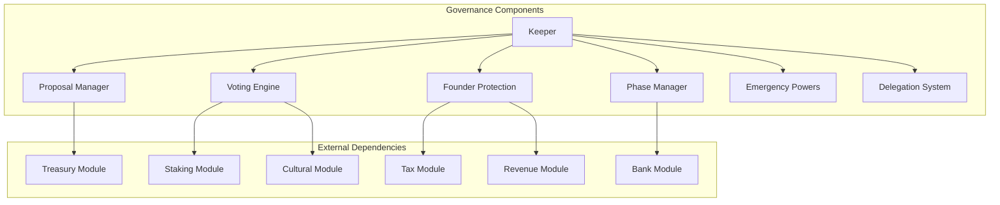
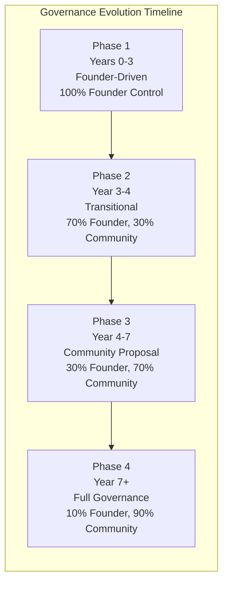
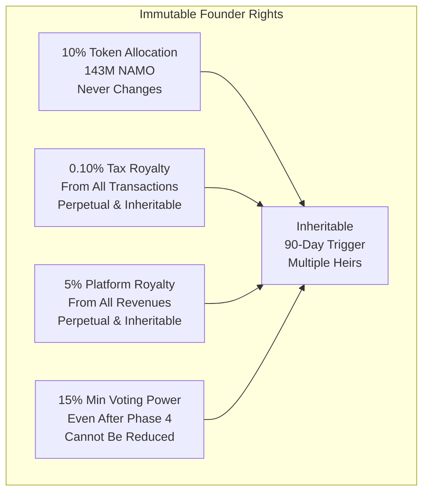
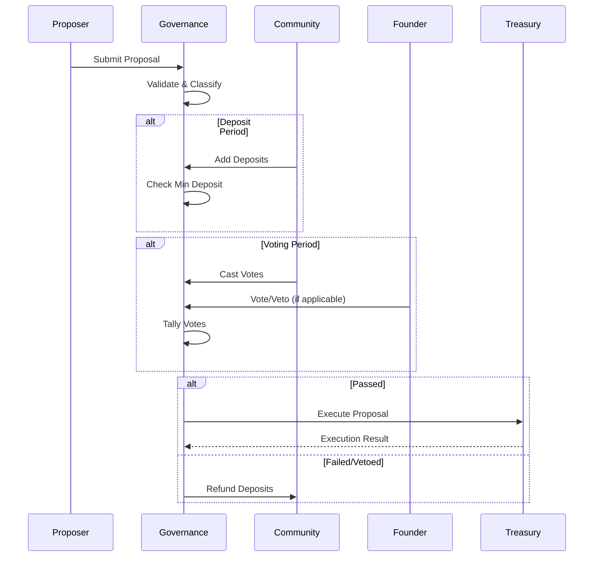
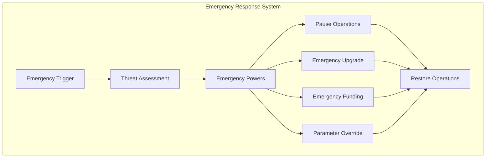

# Governance Module Documentation

## Overview

The Governance module implements DeshChain's innovative phased on-chain democracy system with built-in founder protection mechanisms. It evolves from founder-driven decision making to full community governance over 7+ years, ensuring platform stability while preserving long-term vision and protecting inherent founder rights including immutable royalty allocations.

## Module Architecture



## Phased Governance Evolution

### 1. Four Governance Phases



### 2. Phase Characteristics

```go
type GovernancePhase struct {
    Name                string
    Duration            time.Duration
    
    // Voting Power Distribution
    FounderInfluence    sdk.Dec     // Founder's influence percentage
    CommunityInfluence  sdk.Dec     // Community's influence percentage
    
    // Proposal Requirements
    MinDeposit          sdk.Coin    // Minimum proposal deposit
    VotingPeriod        time.Duration
    QuorumRequired      sdk.Dec     // Minimum participation
    PassThreshold       sdk.Dec     // Threshold to pass
    
    // Special Powers
    FounderVetoEnabled  bool        // Can founder veto?
    EmergencyPowers     []EmergencyPower
    
    // Transition Conditions
    NextPhase           string
    TransitionTrigger   TriggerType
}
```

### 3. Automatic Phase Transitions

```go
func (k Keeper) CheckPhaseTransition(ctx sdk.Context) error {
    currentTime := ctx.BlockTime()
    genesisTime := k.GetGenesisTime(ctx)
    yearsSinceLaunch := currentTime.Sub(genesisTime).Hours() / (24 * 365)
    
    var newPhase PhaseType
    switch {
    case yearsSinceLaunch < 3:
        newPhase = PhaseFounderDriven
    case yearsSinceLaunch < 4:
        newPhase = PhaseTransitional
    case yearsSinceLaunch < 7:
        newPhase = PhaseCommunityProposal
    default:
        newPhase = PhaseFullGovernance
    }
    
    if currentPhase := k.GetCurrentPhase(ctx); currentPhase != newPhase {
        return k.TransitionToPhase(ctx, newPhase)
    }
    return nil
}
```

## Founder Protection Mechanisms

### 1. Immutable Rights



### 2. Protection Levels

```go
type ProtectionLevel string

const (
    // Cannot be changed by any means ever
    PROTECTION_IMMUTABLE        ProtectionLevel = "immutable"
    
    // Requires founder explicit consent
    PROTECTION_FOUNDER_CONSENT  ProtectionLevel = "founder_consent"
    
    // Requires 80% supermajority community vote
    PROTECTION_SUPERMAJORITY    ProtectionLevel = "supermajority"
    
    // Cannot be changed for specified time period
    PROTECTION_TIME_LOCKED      ProtectionLevel = "time_locked"
    
    // Standard majority vote
    PROTECTION_STANDARD         ProtectionLevel = "standard"
)
```

### 3. Veto Powers (First 3 Years)

```go
type FounderVetoPowers struct {
    // Proposals that can be vetoed
    VetoableProposals   []ProposalType
    
    // Veto period (3 years from genesis)
    VetoPeriod          time.Duration
    
    // Veto conditions
    VetoTimeLimit       time.Duration   // 72 hours to exercise
    VetoJustification   string          // Required explanation
    
    // Override mechanism
    OverrideThreshold   sdk.Dec         // 80% to override veto
    OverridePeriod      time.Duration   // 30 days to gather votes
}
```

## Proposal System

### 1. Proposal Types

```go
type ProposalType string

const (
    PROPOSAL_PARAMETER_CHANGE   ProposalType = "parameter_change"
    PROPOSAL_SOFTWARE_UPGRADE   ProposalType = "software_upgrade"
    PROPOSAL_COMMUNITY_SPEND    ProposalType = "community_spend"
    PROPOSAL_REVENUE_DIST       ProposalType = "revenue_distribution"
    PROPOSAL_TAX_ADJUSTMENT     ProposalType = "tax_adjustment"
    PROPOSAL_FOUNDER_RELATED    ProposalType = "founder_related"
    PROPOSAL_CULTURAL_UPDATE    ProposalType = "cultural_update"
    PROPOSAL_EMERGENCY          ProposalType = "emergency"
)
```

### 2. Proposal Structure

```go
type Proposal struct {
    ProposalID          uint64
    Content             Content         // Proposal details
    Status              ProposalStatus
    
    // Submission Details
    Proposer            sdk.AccAddress
    SubmitTime          time.Time
    DepositEndTime      time.Time
    TotalDeposit        sdk.Coins
    
    // Voting Details
    VotingStartTime     time.Time
    VotingEndTime       time.Time
    
    // Results
    FinalTallyResult    TallyResult
    
    // Special Flags
    FounderVetoed       bool
    VetoReason          string
    EmergencyProposal   bool
    CulturalRelevance   int32           // Cultural scoring 1-10
    
    // Protection Classification
    ProtectionLevel     ProtectionLevel
    RequiredThreshold   sdk.Dec
}
```

### 3. Proposal Lifecycle



## Voting System

### 1. Voting Power Calculation

```go
func (k Keeper) CalculateVotingPower(ctx sdk.Context, voter sdk.AccAddress) sdk.Int {
    // Base voting power from staked tokens
    stakedTokens := k.stakingKeeper.GetDelegatorBonded(ctx, voter)
    
    // Cultural bonus (up to 20% additional power)
    culturalScore := k.culturalKeeper.GetPatriotismScore(ctx, voter)
    culturalBonus := stakedTokens.Mul(culturalScore).Quo(sdk.NewInt(500)) // Max 20%
    
    // Participation bonus (up to 10% for consistent voters)
    participationRate := k.GetVoterParticipationRate(ctx, voter)
    participationBonus := stakedTokens.Mul(participationRate).Quo(sdk.NewInt(1000)) // Max 10%
    
    // Special founder minimum guarantee
    if k.IsFounder(ctx, voter) {
        totalVotingPower := k.GetTotalVotingPower(ctx)
        founderMinPower := totalVotingPower.Mul(sdk.NewInt(15)).Quo(sdk.NewInt(100)) // 15%
        
        calculatedPower := stakedTokens.Add(culturalBonus).Add(participationBonus)
        if calculatedPower.LT(founderMinPower) {
            return founderMinPower
        }
    }
    
    return stakedTokens.Add(culturalBonus).Add(participationBonus)
}
```

### 2. Vote Options

```go
type VoteOption string

const (
    VOTE_OPTION_YES         VoteOption = "yes"
    VOTE_OPTION_NO          VoteOption = "no"
    VOTE_OPTION_ABSTAIN     VoteOption = "abstain"
    VOTE_OPTION_VETO        VoteOption = "no_with_veto"
    
    // Special founder votes
    VOTE_FOUNDER_APPROVE    VoteOption = "founder_approve"
    VOTE_FOUNDER_VETO       VoteOption = "founder_veto"
)
```

### 3. Weighted Voting

```go
type WeightedVoteOption struct {
    Option  VoteOption
    Weight  sdk.Dec     // Percentage of voting power allocated
}

type WeightedVote struct {
    ProposalID  uint64
    Voter       string
    Options     []WeightedVoteOption
    
    // Cultural Context
    CulturalJustification   string
    PatriotismBonus        bool
}
```

## Emergency Governance

### 1. Emergency Powers



### 2. Emergency Conditions

```go
type EmergencyType string

const (
    EMERGENCY_SECURITY_BREACH   EmergencyType = "security_breach"
    EMERGENCY_ECONOMIC_CRISIS   EmergencyType = "economic_crisis"
    EMERGENCY_TECHNICAL_FAILURE EmergencyType = "technical_failure"
    EMERGENCY_LEGAL_COMPLIANCE  EmergencyType = "legal_compliance"
    EMERGENCY_NATURAL_DISASTER  EmergencyType = "natural_disaster"
)

type EmergencyAction struct {
    Type                EmergencyType
    Severity            int32           // 1-5 scale
    AutoTriggerEnabled  bool
    RequiredApprovers   []sdk.AccAddress
    MaxDuration         time.Duration
    
    // Available Actions
    AvailablePowers     []EmergencyPower
    RestoreConditions   []RestoreCondition
}
```

## Module Parameters

```go
type Params struct {
    // Deposit Configuration
    MinDeposit              sdk.Coins   // 10,000 NAMO
    MaxDepositPeriod        time.Duration // 168 hours (7 days)
    
    // Voting Configuration
    VotingPeriod            time.Duration // 336 hours (14 days)
    Quorum                  sdk.Dec       // 0.334 (33.4%)
    Threshold               sdk.Dec       // 0.5 (50%)
    VetoThreshold           sdk.Dec       // 0.334 (33.4%)
    
    // Founder Protection
    FounderVetoPeriod       time.Duration // 3 years
    SupermajorityThreshold  sdk.Dec       // 0.80 (80%)
    FounderMinVotingPower   sdk.Dec       // 0.15 (15%)
    
    // Phase Transition
    PhaseTransitionAuto     bool          // Automatic transitions
    PhaseOverrideEnabled    bool          // Manual override in emergency
    
    // Cultural Integration
    CulturalBonusEnabled    bool          // Cultural voting bonus
    PatriotismMultiplier    sdk.Dec       // 0.20 (20% max bonus)
    
    // Emergency Configuration
    EmergencyQuorum         sdk.Dec       // 0.20 (20% for emergency)
    EmergencyVotingPeriod   time.Duration // 72 hours
}
```

## Transaction Types

### 1. MsgSubmitProposal
Submit a new governance proposal.

```go
type MsgSubmitProposal struct {
    Content             Content
    InitialDeposit      sdk.Coins
    Proposer            string
    
    // Cultural Context
    CulturalRelevance   int32       // 1-10 score
    RegionalImpact      []string    // Affected regions
    LanguagePreference  string      // Preferred language
    
    // Special Flags
    EmergencyProposal   bool        // Fast track
    FounderConsent      bool        // Pre-approved by founder
}
```

### 2. MsgVote
Cast a vote on a proposal.

```go
type MsgVote struct {
    ProposalID          uint64
    Voter               string
    Option              VoteOption
    
    // Justification
    Reason              string
    CulturalContext     string
    PatriotismScore     int32
}
```

### 3. MsgVoteWeighted
Cast weighted votes with split options.

```go
type MsgVoteWeighted struct {
    ProposalID          uint64
    Voter               string
    Options             []WeightedVoteOption
    Justification       string
}
```

### 4. MsgDeposit
Deposit tokens to a proposal.

```go
type MsgDeposit struct {
    ProposalID          uint64
    Depositor           string
    Amount              sdk.Coins
    
    // Support message
    SupportMessage      string
}
```

### 5. MsgFounderVeto
Founder exercises veto power.

```go
type MsgFounderVeto struct {
    ProposalID          uint64
    Founder             string
    VetoReason          string
    
    // Override information
    OverrideAllowed     bool        // Can community override?
    OverridePeriod      time.Duration
}
```

## Query Endpoints

### 1. QueryProposal
Get proposal details.

**Request**: `/deshchain/governance/v1/proposal/{proposal_id}`

**Response**:
```json
{
  "proposal": {
    "proposal_id": "42",
    "content": {
      "title": "Increase Community Pool Allocation",
      "description": "Proposal to increase monthly allocation to community projects"
    },
    "status": "VOTING_PERIOD",
    "total_deposit": "50000 NAMO",
    "voting_end_time": "2024-08-01T00:00:00Z",
    "cultural_relevance": 8,
    "founder_vetoed": false,
    "protection_level": "STANDARD"
  }
}
```

### 2. QueryVote
Get vote details for a proposal.

**Request**: `/deshchain/governance/v1/proposal/{proposal_id}/vote/{voter}`

**Response**:
```json
{
  "vote": {
    "proposal_id": "42",
    "voter": "deshchain1...",
    "option": "YES",
    "voting_power": "15000",
    "cultural_bonus": "3000",
    "justification": "Supports community development",
    "timestamp": "2024-07-25T10:30:00Z"
  }
}
```

### 3. QueryTally
Get current vote tally.

**Request**: `/deshchain/governance/v1/proposal/{proposal_id}/tally`

**Response**:
```json
{
  "tally": {
    "yes": "150000",
    "no": "45000",
    "abstain": "5000",
    "no_with_veto": "2000",
    "total_voting_power": "300000",
    "quorum_reached": true,
    "threshold_met": true
  }
}
```

### 4. QueryPhase
Get current governance phase.

**Request**: `/deshchain/governance/v1/phase`

**Response**:
```json
{
  "phase": {
    "current_phase": "founder_driven",
    "phase_start": "2024-01-01T00:00:00Z",
    "next_transition": "2027-01-01T00:00:00Z",
    "founder_influence": "100%",
    "community_influence": "0%",
    "veto_enabled": true
  }
}
```

## Events

### 1. Proposal Submitted Event
```json
{
  "type": "proposal_submitted",
  "attributes": [
    {"key": "proposal_id", "value": "42"},
    {"key": "proposer", "value": "{address}"},
    {"key": "proposal_type", "value": "parameter_change"},
    {"key": "cultural_relevance", "value": "8"},
    {"key": "deposit", "value": "10000 NAMO"}
  ]
}
```

### 2. Vote Cast Event
```json
{
  "type": "vote_cast",
  "attributes": [
    {"key": "proposal_id", "value": "42"},
    {"key": "voter", "value": "{address}"},
    {"key": "option", "value": "YES"},
    {"key": "voting_power", "value": "15000"},
    {"key": "cultural_bonus", "value": "3000"}
  ]
}
```

### 3. Founder Veto Event
```json
{
  "type": "founder_veto",
  "attributes": [
    {"key": "proposal_id", "value": "42"},
    {"key": "founder", "value": "{address}"},
    {"key": "reason", "value": "Conflicts with long-term vision"},
    {"key": "override_allowed", "value": "true"},
    {"key": "override_period", "value": "30 days"}
  ]
}
```

### 4. Phase Transition Event
```json
{
  "type": "governance_phase_transition",
  "attributes": [
    {"key": "old_phase", "value": "founder_driven"},
    {"key": "new_phase", "value": "transitional"},
    {"key": "trigger", "value": "time_based"},
    {"key": "effective_date", "value": "2027-01-01T00:00:00Z"}
  ]
}
```

## Cultural Integration

### 1. Cultural Voting Bonus

```go
type CulturalVotingBonus struct {
    // Patriotism Score Bonus
    PatriotismScore     int32       // 0-10000
    PatriotismMultiplier sdk.Dec    // Up to 20% bonus
    
    // Participation History
    ConsistentVoter     bool        // Regular participation
    ParticipationBonus  sdk.Dec     // Up to 10% bonus
    
    // Regional Representation
    RepresentsRegion    string      // Geographic representation
    RegionalMultiplier  sdk.Dec     // Regional diversity bonus
    
    // Language Preference
    VotesInNativeLanguage bool      // Votes in regional language
    LanguageBonus       sdk.Dec     // Cultural preservation bonus
}
```

### 2. Festival Governance

```go
type FestivalGovernance struct {
    // Special voting during festivals
    FestivalBonusActive bool        // During major festivals
    BonusMultiplier     sdk.Dec     // Extra voting power
    
    // Cultural proposal priority
    CulturalProposals   bool        // Heritage-related proposals
    FastTrackEnabled    bool        // Reduced voting period
    
    // Community participation
    FestivalQuorum      sdk.Dec     // Lower quorum during festivals
}
```

## Best Practices

### For Proposal Submitters
1. **Research Thoroughly**: Understand current parameters
2. **Engage Community**: Build support before submission
3. **Cultural Relevance**: Include cultural context
4. **Clear Language**: Use simple, accessible language
5. **Proper Documentation**: Provide comprehensive details

### For Voters
1. **Stay Informed**: Read proposals carefully
2. **Consider Impact**: Think long-term consequences
3. **Cultural Values**: Align with Indian principles
4. **Active Participation**: Vote on all proposals
5. **Respectful Discourse**: Maintain civil discussion

### For Validators
1. **Lead by Example**: Participate actively
2. **Educate Community**: Explain complex proposals
3. **Cultural Guidance**: Provide cultural context
4. **Technical Expertise**: Assess technical proposals
5. **Neutral Stance**: Remain impartial

## CLI Commands

### Query Commands
```bash
# View proposal details
deshchaind query governance proposal [proposal-id]

# Check vote status
deshchaind query governance vote [proposal-id] [voter-address]

# Get current tally
deshchaind query governance tally [proposal-id]

# View governance phase
deshchaind query governance phase

# List all proposals
deshchaind query governance proposals --status voting
```

### Transaction Commands
```bash
# Submit proposal
deshchaind tx governance submit-proposal param-change proposal.json \
  --deposit "10000namo" \
  --cultural-relevance 8 \
  --from [key]

# Vote on proposal
deshchaind tx governance vote [proposal-id] yes \
  --reason "Supports community growth" \
  --from [key]

# Deposit to proposal
deshchaind tx governance deposit [proposal-id] "5000namo" \
  --from [key]

# Founder veto (if applicable)
deshchaind tx governance founder-veto [proposal-id] \
  --reason "Conflicts with vision" \
  --from [founder-key]
```

## FAQ

**Q: How does founder protection work?**
A: Founder has immutable rights (10% tokens, 0.10% tax royalty, 5% platform royalty) that can never be changed, plus veto power for first 3 years.

**Q: When does community get full control?**
A: After 7 years, community gets 90% influence, but founder retains 15% minimum voting power and immutable rights.

**Q: Can founder rights be inherited?**
A: Yes, all founder rights including royalties and minimum voting power are inheritable after 90-day inactivity trigger.

**Q: How do cultural factors affect voting?**
A: Patriotism scores can provide up to 20% voting power bonus, encouraging cultural engagement.

**Q: What requires supermajority?**
A: Certain founder-related proposals require 80% community support to pass, protecting platform vision.

---

For more information, see the [Module Overview](../MODULE_OVERVIEW.md) or explore other [DeshChain Modules](../MODULE_OVERVIEW.md#module-categories).