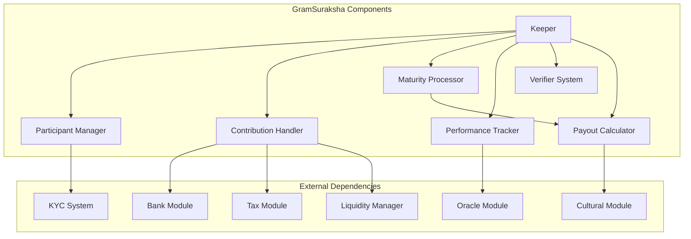
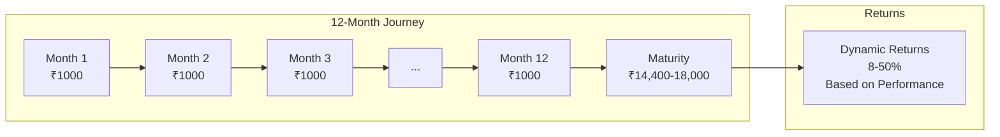
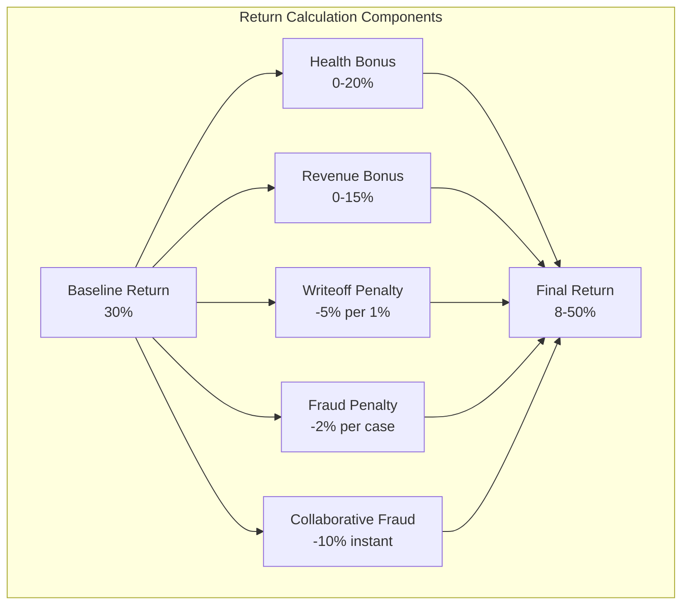
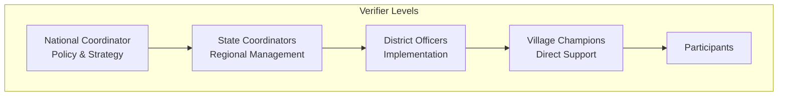
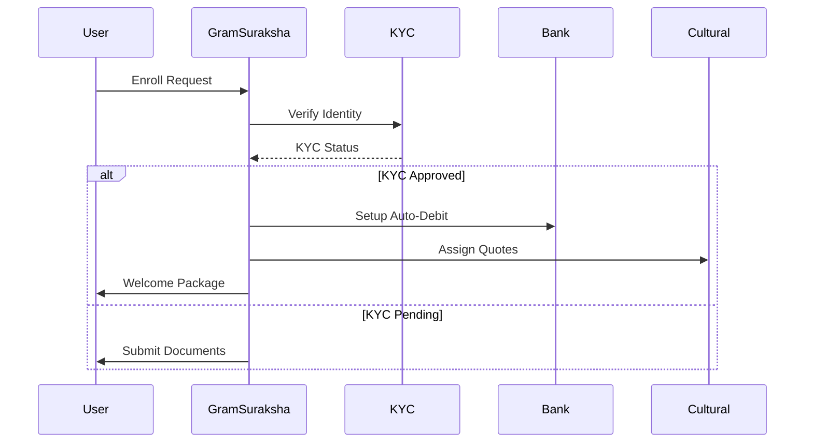
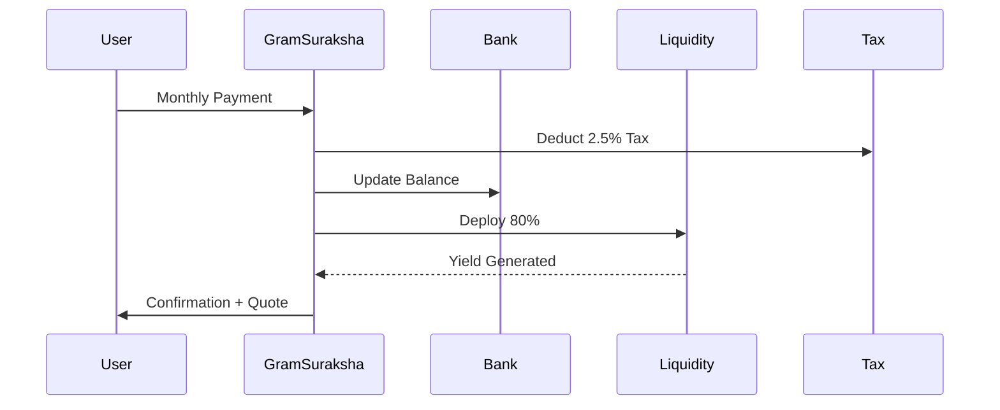
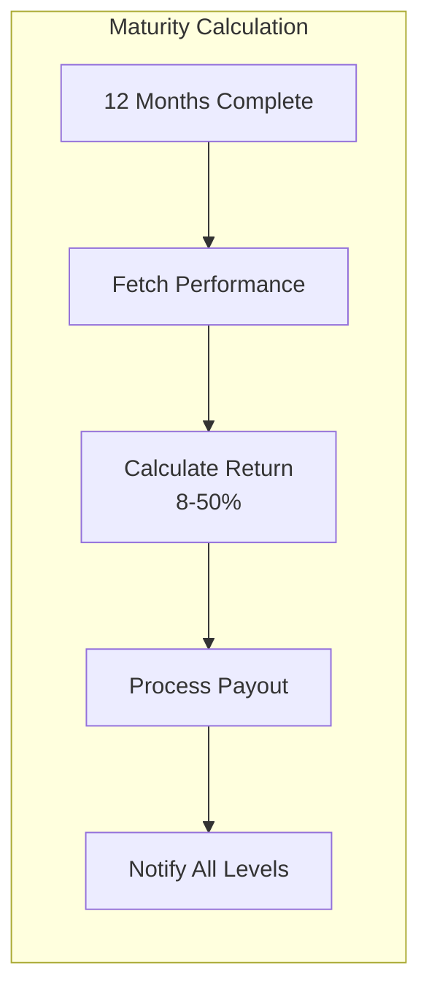
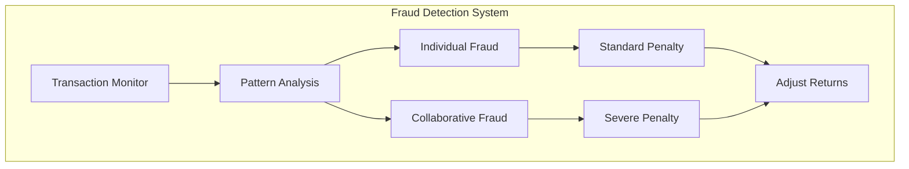

# GramSuraksha Module Documentation

## Overview

The GramSuraksha (Village Protection) module implements DeshChain's revolutionary blockchain-based pension scheme designed specifically for rural India. It offers dynamic returns ranging from 8-50% based on chain performance, making it one of the world's first performance-linked blockchain pension products that aligns participant interests with ecosystem health.

## Module Architecture



## Pension Scheme Design

### Basic Structure



**Key Parameters**:
- Monthly Contribution: ₹1,000
- Duration: 12 months
- Total Investment: ₹12,000
- Returns: 8-50% (dynamic)
- Maturity Range: ₹12,960 - ₹18,000
- Age Eligibility: 18-65 years

## Dynamic Payout System

### Performance-Based Returns



### Performance Metrics

```go
type ChainPerformanceMetrics struct {
    // Chain Health Indicators
    BlockTime           time.Duration
    ActiveValidators    int32
    NetworkUptime       float64      // 99.9% target
    ConsensusLatency    time.Duration
    
    // Financial Performance
    TotalRevenue        sdk.Coins
    MonthlyRevenue      sdk.Coins
    RevenueTrend        float64      // Growth percentage
    
    // Risk Indicators
    TotalWriteoffs      sdk.Coins
    WriteoffRate        float64      // Percentage of total
    
    // Fraud Detection
    DetectedFrauds      int32
    CollaborativeFraud  bool
    FraudRate           float64      // Per 1000 accounts
    
    // Calculated Scores
    HealthScore         int32        // 0-100
    RiskScore           int32        // 0-100
    PerformanceScore    int32        // 0-100
}
```

### Payout Calculation Formula

```go
func CalculateDynamicPayout(metrics ChainPerformanceMetrics) float64 {
    // Start with baseline
    payout := 30.0  // 30% baseline
    
    // Add health bonus (0-20%)
    healthBonus := (metrics.HealthScore / 100.0) * 20.0
    payout += healthBonus
    
    // Add revenue bonus (0-15%)
    if metrics.RevenueTrend > 0 {
        revenueBonus := math.Min(metrics.RevenueTrend, 15.0)
        payout += revenueBonus
    }
    
    // Apply writeoff penalty
    writeoffPenalty := metrics.WriteoffRate * 5.0
    payout -= writeoffPenalty
    
    // Apply fraud penalty
    fraudPenalty := metrics.FraudRate * 2.0
    payout -= fraudPenalty
    
    // Apply collaborative fraud penalty
    if metrics.CollaborativeFraud {
        payout -= 10.0
    }
    
    // Enforce bounds
    return math.Max(8.0, math.Min(50.0, payout))
}
```

## Verifier Hierarchy System

### Four-Level Management Structure



### Verifier Messaging System

```go
type VerifierMessage struct {
    Level           VerifierLevel
    Title           string
    Content         string
    ActionItems     []string
    Priority        MessagePriority
    Timestamp       time.Time
}

type VerifierLevel string

const (
    LevelVillage    VerifierLevel = "village"
    LevelDistrict   VerifierLevel = "district"  
    LevelState      VerifierLevel = "state"
    LevelNational   VerifierLevel = "national"
)
```

**Message Examples**:

**Village Level** (Detailed):
```
Title: "Payout Rate Changed to 35%"
Content: "Due to excellent chain performance, returns increased to 35%. 
         Please inform all participants in your village."
Actions: ["Update village notice board", 
         "Call participants personally",
         "Organize celebration meeting"]
```

**National Level** (Strategic):
```
Title: "Q3 Performance: 35% Returns"
Content: "Strong performance metrics. Board recommendation: 
         Expand rural outreach by 20%."
Actions: ["Review expansion strategy",
         "Allocate marketing budget"]
```

## Participant Lifecycle

### 1. Enrollment Process



### 2. Monthly Contribution Flow



### 3. Maturity Processing



## Module Parameters

```go
type Params struct {
    // Scheme Configuration
    MonthlyContribution     sdk.Int     // 1000 (₹1,000)
    ContributionMonths      int32       // 12 months
    MinAge                  int32       // 18 years
    MaxAge                  int32       // 65 years
    
    // Payout Configuration
    MinimumPayout           sdk.Dec     // 0.08 (8%)
    MaximumPayout           sdk.Dec     // 0.50 (50%)
    BaselinePayout          sdk.Dec     // 0.30 (30%)
    
    // Performance Multipliers
    HealthMultiplier        sdk.Dec     // 0.20 (20% max bonus)
    RevenueMultiplier       sdk.Dec     // 0.15 (15% max bonus)
    WriteoffPenalty         sdk.Dec     // 5.0 (5% per 1% writeoff)
    FraudPenalty            sdk.Dec     // 2.0 (2% per fraud)
    CollabFraudPenalty      sdk.Dec     // 10.0 (10% penalty)
    
    // Liquidity Configuration
    LiquidityDeployment     sdk.Dec     // 0.80 (80%)
    MinLiquidityBuffer      sdk.Int     // Emergency reserve
    
    // Early Withdrawal
    EarlyWithdrawalPenalty  sdk.Dec     // 0.10 (10%)
    MinContributionsForExit int32       // 3 months
}
```

## Transaction Types

### 1. MsgEnrollInGramPension
Enrolls a new participant in the pension scheme.

```go
type MsgEnrollInGramPension struct {
    Participant         string
    AadhaarHash         string      // Hashed for privacy
    DateOfBirth         time.Time
    PreferredLanguage   string
    ReferralCode        string      // Optional
}
```

### 2. MsgMakeMonthlyContribution
Processes monthly contribution payment.

```go
type MsgMakeMonthlyContribution struct {
    Participant         string
    SchemeID            string
    Amount              sdk.Coin
    PaymentMethod       PaymentMethod
}
```

### 3. MsgProcessMaturityPayout
Handles maturity payout with dynamic returns.

```go
type MsgProcessMaturityPayout struct {
    SchemeID            string
    Participant         string
    PerformanceMetrics  ChainPerformanceMetrics
}
```

### 4. MsgRequestEarlyWithdrawal
Allows early exit with penalties.

```go
type MsgRequestEarlyWithdrawal struct {
    Participant         string
    SchemeID            string
    Reason              string
}
```

### 5. MsgUpdateKYCStatus
Updates participant KYC verification.

```go
type MsgUpdateKYCStatus struct {
    Authority           string
    Participant         string
    KYCStatus           KYCStatus
    VerificationDocs    []string
}
```

## Query Endpoints

### 1. QueryParams
Returns module parameters.

**Request**: `/deshchain/gramsuraksha/v1/params`

**Response**:
```json
{
  "params": {
    "monthly_contribution": "1000",
    "contribution_months": 12,
    "minimum_payout": "0.08",
    "maximum_payout": "0.50",
    "baseline_payout": "0.30"
  }
}
```

### 2. QueryParticipant
Returns participant details.

**Request**: `/deshchain/gramsuraksha/v1/participant/{address}`

**Response**:
```json
{
  "participant": {
    "address": "deshchain1...",
    "enrollment_date": "2024-01-15T10:00:00Z",
    "kyc_status": "verified",
    "active_schemes": 2,
    "total_contributed": "24000",
    "matured_schemes": 1,
    "total_returns": "4800"
  }
}
```

### 3. QueryScheme
Returns specific pension scheme details.

**Request**: `/deshchain/gramsuraksha/v1/scheme/{scheme_id}`

**Response**:
```json
{
  "scheme": {
    "id": "GRAM-2024-001",
    "participant": "deshchain1...",
    "start_date": "2024-01-15T10:00:00Z",
    "contributions_made": 7,
    "total_contributed": "7000",
    "current_value": "7350",
    "projected_return": "35%",
    "maturity_date": "2025-01-15T10:00:00Z"
  }
}
```

### 4. QueryPerformanceMetrics
Returns current chain performance metrics.

**Request**: `/deshchain/gramsuraksha/v1/performance`

**Response**:
```json
{
  "metrics": {
    "health_score": 85,
    "revenue_trend": 5.2,
    "writeoff_rate": 1.5,
    "fraud_rate": 0.2,
    "collaborative_fraud": false,
    "current_payout_rate": "35%",
    "last_updated": "2024-07-22T12:00:00Z"
  }
}
```

### 5. QueryVerifierMessages
Returns messages for specific verifier level.

**Request**: `/deshchain/gramsuraksha/v1/verifier-messages?level=district`

**Response**:
```json
{
  "messages": [
    {
      "level": "district",
      "title": "Monthly Performance Update",
      "content": "District achieved 95% enrollment target",
      "action_items": [
        "Focus on remaining 5%",
        "Schedule village meetings"
      ],
      "priority": "medium",
      "timestamp": "2024-07-22T09:00:00Z"
    }
  ]
}
```

## Events

### 1. Enrollment Event
```json
{
  "type": "gram_pension_enrolled",
  "attributes": [
    {"key": "participant", "value": "{address}"},
    {"key": "scheme_id", "value": "GRAM-2024-001"},
    {"key": "enrollment_date", "value": "2024-01-15T10:00:00Z"},
    {"key": "referral_code", "value": "REF123"}
  ]
}
```

### 2. Contribution Event
```json
{
  "type": "monthly_contribution_made",
  "attributes": [
    {"key": "scheme_id", "value": "GRAM-2024-001"},
    {"key": "month_number", "value": "7"},
    {"key": "amount", "value": "1000"},
    {"key": "cultural_quote_shown", "value": "true"}
  ]
}
```

### 3. Maturity Event
```json
{
  "type": "pension_matured",
  "attributes": [
    {"key": "scheme_id", "value": "GRAM-2024-001"},
    {"key": "total_contributed", "value": "12000"},
    {"key": "payout_amount", "value": "16200"},
    {"key": "return_percentage", "value": "35"},
    {"key": "performance_score", "value": "85"}
  ]
}
```

### 4. Performance Update Event
```json
{
  "type": "performance_metrics_updated",
  "attributes": [
    {"key": "old_rate", "value": "30"},
    {"key": "new_rate", "value": "35"},
    {"key": "health_score", "value": "85"},
    {"key": "notification_sent", "value": "all_levels"}
  ]
}
```

## Cultural Integration

### 1. Quote System
```go
type CulturalQuote struct {
    QuoteID         string
    Text            string
    Author          string
    Language        string
    Category        string  // savings, prosperity, discipline
    PatriotismScore int32
}
```

### 2. Language Support
- 22 Indian languages supported
- Regional quote preferences
- Localized notifications
- Cultural calendar integration

### 3. Rewards System
- Patriotism points for completion: 100
- Cultural engagement bonuses
- Festival special offers
- Community recognition

## Risk Management

### 1. Fraud Detection



### 2. Liquidity Management
- 80% deployed to unified liquidity pool
- 20% maintained as buffer
- Real-time liquidity monitoring
- Emergency withdrawal provisions

### 3. Performance Safeguards
- Minimum 8% return guarantee
- Maximum 50% return cap
- Monthly performance reviews
- Transparent metric publication

## Integration Points

### 1. KYC System
- Aadhaar/PAN verification
- Bank account validation
- Document storage
- Periodic re-verification

### 2. Liquidity Manager
- Automated deployment
- Yield optimization
- Risk diversification
- Return attribution

### 3. Cultural Module
- Quote assignments
- Language preferences
- Festival integrations
- Patriotism tracking

### 4. Tax Module
- 2.5% transaction tax
- Tax optimization tips
- Compliance tracking
- Refund processing

## Success Stories Format

```go
type SuccessStory struct {
    ParticipantID       string
    VillageName         string
    StateName           string
    InvestmentAmount    sdk.Int
    ReturnReceived      sdk.Int
    ReturnPercentage    float64
    LifeImpact          string
    TestimonialQuote    string
    PhotoHash           string
}
```

## Best Practices

### For Participants
1. **Complete KYC Early**: Avoid delays in enrollment
2. **Set Auto-Debit**: Ensure timely contributions
3. **Track Performance**: Monitor monthly updates
4. **Avoid Early Exit**: Maximize returns
5. **Refer Friends**: Earn referral bonuses

### For Verifiers
1. **Regular Communication**: Update participants monthly
2. **Fraud Vigilance**: Report suspicious patterns
3. **Performance Tracking**: Monitor local metrics
4. **Community Building**: Organize awareness camps
5. **Documentation**: Maintain accurate records

### For Developers
1. **Performance Optimization**: Efficient metric calculation
2. **Security Focus**: Protect participant data
3. **Cultural Sensitivity**: Respect local customs
4. **Scalability Planning**: Handle millions of users
5. **Integration Testing**: Verify all connections

## CLI Commands

### Query Commands
```bash
# Query module parameters
deshchaind query gramsuraksha params

# Query participant details
deshchaind query gramsuraksha participant [address]

# Query scheme details
deshchaind query gramsuraksha scheme [scheme-id]

# Query current performance metrics
deshchaind query gramsuraksha performance

# Query verifier messages
deshchaind query gramsuraksha verifier-messages --level [village|district|state|national]
```

### Transaction Commands
```bash
# Enroll in pension scheme
deshchaind tx gramsuraksha enroll \
  --aadhaar-hash [hash] \
  --dob [YYYY-MM-DD] \
  --language [hindi|english|...] \
  --from [key]

# Make monthly contribution
deshchaind tx gramsuraksha contribute [scheme-id] [amount] --from [key]

# Request early withdrawal
deshchaind tx gramsuraksha withdraw [scheme-id] --reason [reason] --from [key]

# Update KYC status (authorized only)
deshchaind tx gramsuraksha update-kyc [participant] [status] --from [key]
```

## FAQ

**Q: What happens if I miss a monthly payment?**
A: You have a 7-day grace period. After that, penalties apply, but you can continue after payment.

**Q: Can returns go below 8%?**
A: No, 8% is the guaranteed minimum return regardless of chain performance.

**Q: How are returns paid out?**
A: In NAMO tokens equivalent to INR value at maturity, directly to your wallet.

**Q: Can I have multiple schemes running?**
A: Yes, you can have multiple schemes with different start dates.

**Q: What if the chain fails completely?**
A: Insurance mechanisms and the guaranteed minimum ensure participant protection.

---

For more information, see the [Module Overview](../MODULE_OVERVIEW.md) or explore other [DeshChain Modules](../MODULE_OVERVIEW.md#module-categories).