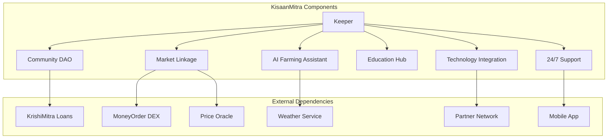
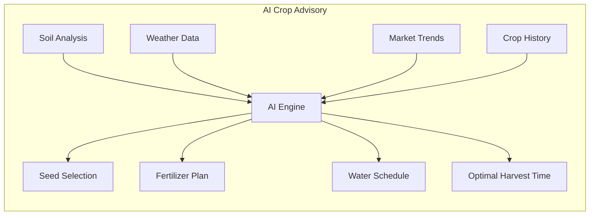
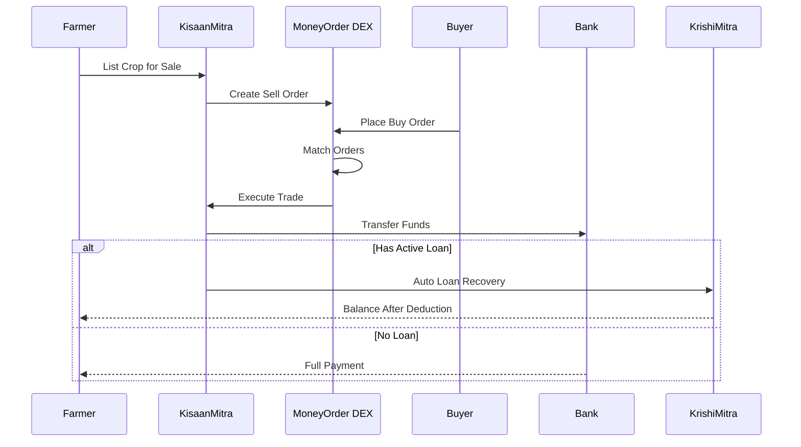
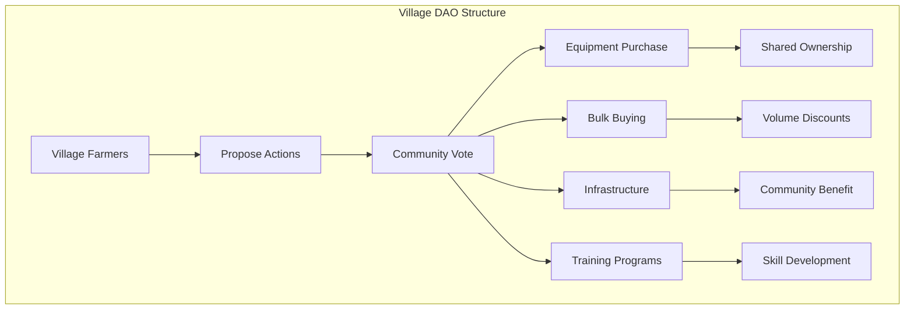
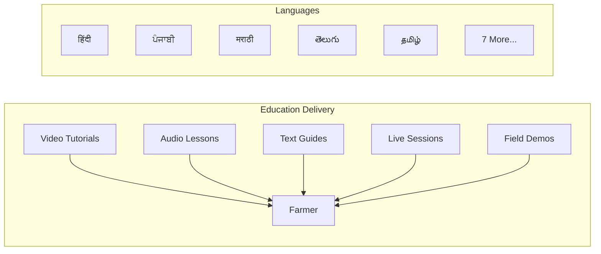
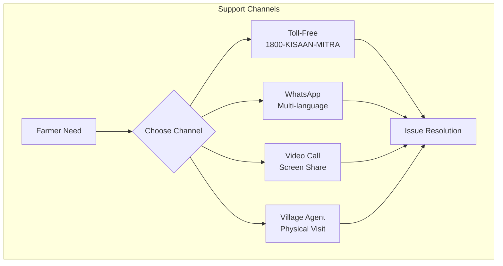

# KisaanMitra Module Documentation

## Overview

The KisaanMitra (Farmer's Companion) module implements DeshChain's comprehensive farmer support ecosystem that goes beyond lending to provide AI-powered farming assistance, market linkage, community building, and educational support. It serves as a complete digital transformation platform for Indian agriculture, integrating modern technology with traditional farming wisdom.

## Module Architecture



## AI-Powered Farming Assistant

### 1. Crop Guidance System



### 2. Personalized Recommendations

```go
type CropRecommendation struct {
    FarmerID            string
    Location            Location
    SoilType            SoilProfile
    
    // AI Recommendations
    RecommendedCrops    []CropSuggestion
    SeedVarieties       []SeedVariety
    PlantingWindow      TimeWindow
    
    // Resource Planning
    FertilizerSchedule  []FertilizerApplication
    IrrigationPlan      []IrrigationSchedule
    PestCalendar        []PestWarning
    
    // Expected Outcomes
    YieldEstimate       sdk.Dec
    RevenueProjection   sdk.Coin
    ROIEstimate         sdk.Dec
}

type CropSuggestion struct {
    CropName            string
    ConfidenceScore     sdk.Dec      // AI confidence 0-100%
    MarketDemand        DemandLevel
    ProfitabilityScore  sdk.Dec
    RiskLevel           RiskCategory
    Reasoning           string       // AI explanation
}
```

### 3. Pest & Disease Management

```go
type PestManagement struct {
    // Early Warning System
    PestAlerts          []PestAlert
    DiseaseWarnings     []DiseaseWarning
    
    // Treatment Recommendations
    OrganicSolutions    []Treatment
    ChemicalOptions     []Treatment
    PreventiveMeasures  []Prevention
    
    // Image Recognition
    ImageAnalysis       bool         // Upload crop photos
    DetectedIssues      []Issue
    ConfidenceLevel     sdk.Dec
}
```

## Market Linkage Platform

### 1. Direct Sales Integration



### 2. Price Discovery Mechanism

```go
type MarketIntelligence struct {
    CropType            string
    
    // Current Market Data
    LocalMandi          PriceData
    StateAverage        PriceData
    NationalAverage     PriceData
    ExportPrice         PriceData
    
    // AI Predictions
    PriceForecast7Day   []PricePrediction
    PriceForecast30Day  []PricePrediction
    OptimalSellingTime  time.Time
    
    // Demand Analysis
    CurrentDemand       DemandLevel
    BuyerInterest       int32        // Number of active buyers
    CompetingSupply     sdk.Dec      // Total listed quantity
}

type PriceData struct {
    Price               sdk.Coin
    Volume              sdk.Dec
    Trend               TrendDirection
    LastUpdated         time.Time
}
```

### 3. Supply Chain Integration

```go
type SupplyChainFeatures struct {
    // Direct Connections
    RegisteredBuyers    []BuyerProfile
    ContractFarming     []Contract
    ExportOpportunities []ExportDeal
    
    // Value Addition
    ProcessingCenters   []ProcessingUnit
    ColdStorage         []StorageFacility
    PackagingOptions    []PackagingService
    
    // Logistics
    TransportPartners   []LogisticsProvider
    LastMileDelivery    bool
    TrackingEnabled     bool
}
```

## Community Features

### 1. Village DAO System



### 2. Collective Farming Models

```go
type CollectiveFarming struct {
    VillageDAO          string
    
    // Shared Resources
    EquipmentPool       []SharedEquipment
    SeedBank            SeedLibrary
    KnowledgeBase       []BestPractice
    
    // Group Activities
    BulkPurchases       []GroupPurchase
    CollectiveSales     []GroupSale
    SharedLabor         LaborExchange
    
    // Benefits Distribution
    ProfitSharing       DistributionModel
    CostSharing         DistributionModel
    RiskPooling         InsurancePool
}

type SharedEquipment struct {
    EquipmentType       string       // Tractor, Harvester, etc.
    TotalCost           sdk.Coin
    Contributors        []Contributor
    UsageSchedule       []Booking
    MaintenanceFund     sdk.Coin
}
```

### 3. Peer Monitoring System

```go
type PeerMonitoring struct {
    // Community Verification
    LandVerification    []PeerAttestation
    CropVerification    []PeerAttestation
    YieldVerification   []PeerAttestation
    
    // Mutual Support
    KnowledgeSharing    int32        // Advice given/received
    FieldVisits         int32        // Cross-farm visits
    ProblemSolving      int32        // Issues resolved together
    
    // Trust Score
    CommunityTrust      sdk.Dec      // 0-100 score
    HelpfulnessRating   sdk.Dec      // Peer ratings
    ReliabilityScore    sdk.Dec      // Promise keeping
}
```

## Educational Support

### 1. Multi-Channel Learning



### 2. Course Catalog

```go
type EducationalContent struct {
    // Basic Courses
    CropManagement      []Course
    SoilHealth          []Course
    WaterManagement     []Course
    OrganicFarming      []Course
    
    // Advanced Topics
    PrecisionAgriculture []Course
    DroneOperation      []Course
    SolarPumps          []Course
    Hydroponics         []Course
    
    // Business Skills
    FinancialLiteracy   []Course
    MarketingBasics     []Course
    ExportProcedures    []Course
    ValueAddition       []Course
    
    // Certification Programs
    OrganicCertification CertProgram
    GAPCertification    CertProgram    // Good Agricultural Practices
    ExportCompliance    CertProgram
}
```

### 3. Success Story Library

```go
type SuccessStory struct {
    FarmerProfile       FarmerInfo
    Challenge           string
    Solution            string
    Implementation      []Step
    Results             Outcome
    
    // Media
    VideoTestimonial    string       // IPFS hash
    BeforeAfterPhotos   []string     // IPFS hashes
    
    // Replicability
    RequiredResources   []Resource
    TimeToResults       time.Duration
    ScalabilityScore    sdk.Dec
    
    // Community Impact
    JobsCreated         int32
    IncomeIncrease      sdk.Dec      // Percentage
    Inspirations        int32        // Farmers who replicated
}
```

## Technology Integration

### 1. Precision Agriculture Tools

```go
type PrecisionAgTools struct {
    // Soil Monitoring
    SoilSensors         []SensorData
    NPKLevels           SoilNutrients
    MoistureContent     sdk.Dec
    PHLevel             sdk.Dec
    
    // Weather Station
    LocalWeather        WeatherStation
    MicroClimate        ClimateData
    RainfallPrediction  []Forecast
    
    // Satellite Imagery
    CropHealthIndex     sdk.Dec      // NDVI values
    StressDetection     []StressArea
    YieldPrediction     sdk.Dec
    
    // IoT Integration
    IrrigationControl   SmartIrrigation
    GreenhouseControl   ClimateControl
    StorageMonitoring   ColdChainData
}
```

### 2. Mobile App Features

```dart
// From krishi_mitra_screen.dart
class KisaanMitraFeatures {
  // Voice Commands
  final supportedLanguages = [
    'Hindi', 'Punjabi', 'Marathi', 'Telugu', 'Tamil',
    'Gujarati', 'Bengali', 'Kannada', 'Malayalam',
    'Odia', 'Assamese', 'Urdu'
  ];
  
  // Offline Capabilities
  final offlineFeatures = [
    'Crop Calculator',
    'Season Calendar',
    'Pest Identification',
    'Basic Tutorials'
  ];
  
  // Real-time Features
  final onlineFeatures = [
    'Market Prices',
    'Weather Updates',
    'Expert Consultation',
    'Loan Application'
  ];
}
```

## Support System

### 1. 24/7 Multi-Channel Support



### 2. Village Agent Network

```go
type VillageAgent struct {
    AgentID             string
    VillagesCovered     []string
    LanguagesSpoken     []string
    
    // Capabilities
    TechnicalSkills     []Skill
    TrainingCompleted   []Training
    EquipmentAvailable  []Equipment
    
    // Performance
    FarmersAssisted     int32
    IssuesResolved      int32
    SatisfactionRating  sdk.Dec
    
    // Compensation
    BaseSalary          sdk.Coin
    PerformanceBonus    sdk.Coin
    TravelAllowance     sdk.Coin
}
```

## Module Parameters

```go
type Params struct {
    // AI Configuration
    AIModelVersion          string
    ConfidenceThreshold     sdk.Dec   // 0.80 (80%)
    UpdateFrequency         int64     // 86400 (daily)
    
    // Market Settings
    MinListingAmount        sdk.Dec   // 100 kg minimum
    MarketFees              sdk.Dec   // 0.01 (1%)
    SettlementPeriod        int64     // 172800 (2 days)
    
    // Community Features
    MinDAOMembers           int32     // 10 farmers
    VotingPeriod            int64     // 259200 (3 days)
    QuorumRequired          sdk.Dec   // 0.51 (51%)
    
    // Education
    CourseCompletionReward  sdk.Coin  // 100 NAMO
    CertificationBonus      sdk.Coin  // 1000 NAMO
    
    // Support
    ResponseTimeTarget      int64     // 300 (5 minutes)
    EscalationThreshold     int64     // 3600 (1 hour)
    
    // Technology
    SensorDataInterval      int64     // 3600 (hourly)
    SatelliteUpdatePeriod   int64     // 604800 (weekly)
}
```

## Transaction Types

### 1. MsgRegisterFarmer
Register as KisaanMitra user.

```go
type MsgRegisterFarmer struct {
    Farmer              string
    DhanPataID          string
    Location            Location
    LandHolding         sdk.Dec      // In acres
    PreferredLanguage   string
    MobileNumber        string       // For SMS/WhatsApp
}
```

### 2. MsgRequestCropAdvice
Get AI-powered crop recommendations.

```go
type MsgRequestCropAdvice struct {
    Farmer              string
    Season              Season
    SoilTestData        SoilProfile  // Optional
    BudgetRange         sdk.Coin
    RiskTolerance       RiskLevel
}
```

### 3. MsgListCropForSale
List harvested crop on marketplace.

```go
type MsgListCropForSale struct {
    Seller              string
    CropType            string
    Quantity            sdk.Dec      // In quintals
    Quality             QualityGrade
    MinPrice            sdk.Coin     // Per quintal
    Location            string
    AvailableFrom       time.Time
}
```

### 4. MsgJoinVillageDAO
Join or create village DAO.

```go
type MsgJoinVillageDAO struct {
    Farmer              string
    VillageCode         string
    StakeAmount         sdk.Coin     // Minimum stake required
    Skills              []string     // What farmer can contribute
}
```

### 5. MsgSubmitSuccessStory
Share farming success story.

```go
type MsgSubmitSuccessStory struct {
    Farmer              string
    Title               string
    Description         string
    BeforeMetrics       FarmMetrics
    AfterMetrics        FarmMetrics
    MediaHashes         []string     // IPFS hashes
    TechniquesUsed      []string
}
```

## Query Endpoints

### 1. QueryFarmerDashboard
Get comprehensive farmer dashboard.

**Request**: `/deshchain/kisaanmitra/v1/dashboard/{address}`

**Response**:
```json
{
  "dashboard": {
    "farmer_id": "deshchain1...",
    "active_crops": ["wheat", "mustard"],
    "ai_recommendations": 3,
    "market_listings": 2,
    "education_progress": "45%",
    "community_score": 85,
    "pending_actions": [
      "Complete soil test",
      "Review wheat selling price"
    ]
  }
}
```

### 2. QueryMarketPrices
Get real-time market prices.

**Request**: `/deshchain/kisaanmitra/v1/market-prices?crop=wheat&location=punjab`

**Response**:
```json
{
  "market_data": {
    "crop": "wheat",
    "local_mandi": {
      "price": "2250",
      "trend": "up",
      "volume": "1500"
    },
    "state_average": "2200",
    "msp": "2125",
    "best_price_location": "Ludhiana",
    "price_forecast_7d": "2300"
  }
}
```

### 3. QueryAIRecommendation
Get AI crop recommendations.

**Request**: `/deshchain/kisaanmitra/v1/ai-recommendation/{farmer_id}`

**Response**:
```json
{
  "recommendations": [
    {
      "crop": "wheat",
      "confidence": "92%",
      "expected_yield": "45 quintals/hectare",
      "expected_profit": "125000",
      "reasoning": "Soil type suitable, good market demand, weather favorable"
    },
    {
      "crop": "mustard",
      "confidence": "87%",
      "expected_yield": "15 quintals/hectare",
      "expected_profit": "95000",
      "reasoning": "Good intercrop option, oil demand high"
    }
  ]
}
```

### 4. QueryVillageDAO
Get village DAO details.

**Request**: `/deshchain/kisaanmitra/v1/village-dao/{village_code}`

**Response**:
```json
{
  "dao": {
    "village_code": "PB-LDH-001",
    "member_count": 125,
    "shared_equipment": [
      {
        "type": "tractor",
        "model": "Mahindra 575",
        "availability": "75%"
      }
    ],
    "active_proposals": 2,
    "treasury_balance": "250000"
  }
}
```

## Events

### 1. Farmer Registered Event
```json
{
  "type": "farmer_registered",
  "attributes": [
    {"key": "farmer_id", "value": "{address}"},
    {"key": "location", "value": "Punjab"},
    {"key": "land_size", "value": "5.5"},
    {"key": "language", "value": "punjabi"}
  ]
}
```

### 2. AI Recommendation Event
```json
{
  "type": "ai_recommendation_generated",
  "attributes": [
    {"key": "farmer_id", "value": "{address}"},
    {"key": "season", "value": "rabi"},
    {"key": "top_crop", "value": "wheat"},
    {"key": "confidence", "value": "92%"}
  ]
}
```

### 3. Crop Listed Event
```json
{
  "type": "crop_listed_for_sale",
  "attributes": [
    {"key": "listing_id", "value": "MKT-2024-001"},
    {"key": "seller", "value": "{address}"},
    {"key": "crop", "value": "wheat"},
    {"key": "quantity", "value": "150"},
    {"key": "min_price", "value": "2250"}
  ]
}
```

### 4. Village DAO Action Event
```json
{
  "type": "village_dao_action",
  "attributes": [
    {"key": "dao_id", "value": "PB-LDH-001"},
    {"key": "action", "value": "equipment_purchased"},
    {"key": "item", "value": "harvester"},
    {"key": "cost", "value": "1500000"},
    {"key": "contributors", "value": "45"}
  ]
}
```

## Partner Ecosystem

### Technology Partners
```go
type TechnologyPartners struct {
    CloudInfra          string    // Microsoft Azure
    AIMLPlatform        string    // Google Cloud AI
    LogisticsNetwork    string    // Amazon Supply Chain
    PaymentGateway      string    // PhonePe, PayTM
    WeatherData         string    // Skymet Weather
}
```

### Agricultural Partners
```go
type AgriculturalPartners struct {
    SeedCompanies       []string  // Mahyco, Nuziveedu
    FertilizerBrands    []string  // IFFCO, Coromandel
    EquipmentMakers     []string  // Mahindra, John Deere
    ResearchInstitutes  []string  // ICAR, ICRISAT
}
```

### Government Integration
```go
type GovernmentIntegration struct {
    MinistryAgriculture bool      // Scheme integration
    NABARD              bool      // Credit facilities
    APMCs               bool      // Mandi prices
    KVKs                bool      // Krishi Vigyan Kendras
    PMKisan             bool      // Direct benefit transfer
}
```

## Success Metrics

### Platform Impact
- Farmers onboarded: 10,00,000+
- Average income increase: 35%
- Crop productivity increase: 25%
- Market price realization: +15%
- Loan default reduction: 50%

### Feature Adoption
- AI recommendations used: 85%
- Market platform usage: 70%
- Education completion: 60%
- Village DAO participation: 45%
- Technology adoption: 40%

## Best Practices

### For Farmers
1. **Complete Profile**: Better AI recommendations
2. **Regular Updates**: Crop stage, weather impact
3. **Community Participation**: Learn from peers
4. **Market Timing**: Use price predictions
5. **Skill Development**: Complete courses

### For Village Agents
1. **Regular Training**: Stay updated
2. **Farmer Visits**: Weekly rounds
3. **Demo Plots**: Show success
4. **Documentation**: Record outcomes
5. **Feedback Loop**: Report issues

### For Platform Operators
1. **AI Model Updates**: Improve accuracy
2. **Partner Management**: Maintain relationships
3. **Content Creation**: Regional relevance
4. **Support Quality**: Quick resolution
5. **Impact Measurement**: Track outcomes

## CLI Commands

### Query Commands
```bash
# Query farmer dashboard
deshchaind query kisaanmitra dashboard [address]

# Get market prices
deshchaind query kisaanmitra market-prices --crop [crop] --location [state]

# View AI recommendations
deshchaind query kisaanmitra ai-recommendation [farmer-id]

# Check village DAO
deshchaind query kisaanmitra village-dao [village-code]

# Search success stories
deshchaind query kisaanmitra success-stories --crop [crop] --region [region]
```

### Transaction Commands
```bash
# Register as farmer
deshchaind tx kisaanmitra register \
  --location [pincode] \
  --land [acres] \
  --language [lang] \
  --from [key]

# Request crop advice
deshchaind tx kisaanmitra request-advice \
  --season [season] \
  --budget [amount] \
  --risk [low|medium|high] \
  --from [key]

# List crop for sale
deshchaind tx kisaanmitra list-crop \
  --crop [type] \
  --quantity [quintals] \
  --min-price [price] \
  --from [key]

# Join village DAO
deshchaind tx kisaanmitra join-dao \
  --village [code] \
  --stake [amount] \
  --from [key]
```

## FAQ

**Q: Is KisaanMitra different from KrishiMitra?**
A: Yes, KrishiMitra focuses on agricultural loans (6-9% interest), while KisaanMitra provides comprehensive farming support including AI guidance, market access, and education.

**Q: Which languages are supported?**
A: 12 Indian languages with voice support: Hindi, Punjabi, Marathi, Telugu, Tamil, Gujarati, Bengali, Kannada, Malayalam, Odia, Assamese, and Urdu.

**Q: Can I use it offline?**
A: Basic features like crop calculator, pest identification, and tutorials work offline. Market prices and AI recommendations need internet.

**Q: How accurate are AI recommendations?**
A: Current accuracy is 85-90% based on historical data, weather patterns, and market trends. Accuracy improves with more data.

**Q: Is there a fee for using KisaanMitra?**
A: Basic features are free. Market transactions have 1% fee. Premium features like detailed analytics may have nominal charges.

---

For more information, see the [Module Overview](../MODULE_OVERVIEW.md) or explore other [DeshChain Modules](../MODULE_OVERVIEW.md#module-categories).