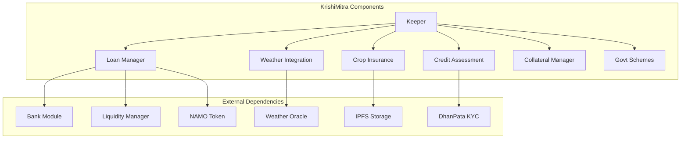
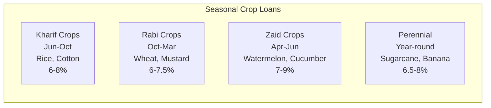
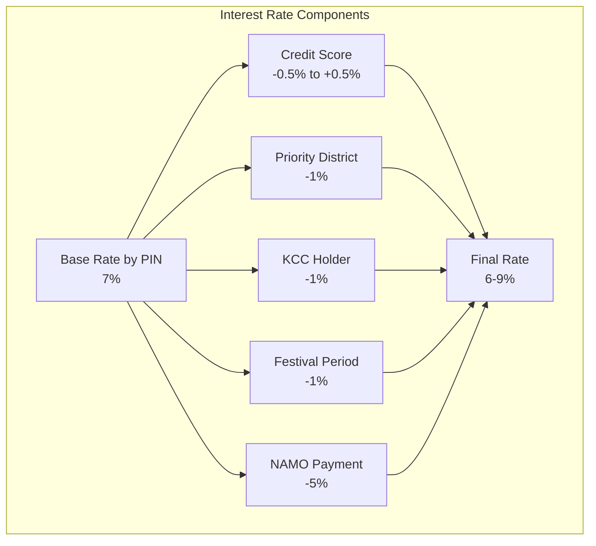
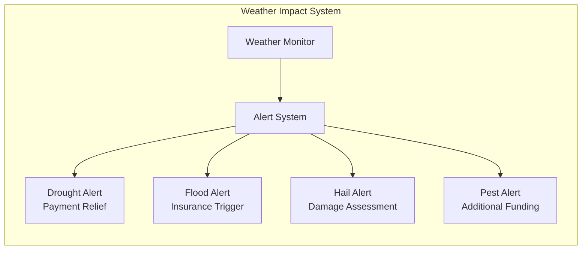
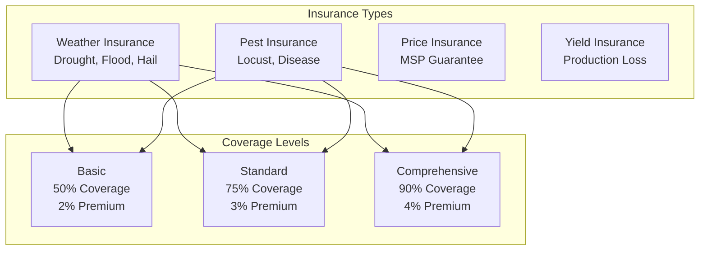
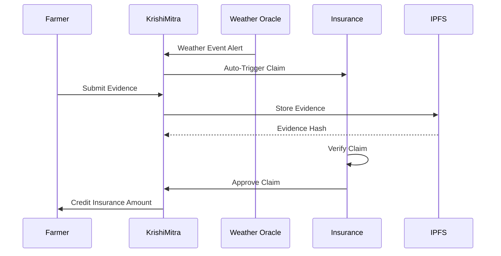
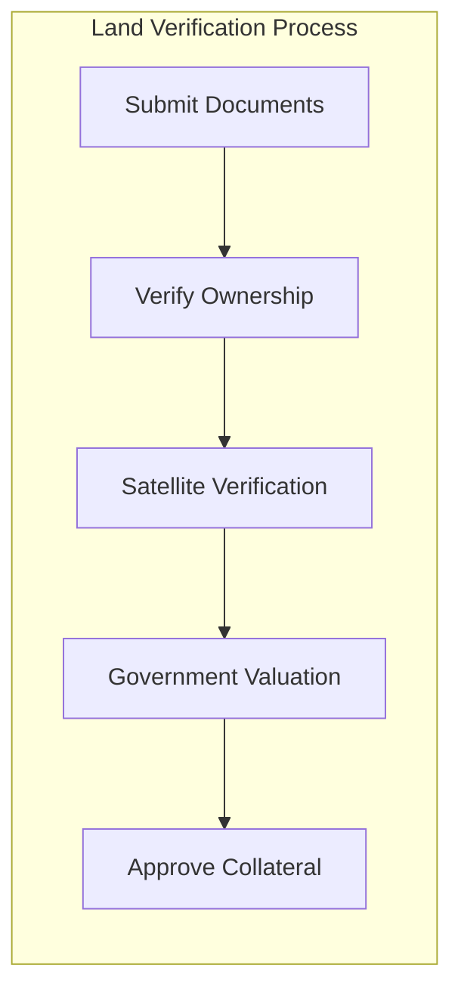
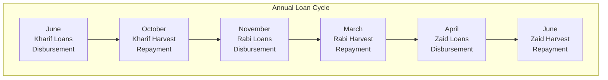
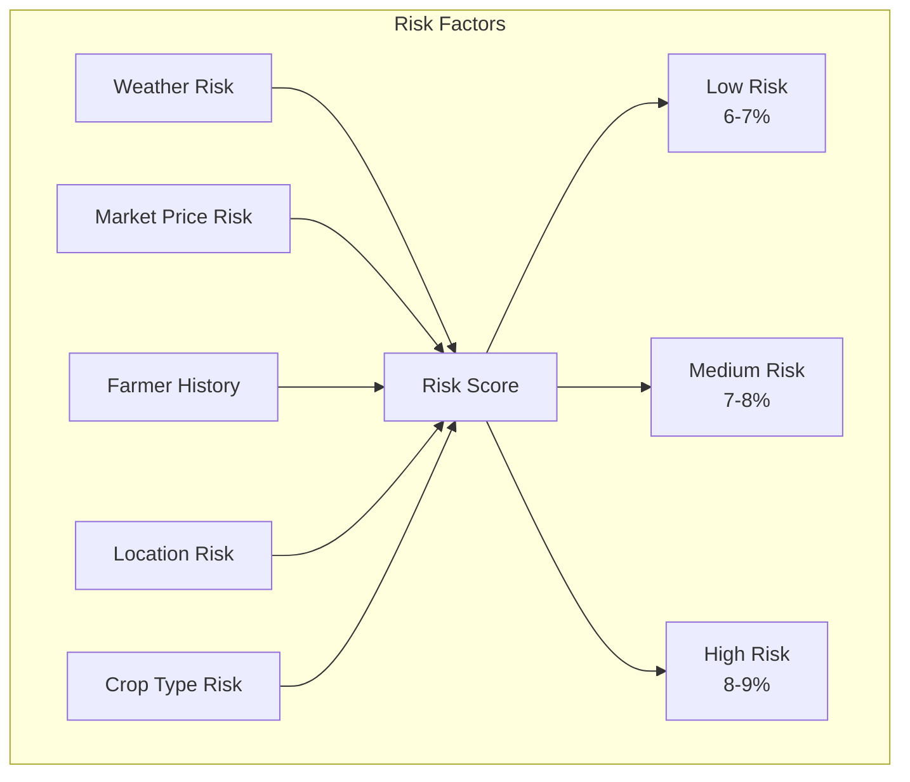

# KrishiMitra Module Documentation

## Overview

The KrishiMitra (Farmer's Friend) module implements DeshChain's revolutionary agricultural lending platform offering loans at 6-9% interest (compared to 12-18% from traditional sources). It features weather-based adjustments, automatic crop insurance, government scheme integration, and seasonal loan cycles specifically designed for Indian farmers' needs.

## Module Architecture



## Agricultural Loan Products

### 1. Crop-Based Loans



### 2. Purpose-Based Categories

```go
type LoanPurpose string

const (
    PURPOSE_SEEDS           LoanPurpose = "seeds"
    PURPOSE_FERTILIZERS     LoanPurpose = "fertilizers"
    PURPOSE_EQUIPMENT       LoanPurpose = "equipment"
    PURPOSE_IRRIGATION      LoanPurpose = "irrigation"
    PURPOSE_LAND_PREPARATION LoanPurpose = "land_preparation"
    PURPOSE_HARVEST         LoanPurpose = "harvest"
    PURPOSE_STORAGE         LoanPurpose = "storage"
    PURPOSE_TRANSPORT       LoanPurpose = "transport"
)
```

### 3. Loan Limits by Land Size

| Land Size | Max Loan Amount | Interest Rate |
|-----------|----------------|---------------|
| 0.5-2 acres | ₹50,000/acre | 6-7% |
| 2-5 acres | ₹40,000/acre | 6.5-7.5% |
| 5-10 acres | ₹35,000/acre | 7-8% |
| >10 acres | ₹30,000/acre | 7.5-9% |

## Interest Rate Calculation

### Dynamic Rate Structure



### Credit Score Impact

```go
func CalculateInterestRate(application LoanApplication) sdk.Dec {
    baseRate := GetPINBasedRate(application.PINCode)
    
    // Credit score adjustments
    switch {
    case application.CreditScore >= 750:
        baseRate = baseRate.Sub(sdk.NewDecWithPrec(50, 4)) // -0.5%
    case application.CreditScore >= 650:
        baseRate = baseRate.Sub(sdk.NewDecWithPrec(25, 4)) // -0.25%
    case application.CreditScore < 550:
        baseRate = baseRate.Add(sdk.NewDecWithPrec(50, 4)) // +0.5%
    }
    
    // Special discounts
    if application.IsPriorityDistrict {
        baseRate = baseRate.Sub(sdk.NewDec(1)) // -1%
    }
    if application.HasKCC {
        baseRate = baseRate.Sub(sdk.NewDec(1)) // -1%
    }
    if application.PaymentInNAMO {
        finalRate = finalRate.Mul(sdk.NewDecWithPrec(95, 2)) // 5% discount
    }
    
    return ClampRate(baseRate, 6, 9) // Ensure 6-9% range
}
```

## Weather-Based Features

### 1. Weather Integration



### 2. Weather Data Structure

```go
type WeatherInfo struct {
    Pincode         string
    Temperature     sdk.Dec    // Celsius
    Humidity        sdk.Dec    // Percentage
    Rainfall        sdk.Dec    // mm
    Season          Season
    LastUpdated     time.Time
    
    // Alerts
    ActiveAlerts    []WeatherAlert
    RiskLevel       RiskLevel  // LOW, MEDIUM, HIGH, CRITICAL
}

type WeatherAlert struct {
    Type            WeatherEvent  // DROUGHT, FLOOD, HAIL, PEST
    Severity        int32         // 1-5 scale
    StartDate       time.Time
    ExpectedDuration time.Duration
    AffectedCrops   []string
    RecommendedAction string
}
```

### 3. Weather-Based Adjustments

```go
type WeatherAdjustment struct {
    // Payment Relief
    DroughtRelief       bool      // 3-month moratorium
    FloodRelief         bool      // 6-month moratorium
    
    // Insurance Triggers
    AutoInsuranceClaim  bool      // Automatic claim filing
    ClaimAmount         sdk.Coin  // Based on damage assessment
    
    // Additional Support
    EmergencyCredit     sdk.Coin  // Quick disbursement
    InterestWaiver      sdk.Dec   // Temporary waiver
}
```

## Crop Insurance System

### 1. Insurance Coverage



### 2. Insurance Claim Process



### 3. Insurance Premium Structure

```go
type InsurancePremium struct {
    CropType            CropType
    CoverageLevel       CoverageLevel
    LandArea            sdk.Dec       // In acres
    
    // Premium Calculation
    BasePremiumRate     sdk.Dec       // 2-4% of sum insured
    RiskMultiplier      sdk.Dec       // Based on location
    ClaimHistory        sdk.Dec       // Past claims impact
    
    // Final Premium
    TotalPremium        sdk.Coin
    SubsidyAmount       sdk.Coin      // Government subsidy
    FarmerShare         sdk.Coin      // After subsidy
}
```

## Government Scheme Integration

### 1. Kisan Credit Card (KCC)

```go
type KCCIntegration struct {
    KCCNumber           string
    IssuingBank         string
    CreditLimit         sdk.Coin
    
    // Benefits
    InterestDiscount    sdk.Dec   // 1% reduction
    ProcessingFeeWaiver bool      // 100% waiver
    InsuranceSubsidy    sdk.Dec   // 50% subsidy
    
    // Limits
    MaxLoanMultiple     sdk.Dec   // 3x of KCC limit
    RenewalBonus        sdk.Coin  // Annual bonus
}
```

### 2. Priority District Benefits

```go
type PriorityDistrictBenefits struct {
    DistrictName        string
    StateCode           string
    
    // Benefits
    InterestSubsidy     sdk.Dec   // 1% reduction
    HigherLoanLimit     sdk.Dec   // 20% increase
    FasterProcessing    bool      // 24-hour approval
    TechnicalSupport    bool      // Free agri-advisory
    
    // Special Programs
    SoilHealthCard      bool
    SeedSubsidy         sdk.Dec
    FertilizerSubsidy   sdk.Dec
}
```

## Module Parameters

```go
type Params struct {
    // Interest Rates
    MinInterestRate         sdk.Dec   // 0.06 (6%)
    MaxInterestRate         sdk.Dec   // 0.09 (9%)
    
    // Loan Limits
    MinLoanAmount           sdk.Int   // 10000 (₹10,000)
    MaxLoanPerAcre          sdk.Int   // 50000 (₹50,000)
    MinLandRequirement      sdk.Dec   // 0.5 acres
    
    // Insurance
    MandatoryInsuranceLimit sdk.Int   // 100000 (₹1 Lakh)
    MinInsurancePremium     sdk.Dec   // 0.02 (2%)
    MaxInsurancePremium     sdk.Dec   // 0.04 (4%)
    
    // Processing
    ProcessingFeeRate       sdk.Dec   // 0.01 (1%)
    MaxProcessingFee        sdk.Int   // 5000 (₹5,000)
    
    // Repayment
    MinRepaymentMonths      int32     // 3 months
    MaxRepaymentMonths      int32     // 12 months
    HarvestGracePeriod      int32     // 30 days
    
    // Discounts
    KCCDiscount             sdk.Dec   // 0.01 (1%)
    NAMOPaymentDiscount     sdk.Dec   // 0.05 (5%)
    PriorityDistrictDiscount sdk.Dec  // 0.01 (1%)
}
```

## Collateral Management

### 1. Accepted Collateral Types

```go
type CollateralType struct {
    Type                string    // land, crop, equipment, warehouse_receipt
    Description         string
    ValuationMethod     string    // government_rate, market_rate, depreciated_value
    LTVRatio            sdk.Dec   // Loan-to-Value ratio
    
    // Documentation
    RequiredDocuments   []string
    VerificationMethod  string    // physical, digital, satellite
}
```

### 2. Land Collateral



## Transaction Types

### 1. MsgApplyAgriculturalLoan
Apply for agricultural loan.

```go
type MsgApplyAgriculturalLoan struct {
    Farmer              string
    DhanPataID          string
    RequestedAmount     sdk.Coin
    CropType            CropType
    LandArea            sdk.Dec       // In acres
    LandOwnershipProof  string        // Document hash
    PINCode             string
    Purpose             LoanPurpose
    RepaymentSchedule   RepaymentType // MONTHLY, QUARTERLY, HARVEST_BASED
    InsuranceOptIn      bool
    KCCNumber           string        // Optional
}
```

### 2. MsgUpdateWeatherData
Update weather information (Oracle only).

```go
type MsgUpdateWeatherData struct {
    Authority           string
    Pincode             string
    WeatherData         WeatherInfo
    Alerts              []WeatherAlert
}
```

### 3. MsgFileInsuranceClaim
File crop insurance claim.

```go
type MsgFileInsuranceClaim struct {
    Farmer              string
    LoanID              string
    ClaimType           ClaimType    // WEATHER, PEST, YIELD, PRICE
    EstimatedLoss       sdk.Coin
    EvidenceHashes      []string     // IPFS hashes
    AffectedArea        sdk.Dec      // In acres
}
```

### 4. MsgRegisterKCC
Register Kisan Credit Card.

```go
type MsgRegisterKCC struct {
    Farmer              string
    KCCNumber           string
    IssuingBank         string
    CreditLimit         sdk.Coin
    ValidityProof       string       // Document hash
}
```

### 5. MsgRepayLoan
Make loan repayment.

```go
type MsgRepayLoan struct {
    Farmer              string
    LoanID              string
    RepaymentAmount     sdk.Coin
    PaymentMethod       string       // BANK, NAMO, HARVEST_PROCEEDS
}
```

## Query Endpoints

### 1. QueryFarmerProfile
Get farmer profile and loan history.

**Request**: `/deshchain/krishimitra/v1/farmer/{address}`

**Response**:
```json
{
  "profile": {
    "farmer_address": "deshchain1...",
    "dhanpata_id": "DHP123456",
    "total_land": "5.5",
    "credit_score": 680,
    "active_loans": 1,
    "total_borrowed": "150000",
    "repayment_history": "GOOD",
    "kcc_registered": true,
    "insurance_claims": 2
  }
}
```

### 2. QueryLoanDetails
Get agricultural loan details.

**Request**: `/deshchain/krishimitra/v1/loan/{loan_id}`

**Response**:
```json
{
  "loan": {
    "loan_id": "AGRI-2024-001",
    "farmer": "deshchain1...",
    "amount": "100000",
    "interest_rate": "6.5%",
    "crop_type": "KHARIF",
    "land_area": "3.5",
    "disbursement_date": "2024-06-15",
    "due_date": "2024-12-15",
    "insurance_active": true,
    "weather_relief": false
  }
}
```

### 3. QueryWeatherInfo
Get weather data for PIN code.

**Request**: `/deshchain/krishimitra/v1/weather/{pincode}`

**Response**:
```json
{
  "weather": {
    "pincode": "560001",
    "temperature": "28.5",
    "humidity": "65",
    "rainfall": "120",
    "season": "MONSOON",
    "active_alerts": [
      {
        "type": "HEAVY_RAIN",
        "severity": 3,
        "affected_crops": ["rice", "cotton"]
      }
    ],
    "risk_level": "MEDIUM"
  }
}
```

### 4. QueryInsuranceStatus
Get insurance coverage details.

**Request**: `/deshchain/krishimitra/v1/insurance/{loan_id}`

**Response**:
```json
{
  "insurance": {
    "loan_id": "AGRI-2024-001",
    "coverage_type": "COMPREHENSIVE",
    "sum_insured": "150000",
    "premium_paid": "6000",
    "subsidy_received": "3000",
    "active_claims": 0,
    "coverage_ends": "2025-03-31"
  }
}
```

### 5. QueryEligibleSchemes
Get government schemes for farmer.

**Request**: `/deshchain/krishimitra/v1/schemes/{pincode}`

**Response**:
```json
{
  "schemes": [
    {
      "scheme_name": "Priority District Program",
      "benefits": {
        "interest_subsidy": "1%",
        "higher_loan_limit": "20%",
        "technical_support": true
      }
    },
    {
      "scheme_name": "Small Farmer Subsidy",
      "benefits": {
        "insurance_subsidy": "50%",
        "seed_subsidy": "30%"
      }
    }
  ]
}
```

## Events

### 1. Loan Sanctioned Event
```json
{
  "type": "agricultural_loan_sanctioned",
  "attributes": [
    {"key": "loan_id", "value": "AGRI-2024-001"},
    {"key": "farmer", "value": "{address}"},
    {"key": "amount", "value": "100000"},
    {"key": "interest_rate", "value": "6.5%"},
    {"key": "crop_type", "value": "KHARIF"},
    {"key": "repayment_schedule", "value": "HARVEST_BASED"}
  ]
}
```

### 2. Weather Alert Event
```json
{
  "type": "weather_alert_triggered",
  "attributes": [
    {"key": "pincode", "value": "560001"},
    {"key": "alert_type", "value": "DROUGHT"},
    {"key": "severity", "value": "4"},
    {"key": "affected_loans", "value": "25"},
    {"key": "relief_activated", "value": "true"}
  ]
}
```

### 3. Insurance Claim Event
```json
{
  "type": "insurance_claim_processed",
  "attributes": [
    {"key": "claim_id", "value": "CLM-2024-001"},
    {"key": "loan_id", "value": "AGRI-2024-001"},
    {"key": "claim_type", "value": "WEATHER"},
    {"key": "approved_amount", "value": "75000"},
    {"key": "auto_triggered", "value": "true"}
  ]
}
```

### 4. Harvest Payment Event
```json
{
  "type": "harvest_based_repayment",
  "attributes": [
    {"key": "loan_id", "value": "AGRI-2024-001"},
    {"key": "harvest_value", "value": "200000"},
    {"key": "loan_deduction", "value": "106500"},
    {"key": "farmer_proceeds", "value": "93500"},
    {"key": "loan_closed", "value": "true"}
  ]
}
```

## Seasonal Loan Cycles

### Crop Calendar Integration



## Risk Management

### 1. Multi-Layer Risk Assessment



### 2. Default Prevention

```go
type DefaultPrevention struct {
    // Early Warning
    PaymentReminders    int32     // SMS/App notifications
    GracePeriodDays     int32     // 30 days
    
    // Support Measures
    RestructuringOption bool      // Extended tenure
    PartialPayment      bool      // Accept partial payments
    CropSwitchAdvice    bool      // Better crop suggestions
    
    // Community Support
    VillageGuarantee    bool      // Peer guarantee system
    FarmerGroups        bool      // Group lending benefits
}
```

## Success Metrics

### Platform Impact
- Average interest rate: 7.2%
- Loan approval time: 48 hours
- Insurance claim settlement: 7 days
- Farmer satisfaction: 92%
- Loan recovery rate: 94%

### Farmer Benefits
- Interest savings: ₹5,000-15,000 per loan
- Timely credit access: 100% before sowing
- Insurance coverage: 85% of farmers
- Weather alerts: 24-hour advance
- Government subsidy access: 100%

## Integration Benefits

### 1. With DhanPata KYC
- Instant farmer verification
- Land record integration
- Credit history import
- Paperless process

### 2. With Weather Oracle
- Real-time weather data
- Automatic alerts
- Insurance triggers
- Crop advisories

### 3. With NAMO Token
- 5% discount on interest
- Faster processing
- Reward points
- Liquidity benefits

## Best Practices

### For Farmers
1. **Register KCC**: Get 1% discount
2. **Opt for Insurance**: Protect against losses
3. **Maintain Land Records**: Faster approval
4. **Track Weather**: Plan activities
5. **Repay on Time**: Build credit score

### For Agricultural Officers
1. **Verify Documents**: Ensure authenticity
2. **Monitor Weather**: Alert farmers
3. **Process Claims**: Quick settlement
4. **Provide Advisory**: Crop guidance
5. **Track Recovery**: Maintain portfolio health

### For Platform Operators
1. **Weather Integration**: Keep data current
2. **Insurance Partners**: Maintain relationships
3. **Government Liaison**: Scheme updates
4. **Risk Monitoring**: Portfolio analysis
5. **Farmer Education**: Conduct workshops

## CLI Commands

### Query Commands
```bash
# Query farmer profile
deshchaind query krishimitra farmer [address]

# Get loan details
deshchaind query krishimitra loan [loan-id]

# Check weather info
deshchaind query krishimitra weather [pincode]

# View insurance status
deshchaind query krishimitra insurance [loan-id]

# Check eligible schemes
deshchaind query krishimitra schemes [pincode]
```

### Transaction Commands
```bash
# Apply for agricultural loan
deshchaind tx krishimitra apply-loan \
  --amount [amount] \
  --crop-type [type] \
  --land-area [acres] \
  --purpose [purpose] \
  --from [key]

# Register KCC
deshchaind tx krishimitra register-kcc \
  --kcc-number [number] \
  --bank [bank-name] \
  --limit [amount] \
  --from [key]

# File insurance claim
deshchaind tx krishimitra file-claim \
  --loan-id [id] \
  --claim-type [type] \
  --loss-amount [amount] \
  --evidence [ipfs-hashes] \
  --from [key]

# Make loan repayment
deshchaind tx krishimitra repay-loan \
  --loan-id [id] \
  --amount [amount] \
  --payment-method [method] \
  --from [key]
```

## FAQ

**Q: What documents are needed for loan application?**
A: Land ownership proof, DhanPata KYC, and Aadhaar. KCC holders need minimal documents.

**Q: How does weather-based relief work?**
A: Automatic moratorium on payments during severe weather events, with insurance claims triggered automatically.

**Q: Can I get multiple loans for different crops?**
A: Yes, separate loans for Kharif, Rabi, and Zaid crops with appropriate limits.

**Q: Is crop insurance mandatory?**
A: Mandatory for loans above ₹1 Lakh, optional but recommended for smaller loans.

**Q: How fast is loan disbursement?**
A: 48 hours for complete applications, 24 hours in priority districts.

---

For more information, see the [Module Overview](../MODULE_OVERVIEW.md) or explore other [DeshChain Modules](../MODULE_OVERVIEW.md#module-categories).