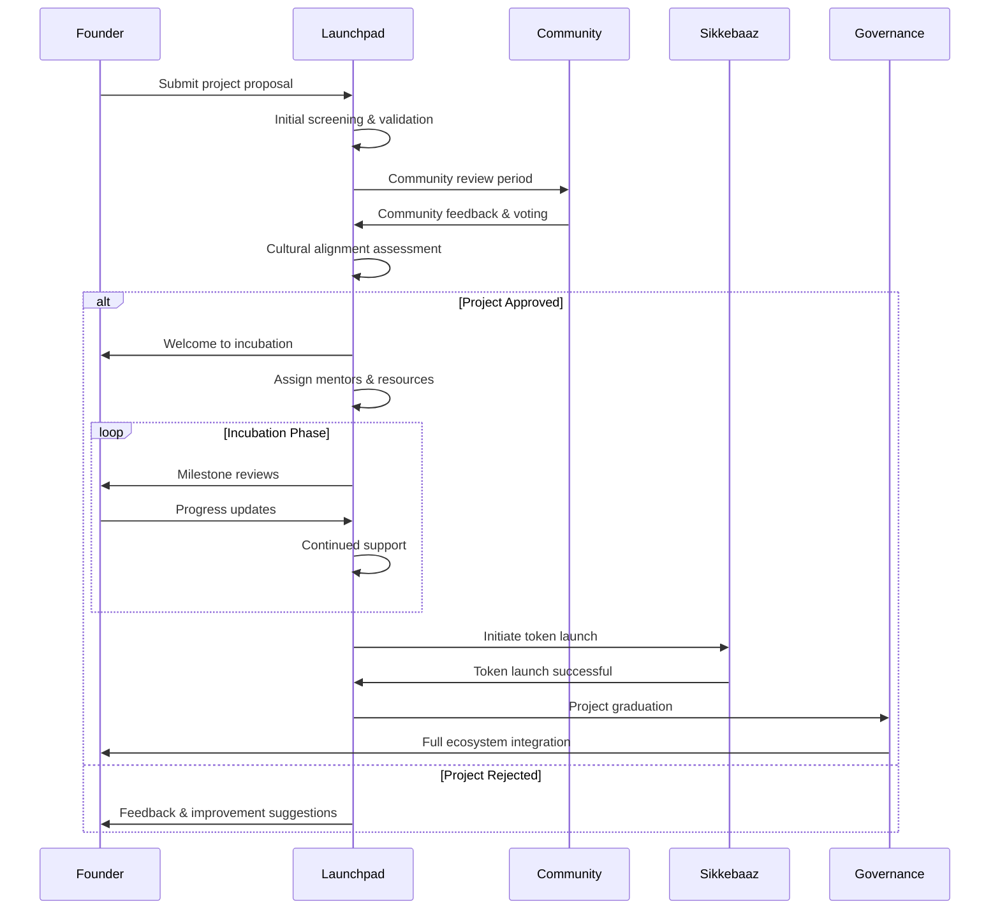

# Launchpad Module Documentation

## Overview

The Launchpad module serves as DeshChain's comprehensive project incubation and launch platform, providing end-to-end support for blockchain startups, DeFi protocols, cultural initiatives, and social impact projects. It integrates with Sikkebaaz for token launches, supports multi-stage funding rounds, and emphasizes projects that align with DeshChain's cultural and social values.

## Module Architecture

```mermaid
graph TB
    subgraph "Launchpad Ecosystem"
        KEEPER[Keeper]
        PROJECTS[Project Management]
        FUNDING[Multi-Stage Funding]
        VETTING[Due Diligence Engine]
        CULTURAL[Cultural Alignment Check]
        TOKENOMICS[Tokenomics Validation]
        COMMUNITY[Community Voting]
        INCUBATION[Incubation Support]
        GRADUATION[Launch & Graduation]
    end
    
    subgraph "Integration Layer"
        SIKKEBAAZ[Sikkebaaz Token Launch]
        GOVERNANCE[DeshChain Governance]
        CULTURAL_MOD[Cultural Module]
        DONATION[Donation Integration]
        NAMO[NAMO Staking]
        MONEYORDER[DEX Integration]
    end
    
    subgraph "External Services"
        KYC[KYC Verification]
        LEGAL[Legal Compliance]
        AUDIT[Security Audits]
        MENTORSHIP[Mentor Network]
        MARKETING[Marketing Support]
    end
    
    KEEPER --> PROJECTS
    KEEPER --> FUNDING
    KEEPER --> VETTING
    KEEPER --> CULTURAL
    KEEPER --> TOKENOMICS
    KEEPER --> COMMUNITY
    KEEPER --> INCUBATION
    KEEPER --> GRADUATION
    
    PROJECTS --> SIKKEBAAZ
    FUNDING --> GOVERNANCE
    CULTURAL --> CULTURAL_MOD
    COMMUNITY --> DONATION
    VETTING --> NAMO
    TOKENOMICS --> MONEYORDER
    
    VETTING --> KYC
    PROJECTS --> LEGAL
    GRADUATION --> AUDIT
    INCUBATION --> MENTORSHIP
    PROJECTS --> MARKETING
```



## Project Lifecycle Management

### 1. Multi-Stage Project Development



### 2. Comprehensive Project Structure

```go
type LaunchpadProject struct {
    ProjectId           string                 // Unique project identifier
    Name                string                 // Project name
    Description         string                 // Project description
    Category            string                 // Category (DeFi, Social, Cultural, etc.)
    FounderTeam         []TeamMember           // Founding team information
    Status              ProjectStatus          // Current project status
    Stage               DevelopmentStage       // Current development stage
    
    // Financial Information
    FundingGoal         sdk.Coin               // Total funding target
    FundingRaised       sdk.Coin               // Amount raised so far
    TokenAllocation     TokenAllocationPlan    // Token distribution plan
    Tokenomics          TokenomicsModel        // Economic model
    
    // Cultural & Social Alignment
    CulturalAlignment   CulturalAssessment     // Cultural values alignment
    SocialImpact        SocialImpactPlan       // Expected social impact
    CommunityBenefit    string                 // Community benefits
    CharityAllocation   sdk.Dec                // % for charity (minimum 5%)
    
    // Technical Information
    TechnicalSpecs      TechnicalSpecification // Technical requirements
    SecurityAudits      []SecurityAudit        // Security audit results
    Roadmap             []Milestone            // Project milestones
    GitRepository       string                 // Code repository
    Documentation       []DocumentLink         // Project documentation
    
    // Community & Governance
    CommunityScore      int32                  // Community support score
    GovernanceVotes     []GovernanceVote       // Governance decisions
    MentorAssignments   []MentorAssignment     // Assigned mentors
    
    // Timestamps & Tracking
    ApplicationTime     time.Time              // Application submission
    ApprovalTime        time.Time              // Project approval
    LaunchTime          time.Time              // Token launch time
    GraduationTime      time.Time              // Platform graduation
    LastUpdateTime      time.Time              // Last update
    
    // Metadata
    Tags                []string               // Project tags
    Website             string                 // Project website
    SocialLinks         map[string]string      // Social media links
    PressReleases       []PressRelease         // Media coverage
    Awards              []AwardRecognition     // Recognition received
}

type TeamMember struct {
    Name            string    // Member name
    Role            string    // Role in project
    Experience      string    // Previous experience
    LinkedInProfile string    // LinkedIn URL
    GitHubProfile   string    // GitHub URL
    KYCStatus       string    // KYC verification status
    StakedNAMO      sdk.Coin  // NAMO staked as commitment
}

type ProjectStatus string
const (
    StatusDraft             ProjectStatus = "draft"             // Initial draft
    StatusSubmitted         ProjectStatus = "submitted"         // Submitted for review
    StatusUnderReview       ProjectStatus = "under_review"      // Being reviewed
    StatusCommunityVoting   ProjectStatus = "community_voting"  // Community voting phase
    StatusApproved          ProjectStatus = "approved"          // Approved for incubation
    StatusIncubation        ProjectStatus = "incubation"        // In incubation
    StatusPreLaunch         ProjectStatus = "pre_launch"        // Preparing for launch
    StatusLaunched          ProjectStatus = "launched"          // Token launched
    StatusGraduated         ProjectStatus = "graduated"         // Full ecosystem member
    StatusRejected          ProjectStatus = "rejected"          // Application rejected
    StatusSuspended         ProjectStatus = "suspended"         // Temporarily suspended
)
```

### 3. Cultural Alignment Assessment

```go
type CulturalAssessment struct {
    OverallScore        int32                  // 0-100 cultural alignment score
    ValueAlignment      map[string]int32       // Alignment with Indian values
    CulturalIntegration CulturalIntegration    // Planned cultural integration
    LanguageSupport     []string               // Supported Indian languages
    FestivalParticipation bool                 // Plans for festival participation
    CommunityEngagement CommunityEngagement    // Community involvement plans
    
    // Specific Assessments
    PatriotismScore     int32                  // Patriotic value score
    SocialResponsibility int32                 // Social responsibility score
    TraditionalRespect  int32                  // Respect for traditions score
    InnovationBalance   int32                  // Balance of innovation with tradition
    
    // Review Details
    ReviewedBy          string                 // Cultural review committee member
    ReviewDate          time.Time              // Assessment date
    Comments            string                 // Detailed assessment comments
    Recommendations     []string               // Improvement recommendations
}

type CulturalIntegration struct {
    QuoteIntegration    bool      // Plans to integrate cultural quotes
    FestivalEvents      []string  // Festival celebration plans
    LanguageLocalization bool     // Multi-language support planned
    CulturalEducation   bool      // Educational content about culture
    TraditionalDesign   bool      // Traditional design elements
    CommunityTraditions bool      // Support for local traditions
}

// Assess cultural alignment of project
func (k Keeper) AssessCulturalAlignment(
    ctx sdk.Context,
    projectId string,
    culturalPlan CulturalIntegration,
    socialImpact SocialImpactPlan,
) CulturalAssessment {
    assessment := CulturalAssessment{
        ValueAlignment: make(map[string]int32),
    }
    
    // Evaluate different aspects
    assessment.ValueAlignment["respect_for_elders"] = k.evaluateElderRespect(culturalPlan)
    assessment.ValueAlignment["community_service"] = k.evaluateCommunityService(socialImpact)
    assessment.ValueAlignment["environmental_consciousness"] = k.evaluateEnvironmentalImpact(socialImpact)
    assessment.ValueAlignment["cultural_preservation"] = k.evaluateCulturalPreservation(culturalPlan)
    assessment.ValueAlignment["social_harmony"] = k.evaluateSocialHarmony(socialImpact)
    
    // Calculate overall score
    totalScore := int32(0)
    for _, score := range assessment.ValueAlignment {
        totalScore += score
    }
    assessment.OverallScore = totalScore / int32(len(assessment.ValueAlignment))
    
    // Additional scoring
    if culturalPlan.QuoteIntegration {
        assessment.PatriotismScore += 20
    }
    if len(culturalPlan.FestivalEvents) > 0 {
        assessment.PatriotismScore += 15
    }
    if culturalPlan.LanguageLocalization {
        assessment.PatriotismScore += 10
    }
    
    // Social responsibility scoring
    if socialImpact.CharityPercentage.GT(sdk.NewDecWithPrec(5, 2)) { // >5%
        assessment.SocialResponsibility += 25
    }
    if socialImpact.CommunityJobs > 0 {
        assessment.SocialResponsibility += 20
    }
    
    return assessment
}
```

## Multi-Stage Funding System

### 1. Sophisticated Funding Rounds

```go
type FundingRound struct {
    RoundId             string        // Unique round identifier
    ProjectId           string        // Associated project
    RoundType           RoundType     // Type of funding round
    FundingGoal         sdk.Coin      // Target amount to raise
    MinContribution     sdk.Coin      // Minimum individual contribution
    MaxContribution     sdk.Coin      // Maximum individual contribution
    StartTime           time.Time     // Round start time
    EndTime             time.Time     // Round end time
    Status              RoundStatus   // Current round status
    
    // Raised Amounts
    TotalRaised         sdk.Coin      // Total amount raised
    ContributorCount    uint64        // Number of contributors
    Contributions       []Contribution // Individual contributions
    
    // Token Economics
    TokenPrice          sdk.Dec       // Price per token in this round
    TokensOffered       sdk.Int       // Total tokens available
    TokensSold          sdk.Int       // Tokens sold so far
    VestingSchedule     VestingPlan   // Token vesting plan
    
    // Access Control
    Whitelist           []string      // Whitelisted addresses (for private rounds)
    MinimumStakeReq     sdk.Coin      // Minimum NAMO staking requirement
    KYCRequired         bool          // KYC verification required
    
    // Special Features
    EarlyBirdBonus      sdk.Dec       // Early contributor bonus %
    CommunityDiscount   sdk.Dec       // Discount for community members
    LoyaltyBonus        sdk.Dec       // Bonus for loyal DeshChain users
    ReferralBonus       sdk.Dec       // Referral bonus program
}

type RoundType string
const (
    RoundTypePreSeed    RoundType = "pre_seed"    // Pre-seed funding
    RoundTypeSeed       RoundType = "seed"        // Seed funding
    RoundTypePrivate    RoundType = "private"     // Private sale
    RoundTypePublic     RoundType = "public"      // Public sale
    RoundTypeStrategic  RoundType = "strategic"   // Strategic partnerships
    RoundTypeCommunity  RoundType = "community"   // Community round
)

type Contribution struct {
    ContributorAddress  string        // Contributor address
    Amount              sdk.Coin      // Contribution amount
    TokensReceived      sdk.Int       // Tokens received
    Timestamp           time.Time     // Contribution time
    ReferredBy          string        // Referrer address (if any)
    BonusTokens         sdk.Int       // Bonus tokens received
    VestingScheduleId   string        // Associated vesting schedule
    KYCVerified         bool          // KYC verification status
}
```

### 2. Smart Vesting & Token Distribution

```go
type VestingPlan struct {
    PlanId              string            // Unique vesting plan ID
    TokensTotal         sdk.Int           // Total tokens to vest
    CliffPeriod         time.Duration     // Initial cliff period
    VestingDuration     time.Duration     // Total vesting duration
    VestingSchedule     []VestingMilestone // Vesting milestones
    
    // Release Conditions
    PerformanceBased    bool              // Performance-based vesting
    CommunityMilestones []CommunityGoal   // Community achievement goals
    CharityRequirements []CharityGoal     // Charity contribution requirements
    
    // Current Status
    TokensReleased      sdk.Int           // Tokens already released
    NextReleaseDate     time.Time         // Next release date
    ReleasesRemaining   uint64            // Remaining releases
}

type VestingMilestone struct {
    MilestoneId         string        // Milestone identifier
    ReleaseDate         time.Time     // Token release date
    ReleasePercentage   sdk.Dec       // % of total tokens to release
    ReleaseConditions   []string      // Conditions that must be met
    TokenAmount         sdk.Int       // Exact token amount
    Status              MilestoneStatus // Milestone status
}

type CommunityGoal struct {
    GoalId              string        // Goal identifier
    Description         string        // Goal description
    TargetMetric        string        // Metric to measure
    TargetValue         sdk.Int       // Target value to achieve
    CurrentValue        sdk.Int       // Current achievement
    RewardTokens        sdk.Int       // Bonus tokens for achievement
    Deadline            time.Time     // Achievement deadline
}
```

## Advanced Due Diligence Engine

### 1. Multi-Dimensional Project Evaluation

```go
type DueDiligenceReport struct {
    ProjectId           string                 // Project being evaluated
    OverallScore        int32                  // Overall DD score (0-100)
    RiskRating          RiskRating             // Risk assessment
    RecommendedAction   RecommendationAction   // Recommended next steps
    
    // Individual Assessment Areas
    TechnicalAssessment TechnicalEvaluation    // Technical viability
    TeamAssessment      TeamEvaluation         // Team capability
    MarketAssessment    MarketAnalysis         // Market opportunity
    FinancialAssessment FinancialAnalysis      // Financial projections
    LegalAssessment     LegalCompliance        // Legal compliance
    CulturalAssessment  CulturalAlignment      // Cultural fit
    
    // Risk Factors
    IdentifiedRisks     []RiskFactor           // Potential risks
    MitigationPlans     []MitigationStrategy   // Risk mitigation
    RedFlags            []RedFlag              // Serious concerns
    
    // Reviewer Information
    ReviewedBy          string                 // DD team member
    ReviewDate          time.Time              // Review completion date
    SecondOpinionBy     string                 // Second reviewer
    ExternalAuditBy     string                 // External auditor
}

type TechnicalEvaluation struct {
    CodeQualityScore    int32     // Code quality (0-100)
    ArchitectureScore   int32     // System architecture (0-100)
    SecurityScore       int32     // Security measures (0-100)
    ScalabilityScore    int32     // Scalability potential (0-100)
    InnovationScore     int32     // Technical innovation (0-100)
    
    // Specific Assessments
    SmartContractAudit  AuditResult  // Smart contract security audit
    CodeReview          CodeReview   // Code review results
    TestCoverage        sdk.Dec      // Test coverage percentage
    DocumentationScore  int32        // Documentation quality
    
    // Technical Risks
    TechnicalRisks      []string     // Identified technical risks
    PerformanceIssues   []string     // Performance concerns
    SecurityVulns       []string     // Security vulnerabilities
}

type TeamEvaluation struct {
    OverallScore        int32              // Overall team score
    ExperienceScore     int32              // Team experience level
    DiversityScore      int32              // Team diversity
    CommitmentScore     int32              // Team commitment level
    
    // Individual Assessments
    TeamMembers         []MemberEvaluation // Individual member assessments
    KeyPersonRisk       int32              // Key person dependency risk
    TeamCohesion        int32              // Team working relationship
    AdvisoryBoard       []AdvisorProfile   // Advisory board members
    
    // Commitment Indicators
    FullTimeCommitment  bool               // Full-time commitment
    NAMOStakingAmount   sdk.Coin           // NAMO staked by team
    LockupAgreements    []LockupAgreement  // Team token lockups
}

// Perform comprehensive due diligence
func (k Keeper) PerformDueDiligence(
    ctx sdk.Context,
    projectId string,
    dueDiligenceRequest DDRequest,
) DueDiligenceReport {
    project, found := k.GetProject(ctx, projectId)
    if !found {
        return DueDiligenceReport{}
    }
    
    report := DueDiligenceReport{
        ProjectId:    projectId,
        ReviewedBy:   dueDiligenceRequest.ReviewerAddress,
        ReviewDate:   ctx.BlockTime(),
    }
    
    // Technical evaluation
    report.TechnicalAssessment = k.EvaluateTechnicalAspects(project)
    
    // Team evaluation
    report.TeamAssessment = k.EvaluateTeam(project.FounderTeam)
    
    // Market analysis
    report.MarketAssessment = k.AnalyzeMarket(project)
    
    // Financial analysis
    report.FinancialAssessment = k.AnalyzeFinancials(project)
    
    // Cultural alignment (using existing function)
    report.CulturalAssessment = k.AssessCulturalAlignment(ctx, projectId, 
        project.CulturalAlignment.CulturalIntegration, project.SocialImpact)
    
    // Calculate overall score
    scores := []int32{
        report.TechnicalAssessment.CodeQualityScore,
        report.TeamAssessment.OverallScore,
        report.MarketAssessment.OpportunityScore,
        report.FinancialAssessment.ViabilityScore,
        report.CulturalAssessment.OverallScore,
    }
    
    total := int32(0)
    for _, score := range scores {
        total += score
    }
    report.OverallScore = total / int32(len(scores))
    
    // Determine recommendation
    if report.OverallScore >= 80 {
        report.RecommendedAction = ActionApprove
    } else if report.OverallScore >= 60 {
        report.RecommendedAction = ActionConditionalApproval
    } else {
        report.RecommendedAction = ActionReject
    }
    
    return report
}
```

## Community-Driven Governance

### 1. Democratic Project Approval

```go
type CommunityVoting struct {
    VotingId            string            // Unique voting session ID
    ProjectId           string            // Project being voted on
    VotingType          VotingType        // Type of vote
    StartTime           time.Time         // Voting start time
    EndTime             time.Time         // Voting end time
    Status              VotingStatus      // Current voting status
    
    // Voting Parameters
    RequiredQuorum      sdk.Dec           // Minimum participation required
    PassingThreshold    sdk.Dec           // Threshold for approval
    VotingPower         VotingPowerType   // How voting power is calculated
    
    // Vote Tallies
    VotesYes            sdk.Int           // Yes votes
    VotesNo             sdk.Int           // No votes
    VotesAbstain        sdk.Int           // Abstain votes
    TotalVotingPower    sdk.Int           // Total possible voting power
    ParticipationRate   sdk.Dec           // Actual participation rate
    
    // Voter Information
    Voters              []VoterRecord     // Individual vote records
    VoterCount          uint64            // Total number of voters
    
    // Results
    Result              VotingResult      // Final voting result
    ExecutionTime       time.Time         // When result was executed
    ReasonForOutcome    string            // Explanation of outcome
}

type VoterRecord struct {
    VoterAddress        string        // Voter's address
    VotingPower         sdk.Int       // Voter's voting power
    VoteChoice          VoteChoice    // Vote decision
    VoteTime            time.Time     // When vote was cast
    Reasoning           string        // Optional vote explanation
    
    // Voter Qualifications
    NAMOStaked          sdk.Coin      // NAMO staked by voter
    PatriotismScore     int32         // Voter's patriotism score
    CommunityTenure     time.Duration // How long in community
    PreviousVotes       uint64        // Number of previous votes
    VotingReputation    int32         // Voting reputation score
}

// Calculate voting power based on multiple factors
func (k Keeper) CalculateVotingPower(
    ctx sdk.Context,
    voterAddress string,
) sdk.Int {
    // Base voting power from NAMO staking
    stakedAmount := k.GetStakedNAMO(ctx, voterAddress)
    baseVotingPower := stakedAmount.Amount
    
    // Patriotism bonus (up to 50% bonus)
    patriotismScore := k.GetPatriotismScore(ctx, voterAddress)
    patriotismBonus := sdk.NewDec(patriotismScore).Quo(sdk.NewDec(200)) // Max 50% bonus
    
    // Community tenure bonus (up to 25% bonus)
    tenureBonus := k.GetCommunityTenureBonus(ctx, voterAddress) // Max 25%
    
    // Voting history bonus (up to 25% bonus)
    votingHistoryBonus := k.GetVotingHistoryBonus(ctx, voterAddress) // Max 25%
    
    // Calculate final voting power
    bonusMultiplier := sdk.OneDec().Add(patriotismBonus).Add(tenureBonus).Add(votingHistoryBonus)
    finalVotingPower := bonusMultiplier.MulInt(baseVotingPower).TruncateInt()
    
    return finalVotingPower
}
```

### 2. Transparent Community Feedback

```go
type CommunityFeedback struct {
    FeedbackId          string            // Unique feedback ID
    ProjectId           string            // Project receiving feedback
    ReviewerAddress     string            // Community member address
    ReviewerProfile     ReviewerProfile   // Reviewer background
    
    // Structured Feedback
    OverallRating       int32             // Overall rating (1-10)
    CategoryRatings     map[string]int32  // Ratings by category
    DetailedComments    string            // Written feedback
    SuggestedChanges    []string          // Specific improvement suggestions
    
    // Cultural & Social Assessment
    CulturalFit         int32             // Cultural alignment rating
    SocialImpact        int32             // Social impact potential
    CommunityBenefit    int32             // Community benefit rating
    InnovationLevel     int32             // Innovation assessment
    
    // Reviewer Credibility
    ReviewerReputation  int32             // Reviewer's reputation score
    ExpertiseAreas      []string          // Areas of expertise
    PreviousReviews     uint64            // Number of previous reviews
    ReviewQuality       int32             // Quality of past reviews
    
    // Feedback Metadata
    SubmissionTime      time.Time         // Feedback submission time
    LastUpdateTime      time.Time         // Last update
    HelpfulnessVotes    int32             // Community votes on helpfulness
    ReportedAsSpam      bool              // Flagged as inappropriate
}

type ReviewerProfile struct {
    Address             string        // Reviewer address
    DisplayName         string        // Optional display name
    ExpertiseLevel      ExpertiseLevel // Technical expertise level
    CommunityRole       string        // Role in DeshChain community
    ProfessionalBackground string     // Professional background
    ReviewingExperience uint64        // Years of reviewing experience
    Certifications      []string      // Relevant certifications
    LinkedInProfile     string        // Professional profile
}
```

## Incubation & Mentorship Program

### 1. Comprehensive Support System

```go
type IncubationProgram struct {
    ProgramId           string               // Unique program ID
    ProjectId           string               // Associated project
    ProgramType         IncubationType       // Type of incubation
    StartDate           time.Time            // Program start date
    Duration            time.Duration        // Program duration
    Status              IncubationStatus     // Current status
    
    // Support Team
    AssignedMentors     []MentorAssignment   // Assigned mentors
    TechnicalAdvisor    string               // Technical advisor
    BusinessAdvisor     string               // Business advisor
    CulturalAdvisor     string               // Cultural integration advisor
    LegalAdvisor        string               // Legal advisor
    
    // Resources Provided
    Funding             sdk.Coin             // Incubation funding provided
    TechnicalSupport    []TechnicalResource  // Technical resources
    MarketingSupport    []MarketingResource  // Marketing assistance
    NetworkingEvents    []Event              // Networking opportunities
    EducationalContent  []EducationalModule  // Training modules
    
    // Milestone Tracking
    Milestones          []IncubationMilestone // Program milestones
    CompletedMilestones uint64               // Milestones completed
    CurrentPhase        IncubationPhase      // Current phase
    NextMilestoneDate   time.Time            // Next milestone deadline
    
    // Performance Metrics
    ProgressScore       int32                // Overall progress score
    CommunityEngagement int32                // Community interaction level
    TechnicalProgress   int32                // Technical development progress
    MarketValidation    int32                // Market validation progress
    CulturalIntegration int32                // Cultural alignment progress
    
    // Graduation Criteria
    GraduationRequirements []Requirement     // Requirements for graduation
    GraduationStatus       GraduationStatus // Graduation readiness
    EstimatedGraduation    time.Time        // Estimated graduation date
}

type MentorAssignment struct {
    MentorAddress       string            // Mentor's address
    MentorProfile       MentorProfile     // Mentor background
    SpecializationArea  string            // Area of mentorship
    AssignmentDate      time.Time         // Assignment date
    SessionsCompleted   uint64            // Number of sessions held
    MenteeRating        int32             // Mentee's rating of mentor
    MentorRating        int32             // Mentor's rating of mentee
    Status              AssignmentStatus  // Assignment status
}

type MentorProfile struct {
    Name                string        // Mentor name
    Expertise           []string      // Areas of expertise
    ExperienceYears     uint64        // Years of experience
    PreviousCompanies   []string      // Previous work experience
    SuccessfulMentees   uint64        // Number of successful mentees
    Achievements        []string      // Professional achievements
    AvailabilityHours   uint64        // Weekly availability hours
    PreferredCommunication string     // Communication preference
    Languages           []string      // Supported languages
}
```

### 2. Milestone-Based Progress Tracking

```go
type IncubationMilestone struct {
    MilestoneId         string                // Unique milestone ID
    Title               string                // Milestone title
    Description         string                // Detailed description
    Category            MilestoneCategory     // Category of milestone
    DueDate             time.Time             // Due date
    Status              MilestoneStatus       // Current status
    
    // Completion Criteria
    CompletionCriteria  []CompletionCriterion // What needs to be done
    VerificationMethod  string                // How completion is verified
    RequiredEvidence    []string              // Evidence required
    
    // Progress Tracking
    ProgressPercentage  int32                 // Completion percentage
    LastUpdateTime      time.Time             // Last progress update
    CompletionTime      time.Time             // Actual completion time
    
    // Rewards & Consequences
    CompletionReward    sdk.Coin              // Reward for completion
    DelayPenalty        sdk.Coin              // Penalty for delay
    RewardDistributed   bool                  // Whether reward was paid
    
    // Review & Feedback
    ReviewedBy          string                // Reviewer address
    ReviewComments      string                // Review feedback
    ApprovalStatus      ApprovalStatus        // Approval status
    RevisionRequested   bool                  // Revision needed
}

type CompletionCriterion struct {
    CriterionId         string        // Unique criterion ID
    Description         string        // What must be accomplished
    MeasurementMethod   string        // How it's measured
    TargetValue         string        // Target to achieve
    CurrentValue        string        // Current achievement
    IsCompleted         bool          // Completion status
    VerificationDate    time.Time     // When verified
    VerifiedBy          string        // Who verified
}
```

## Token Launch Integration

### 1. Seamless Sikkebaaz Integration

```go
// Launch project token through Sikkebaaz
func (k Keeper) LaunchProjectToken(
    ctx sdk.Context,
    projectId string,
    tokenLaunchRequest TokenLaunchRequest,
) error {
    project, found := k.GetProject(ctx, projectId)
    if !found {
        return ErrProjectNotFound
    }
    
    // Verify project is ready for launch
    if project.Status != StatusPreLaunch {
        return ErrProjectNotReady
    }
    
    // Verify all graduation requirements are met
    if !k.VerifyGraduationRequirements(ctx, projectId) {
        return ErrGraduationRequirementsNotMet
    }
    
    // Create token launch on Sikkebaaz
    sikkebaazLaunch := sikkebaaz.TokenLaunch{
        CreatorAddress:    project.FounderTeam[0].Address, // Primary founder
        TokenName:        tokenLaunchRequest.TokenName,
        TokenSymbol:      tokenLaunchRequest.TokenSymbol,
        InitialSupply:    tokenLaunchRequest.InitialSupply,
        Description:      project.Description,
        
        // Launchpad specific features
        IsLaunchpadProject:    true,
        LaunchpadProjectId:   projectId,
        CulturalAlignment:    project.CulturalAlignment.OverallScore,
        SocialImpactScore:    project.SocialImpact.OverallScore,
        CommunityApproval:    project.CommunityScore,
        
        // Enhanced anti-pump features for launchpad projects
        MaxWalletPercentage:  sdk.NewDecWithPrec(2, 2), // 2% max wallet
        TradingDelay:         time.Hour * 24,            // 24h trading delay
        InitialLiquidityLock: time.Hour * 24 * 365,      // 1 year liquidity lock
        
        // Charity allocation (enforced minimum 5%)
        CharityPercentage:    project.SocialImpact.CharityPercentage,
        CharityRecipient:     project.SocialImpact.CharityRecipient,
    }
    
    // Call Sikkebaaz module to create token
    err := k.sikkebaazKeeper.CreateTokenLaunch(ctx, sikkebaazLaunch)
    if err != nil {
        return err
    }
    
    // Update project status
    project.Status = StatusLaunched
    project.LaunchTime = ctx.BlockTime()
    k.SetProject(ctx, project)
    
    // Create graduation pathway
    graduationPlan := GraduationPlan{
        ProjectId:           projectId,
        EstimatedDuration:   time.Hour * 24 * 90, // 90 days post-launch
        RequiredMetrics:     k.GetGraduationMetrics(projectId),
        SupportPeriod:       time.Hour * 24 * 180, // 6 months support
    }
    k.SetGraduationPlan(ctx, graduationPlan)
    
    // Emit launch event
    ctx.EventManager().EmitEvent(
        sdk.NewEvent(
            EventTypeTokenLaunched,
            sdk.NewAttribute(AttributeKeyProjectId, projectId),
            sdk.NewAttribute(AttributeKeyTokenSymbol, tokenLaunchRequest.TokenSymbol),
            sdk.NewAttribute(AttributeKeyCulturalScore, fmt.Sprintf("%d", project.CulturalAlignment.OverallScore)),
            sdk.NewAttribute(AttributeKeySocialImpact, fmt.Sprintf("%d", project.SocialImpact.OverallScore)),
        ),
    )
    
    return nil
}
```

## Transaction Types

### 1. MsgSubmitProject
Submit a new project for launchpad consideration.

```go
type MsgSubmitProject struct {
    FounderAddress      string                 // Primary founder address
    ProjectName         string                 // Project name
    Description         string                 // Project description
    Category            string                 // Project category
    TeamMembers         []TeamMember           // Team information
    TechnicalSpecs      TechnicalSpecification // Technical details
    FundingGoal         sdk.Coin               // Funding target
    TokenomicsModel     TokenomicsModel        // Token economics
    CulturalIntegration CulturalIntegration    // Cultural alignment plan
    SocialImpactPlan    SocialImpactPlan       // Social impact strategy
    Roadmap             []Milestone            // Development roadmap
    Documentation       []DocumentLink         // Supporting documents
}
```

### 2. MsgVoteOnProject
Cast a vote on a project during community voting phase.

```go
type MsgVoteOnProject struct {
    VoterAddress        string        // Voter's address
    ProjectId           string        // Project being voted on
    VoteChoice          VoteChoice    // Yes/No/Abstain
    VotingPower         sdk.Int       // Calculated voting power
    Reasoning           string        // Optional vote explanation
}
```

### 3. MsgProvideFeedback
Provide detailed community feedback on a project.

```go
type MsgProvideFeedback struct {
    ReviewerAddress     string            // Reviewer address
    ProjectId           string            // Project receiving feedback
    OverallRating       int32             // Overall rating (1-10)
    CategoryRatings     map[string]int32  // Ratings by category
    DetailedComments    string            // Written feedback
    SuggestedChanges    []string          // Improvement suggestions
}
```

### 4. MsgContributeToFunding
Participate in a project's funding round.

```go
type MsgContributeToFunding struct {
    ContributorAddress  string        // Contributor address
    ProjectId           string        // Project receiving funding
    RoundId             string        // Specific funding round
    ContributionAmount  sdk.Coin      // Amount to contribute
    ReferrerAddress     string        // Referrer (if applicable)
}
```

## Query Endpoints

### 1. QueryProject
Get comprehensive project information.

**Request**: `/deshchain/launchpad/v1/project/{project_id}`

**Response**:
```json
{
  "project": {
    "project_id": "proj_001",
    "name": "DeshiFi Protocol",
    "description": "Decentralized lending protocol with cultural values integration",
    "category": "DeFi",
    "status": "incubation",
    "stage": "development",
    "funding_goal": {"denom": "namo", "amount": "100000000000000"},
    "funding_raised": {"denom": "namo", "amount": "75000000000000"},
    "cultural_alignment": {
      "overall_score": 85,
      "patriotism_score": 78,
      "social_responsibility": 92
    },
    "community_score": 89,
    "founder_team": [
      {
        "name": "Priya Sharma",
        "role": "CEO & Founder",
        "experience": "10 years in DeFi",
        "kyc_status": "verified",
        "staked_namo": {"denom": "namo", "amount": "5000000000"}
      }
    ]
  }
}
```

### 2. QueryActiveVoting
Get current community voting sessions.

**Request**: `/deshchain/launchpad/v1/voting/active`

**Response**:
```json
{
  "active_votes": [
    {
      "voting_id": "vote_001",
      "project_id": "proj_001", 
      "project_name": "DeshiFi Protocol",
      "start_time": "2024-07-25T10:00:00Z",
      "end_time": "2024-08-01T10:00:00Z",
      "votes_yes": "1250000000000",
      "votes_no": "150000000000",
      "votes_abstain": "75000000000",
      "participation_rate": "0.68",
      "required_quorum": "0.60",
      "passing_threshold": "0.66",
      "current_result": "passing"
    }
  ]
}
```

### 3. QueryIncubationProgram
Get incubation program details.

**Request**: `/deshchain/launchpad/v1/incubation/{project_id}`

**Response**:
```json
{
  "incubation_program": {
    "program_id": "incub_001",
    "project_id": "proj_001",
    "program_type": "full_incubation",
    "start_date": "2024-07-01T00:00:00Z",
    "duration": "7776000000000000",
    "status": "active",
    "assigned_mentors": [
      {
        "mentor_address": "deshchain1mentor1...",
        "specialization_area": "Technical Architecture",
        "sessions_completed": 8,
        "mentee_rating": 95
      }
    ],
    "milestones": [
      {
        "milestone_id": "ms_001",
        "title": "MVP Development",
        "status": "completed",
        "progress_percentage": 100,
        "completion_time": "2024-07-15T14:30:00Z"
      }
    ],
    "progress_score": 78
  }
}
```

### 4. QueryFundingRounds
Get project funding round information.

**Request**: `/deshchain/launchpad/v1/funding/{project_id}/rounds`

**Response**:
```json
{
  "funding_rounds": [
    {
      "round_id": "round_001",
      "round_type": "seed",
      "funding_goal": {"denom": "namo", "amount": "50000000000000"},
      "total_raised": {"denom": "namo", "amount": "45000000000000"},
      "contributor_count": 156,
      "token_price": "0.001",
      "start_time": "2024-07-20T00:00:00Z",
      "end_time": "2024-08-20T00:00:00Z",
      "status": "active",
      "early_bird_bonus": "0.15",
      "community_discount": "0.10"
    }
  ]
}
```

## Best Practices

### For Project Founders
1. **Strong Cultural Alignment**: Emphasize how your project aligns with Indian values and culture
2. **Community-First Approach**: Engage with the DeshChain community before and during application
3. **Transparent Documentation**: Provide comprehensive technical and business documentation
4. **Team Commitment**: Demonstrate commitment through NAMO staking and full-time dedication
5. **Social Impact Focus**: Include meaningful charity allocation and social benefits

### For Community Voters
1. **Informed Voting**: Review project documentation thoroughly before voting
2. **Cultural Assessment**: Consider how well the project aligns with DeshChain values
3. **Long-term Impact**: Evaluate potential long-term benefits to the ecosystem
4. **Technical Viability**: Assess technical feasibility and innovation level
5. **Regular Participation**: Maintain active participation to build voting power

### For Mentors
1. **Active Engagement**: Provide regular, high-quality mentorship sessions
2. **Expertise Sharing**: Share relevant industry knowledge and connections
3. **Cultural Guidance**: Help projects better integrate with DeshChain culture
4. **Performance Tracking**: Monitor mentee progress and provide feedback
5. **Network Building**: Facilitate connections within the DeshChain ecosystem

## CLI Commands

### Project Management Commands
```bash
# Submit new project
deshchaind tx launchpad submit-project \
  --name "DeshiFi Protocol" \
  --description "Decentralized lending with cultural values" \
  --category "DeFi" \
  --funding-goal 100000000000000namo \
  --from [founder-key]

# Update project information
deshchaind tx launchpad update-project \
  --project-id proj_001 \
  --roadmap-update "MVP completed ahead of schedule" \
  --from [founder-key]

# Apply for incubation
deshchaind tx launchpad apply-incubation \
  --project-id proj_001 \
  --program-type full_incubation \
  --from [founder-key]
```

### Community Participation Commands
```bash
# Vote on project
deshchaind tx launchpad vote-project \
  --project-id proj_001 \
  --vote yes \
  --reasoning "Strong technical team and cultural alignment" \
  --from [voter-key]

# Provide feedback
deshchaind tx launchpad provide-feedback \
  --project-id proj_001 \
  --overall-rating 8 \
  --comments "Excellent concept, needs better market validation" \
  --from [reviewer-key]

# Contribute to funding
deshchaind tx launchpad contribute-funding \
  --project-id proj_001 \
  --round-id round_001 \
  --amount 1000000000namo \
  --from [contributor-key]
```

### Query Commands
```bash
# Get project details
deshchaind query launchpad project proj_001

# List active projects
deshchaind query launchpad projects --status active --limit 20

# Check voting sessions
deshchaind query launchpad voting-active

# View incubation programs
deshchaind query launchpad incubation-programs

# Get funding rounds
deshchaind query launchpad funding-rounds proj_001

# Check community feedback
deshchaind query launchpad feedback proj_001 --limit 50

# View mentorship assignments
deshchaind query launchpad mentors proj_001

# Get launchpad statistics
deshchaind query launchpad statistics
```

## FAQ

**Q: What types of projects does the Launchpad support?**
A: DeFi protocols, cultural preservation projects, social impact initiatives, educational platforms, and any project that aligns with DeshChain's values and benefits the community.

**Q: How is cultural alignment assessed?**
A: Projects are evaluated on respect for Indian traditions, plans for cultural integration, language support, community benefits, and social responsibility commitments.

**Q: What are the minimum requirements for project submission?**
A: Complete team information, technical documentation, business plan, minimum 5% charity allocation, cultural integration plan, and founder NAMO staking commitment.

**Q: How does community voting work?**
A: Voting power is based on NAMO staking, patriotism score, community tenure, and voting history. Projects need majority approval to proceed to incubation.

**Q: What support is provided during incubation?**
A: Technical and business mentorship, funding support, marketing assistance, legal guidance, cultural integration advice, and access to the DeshChain network.

**Q: How do projects graduate from the Launchpad?**
A: Successful completion of incubation milestones, community engagement metrics, technical deliverables, token launch through Sikkebaaz, and ecosystem integration.

---

For more information, see the [Module Overview](../MODULE_OVERVIEW.md) or explore other [DeshChain Modules](../MODULE_OVERVIEW.md#module-categories).