# LiquidityManager Module Documentation

## Overview

The LiquidityManager module serves as DeshChain's central liquidity orchestration system, managing pool liquidity across all lending modules with revolutionary risk management and member-exclusive access. It implements industry-leading financial safety measures with 75% reserve ratios and restricts lending access to Suraksha Pool members only.

## Module Architecture


## Revolutionary Lending System

### 1. Member-Only Access Control

```mermaid
flowchart TD
    A[Loan Request] --> B{Is Pool Member?}
    B -->|No| C[❌ Access Denied<br/>Join Suraksha Pool]
    B -->|Yes| D{Liquidity Available?}
    D -->|No| E[❌ Insufficient Liquidity<br/>Try Later]
    D -->|Yes| F{Within Limits?}
    F -->|No| G[❌ Exceeds Limits<br/>Reduce Amount]
    F -->|Yes| H{Daily Limit OK?}
    H -->|No| I[❌ Daily Limit Reached<br/>Try Tomorrow]
    H -->|Yes| J[✅ Loan Approved]
    
    style C fill:#ffebee
    style E fill:#fff3e0
    style G fill:#fff3e0
    style I fill:#fff3e0
    style J fill:#e8f5e8
```



### 2. Liquidity Status Levels

```go
type LiquidityStatus string

const (
    LiquidityStatusBuilding LiquidityStatus = "BUILDING" // <₹10 Cr  - No lending
    LiquidityStatusBasic    LiquidityStatus = "BASIC"    // ₹10-50 Cr - KrishiMitra only
    LiquidityStatusMedium   LiquidityStatus = "MEDIUM"   // ₹50-100 Cr - + VyavasayaMitra
    LiquidityStatusFull     LiquidityStatus = "FULL"     // ₹100+ Cr - All modules
    LiquidityStatusPaused   LiquidityStatus = "PAUSED"   // Emergency pause
)

// Status-based lending capabilities
func (k Keeper) getAvailableModules(status LiquidityStatus) []string {
    switch status {
    case LiquidityStatusBasic:
        return []string{"krishimitra"}                                    // Agricultural only
    case LiquidityStatusMedium:
        return []string{"krishimitra", "vyavasayamitra"}                 // + Business
    case LiquidityStatusFull:
        return []string{"krishimitra", "vyavasayamitra", "shikshamitra"} // + Education
    default:
        return []string{} // No lending available
    }
}
```

### 3. Conservative Daily Lending Limits

```go
// REVOLUTIONARY: Ultra-conservative limits to prevent liquidity crisis
func (k Keeper) getDailyLendingLimit(status LiquidityStatus, available sdk.Dec) sdk.Dec {
    switch status {
    case LiquidityStatusBasic:
        // Max 1% of available liquidity per day (prevents pool exhaustion)
        return available.Mul(sdk.NewDecWithPrec(1, 2))
    case LiquidityStatusMedium:
        // Max 2% of available liquidity per day
        return available.Mul(sdk.NewDecWithPrec(2, 2))
    case LiquidityStatusFull:
        // Max 3% of available liquidity per day (vs industry 15%!)
        return available.Mul(sdk.NewDecWithPrec(3, 2))
    default:
        return sdk.ZeroDec()
    }
}
```

## Comprehensive Liquidity Information

### 1. Liquidity Status Structure

```go
type LiquidityInfo struct {
    TotalPoolValue      sdk.Dec         // Total across all pools
    AvailableForLending sdk.Dec         // Amount available for loans
    ReserveAmount       sdk.Dec         // 50% minimum reserve
    EmergencyReserve    sdk.Dec         // 15% emergency reserve
    Status              LiquidityStatus // Current status level
    MaxLoanAmount       sdk.Dec         // Maximum single loan
    DailyLendingLimit   sdk.Dec         // Daily lending limit
    AvailableModules    []string        // Enabled lending modules
    NextThreshold       sdk.Dec         // Next status threshold
    ProgressToNext      sdk.Dec         // Progress percentage
    EstimatedDaysToNext int64           // Estimated days to next level
}

// Industry-leading 75% total reserves (vs typical 20-30%)
func (k Keeper) GetLiquidityInfo(ctx sdk.Context) LiquidityInfo {
    totalPool := k.GetTotalPoolValue(ctx)
    
    // Calculate comprehensive reserves
    reserveAmount := totalPool.Mul(params.MinimumReserveRatio)      // 50% minimum
    emergencyReserve := totalPool.Mul(params.EmergencyReserveRatio) // 15% emergency
    loanLossProvision := totalPool.Mul(params.LoanLossProvisionRatio) // 10% provisions
    
    // Total reserves = 75% (industry-leading financial safety)
    totalReserves := reserveAmount.Add(emergencyReserve).Add(loanLossProvision)
    availableForLending := totalPool.Sub(totalReserves)
    
    // Ensure non-negative (critical safety check)
    if availableForLending.IsNegative() {
        availableForLending = sdk.ZeroDec()
    }
    
    return LiquidityInfo{
        TotalPoolValue:      totalPool,
        AvailableForLending: availableForLending,
        // ... other fields
    }
}
```

### 2. Pool Value Aggregation

```go
// Aggregates liquidity from multiple sources
func (k Keeper) GetTotalPoolValue(ctx sdk.Context) sdk.Dec {
    // Village and Urban Suraksha Pools
    surakshaValue := k.getSurakshaPoolValue(ctx)
    
    // MoneyOrder DEX liquidity pools
    dexValue := k.getDEXLiquidityValue(ctx)
    
    // Active lending pools
    lendingValue := k.getLendingPoolValue(ctx)
    
    return surakshaValue.Add(dexValue).Add(lendingValue)
}
```

## NAMO Collateral System

### 1. 70% Loan-to-Value Ratio


### 2. Collateral Management

```go
type CollateralLoan struct {
    Borrower         string    // Borrower address
    LoanAmount       sdk.Dec   // Loan amount in DINR
    CollateralAmount sdk.Dec   // Locked NAMO amount
    Timestamp        time.Time // Loan timestamp
    IsActive         bool      // Loan status
}

// Check collateral loan eligibility
func (k Keeper) CanProcessCollateralLoan(
    ctx sdk.Context,
    loanAmount sdk.Dec,
    collateralAmount sdk.Dec,
    borrower sdk.AccAddress,
) (bool, string) {
    // 70% LTV limit
    maxLoanAmount := collateralAmount.Mul(sdk.NewDecWithPrec(70, 2))
    
    if loanAmount.GT(maxLoanAmount) {
        return false, fmt.Sprintf("🏛️ Loan exceeds 70%% collateral limit. Max: ₹%.0f",
            maxLoanAmount.Quo(sdk.NewDec(1000000)).TruncateInt64())
    }
    
    // Verify sufficient staked NAMO
    stakedAmount := k.GetStakedNAMO(ctx, borrower)
    if stakedAmount.LT(collateralAmount) {
        return false, fmt.Sprintf("🔒 Insufficient staked NAMO. Required: ₹%.0f, Available: ₹%.0f",
            collateralAmount.Quo(sdk.NewDec(1000000)).TruncateInt64(),
            stakedAmount.Quo(sdk.NewDec(1000000)).TruncateInt64())
    }
    
    // Check if collateral is already used
    if k.IsCollateralLocked(ctx, borrower, collateralAmount) {
        return false, "💎 Staked NAMO already used as collateral. Stake more or repay existing loans"
    }
    
    return true, ""
}
```

## Member Access Control

### 1. Pool Membership Requirements

```go
// Revolutionary restriction: Only Suraksha Pool members get lending access
func (k Keeper) IsPoolMember(ctx sdk.Context, user sdk.AccAddress) bool {
    // Check Village Suraksha Pool membership
    if k.isVillageSurakshaPoolMember(ctx, user) {
        return true
    }
    
    // Check Urban Suraksha Pool membership  
    if k.isUrbanSurakshaPoolMember(ctx, user) {
        return true
    }
    
    // Alternative: Minimum ₹1L NAMO staking
    stakedAmount := k.GetStakedNAMO(ctx, user)
    minimumStakeForLending := sdk.NewDec(100000000000) // ₹1L minimum
    
    return stakedAmount.GTE(minimumStakeForLending)
}

// Comprehensive loan approval check
func (k Keeper) CanProcessLoan(
    ctx sdk.Context,
    amount sdk.Dec,
    module string,
    borrower sdk.AccAddress,
) (bool, string) {
    info := k.GetLiquidityInfo(ctx)
    
    // RESTRICTION 1: Only pool members can access loans
    if !k.IsPoolMember(ctx, borrower) {
        return false, "🚫 Lending restricted to Suraksha Pool members only. Join Village or Urban Suraksha Pool to access revolutionary lending rates!"
    }
    
    // Check if lending is available
    if !k.IsLendingAvailable(ctx) {
        return false, k.getLendingUnavailableMessage(info.Status, info.EstimatedDaysToNext)
    }
    
    // Validate module availability
    moduleAvailable := false
    for _, availableModule := range info.AvailableModules {
        if availableModule == module {
            moduleAvailable = true
            break
        }
    }
    if !moduleAvailable {
        return false, fmt.Sprintf("Module %s not available at current liquidity level", module)
    }
    
    // Check amount limits
    if amount.GT(info.MaxLoanAmount) {
        return false, fmt.Sprintf("Loan exceeds maximum of ₹%.0f",
            info.MaxLoanAmount.Quo(sdk.NewDec(1000000)).TruncateInt64())
    }
    
    // Check available liquidity
    if amount.GT(info.AvailableForLending) {
        return false, "Insufficient liquidity available for lending"
    }
    
    // Check daily limits
    dailyUsed := k.getDailyLendingUsed(ctx)
    if dailyUsed.Add(amount).GT(info.DailyLendingLimit) {
        return false, "Daily lending limit reached. Try again tomorrow"
    }
    
    return true, ""
}
```

## Ultra-Competitive Fee Structure

### 1. Processing Fee with ₹2,500 Cap

```go
// Industry-leading low fees with borrower protection
func (k Keeper) CalculateProcessingFee(ctx sdk.Context, loanAmount sdk.Dec) sdk.Dec {
    params := k.GetParams(ctx)
    
    // Calculate 1% processing fee
    processingFee := loanAmount.Mul(params.ProcessingFeeRate) // 1%
    
    // Apply ₹2,500 cap (revolutionary borrower protection)
    feeCap := sdk.NewDecFromInt(params.ProcessingFeeCap) // ₹2,500
    if processingFee.GT(feeCap) {
        processingFee = feeCap
    }
    
    return processingFee
}

// Comprehensive loan cost breakdown for transparency
type LoanBreakdown struct {
    ApprovedAmount   sdk.Dec // Original loan amount
    ProcessingFee    sdk.Dec // Max ₹2,500 fee
    DisbursedAmount  sdk.Dec // 99%+ disbursement
    InterestRate     sdk.Dec // Annual interest rate
    TotalInterest    sdk.Dec // Total interest over term
    TotalRepayment   sdk.Dec // Total amount to repay
    MonthlyEMI       sdk.Dec // Monthly EMI amount
    TermMonths       int64   // Loan term in months
    EffectiveFeeRate sdk.Dec // Actual fee percentage
}

func (k Keeper) GetLoanBreakdown(
    ctx sdk.Context,
    loanAmount sdk.Dec,
    interestRate sdk.Dec,
    termMonths int64,
) LoanBreakdown {
    processingFee := k.CalculateProcessingFee(ctx, loanAmount)
    disbursedAmount := loanAmount.Sub(processingFee)
    
    // Calculate total interest
    monthlyRate := interestRate.Quo(sdk.NewDec(12))
    totalInterest := loanAmount.Mul(monthlyRate).Mul(sdk.NewDec(termMonths))
    
    totalRepayment := loanAmount.Add(totalInterest)
    monthlyEMI := totalRepayment.Quo(sdk.NewDec(termMonths))
    
    return LoanBreakdown{
        ApprovedAmount:   loanAmount,
        ProcessingFee:    processingFee,
        DisbursedAmount:  disbursedAmount,
        InterestRate:     interestRate,
        TotalInterest:    totalInterest,
        TotalRepayment:   totalRepayment,
        MonthlyEMI:       monthlyEMI,
        TermMonths:       termMonths,
        EffectiveFeeRate: processingFee.Quo(loanAmount),
    }
}
```

### 2. Early Settlement Benefits

```go
// 0.5% early settlement fee (on remaining principal only)
func (k Keeper) CalculateEarlySettlementFee(
    ctx sdk.Context,
    remainingPrincipal sdk.Dec,
) sdk.Dec {
    params := k.GetParams(ctx)
    
    // 0.5% fee on remaining principal (borrower-friendly)
    earlySettlementFee := remainingPrincipal.Mul(params.EarlySettlementRate)
    
    return earlySettlementFee
}
```

## Risk Management & Monitoring

### 1. Multi-Layer Risk Framework


### 2. Status-Based Loan Limits

```go
// Maximum loan amounts by liquidity status
func (k Keeper) getMaxLoanAmount(status LiquidityStatus) sdk.Dec {
    switch status {
    case LiquidityStatusBasic:
        return sdk.NewDec(50000000000)  // ₹50K max
    case LiquidityStatusMedium:
        return sdk.NewDec(200000000000) // ₹2L max
    case LiquidityStatusFull:
        return sdk.NewDec(500000000000) // ₹5L max
    default:
        return sdk.ZeroDec() // No lending
    }
}
```

## Transaction Types

### 1. MsgProcessLoan
Process a loan request with member validation.

```go
type MsgProcessLoan struct {
    Borrower string  // Borrower address
    Amount   sdk.Dec // Loan amount
    Module   string  // Lending module (krishimitra, etc.)
}
```

### 2. MsgProcessCollateralLoan
Process a NAMO collateral-backed loan.

```go
type MsgProcessCollateralLoan struct {
    Borrower         string  // Borrower address
    LoanAmount       sdk.Dec // Requested loan amount
    CollateralAmount sdk.Dec // NAMO collateral amount
}
```

### 3. MsgRepayCollateralLoan
Repay collateral loan and unlock NAMO.

```go
type MsgRepayCollateralLoan struct {
    Borrower         string  // Borrower address
    LoanAmount       sdk.Dec // Loan amount being repaid
    CollateralAmount sdk.Dec // Collateral amount to unlock
}
```

## Query Endpoints

### 1. QueryLiquidityInfo
Get comprehensive liquidity status.

**Request**: `/deshchain/liquiditymanager/v1/info`

**Response**:
```json
{
  "liquidity_info": {
    "total_pool_value": "75000000000000",
    "available_for_lending": "18750000000000",
    "reserve_amount": "37500000000000",
    "emergency_reserve": "11250000000000",
    "status": "MEDIUM",
    "max_loan_amount": "200000000000",
    "daily_lending_limit": "375000000000",
    "available_modules": ["krishimitra", "vyavasayamitra"],
    "next_threshold": "100000000000000",
    "progress_to_next": "0.75",
    "estimated_days_to_next": 45
  }
}
```

### 2. QueryMembershipStatus
Check if user can access lending.

**Request**: `/deshchain/liquiditymanager/v1/membership/{address}`

**Response**:
```json
{
  "membership_status": {
    "is_pool_member": true,
    "village_pool_member": true,
    "urban_pool_member": false,
    "staked_namo": "150000000000",
    "can_access_lending": true,
    "membership_benefits": [
      "Access to 6-9% interest rates",
      "₹2,500 max processing fee",
      "Priority loan processing",
      "NAMO collateral loans at 70% LTV"
    ]
  }
}
```

### 3. QueryCollateralStatus
Get user's collateral information.

**Request**: `/deshchain/liquiditymanager/v1/collateral/{address}`

**Response**:
```json
{
  "collateral_status": {
    "staked_namo": "500000000000",
    "locked_collateral": "200000000000",
    "available_collateral": "300000000000",
    "max_loan_amount": "210000000000",
    "active_collateral_loans": [
      {
        "loan_amount": "140000000000",
        "collateral_amount": "200000000000",
        "timestamp": "2024-07-25T10:00:00Z",
        "is_active": true
      }
    ]
  }
}
```

### 4. QueryLoanBreakdown
Get detailed loan cost breakdown.

**Request**: `/deshchain/liquiditymanager/v1/breakdown?amount=100000000000&rate=0.08&term=36`

**Response**:
```json
{
  "loan_breakdown": {
    "approved_amount": "100000000000",
    "processing_fee": "1000000000",
    "disbursed_amount": "99000000000",
    "interest_rate": "0.08",
    "total_interest": "24000000000",
    "total_repayment": "124000000000",
    "monthly_emi": "3444444444",
    "term_months": 36,
    "effective_fee_rate": "0.01"
  }
}
```

## Events

### 1. Loan Processing Events
```json
{
  "type": "loan_processed",
  "attributes": [
    {"key": "borrower", "value": "deshchain1..."},
    {"key": "amount", "value": "100000000000"},
    {"key": "module", "value": "krishimitra"},
    {"key": "status", "value": "approved"}
  ]
}
```

### 2. Collateral Lock Events
```json
{
  "type": "collateral_locked",
  "attributes": [
    {"key": "borrower", "value": "deshchain1..."},
    {"key": "loan_amount", "value": "140000000000"},
    {"key": "collateral_amount", "value": "200000000000"},
    {"key": "ltv_ratio", "value": "0.70"}
  ]
}
```

## Best Practices

### For Borrowers
1. **Join Suraksha Pools**: Essential for lending access
2. **Stake NAMO**: Build collateral for better loan terms
3. **Understand Costs**: Review loan breakdown before applying
4. **Plan Repayments**: Take advantage of early settlement benefits
5. **Monitor Pool Status**: Track liquidity levels for availability

### For Pool Members
1. **Maintain Membership**: Keep pool contributions active
2. **Stake Strategically**: Balance liquidity needs with collateral benefits
3. **Use Responsibly**: Conservative borrowing preserves pool health
4. **Early Repayment**: Save on interest with early settlement
5. **Community Focus**: Pool health benefits all members

### For Developers
1. **Check Membership**: Always validate pool membership first
2. **Monitor Limits**: Respect daily and individual limits
3. **Handle Rejections**: Provide clear guidance for access requirements
4. **Track Status**: Monitor liquidity status changes
5. **Security First**: Implement additional validation layers

## CLI Commands

### Query Commands
```bash
# Check liquidity status
deshchaind query liquiditymanager info

# Verify membership status
deshchaind query liquiditymanager membership [address]

# Check collateral status
deshchaind query liquiditymanager collateral [address]

# Get loan breakdown
deshchaind query liquiditymanager breakdown \
  --amount 100000000000 \
  --rate 0.08 \
  --term 36
```

### Transaction Commands
```bash
# Process standard loan
deshchaind tx liquiditymanager process-loan \
  --amount 100000000000 \
  --module krishimitra \
  --from [borrower-key]

# Process collateral loan
deshchaind tx liquiditymanager process-collateral-loan \
  --loan-amount 140000000000 \
  --collateral-amount 200000000000 \
  --from [borrower-key]

# Repay collateral loan
deshchaind tx liquiditymanager repay-collateral-loan \
  --loan-amount 140000000000 \
  --collateral-amount 200000000000 \
  --from [borrower-key]
```

## Integration Examples

### Check Lending Eligibility
```javascript
import { LiquidityManagerClient } from '@deshchain/liquiditymanager-sdk'

async function checkLendingEligibility() {
  const client = new LiquidityManagerClient(rpcEndpoint)
  
  // Check if user can access lending
  const membership = await client.getMembershipStatus(userAddress)
  
  if (!membership.canAccessLending) {
    console.log('❌ Lending access denied')
    console.log('💡 Join Suraksha Pool to access revolutionary 6-9% rates!')
    return
  }
  
  // Check current liquidity status
  const liquidityInfo = await client.getLiquidityInfo()
  
  console.log(`✅ Lending available - Status: ${liquidityInfo.status}`)
  console.log(`📊 Available modules: ${liquidityInfo.availableModules.join(', ')}`)
  console.log(`💰 Max loan: ₹${liquidityInfo.maxLoanAmount / 1000000}`)
  console.log(`📅 Daily limit: ₹${liquidityInfo.dailyLendingLimit / 1000000}`)
}
```

### Process Collateral Loan
```javascript
async function processCollateralLoan() {
  const client = new LiquidityManagerClient(rpcEndpoint)
  
  const loanAmount = '140000000000'      // ₹1.4L loan
  const collateralAmount = '200000000000' // ₹2L NAMO collateral
  
  // Check collateral eligibility
  const collateralStatus = await client.getCollateralStatus(userAddress)
  
  if (collateralStatus.availableCollateral < collateralAmount) {
    console.log('❌ Insufficient staked NAMO for collateral')
    console.log(`💎 Need: ₹${collateralAmount / 1000000}`)
    console.log(`💎 Available: ₹${collateralStatus.availableCollateral / 1000000}`)
    return
  }
  
  // Process the loan
  await client.processCollateralLoan({
    loanAmount: loanAmount,
    collateralAmount: collateralAmount
  })
  
  console.log('✅ Collateral loan processed successfully!')
  console.log('🔒 NAMO collateral locked at 70% LTV')
}
```

## FAQ

**Q: Who can access DeshChain lending services?**
A: Only Suraksha Pool members or users with minimum ₹1L staked NAMO. This revolutionary restriction ensures responsible lending.

**Q: What are the processing fees?**
A: Ultra-competitive 1% processing fee with ₹2,500 maximum cap - industry-leading borrower protection.

**Q: How does NAMO collateral lending work?**
A: Stake NAMO tokens and borrow up to 70% of staked value. Collateral is locked during loan term and released upon repayment.

**Q: Why are daily lending limits so conservative?**
A: 1-3% daily limits (vs industry 15%) prevent liquidity crisis and ensure long-term pool stability for all members.

**Q: What happens if liquidity drops?**
A: System automatically pauses lending, adjusts limits, and provides clear timelines for resumption based on pool recovery.

**Q: Can I repay loans early?**
A: Yes! Early settlement fee is only 0.5% on remaining principal - save significantly on total interest.

---

For more information, see the [Module Overview](../MODULE_OVERVIEW.md) or explore other [DeshChain Modules](../MODULE_OVERVIEW.md#module-categories).