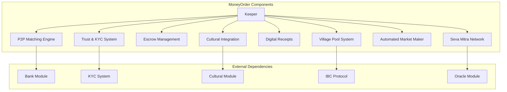
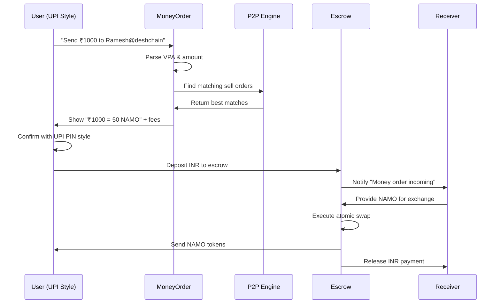
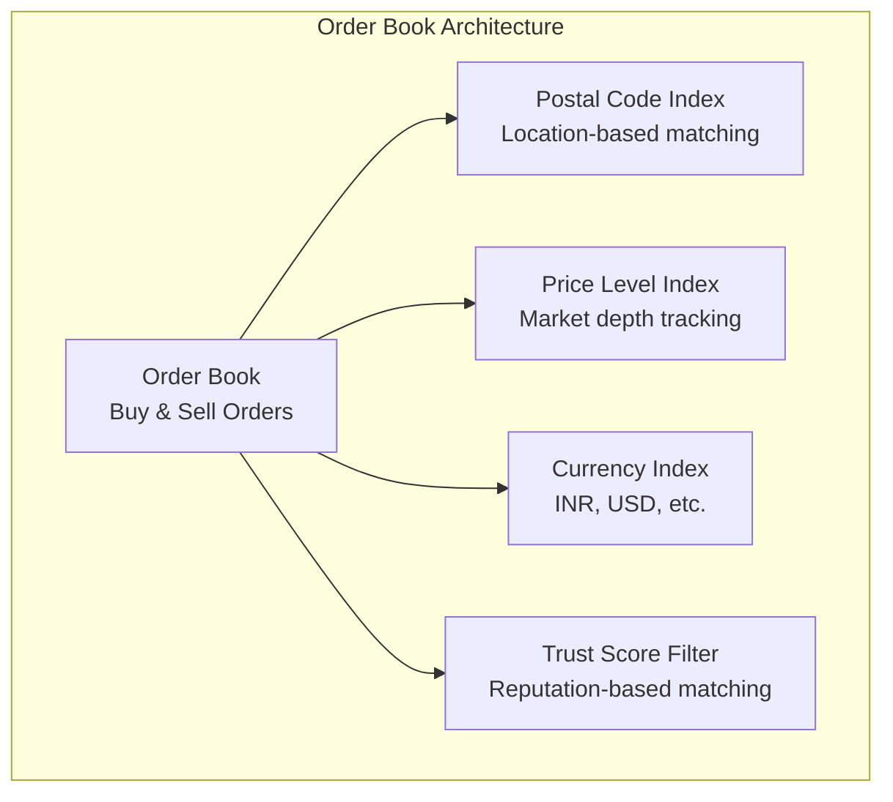
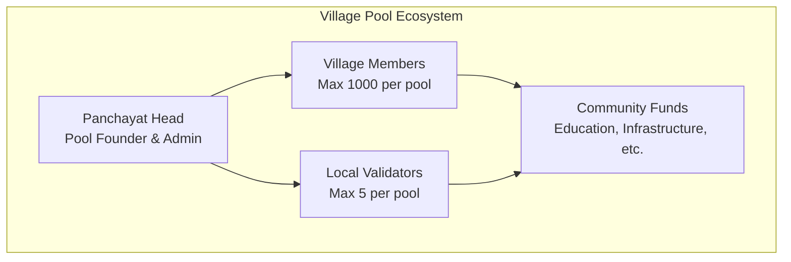
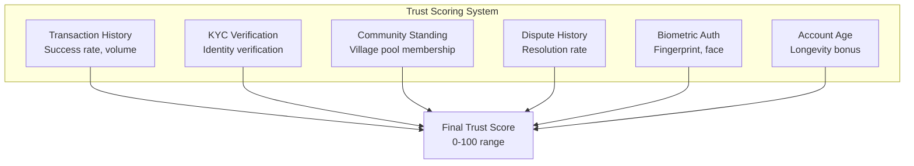
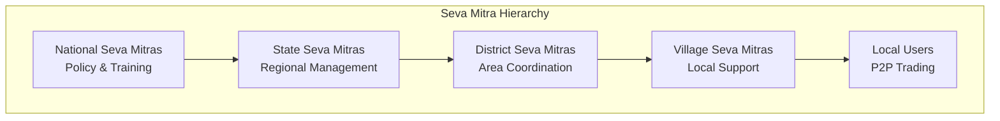

# MoneyOrder Module Documentation

## Overview

The MoneyOrder module creates DeshChain's flagship P2P exchange system that reimagines traditional Indian money orders as a blockchain-powered local exchange network. It combines the familiar UPI-style interface with advanced DEX functionality, community pools, trust scoring, and cultural integration to enable secure NAMO-to-fiat trading across India's postal network.

## Module Architecture



## UPI-Style User Experience

### 1. Simplified Money Order Interface

DeshChain Money Orders mirror the familiar UPI experience while providing powerful DEX functionality:



### 2. Digital Receipt System

Every transaction generates a traditional money order style receipt with modern features:

```go
type MoneyOrderReceipt struct {
    // Traditional Fields (like postal money orders)
    OrderId          string         // Unique transaction ID
    ReferenceNumber  string         // MO-2024-DEL-001234
    TransactionType  string         // "instant", "normal", "scheduled"
    
    // Sender Details (भेजने वाला)
    SenderAddress    sdk.AccAddress
    SenderName       string
    SenderMobile     string
    SenderPostalCode string
    
    // Receiver Details (प्राप्तकर्ता)
    ReceiverAddress    sdk.AccAddress
    ReceiverName       string
    ReceiverMobile     string
    ReceiverPostalCode string
    
    // Transaction Details (लेनदेन विवरण)
    Amount           sdk.Coin       // NAMO amount
    Fees             sdk.Coin       // Transaction fees
    TotalAmount      sdk.Coin       // Total including fees
    ExchangeRate     sdk.Dec        // INR/NAMO rate
    
    // UPI-Style Features
    Note             string         // Personal message "Beta ke liye"
    Purpose          string         // "family", "business", "emergency"
    
    // Cultural Integration
    CulturalQuote    string         // Relevant quote
    FestivalGreeting string         // Seasonal greetings
    Language         string         // Regional language
    
    // Digital Features
    QRCode           string         // QR for tracking
    TrackingURL      string         // Web tracking
    SMSNotification  bool
    EmailNotification bool
    
    // Timestamps
    CreatedAt        time.Time
    ProcessedAt      time.Time
    CompletedAt      time.Time
    ExpiresAt        time.Time
}
```

### 3. Virtual Payment Addresses (VPA)

Enable UPI-style addressing for easy transfers:

```go
type VirtualPaymentAddress struct {
    VPA              string         // ramesh@deshchain
    LinkedAddress    sdk.AccAddress // Blockchain address
    DisplayName      string         // "Ramesh Kumar"
    ProfilePicture   string         // IPFS hash
    VerifiedMerchant bool          // Business verification
    CreatedAt        time.Time
}

// VPA formats
// Personal: name@deshchain (ramesh@deshchain)
// Mobile: mobile@deshchain (9876543210@deshchain)
// Business: business.name@deshchain (shop.kumar@deshchain)
```

## P2P Matching Engine

### 1. Advanced Order Book System

The MoneyOrder module implements a sophisticated order matching system:



### 2. Multi-Dimensional Matching Algorithm

Orders are scored on 8 key factors:

```go
type MatchingEngine struct {
    keeper    *Keeper
    orderBook *OrderBook
    
    // Matching Parameters
    maxDistanceKm      int32    // 50km default radius
    minTrustScore      int32    // 50 minimum trust score
    maxPriceDeviation  sdk.Dec  // 5% price tolerance
    languageBonus      float64  // 10% bonus for common language
    paymentMethodBonus float64  // 15% bonus for compatible payment
}

// Advanced match scoring (0-200 points)
func (me *MatchingEngine) calculateAdvancedMatchScore(order1, order2 *P2POrder) float64 {
    score := 100.0 // Base score
    
    // 1. Distance Score (0-30 points)
    distance := me.calculateDistance(order1.PostalCode, order2.PostalCode)
    distanceScore := me.calculateDistanceScore(distance, maxDistance)
    score += distanceScore * 30
    
    // 2. Price Match Score (0-25 points) 
    priceScore := me.calculatePriceMatch(order1, order2)
    score += priceScore * 25
    
    // 3. Trust Score (0-20 points)
    avgTrust := (getUserTrust(order1.Creator) + getUserTrust(order2.Creator)) / 2
    score += (avgTrust / 100.0) * 20
    
    // 4. Payment Method Compatibility (0-15 points)
    paymentScore := me.calculatePaymentMethodScore(order1, order2)
    score += paymentScore * 15
    
    // 5. Language Compatibility (0-10 points)
    if hasCommonLanguage(order1.Languages, order2.Languages) {
        score += 10
    }
    
    // 6. Time Priority (0-10 points) - Older orders first
    ageHours := time.Since(order2.CreatedAt).Hours()
    timeBonus := math.Min(ageHours*0.5, 10)
    score += timeBonus
    
    // 7. Volume Bonus (0-10 points) - Larger orders
    volumeBonus := math.Log10(avgVolume) * 2
    score += volumeBonus
    
    // 8. User History Bonus (0-10 points)
    if completionRate > 0.9 && totalTrades > 10 {
        score += 10
    }
    
    return score
}
```

### 3. Indian Postal Code Distance Calculation

Leverages Indian postal code structure for accurate distance estimation:

```go
func (me *MatchingEngine) calculateDistance(pincode1, pincode2 string) float64 {
    // Indian postal code structure:
    // First digit: region/zone (1=Delhi, 2=Punjab, etc.)
    // First 2 digits: sub-region
    // First 3 digits: sorting district  
    // Last 3 digits: specific post office
    
    if pincode1 == pincode2 {
        return 0 // Same post office
    }
    
    if pincode1[:3] == pincode2[:3] {
        return 5.0 // Same sorting district (~5km)
    }
    
    if pincode1[:2] == pincode2[:2] {
        return 25.0 // Same sub-region (~25km)
    }
    
    if pincode1[0] == pincode2[0] {
        return 100.0 // Same region (~100km)
    }
    
    return 500.0 // Different regions (~500km)
}
```

## Village Pool System

### 1. Community-Managed Liquidity Pools

Village pools enable community-driven liquidity provision with local governance:



### 2. Village Pool Structure

```go
type VillagePool struct {
    PoolId            uint64         // Unique pool identifier
    VillageName       string         // "Ramgarh Village"
    PostalCode        string         // "110001"
    StateCode         string         // "DL" for Delhi
    DistrictCode      string         // "Central Delhi"
    PanchayatHead     sdk.AccAddress // Pool admin
    
    // Pool Status
    Active            bool           // Pool operational status
    Verified          bool           // Government verification
    TotalMembers      uint64         // Current member count
    
    // Financial Data
    TotalLiquidity    sdk.Coins      // Total pool liquidity
    CommunityFund     sdk.Coin       // Community development fund
    EducationFund     sdk.Coin       // Education fund
    
    // Local Governance
    LocalValidators   []LocalValidator // Community validators
    VillageMitras     []VillageMitra   // Local facilitators
    Achievements      []VillageAchievement // Community milestones
    
    // Metrics
    TotalTransactions uint64         // Lifetime transactions
    TotalVolume      sdk.Int         // Lifetime trading volume
    AverageRating    sdk.Dec         // Community rating
    TrustScore       int32           // Pool trust score
    
    CreatedAt        time.Time
    LastActivityDate time.Time
}
```

### 3. Village Pool Benefits

Members enjoy significant benefits:

- **50% Fee Discount**: Lower transaction costs for community members
- **Priority Matching**: Orders matched within village first
- **Shared Rewards**: Fee distribution to liquidity providers
- **Community Funds**: Automatic allocation to local development
- **Trust Bonus**: Higher trust scores for verified community members

### 4. Community Fund Distribution

```go
func (pool *VillagePool) DistributeFees(fees sdk.Coin) map[string]sdk.Coin {
    distribution := make(map[string]sdk.Coin)
    
    // 30% to community development fund
    communityShare := fees.Amount.Mul(sdk.NewInt(30)).Quo(sdk.NewInt(100))
    distribution["community"] = sdk.NewCoin(fees.Denom, communityShare)
    
    // 20% to education fund  
    educationShare := fees.Amount.Mul(sdk.NewInt(20)).Quo(sdk.NewInt(100))
    distribution["education"] = sdk.NewCoin(fees.Denom, educationShare)
    
    // 20% to infrastructure fund
    infraShare := fees.Amount.Mul(sdk.NewInt(20)).Quo(sdk.NewInt(100))
    distribution["infrastructure"] = sdk.NewCoin(fees.Denom, infraShare)
    
    // 30% to liquidity providers
    lpShare := fees.Amount.Mul(sdk.NewInt(30)).Quo(sdk.NewInt(100))
    distribution["liquidity_providers"] = sdk.NewCoin(fees.Denom, lpShare)
    
    return distribution
}
```

## Trust & KYC System

### 1. Multi-Layer Trust Framework



### 2. Trust Score Calculation

```go
type UserTrustScore struct {
    BaseScore         int32   // 0-100
    TransactionHistory int32  // +30 for perfect completion rate
    KYCVerification   int32   // +20 for full KYC
    CommunityStanding int32   // +15 for village pool membership
    DisputeHistory    int32   // -20 for lost disputes
    BiometricAuth     int32   // +10 for biometric setup
    AccountAge        int32   // +5 for accounts >1 year
    
    TotalScore        int32   // Final computed score
    LastUpdated       time.Time
}

func CalculateTrustScore(user UserStats, kycLevel int32, 
    communityMember bool, biometricEnabled bool) int32 {
    
    score := int32(50) // Base score
    
    // Transaction history (0-30 points)
    if user.TotalTrades > 0 {
        completionRate := float64(user.SuccessfulTrades) / float64(user.TotalTrades)
        score += int32(completionRate * 30)
    }
    
    // KYC verification (0-20 points)
    score += kycLevel * 4 // 5 KYC levels * 4 points each
    
    // Community membership (0-15 points)
    if communityMember {
        score += 15
    }
    
    // Dispute penalties
    score -= user.DisputesLost * 10
    
    // Biometric bonus
    if biometricEnabled {
        score += 10
    }
    
    // Account age bonus
    ageBonus := int32(math.Min(float64(user.AccountAgeDays/365*5), 5))
    score += ageBonus
    
    // Clamp to 0-100 range
    if score < 0 {
        score = 0
    }
    if score > 100 {
        score = 100
    }
    
    return score
}
```

### 3. KYC Integration

Five-tier KYC system for different transaction limits:

```go
const (
    KYCLevel0 = "none"        // ₹10,000/month limit
    KYCLevel1 = "mobile"      // ₹50,000/month - Mobile OTP
    KYCLevel2 = "email"       // ₹1,00,000/month - Email verification  
    KYCLevel3 = "documents"   // ₹5,00,000/month - ID documents
    KYCLevel4 = "biometric"   // ₹10,00,000/month - Biometric verification
    KYCLevel5 = "full"        // Unlimited - Full KYC with bank account
)
```

## Seva Mitra Network

### 1. Community Facilitator System

Seva Mitras act as local facilitators and dispute resolvers:



### 2. Seva Mitra Responsibilities

- **User Onboarding**: Help new users set up wallets and complete KYC
- **Dispute Resolution**: Mediate disputes between trading parties
- **Community Building**: Organize village pools and local events
- **Education**: Conduct blockchain literacy programs
- **Trust Building**: Verify community members and build local trust

### 3. Seva Mitra Incentives

```go
type SevaMitraRewards struct {
    OnboardingBonus    sdk.Coin   // 100 NAMO per new user
    DisputeResolution  sdk.Coin   // 500 NAMO per resolved dispute
    CommunityBuilding  sdk.Coin   // 1000 NAMO per village pool created
    MonthlyStipend     sdk.Coin   // 5000 NAMO monthly for active mitras
    PerformanceBonus   sdk.Coin   // Based on community metrics
}
```

## Cultural Integration

### 1. Festival-Themed Features

MoneyOrder celebrates Indian culture with festival-specific features:

```go
type FestivalIntegration struct {
    CurrentFestival    string     // "Diwali", "Eid", "Christmas"
    FestivalGreeting   string     // "शुभ दीपावली!" 
    SpecialOffers      []Offer    // Reduced fees, bonus rewards
    CulturalQuotes     []Quote    // Relevant quotes/shlokas
    FestivalTheme      Theme      // UI colors and decorations
    GiftingFeatures    []Feature  // Easy gifting options
}

// Festival-specific benefits
type FestivalOffer struct {
    FestivalName       string     // "Diwali"
    DiscountPercentage int32      // 25% fee discount
    BonusRewards       sdk.Coin   // Extra NAMO rewards
    ValidityPeriod     time.Duration // 7 days
    EligibilityCriteria []string  // Community membership, etc.
}
```

### 2. Cultural Quote Integration

Each transaction includes relevant cultural context:

```go
type CulturalQuote struct {
    QuoteId     uint64
    Text        string // Sanskrit/Hindi quote
    Translation string // English translation
    Author      string // Sage/Scripture source
    Context     string // When to use
    Category    string // "generosity", "prosperity", etc.
    Language    string // Original language
}

// Examples
var DiwaliQuotes = []CulturalQuote{
    {
        Text:        "यस्मिन् रुष्टे गुरुर्राज्यं यस्मिन् तुष्टे धनागमः",
        Translation: "Prosperity comes to those who please the Divine",
        Context:     "Diwali money transfers",
        Category:    "prosperity",
    },
}
```

## Transaction Types

### 1. MsgCreateP2POrder
Create a new P2P buy/sell order.

```go
type MsgCreateP2POrder struct {
    Creator          string          // Order creator
    OrderType        OrderType       // BUY_NAMO or SELL_NAMO
    Amount          sdk.Coin        // NAMO amount
    FiatAmount      sdk.Coin        // Fiat currency amount  
    FiatCurrency    string          // "INR", "USD", etc.
    PaymentMethods  []PaymentMethod // UPI, IMPS, NEFT, etc.
    PostalCode      string          // Location for matching
    District        string          // District name
    State           string          // State name
    MaxDistanceKm   int32          // Maximum distance for matches
    MinTrustScore   int32          // Minimum counterparty trust
    RequireKyc      bool           // Require KYC verification
    ExpiryHours     int32          // Order validity period
    PreferredLanguages []string    // Hindi, English, etc.
    Notes           string         // Additional instructions
}
```

### 2. MsgAcceptP2PMatch
Accept a matched P2P order.

```go
type MsgAcceptP2PMatch struct {
    Acceptor        string   // User accepting the match
    OrderId         string   // Original order ID
    MatchOrderId    string   // Matched order ID
    Amount          sdk.Coin // Amount to trade
    PaymentMethod   PaymentMethod // Selected payment method
    ExpectedCompletionTime int64  // When payment will be made
}
```

### 3. MsgCreateVillagePool
Create a new village liquidity pool.

```go
type MsgCreateVillagePool struct {
    Creator           string            // Panchayat head address
    VillageName       string            // Village name
    PostalCode        string            // Village postal code
    StateCode         string            // State code
    DistrictCode      string            // District code
    InitialLiquidity  sdk.Coins         // Initial NAMO liquidity
    LocalValidators   []string          // Local validator addresses
}
```

## Query Endpoints

### 1. QueryActiveOrders
Get active P2P orders with filtering.

**Request**: `/deshchain/moneyorder/v1/orders?type=buy&location=110001&currency=INR&limit=20`

**Response**:
```json
{
  "orders": [
    {
      "order_id": "MO-2024-001234",
      "order_type": "BUY_NAMO",
      "amount": "1000000000 unamo",
      "fiat_amount": "50000 inr", 
      "exchange_rate": "50.0",
      "payment_methods": ["UPI", "IMPS"],
      "postal_code": "110001",
      "district": "Central Delhi",
      "state": "Delhi",
      "trust_score": 85,
      "expires_at": "2024-07-26T10:30:00Z"
    }
  ],
  "total": 1
}
```

### 2. QueryOrderMatches
Get potential matches for an order.

**Request**: `/deshchain/moneyorder/v1/matches/{order_id}?limit=10`

**Response**:
```json
{
  "matches": [
    {
      "order_id": "MO-2024-001235",
      "match_score": 95.5,
      "distance_km": 2.5,
      "price_match": 98.2,
      "trust_score": 92,
      "payment_compatibility": ["UPI"],
      "estimated_completion": "15 minutes"
    }
  ]
}
```

### 3. QueryVillagePool
Get village pool information.

**Request**: `/deshchain/moneyorder/v1/village/{postal_code}`

**Response**:
```json
{
  "village_pool": {
    "pool_id": 1,
    "village_name": "Ramgarh Village",
    "postal_code": "110001",
    "total_members": 156,
    "total_liquidity": "50000000000 unamo",
    "community_fund": "5000000000 unamo", 
    "education_fund": "2000000000 unamo",
    "verified": true,
    "trust_score": 88,
    "member_benefits": {
      "fee_discount": "50%",
      "priority_matching": true,
      "reward_sharing": true
    }
  }
}
```

### 4. QueryUserTrustScore
Get user's trust score and history.

**Request**: `/deshchain/moneyorder/v1/trust/{address}`

**Response**:
```json
{
  "trust_score": {
    "total_score": 85,
    "transaction_history": 28,
    "kyc_verification": 20,
    "community_standing": 15,
    "dispute_history": -3,
    "biometric_auth": 10,
    "account_age": 5,
    "last_updated": "2024-07-25T10:30:00Z"
  },
  "user_stats": {
    "total_trades": 47,
    "successful_trades": 46,
    "completion_rate": 97.9,
    "total_volume": "2500000000 unamo",
    "disputes_won": 1,
    "disputes_lost": 0
  }
}
```

## Events

### 1. P2P Order Events
```json
{
  "type": "p2p_order_created",
  "attributes": [
    {"key": "order_id", "value": "MO-2024-001234"},
    {"key": "creator", "value": "deshchain1..."},
    {"key": "order_type", "value": "BUY_NAMO"},
    {"key": "amount", "value": "1000000000 unamo"},
    {"key": "fiat_amount", "value": "50000 inr"},
    {"key": "postal_code", "value": "110001"}
  ]
}
```

### 2. Village Pool Events
```json
{
  "type": "village_pool_created",
  "attributes": [
    {"key": "pool_id", "value": "1"},
    {"key": "village_name", "value": "Ramgarh Village"},
    {"key": "postal_code", "value": "110001"},
    {"key": "panchayat_head", "value": "deshchain1..."},
    {"key": "initial_liquidity", "value": "50000000000 unamo"}
  ]
}
```

## Best Practices

### For Traders
1. **Complete KYC**: Higher KYC levels enable larger transactions
2. **Join Village Pools**: 50% fee discount and priority matching
3. **Build Trust Score**: Consistent successful trades improve matching
4. **Use Multiple Payment Methods**: Increases matching opportunities
5. **Set Reasonable Distances**: Balance convenience with matching options

### For Village Pool Operators
1. **Verify Members**: Ensure community authenticity
2. **Encourage Participation**: Active pools get better benefits
3. **Manage Disputes**: Quick resolution builds pool reputation
4. **Utilize Funds**: Use community funds for local development
5. **Engage Seva Mitras**: Leverage local facilitators

### For Developers
1. **Implement Escrow**: Always use secure escrow for trades
2. **Monitor Trust Scores**: Integrate trust scoring in matching logic
3. **Cultural Sensitivity**: Respect local customs and languages
4. **Mobile Optimization**: Design for mobile-first experience
5. **Offline Capability**: Plan for low connectivity scenarios

## CLI Commands

### Query Commands
```bash
# View active orders
deshchaind query moneyorder orders --type buy --location 110001

# Check order matches
deshchaind query moneyorder matches [order-id] --limit 10

# View village pool
deshchaind query moneyorder village [postal-code]

# Check trust score
deshchaind query moneyorder trust [address]

# View receipt
deshchaind query moneyorder receipt [order-id]
```

### Transaction Commands
```bash
# Create P2P order
deshchaind tx moneyorder create-order \
  --type buy \
  --amount 1000000000unamo \
  --fiat-amount 50000inr \
  --payment-methods "UPI,IMPS" \
  --postal-code 110001 \
  --max-distance 25 \
  --from [key]

# Accept order match
deshchaind tx moneyorder accept-match \
  --order-id MO-2024-001234 \
  --match-order-id MO-2024-001235 \
  --payment-method UPI \
  --from [key]

# Create village pool
deshchaind tx moneyorder create-village-pool \
  --village-name "Ramgarh Village" \
  --postal-code 110001 \
  --initial-liquidity 50000000000unamo \
  --from [panchayat-head-key]

# Join village pool
deshchaind tx moneyorder join-village-pool \
  --pool-id 1 \
  --local-name "Ramesh Kumar" \
  --initial-deposit 1000000000unamo \
  --from [key]
```

## Integration Examples

### UPI-Style Money Transfer
```javascript
import { MoneyOrderClient } from '@deshchain/moneyorder-sdk'

async function sendMoneyUPIStyle() {
  const client = new MoneyOrderClient(rpcEndpoint)
  
  // UPI-style transfer
  const transfer = await client.sendMoney({
    receiverVPA: 'ramesh@deshchain',
    amount: '1000', // ₹1000 in simple format
    note: 'Beta ke liye paisa', // Personal message
    purpose: 'family'
  })
  
  console.log(`Order ID: ${transfer.orderId}`)
  console.log(`Reference: ${transfer.referenceNumber}`)
  console.log(`Tracking: ${transfer.trackingURL}`)
  
  // Cultural quote included automatically
  console.log(`Quote: ${transfer.culturalQuote}`)
}
```

### Village Pool Management
```javascript
async function manageVillagePool() {
  const client = new MoneyOrderClient(rpcEndpoint)
  
  // Create village pool (Panchayat Head)
  const pool = await client.createVillagePool({
    villageName: 'Ramgarh Village',
    postalCode: '110001',
    initialLiquidity: { denom: 'unamo', amount: '50000000000' }
  })
  
  // Join as community member
  await client.joinVillagePool({
    poolId: pool.poolId,
    localName: 'Ramesh Kumar',
    mobileNumber: '+919876543210',
    initialDeposit: { denom: 'unamo', amount: '1000000000' }
  })
  
  // Check member benefits
  const benefits = await client.getVillagePoolBenefits(pool.poolId)
  console.log(`Fee discount: ${benefits.feeDiscount}`)
  console.log(`Priority matching: ${benefits.priorityMatching}`)
}
```

## FAQ

**Q: How does MoneyOrder differ from traditional DEX platforms?**
A: MoneyOrder combines familiar UPI-style interface with location-based matching, community pools, trust scoring, and cultural integration specifically for the Indian market.

**Q: What are the benefits of joining a village pool?**
A: 50% fee discount, priority order matching, reward sharing, community fund participation, and higher trust scores.

**Q: How is user trust calculated?**
A: Trust score (0-100) based on transaction history, KYC level, community membership, dispute record, biometric auth, and account age.

**Q: What payment methods are supported?**
A: UPI, IMPS, NEFT, RTGS, bank transfers, and various digital wallet providers across India.

**Q: How does cultural integration work?**
A: Each transaction includes relevant cultural quotes, festival greetings, regional language support, and seasonal themes.

**Q: What is the role of Seva Mitras?**
A: Local facilitators who help with user onboarding, dispute resolution, community building, and blockchain education.

---

For more information, see the [Module Overview](../MODULE_OVERVIEW.md) or explore other [DeshChain Modules](../MODULE_OVERVIEW.md#module-categories).