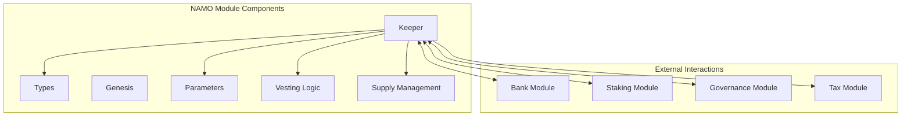
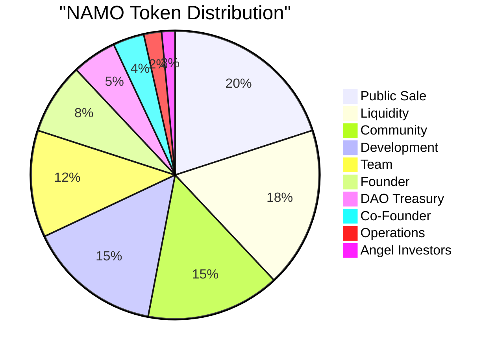
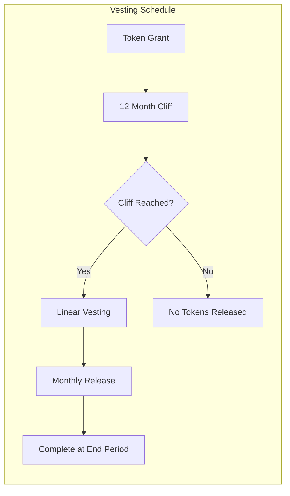
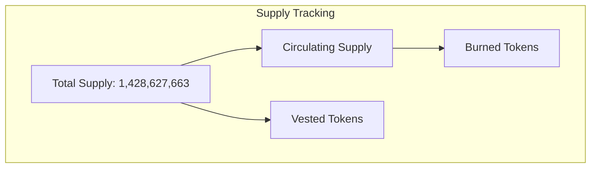

# NAMO Module Documentation

## Overview

The NAMO module is the core token module of DeshChain, managing the native NAMO token that powers the entire ecosystem. It handles token distribution, vesting schedules, burning mechanisms, and serves as the foundation for all economic activities on the chain.

## Module Architecture



## Token Economics

### Total Supply: 1,428,627,663 NAMO

### Distribution Model



| Allocation | Percentage | Amount | Vesting Schedule |
|------------|------------|--------|------------------|
| Public Sale | 20% | 285,725,533 | No vesting (immediate) |
| Liquidity | 18% | 257,152,979 | No vesting (locked in pools) |
| Community | 15% | 214,294,149 | 60-month distribution |
| Development | 15% | 214,294,149 | As per milestones |
| Team | 12% | 171,435,319 | 24-month vesting, 12-month cliff |
| Founder | 8% | 114,290,213 | 48-month vesting, 12-month cliff |
| DAO Treasury | 5% | 71,431,383 | Governance controlled |
| Co-Founder | 3.5% | 50,001,968 | 24-month vesting, 12-month cliff |
| Operations | 2% | 28,572,553 | Monthly unlock over 24 months |
| Angel Investors | 1.5% | 21,428,900 | 24-month vesting, 12-month cliff |

## Module Parameters

```go
type Params struct {
    TokenDenom      string   // Token denomination (default: "namo")
    EnableVesting   bool     // Enable/disable vesting functionality
    EnableBurning   bool     // Enable/disable token burning
    MinBurnAmount   sdk.Int  // Minimum amount for burn transactions (1 NAMO)
}
```

## Key Features

### 1. Vesting Mechanism



**Universal 12-Month Cliff**: All vested allocations have a mandatory 12-month cliff period where no tokens are released.

**Vesting Periods**:
- Founder: 48 months total (12-month cliff + 36-month linear)
- Team/Co-Founder/Angel: 24 months total (12-month cliff + 12-month linear)

### 2. Token Burning

The module supports token burning with the following features:
- Minimum burn amount: 1 NAMO (1,000,000 unamo)
- Burns are permanent and reduce total supply
- Burn events are tracked on-chain
- Governance can enable/disable burning

### 3. Supply Management



## Module Accounts

The module manages 10 specialized accounts for different allocation pools:

1. **public_sale_pool** - Public sale tokens
2. **liquidity_pool** - DEX liquidity provision
3. **community_pool** - Community rewards and incentives
4. **development_pool** - Development funding
5. **team_pool** - Team allocation with vesting
6. **founder_pool** - Founder allocation with vesting
7. **dao_treasury_pool** - DAO-controlled treasury
8. **cofounder_pool** - Co-founder allocation with vesting
9. **operations_pool** - Operational expenses
10. **angel_pool** - Angel investor allocation with vesting

## Transaction Types

### 1. MsgCreateVestingAccount
Creates a new vesting account with specified schedule.

```go
type MsgCreateVestingAccount struct {
    FromAddress     string
    ToAddress       string
    Amount          sdk.Coins
    EndTime         int64
    CliffTime       int64
}
```

### 2. MsgBurnTokens
Burns tokens from the sender's account.

```go
type MsgBurnTokens struct {
    Sender  string
    Amount  sdk.Coin
}
```

### 3. MsgUpdateParams
Updates module parameters (governance only).

```go
type MsgUpdateParams struct {
    Authority string
    Params    Params
}
```

## Query Endpoints

### 1. QueryParams
Returns current module parameters.

**Request**: `/deshchain/namo/v1/params`

**Response**:
```json
{
  "params": {
    "token_denom": "namo",
    "enable_vesting": true,
    "enable_burning": true,
    "min_burn_amount": "1000000"
  }
}
```

### 2. QuerySupply
Returns current token supply information.

**Request**: `/deshchain/namo/v1/supply`

**Response**:
```json
{
  "total_supply": "1428627663000000",
  "circulating_supply": "285725533000000",
  "vested_supply": "1142902130000000",
  "burned_supply": "0"
}
```

### 3. QueryVestingAccount
Returns vesting information for an account.

**Request**: `/deshchain/namo/v1/vesting/{address}`

**Response**:
```json
{
  "address": "deshchain1...",
  "original_vesting": "114290213000000",
  "delegated_free": "0",
  "delegated_vesting": "0",
  "end_time": "1798761600",
  "cliff_time": "1735689600"
}
```

## Events

The module emits the following events:

### 1. Initial Distribution Event
```json
{
  "type": "initial_distribution",
  "attributes": [
    {"key": "recipient", "value": "{pool_name}"},
    {"key": "amount", "value": "{amount}"},
    {"key": "vesting", "value": "{true/false}"}
  ]
}
```

### 2. Vesting Claim Event
```json
{
  "type": "vesting_claim",
  "attributes": [
    {"key": "claimer", "value": "{address}"},
    {"key": "amount", "value": "{amount}"},
    {"key": "remaining_vesting", "value": "{amount}"}
  ]
}
```

### 3. Token Burn Event
```json
{
  "type": "token_burn",
  "attributes": [
    {"key": "burner", "value": "{address}"},
    {"key": "amount", "value": "{amount}"},
    {"key": "new_total_supply", "value": "{amount}"}
  ]
}
```

## Integration with Other Modules

### 1. Tax Module Integration
- All NAMO transfers are subject to the 2.5% transaction tax
- Tax is automatically deducted and distributed according to tax module rules

### 2. Governance Module Integration
- NAMO holdings determine voting power
- Vested tokens can participate in governance (if delegated)

### 3. Staking Module Integration
- NAMO is used for validator staking
- Staking rewards are distributed in NAMO

### 4. Bank Module Integration
- Leverages bank module for basic transfer operations
- Extends bank functionality with vesting and burning

## Security Considerations

1. **Vesting Security**
   - Vested tokens cannot be transferred until vesting conditions are met
   - Cliff periods are enforced at the protocol level
   - Vesting schedules are immutable once created

2. **Burn Protection**
   - Minimum burn amount prevents dust attacks
   - Burns require explicit user consent
   - Burned tokens are permanently removed from supply

3. **Parameter Updates**
   - Only governance can update module parameters
   - Parameter changes go through standard governance process
   - Critical parameters have validation rules

## Best Practices

1. **For Developers**
   - Always check vesting status before assuming token availability
   - Use proper denomination conversions (1 NAMO = 1,000,000 unamo)
   - Subscribe to module events for real-time updates

2. **For Validators**
   - Monitor token distribution events
   - Ensure proper staking of vested tokens
   - Track burn events for supply changes

3. **For Users**
   - Understand vesting schedules before accepting tokens
   - Be aware of minimum burn amounts
   - Check circulating vs total supply for market analysis

## Genesis Configuration

```json
{
  "params": {
    "token_denom": "namo",
    "enable_vesting": true,
    "enable_burning": true,
    "min_burn_amount": "1000000"
  },
  "initial_distribution": [
    {
      "pool_name": "public_sale_pool",
      "amount": "285725533000000",
      "vesting": false
    },
    {
      "pool_name": "founder_pool",
      "amount": "114290213000000",
      "vesting": true,
      "vesting_months": 48,
      "cliff_months": 12
    }
    // ... other allocations
  ]
}
```

## CLI Commands

### Query Commands
```bash
# Query module parameters
deshchaind query namo params

# Query token supply
deshchaind query namo supply

# Query vesting account
deshchaind query namo vesting [address]
```

### Transaction Commands
```bash
# Burn tokens
deshchaind tx namo burn [amount] --from [key]

# Create vesting account (governance only)
deshchaind tx namo create-vesting-account [to_address] [amount] [end_time] [cliff_time] --from [key]
```

## FAQ

**Q: Can vested tokens be staked?**
A: Yes, vested tokens can be staked and earn rewards, but they remain locked until vesting conditions are met.

**Q: What happens to burned tokens?**
A: Burned tokens are permanently removed from the total supply and cannot be recovered.

**Q: Can vesting schedules be modified?**
A: No, once created, vesting schedules are immutable to ensure token holder protection.

**Q: How is the 12-month cliff enforced?**
A: The cliff is enforced at the protocol level. No tokens can be withdrawn before the cliff period ends.

---

For more information, see the [Module Overview](../MODULE_OVERVIEW.md) or explore other [DeshChain Modules](../MODULE_OVERVIEW.md#module-categories).