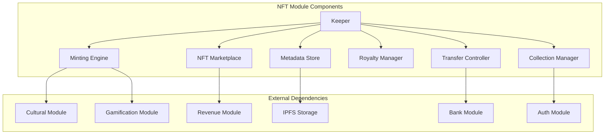
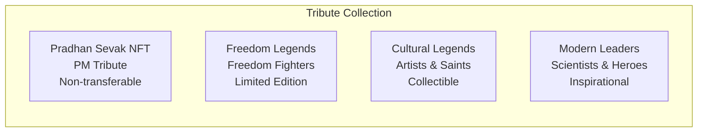
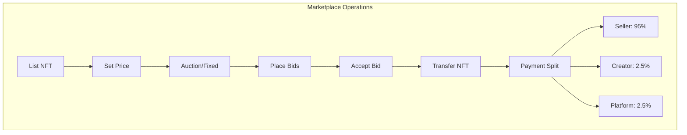
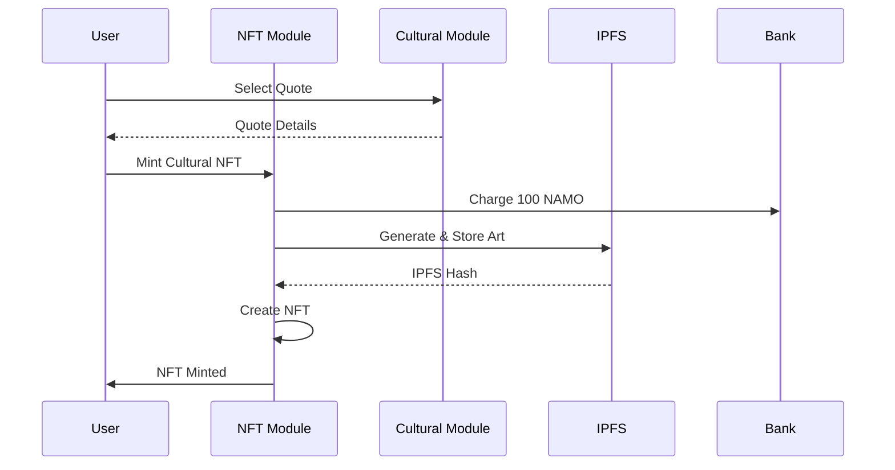

# NFT Module Documentation

## Overview

The NFT module implements DeshChain's non-fungible token system with special focus on cultural preservation, achievement recognition, and tribute collections. It features unique non-transferable tribute NFTs, cultural quote NFTs, achievement-based collectibles, and a marketplace with royalty distribution, all designed to preserve and celebrate Indian heritage on blockchain.

## Module Architecture



## NFT Categories

### 1. Special Tribute NFTs



### 2. Pradhan Sevak NFT (Genesis NFT)

```go
type PradhanSevakNFT struct {
    TokenID         string          // "PRADHAN-SEVAK-001"
    Name            string          // "Pradhan Sevak - Principal Servant"
    TributeTo       string          // "Shri Narendra Modi Ji"
    
    // Cultural Content
    Quotes          []CulturalQuote // 1000+ quotes
    Languages       []string        // 22 Indian languages
    
    // Royalty Configuration
    RoyaltyEnabled  bool            // true
    RoyaltyPercent  sdk.Dec         // 0.01% to PM CARES
    RoyaltyRecipient string         // "PM CARES Fund"
    
    // Special Properties
    Transferable    bool            // false - Cannot be transferred
    Burnable        bool            // false - Cannot be burned
    Mutable         bool            // false - Cannot be modified
    
    // Genesis Block Special
    MintedInGenesis bool            // true
    PresentedTo     string          // "PMO India"
}
```

### 3. Cultural Quote NFTs

```go
type CulturalNFT struct {
    TokenID         string
    QuoteID         uint64          // Links to cultural module
    
    // NFT Metadata
    Title           string          // Quote excerpt
    Description     string          // Full quote with context
    Author          string          // Quote author
    Language        string          // Original language
    
    // Visual Representation
    ImageURI        string          // IPFS hash of artistic rendering
    AnimationURI    string          // Optional animation
    
    // Cultural Attributes
    Category        string          // Wisdom, Patriotism, etc.
    HistoricalPeriod string         // Ancient, Medieval, Modern
    Region          string          // Regional origin
    Significance    int32           // Cultural importance (1-10)
    
    // Minting Details
    Creator         string          // Who minted it
    MintTime        time.Time
    MintFee         sdk.Coin        // 100 NAMO
    Edition         int32           // Edition number
    MaxEditions     int32           // Total editions possible
    
    // Trading Properties
    Transferable    bool            // true
    ListPrice       sdk.Coin        // Current listing price
    RoyaltyRate     sdk.Dec         // 2.5% to creator
}
```

### 4. Achievement NFTs

```go
type AchievementNFT struct {
    TokenID         string
    AchievementID   string          // Links to gamification module
    
    // NFT Metadata
    Title           string          // "Code Ka Sachin"
    Description     string          // Achievement description
    Category        string          // Commits, Bugs, Features, etc.
    
    // Visual Design
    PosterStyle     string          // Bollywood movie poster style
    ImageURI        string          // IPFS hash
    Rarity          Rarity          // Common to Mythic
    SpecialEffects  []string        // Fire, stars, etc.
    
    // Achievement Data
    Developer       string          // Original achiever
    UnlockDate      time.Time
    Progress        string          // "1000/1000 commits"
    
    // Collection Properties
    SeriesName      string          // "DeshChain Legends Series 1"
    SeriesNumber    int32
    TotalInSeries   int32
    
    // Trading
    Transferable    bool            // true
    InitialPrice    sdk.Coin        // Based on rarity
}
```

## NFT Collections

### 1. Collection Structure

```go
type Collection struct {
    Denom           Denom           // Collection identifier
    NFTs            []NFT           // NFTs in collection
    
    // Collection Metadata
    Creator         string
    CreatedAt       time.Time
    TotalSupply     uint64
    
    // Collection Rules
    MintingRules    MintingRules
    TradingRules    TradingRules
    RoyaltyRules    RoyaltyRules
}

type Denom struct {
    ID              string          // Unique identifier
    Name            string          // Human-readable name
    Symbol          string          // Short symbol
    Description     string          // Detailed description
    URI             string          // Collection metadata URI
    
    // Permissions
    Creator         string          // Collection creator
    MintRestricted  bool            // Only creator can mint
    UpdateRestricted bool           // Only creator can update
}
```

### 2. Special Collections

```go
var SpecialCollections = []Collection{
    {
        ID: "tribute-collection",
        Name: "DeshChain Tribute Collection",
        Symbol: "TRIBUTE",
        Description: "Honoring leaders and legends of India",
        MintRestricted: true,           // Only governance can mint
    },
    {
        ID: "cultural-treasures",
        Name: "Bharat Cultural Treasures",
        Symbol: "CULTURE",
        Description: "Preserving Indian wisdom and heritage",
        MintRestricted: false,          // Anyone can mint quotes
    },
    {
        ID: "developer-legends",
        Name: "DeshChain Developer Legends",
        Symbol: "DEVLEGEND",
        Description: "Celebrating coding achievements Bollywood style",
        MintRestricted: false,          // Achievers can mint
    },
}
```

## Marketplace Features

### 1. Bharat Kala NFT Marketplace



### 2. Listing Types

```go
type Listing struct {
    NFT             NFTIdentifier
    Seller          string
    
    // Pricing Options
    ListingType     ListingType     // FIXED_PRICE, AUCTION, OFFER
    Price           sdk.Coin        // For fixed price
    MinBid          sdk.Coin        // For auction
    BuyNowPrice     sdk.Coin        // Optional instant buy
    
    // Timing
    StartTime       time.Time
    EndTime         time.Time       // For auctions
    
    // Status
    Active          bool
    HighestBid      Bid
    TotalBids       int32
}

type ListingType string

const (
    FIXED_PRICE     ListingType = "fixed_price"
    DUTCH_AUCTION   ListingType = "dutch_auction"
    ENGLISH_AUCTION ListingType = "english_auction"
    MAKE_OFFER      ListingType = "make_offer"
)
```

### 3. Royalty Distribution

```go
type RoyaltyConfig struct {
    // Standard Rates
    CreatorRoyalty  sdk.Dec         // 2.5% on secondary sales
    PlatformFee     sdk.Dec         // 2.5% marketplace fee
    
    // Special Royalties
    TributeRoyalty  RoyaltyRecipient // For tribute NFTs
    
    // Distribution
    AutoDistribute  bool            // Automatic distribution
    MinPayout       sdk.Coin        // Minimum for payout
}

type RoyaltyRecipient struct {
    Address         string
    Percentage      sdk.Dec
    Description     string          // "PM CARES Fund", etc.
}
```

## Minting Process

### 1. Cultural NFT Minting



### 2. Achievement NFT Minting

```go
func MintAchievementNFT(
    ctx sdk.Context,
    achievement Achievement,
    developer sdk.AccAddress,
) (*AchievementNFT, error) {
    // Generate movie poster
    poster := GenerateBollywoodPoster(achievement)
    
    // Upload to IPFS
    ipfsHash := ipfs.Upload(poster)
    
    // Create NFT
    nft := &AchievementNFT{
        TokenID:        GenerateTokenID(),
        AchievementID:  achievement.ID,
        Title:          achievement.Name,
        ImageURI:       ipfsHash,
        Developer:      developer.String(),
        Rarity:         achievement.Rarity,
        UnlockDate:     ctx.BlockTime(),
    }
    
    // Mint NFT
    return k.MintNFT(ctx, "developer-legends", nft)
}
```

## Module Parameters

```go
type Params struct {
    // Minting Configuration
    EnableNFTCreation       bool      // Global enable/disable
    CulturalNFTFee          sdk.Coin  // 100 NAMO
    AchievementNFTFee       sdk.Coin  // 50 NAMO
    TributeNFTRestricted    bool      // Only governance
    
    // Marketplace Configuration
    MarketplaceFeePercent   sdk.Dec   // 0.025 (2.5%)
    CreatorRoyaltyPercent   sdk.Dec   // 0.025 (2.5%)
    MinListingPrice         sdk.Coin  // 10 NAMO minimum
    MaxAuctionDuration      int64     // 2592000 (30 days)
    
    // Collection Limits
    MaxNFTsPerCollection    uint64    // 10000
    MaxCollectionsPerUser   uint32    // 10
    MaxEditionsPerNFT       uint32    // 1000
    
    // Transfer Rules
    TransferCooldown        int64     // 86400 (24 hours)
    MaxTransfersPerDay      uint32    // 10
    
    // Metadata
    MaxURILength            uint32    // 512 characters
    SupportedImageFormats   []string  // ["jpg", "png", "gif", "svg"]
    MaxMetadataSize         uint32    // 10KB
}
```

## Transaction Types

### 1. MsgMintNFT
Mint a new NFT.

```go
type MsgMintNFT struct {
    Creator         string
    CollectionID    string
    TokenID         string        // Optional, auto-generated if empty
    
    // NFT Data
    Name            string
    Description     string
    URI             string        // IPFS hash
    URIHash         string        // For verification
    
    // NFT Properties
    Data            string        // JSON metadata
    Transferable    bool
    
    // Payment
    MintingFee      sdk.Coin
}
```

### 2. MsgListNFT
List NFT on marketplace.

```go
type MsgListNFT struct {
    Seller          string
    CollectionID    string
    TokenID         string
    
    // Listing Configuration
    ListingType     ListingType
    Price           sdk.Coin      // Fixed price
    MinBid          sdk.Coin      // For auctions
    Duration        int64         // Listing duration
    
    // Options
    AcceptOffers    bool
    ReservePrice    sdk.Coin      // Hidden reserve
}
```

### 3. MsgBuyNFT
Buy listed NFT.

```go
type MsgBuyNFT struct {
    Buyer           string
    CollectionID    string
    TokenID         string
    OfferPrice      sdk.Coin      // For negotiation
}
```

### 4. MsgCreateCollection
Create new NFT collection.

```go
type MsgCreateCollection struct {
    Creator         string
    Name            string
    Symbol          string
    Description     string
    URI             string
    
    // Collection Rules
    MintRestricted  bool          // Only creator can mint
    MaxSupply       uint64        // 0 for unlimited
    RoyaltyRate     sdk.Dec       // Creator royalty
}
```

### 5. MsgTransferNFT
Transfer NFT ownership.

```go
type MsgTransferNFT struct {
    From            string
    To              string
    CollectionID    string
    TokenID         string
    
    // Optional message
    TransferMessage string
}
```

## Query Endpoints

### 1. QueryNFT
Get NFT details.

**Request**: `/deshchain/nft/v1/nft/{collection_id}/{token_id}`

**Response**:
```json
{
  "nft": {
    "collection_id": "cultural-treasures",
    "token_id": "CULTURE-001",
    "name": "Vivekananda Wisdom",
    "owner": "deshchain1...",
    "creator": "deshchain2...",
    "uri": "ipfs://...",
    "metadata": {
      "quote": "Arise, awake, and stop not till the goal is reached",
      "author": "Swami Vivekananda",
      "language": "en",
      "significance": 10
    },
    "transferable": true,
    "listed": true,
    "price": "1000 NAMO"
  }
}
```

### 2. QueryCollection
Get collection details.

**Request**: `/deshchain/nft/v1/collection/{collection_id}`

**Response**:
```json
{
  "collection": {
    "id": "developer-legends",
    "name": "DeshChain Developer Legends",
    "symbol": "DEVLEGEND",
    "creator": "deshchain1...",
    "total_supply": 1523,
    "description": "Celebrating coding achievements",
    "royalty_rate": "2.5%",
    "top_sale": "5000 NAMO"
  }
}
```

### 3. QueryMarketplace
Get marketplace listings.

**Request**: `/deshchain/nft/v1/marketplace?status=active&sort=price_low`

**Response**:
```json
{
  "listings": [
    {
      "nft_id": "CULTURE-042",
      "collection": "cultural-treasures",
      "name": "Gandhi's Truth",
      "seller": "deshchain1...",
      "price": "500 NAMO",
      "listing_type": "fixed_price",
      "ends_in": null,
      "bid_count": 0
    }
  ],
  "pagination": {
    "total": 234,
    "page": 1
  }
}
```

### 4. QueryUserNFTs
Get NFTs owned by user.

**Request**: `/deshchain/nft/v1/user/{address}/nfts`

**Response**:
```json
{
  "nfts": [
    {
      "collection_id": "tribute-collection",
      "token_id": "PRADHAN-SEVAK-001",
      "name": "Pradhan Sevak NFT",
      "transferable": false,
      "special": true
    },
    {
      "collection_id": "developer-legends",
      "token_id": "LEGEND-123",
      "name": "Code Ka Sachin",
      "listed": false,
      "earned_royalties": "50 NAMO"
    }
  ],
  "total_count": 15,
  "total_value": "25000 NAMO"
}
```

## Events

### 1. NFT Minted Event
```json
{
  "type": "nft_minted",
  "attributes": [
    {"key": "collection_id", "value": "cultural-treasures"},
    {"key": "token_id", "value": "CULTURE-100"},
    {"key": "minter", "value": "{address}"},
    {"key": "name", "value": "Tagore's Poetry"},
    {"key": "minting_fee", "value": "100 NAMO"}
  ]
}
```

### 2. NFT Listed Event
```json
{
  "type": "nft_listed",
  "attributes": [
    {"key": "collection_id", "value": "developer-legends"},
    {"key": "token_id", "value": "LEGEND-42"},
    {"key": "seller", "value": "{address}"},
    {"key": "price", "value": "1000 NAMO"},
    {"key": "listing_type", "value": "english_auction"}
  ]
}
```

### 3. NFT Sold Event
```json
{
  "type": "nft_sold",
  "attributes": [
    {"key": "collection_id", "value": "cultural-treasures"},
    {"key": "token_id", "value": "CULTURE-50"},
    {"key": "seller", "value": "{address}"},
    {"key": "buyer", "value": "{address}"},
    {"key": "price", "value": "2000 NAMO"},
    {"key": "creator_royalty", "value": "50 NAMO"},
    {"key": "platform_fee", "value": "50 NAMO"}
  ]
}
```

### 4. Collection Created Event
```json
{
  "type": "collection_created",
  "attributes": [
    {"key": "collection_id", "value": "artist-series-1"},
    {"key": "creator", "value": "{address}"},
    {"key": "name", "value": "Traditional Art Series"},
    {"key": "max_supply", "value": "1000"}
  ]
}
```

## Special NFT Features

### 1. Non-Transferable NFTs

```go
// Used for special recognition and tributes
type NonTransferableNFT interface {
    SetTransferable(false)
    SetBurnable(false)
    BindToOwner(owner sdk.AccAddress)
}
```

### 2. Dynamic NFTs

```go
// NFTs that can evolve based on conditions
type DynamicNFT struct {
    BaseNFT
    
    // Evolution Conditions
    LevelUpConditions   []Condition
    CurrentLevel        int32
    
    // Dynamic Attributes
    EvolvingAttributes  map[string]interface{}
    LastUpdateTime      time.Time
}
```

### 3. Fractional NFTs

```go
// For high-value NFTs that can be fractionally owned
type FractionalNFT struct {
    BaseNFT
    
    TotalShares         uint64
    SharesIssued        uint64
    SharePrice          sdk.Coin
    ShareHolders        map[string]uint64
}
```

## Integration Benefits

### 1. With Cultural Module
- Direct minting of cultural quotes
- Preservation of heritage
- Multi-language support
- Educational value

### 2. With Gamification Module
- Achievement-based NFTs
- Bollywood-style collectibles
- Social proof
- Developer recognition

### 3. With Revenue Module
- Marketplace fee collection
- Royalty distribution
- Platform sustainability
- Creator economy

## Best Practices

### For Collectors
1. **Verify Authenticity**: Check collection creator
2. **Understand Royalties**: Factor in resale fees
3. **Check Transferability**: Some NFTs can't be traded
4. **Store Safely**: Use secure wallets
5. **Research Rarity**: Understand edition sizes

### For Creators
1. **Quality Content**: High-resolution images
2. **Clear Metadata**: Accurate descriptions
3. **Fair Pricing**: Market-based pricing
4. **Engage Community**: Build collector base
5. **Regular Drops**: Maintain interest

### For Traders
1. **Due Diligence**: Research before buying
2. **Price History**: Check past sales
3. **Liquidity**: Consider demand
4. **Royalty Impact**: Calculate net returns
5. **Tax Planning**: NFT tax implications

## CLI Commands

### Query Commands
```bash
# Query specific NFT
deshchaind query nft nft [collection-id] [token-id]

# View collection
deshchaind query nft collection [collection-id]

# Browse marketplace
deshchaind query nft marketplace --status active --min-price 100

# Check user's NFTs
deshchaind query nft user-nfts [address]

# View royalty info
deshchaind query nft royalties [collection-id]
```

### Transaction Commands
```bash
# Mint NFT
deshchaind tx nft mint \
  --collection [id] \
  --name "..." \
  --uri "ipfs://..." \
  --from [key]

# Create collection
deshchaind tx nft create-collection \
  --name "..." \
  --symbol "..." \
  --royalty "2.5" \
  --from [key]

# List NFT for sale
deshchaind tx nft list \
  --collection [id] \
  --token [id] \
  --price "1000namo" \
  --from [key]

# Buy NFT
deshchaind tx nft buy \
  --collection [id] \
  --token [id] \
  --from [key]

# Transfer NFT
deshchaind tx nft transfer \
  --collection [id] \
  --token [id] \
  --to [address] \
  --from [key]
```

## FAQ

**Q: What makes Pradhan Sevak NFT special?**
A: It's a unique tribute NFT minted in genesis block, non-transferable, with royalties going to PM CARES Fund.

**Q: Can I create my own NFT collection?**
A: Yes, anyone can create collections with customizable rules and royalty rates.

**Q: How are cultural NFTs different?**
A: They preserve Indian heritage, require 100 NAMO to mint, and support multiple languages.

**Q: Do all NFTs have royalties?**
A: Most do (2.5% standard), but creators can set custom rates or disable royalties.

**Q: Can achievement NFTs be traded?**
A: Yes, achievement NFTs from gamification module can be traded as collectibles.

---

For more information, see the [Module Overview](../MODULE_OVERVIEW.md) or explore other [DeshChain Modules](../MODULE_OVERVIEW.md#module-categories).