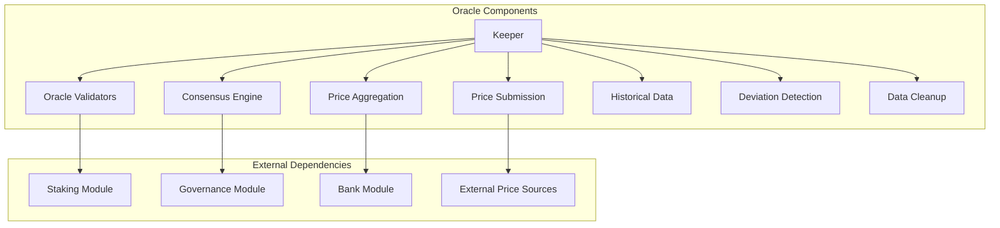
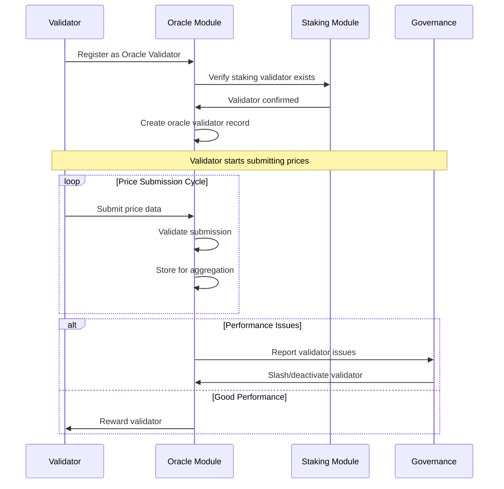
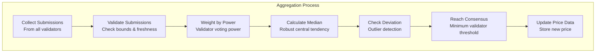

# Oracle Module Documentation

## Overview

The Oracle module provides DeshChain's decentralized price feed system with validator-based consensus, handling real-time price data for NAMO, DINR, and external assets. It implements robust aggregation mechanisms, deviation detection, and historical price tracking to ensure accurate, tamper-resistant price feeds for all DeshChain financial modules.

## Module Architecture



## Oracle Validator System

### 1. Validator Registration & Management



### 2. Oracle Validator Structure

```go
type OracleValidator struct {
    Validator             string    // Validator address
    Power                 uint64    // Voting power for price consensus
    Active                bool      // Active status
    SuccessfulSubmissions uint64    // Count of successful submissions
    FailedSubmissions     uint64    // Count of failed submissions
    LastSubmission        time.Time // Last submission timestamp
    SlashCount            uint64    // Number of slashing events
    Description           string    // Validator description
    Website               string    // Validator website
    Commission            sdk.Dec   // Commission rate for oracle services
    MinSelfDelegation     sdk.Int   // Minimum self-delegation required
}

// Validator performance metrics
type ValidatorStats struct {
    TotalSubmissions      uint64    // Lifetime submissions
    AccuracyRate          sdk.Dec   // Submission accuracy rate
    UptimePercentage      sdk.Dec   // Uptime percentage
    AverageDeviation      sdk.Dec   // Average price deviation
    ResponseTime          sdk.Dec   // Average response time
    ReputationScore       sdk.Dec   // Overall reputation score
}
```

### 3. Oracle Validator Registration

```go
// Register new oracle validator
func (k Keeper) RegisterOracleValidator(
    ctx sdk.Context,
    validatorAddr string,
    power uint64,
    description string,
) error {
    // Verify staking validator exists
    valAddr, err := sdk.ValAddressFromBech32(validatorAddr)
    if err != nil {
        return types.ErrInvalidValidator
    }
    
    validator, found := k.stakingKeeper.GetValidator(ctx, valAddr)
    if !found {
        return types.ErrValidatorNotFound
    }
    
    // Check if already registered
    if _, found := k.GetOracleValidator(ctx, validatorAddr); found {
        return types.ErrValidatorAlreadyExists
    }
    
    // Create oracle validator record
    oracleValidator := types.OracleValidator{
        Validator:             validatorAddr,
        Power:                 power,
        Active:                true,
        SuccessfulSubmissions: 0,
        FailedSubmissions:     0,
        LastSubmission:        time.Time{},
        SlashCount:            0,
        Description:           description,
    }
    
    k.SetOracleValidator(ctx, oracleValidator)
    
    return nil
}
```

## Price Submission & Validation

### 1. Price Submission Process

```go
type ValidatorPriceSubmission struct {
    Validator   string    // Validator making submission
    Symbol      string    // Asset symbol (NAMO, DINR, BTC, etc.)
    Price       sdk.Dec   // Price in INR or USD
    BlockHeight uint64    // Submission block height
    Timestamp   time.Time // Submission timestamp
    Source      string    // Data source (binance, coinbase, etc.)
    Confidence  sdk.Dec   // Confidence level (0.0-1.0)
    Signature   string    // Validator signature for authenticity
}

// Submit price data
func (k Keeper) SubmitPrice(
    ctx sdk.Context,
    validator, symbol string,
    price sdk.Dec,
    source string,
    timestamp time.Time,
) error {
    // Validate oracle validator
    oracleValidator, found := k.GetOracleValidator(ctx, validator)
    if !found {
        return types.ErrUnauthorizedValidator
    }
    
    if !oracleValidator.Active {
        return types.ErrValidatorNotActive
    }
    
    // Validate submission
    if err := k.validatePriceSubmission(ctx, symbol, price, timestamp); err != nil {
        return err
    }
    
    // Check for duplicate submission in current window
    currentHeight := uint64(ctx.BlockHeight())
    params := k.GetParams(ctx)
    
    submissionKey := types.ValidatorSubmissionKey(validator, symbol, currentHeight)
    store := ctx.KVStore(k.storeKey)
    
    if store.Has(submissionKey) {
        return types.ErrDuplicateSubmission
    }
    
    // Store submission for aggregation
    submission := types.ValidatorPriceSubmission{
        Validator:   validator,
        Symbol:      symbol,
        Price:       price,
        BlockHeight: currentHeight,
        Timestamp:   timestamp,
        Source:      source,
    }
    
    bz := k.cdc.MustMarshal(&submission)
    store.Set(submissionKey, bz)
    
    // Update validator stats
    oracleValidator.SuccessfulSubmissions++
    oracleValidator.LastSubmission = timestamp
    k.SetOracleValidator(ctx, oracleValidator)
    
    return nil
}
```

### 2. Submission Validation

```go
func (k Keeper) validatePriceSubmission(
    ctx sdk.Context,
    symbol string,
    price sdk.Dec,
    timestamp time.Time,
) error {
    // Validate symbol format
    if len(symbol) < 2 || len(symbol) > 10 {
        return types.ErrInvalidSymbol
    }
    
    // Check price bounds (reasonable limits)
    if price.LTE(sdk.ZeroDec()) || price.GT(sdk.NewDec(1000000000)) {
        return types.ErrInvalidPrice
    }
    
    // Check timestamp freshness (within 1 hour)
    blockTime := ctx.BlockTime()
    if timestamp.After(blockTime.Add(5 * time.Minute)) {
        return types.ErrInvalidTimestamp
    }
    
    if timestamp.Before(blockTime.Add(-1 * time.Hour)) {
        return types.ErrInvalidTimestamp
    }
    
    return nil
}
```

## Price Aggregation & Consensus

### 1. Aggregation Window Processing



### 2. Price Aggregation Algorithm

```go
func (k Keeper) aggregatePricesForSymbol(
    ctx sdk.Context,
    symbol string,
    windowStart, windowEnd uint64,
) error {
    submissions := k.getSubmissionsForWindow(ctx, symbol, windowStart, windowEnd)
    params := k.GetParams(ctx)
    
    // Ensure minimum validator threshold
    if uint64(len(submissions)) < params.MinValidators {
        return types.ErrInsufficientValidators
    }
    
    // Extract prices and calculate statistics
    prices := make([]sdk.Dec, len(submissions))
    totalPower := uint64(0)
    
    for i, submission := range submissions {
        prices[i] = submission.Price
        
        if oracleVal, found := k.GetOracleValidator(ctx, submission.Validator); found {
            totalPower += oracleVal.Power
        }
    }
    
    // Sort prices for median calculation
    sort.Slice(prices, func(i, j int) bool {
        return prices[i].LT(prices[j])
    })
    
    // Calculate median (robust against outliers)
    var median sdk.Dec
    if len(prices)%2 == 0 {
        median = prices[len(prices)/2-1].Add(prices[len(prices)/2]).Quo(sdk.NewDec(2))
    } else {
        median = prices[len(prices)/2]
    }
    
    // Calculate mean for comparison
    sum := sdk.ZeroDec()
    for _, price := range prices {
        sum = sum.Add(price)
    }
    mean := sum.Quo(sdk.NewDec(int64(len(prices))))
    
    // Calculate standard deviation
    variance := sdk.ZeroDec()
    for _, price := range prices {
        diff := price.Sub(mean)
        variance = variance.Add(diff.Mul(diff))
    }
    variance = variance.Quo(sdk.NewDec(int64(len(prices))))
    stdDev := sdk.NewDecFromInt(variance.TruncateInt()).ApproxRoot(2)
    
    // Check for excessive deviation
    maxDeviation := mean.Mul(params.MaxPriceDeviation)
    if stdDev.GT(maxDeviation) {
        // Emit deviation warning but continue
        ctx.EventManager().EmitEvent(
            sdk.NewEvent(
                types.EventTypePriceDeviation,
                sdk.NewAttribute(types.AttributeKeySymbol, symbol),
                sdk.NewAttribute(types.AttributeKeyMeanPrice, mean.String()),
                sdk.NewAttribute(types.AttributeKeyDeviation, stdDev.String()),
                sdk.NewAttribute(types.AttributeKeyMaxDeviation, maxDeviation.String()),
            ),
        )
    }
    
    // Update price data (use median as final price)
    currentPrice, found := k.GetPriceData(ctx, symbol)
    oldPrice := sdk.ZeroDec()
    if found {
        oldPrice = currentPrice.Price
    }
    
    newPriceData := types.PriceData{
        Symbol:         symbol,
        Price:          median,
        LastUpdated:    ctx.BlockTime(),
        Source:         "aggregated",
        ValidatorCount: uint64(len(submissions)),
        Deviation:      stdDev,
    }
    
    k.SetPriceData(ctx, newPriceData)
    
    // Store historical price
    k.storeHistoricalPrice(ctx, symbol, median, uint64(ctx.BlockHeight()))
    
    // Emit price update event
    ctx.EventManager().EmitEvent(
        sdk.NewEvent(
            types.EventTypePriceUpdate,
            sdk.NewAttribute(types.AttributeKeySymbol, symbol),
            sdk.NewAttribute(types.AttributeKeyOldPrice, oldPrice.String()),
            sdk.NewAttribute(types.AttributeKeyNewPrice, median.String()),
            sdk.NewAttribute(types.AttributeKeyValidatorCount, fmt.Sprintf("%d", len(submissions))),
            sdk.NewAttribute(types.AttributeKeyDeviation, stdDev.String()),
        ),
    )
    
    return nil
}
```

### 3. Consensus Parameters

```go
type OracleParams struct {
    MinValidators         uint64   // Minimum validators for consensus (default: 3)
    AggregationWindow     uint64   // Blocks per aggregation (default: 10)
    MaxPriceDeviation     sdk.Dec  // Maximum allowed deviation (default: 0.1 = 10%)
    StalenessThreshold    uint64   // Seconds before price considered stale (default: 3600)
    SlashingThreshold     uint64   // Failed submissions before slashing (default: 10)
    SlashingPenalty       sdk.Dec  // Penalty percentage (default: 0.05 = 5%)
    RewardMultiplier      sdk.Dec  // Reward multiplier for good performance (default: 1.0)
}
```

## Price Data Structures

### 1. Current Price Data

```go
type PriceData struct {
    Symbol         string    // Asset symbol
    Price          sdk.Dec   // Current consensus price
    LastUpdated    time.Time // Last update timestamp
    Source         string    // Data source ("aggregated", "external")
    ValidatorCount uint64    // Number of validators in consensus
    Deviation      sdk.Dec   // Price standard deviation
    Confidence     sdk.Dec   // Confidence level (0.0-1.0)
    Volume24h      sdk.Dec   // 24h trading volume (if available)
    Change24h      sdk.Dec   // 24h price change percentage
}
```

### 2. Historical Price Data

```go
type HistoricalPrice struct {
    Symbol         string    // Asset symbol
    Price          sdk.Dec   // Historical price
    BlockHeight    uint64    // Block height when recorded
    Timestamp      time.Time // Recording timestamp
    ValidatorCount uint64    // Validators participating in consensus
    Volume         sdk.Dec   // Trading volume at time
    Source         string    // Data source
}
```

### 3. Exchange Rate Support

```go
type ExchangeRate struct {
    Base        string    // Base currency (INR, USD)
    Target      string    // Target currency (NAMO, DINR)
    Rate        sdk.Dec   // Exchange rate
    LastUpdated time.Time // Last update timestamp
    Source      string    // Data source
    Validator   string    // Reporting validator
    Confidence  sdk.Dec   // Rate confidence
}
```

## Transaction Types

### 1. MsgRegisterOracleValidator
Register as an oracle validator.

```go
type MsgRegisterOracleValidator struct {
    Validator   string // Validator address
    Power       uint64 // Voting power
    Description string // Validator description
    Website     string // Optional website
    Details     string // Additional details
}
```

### 2. MsgSubmitPrice
Submit price data for an asset.

```go
type MsgSubmitPrice struct {
    Validator string    // Validator address
    Symbol    string    // Asset symbol
    Price     sdk.Dec   // Price value
    Source    string    // Data source
    Timestamp time.Time // Price timestamp
}
```

### 3. MsgSubmitExchangeRate
Submit exchange rate data.

```go
type MsgSubmitExchangeRate struct {
    Validator string    // Validator address
    Base      string    // Base currency
    Target    string    // Target currency
    Rate      sdk.Dec   // Exchange rate
    Source    string    // Data source
    Timestamp time.Time // Rate timestamp
}
```

## Query Endpoints

### 1. QueryPriceData
Get current price data for an asset.

**Request**: `/deshchain/oracle/v1/price/{symbol}`

**Response**:
```json
{
  "price_data": {
    "symbol": "NAMO",
    "price": "20.50",
    "last_updated": "2024-07-25T14:30:00Z",
    "source": "aggregated",
    "validator_count": 7,
    "deviation": "0.15",
    "confidence": "0.95",
    "volume_24h": "1250000.00",
    "change_24h": "2.5"
  }
}
```

### 2. QueryExchangeRate
Get exchange rate between currency pairs.

**Request**: `/deshchain/oracle/v1/exchange?base=INR&target=NAMO`

**Response**:
```json
{
  "exchange_rate": {
    "base": "INR",
    "target": "NAMO",
    "rate": "0.0488",
    "last_updated": "2024-07-25T14:30:00Z",
    "source": "aggregated",
    "validator": "deshchain1val...",
    "confidence": "0.92"
  }
}
```

### 3. QueryPriceHistory
Get historical price data for an asset.

**Request**: `/deshchain/oracle/v1/history/{symbol}?limit=100`

**Response**:
```json
{
  "price_history": [
    {
      "symbol": "NAMO",
      "price": "20.50",
      "block_height": 1234567,
      "timestamp": "2024-07-25T14:30:00Z",
      "validator_count": 7,
      "volume": "125000.00",
      "source": "aggregated"
    },
    {
      "symbol": "NAMO",
      "price": "20.25",
      "block_height": 1234557,
      "timestamp": "2024-07-25T14:25:00Z",
      "validator_count": 7,
      "volume": "118000.00",
      "source": "aggregated"
    }
  ],
  "total_count": 100
}
```

### 4. QueryOracleValidators
Get list of oracle validators.

**Request**: `/deshchain/oracle/v1/validators`

**Response**:
```json
{
  "oracle_validators": [
    {
      "validator": "deshchain1val1...",
      "power": 1000,
      "active": true,
      "successful_submissions": 1547,
      "failed_submissions": 12,
      "last_submission": "2024-07-25T14:25:00Z",
      "slash_count": 0,
      "description": "DeshChain Oracle Node 1"
    },
    {
      "validator": "deshchain1val2...",
      "power": 850,
      "active": true,
      "successful_submissions": 1523,
      "failed_submissions": 8,
      "last_submission": "2024-07-25T14:28:00Z",
      "slash_count": 0,
      "description": "DeshChain Oracle Node 2"
    }
  ],
  "total_validators": 12,
  "active_validators": 11
}
```

## Events

### 1. Price Update Events
```json
{
  "type": "price_update",
  "attributes": [
    {"key": "symbol", "value": "NAMO"},
    {"key": "old_price", "value": "20.25"},
    {"key": "new_price", "value": "20.50"},
    {"key": "validator_count", "value": "7"},
    {"key": "deviation", "value": "0.15"}
  ]
}
```

### 2. Validator Registration Events
```json
{
  "type": "oracle_validator_registered",
  "attributes": [
    {"key": "validator", "value": "deshchain1val..."},
    {"key": "power", "value": "1000"},
    {"key": "active", "value": "true"}
  ]
}
```

### 3. Price Deviation Events
```json
{
  "type": "price_deviation",
  "attributes": [
    {"key": "symbol", "value": "NAMO"},
    {"key": "mean_price", "value": "20.50"},
    {"key": "deviation", "value": "2.15"},
    {"key": "max_deviation", "value": "2.05"},
    {"key": "deviation_exceeded", "value": "true"}
  ]
}
```

## Best Practices

### For Oracle Validators
1. **Reliable Infrastructure**: Maintain high uptime with redundant systems
2. **Multiple Data Sources**: Use diverse, reliable price feeds
3. **Timely Submissions**: Submit within aggregation windows
4. **Monitor Performance**: Track accuracy and response times
5. **Security Practices**: Secure validator keys and infrastructure

### For Consumers
1. **Check Freshness**: Verify price data timestamps
2. **Monitor Confidence**: Use confidence levels in decision making
3. **Handle Staleness**: Implement fallback mechanisms
4. **Validate Ranges**: Sanity-check price data before use
5. **Track Deviations**: Monitor for unusual price movements

### For Developers
1. **Error Handling**: Gracefully handle missing or stale data
2. **Caching Strategy**: Cache frequently accessed price data
3. **Aggregation Logic**: Use appropriate statistical methods
4. **Security First**: Validate all inputs and outputs
5. **Performance Optimization**: Efficiently query historical data

## CLI Commands

### Query Commands
```bash
# Get current price data
deshchaind query oracle price [symbol]

# Get exchange rate
deshchaind query oracle exchange-rate [base] [target]

# View price history
deshchaind query oracle price-history [symbol] --limit 100

# List oracle validators
deshchaind query oracle validators

# Check validator status
deshchaind query oracle validator [validator-address]
```

### Transaction Commands
```bash
# Register as oracle validator
deshchaind tx oracle register-validator \
  --power 1000 \
  --description "My Oracle Node" \
  --website "https://mynode.com" \
  --from [validator-key]

# Submit price data
deshchaind tx oracle submit-price \
  --symbol NAMO \
  --price 20.50 \
  --source binance \
  --from [validator-key]

# Submit exchange rate
deshchaind tx oracle submit-exchange-rate \
  --base INR \
  --target NAMO \
  --rate 0.0488 \
  --source composite \
  --from [validator-key]
```

## Integration Examples

### Price Data Consumer
```javascript
import { OracleClient } from '@deshchain/oracle-sdk'

async function getLatestPrices() {
  const client = new OracleClient(rpcEndpoint)
  
  // Get current NAMO price
  const namoPrice = await client.getPriceData('NAMO')
  
  console.log(`NAMO Price: ₹${namoPrice.price}`)
  console.log(`Last Updated: ${namoPrice.lastUpdated}`)
  console.log(`Validator Count: ${namoPrice.validatorCount}`)
  console.log(`Confidence: ${namoPrice.confidence * 100}%`)
  
  // Check if price is fresh (within 10 minutes)
  const maxAge = 10 * 60 * 1000 // 10 minutes in ms
  const age = Date.now() - new Date(namoPrice.lastUpdated).getTime()
  
  if (age > maxAge) {
    console.warn('⚠️ Price data is stale, using with caution')
  }
  
  // Get exchange rate
  const exchangeRate = await client.getExchangeRate('INR', 'NAMO')
  console.log(`INR/NAMO Rate: ${exchangeRate.rate}`)
}
```

### Oracle Validator Setup
```javascript
async function submitPriceData() {
  const client = new OracleClient(rpcEndpoint, validatorKey)
  
  // Fetch price from multiple sources
  const prices = await Promise.all([
    fetchFromBinance('NAMOEUR'),
    fetchFromCoinbase('NAMOEUR'),
    fetchFromKraken('NAMOEUR')
  ])
  
  // Calculate median price for submission
  const sortedPrices = prices.sort((a, b) => a - b)
  const medianPrice = sortedPrices[Math.floor(sortedPrices.length / 2)]
  
  // Submit to oracle
  await client.submitPrice({
    symbol: 'NAMO',
    price: medianPrice.toString(),
    source: 'composite',
    timestamp: new Date().toISOString()
  })
  
  console.log(`✅ Submitted NAMO price: ₹${medianPrice}`)
}
```

## FAQ

**Q: How often are prices updated?**
A: Prices are aggregated every 10 blocks (approximately 1 minute) when validator submissions are available.

**Q: What happens if validators submit very different prices?**
A: The system calculates deviation and uses median pricing to be robust against outliers. High deviation events are logged.

**Q: How are oracle validators selected?**
A: Oracle validators must be staking validators who register and maintain good performance metrics.

**Q: What assets are supported by the oracle?**
A: Initially NAMO, DINR, major cryptocurrencies (BTC, ETH), and INR/USD exchange rates. More assets added based on demand.

**Q: How is price accuracy ensured?**
A: Through multiple validators, multiple data sources per validator, statistical aggregation (median), and deviation monitoring.

**Q: What happens during validator downtime?**
A: The system continues operating with remaining validators as long as minimum threshold (3 validators) is met.

---

For more information, see the [Module Overview](../MODULE_OVERVIEW.md) or explore other [DeshChain Modules](../MODULE_OVERVIEW.md#module-categories).