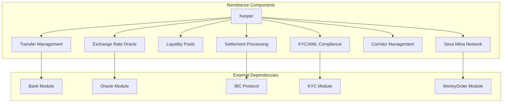
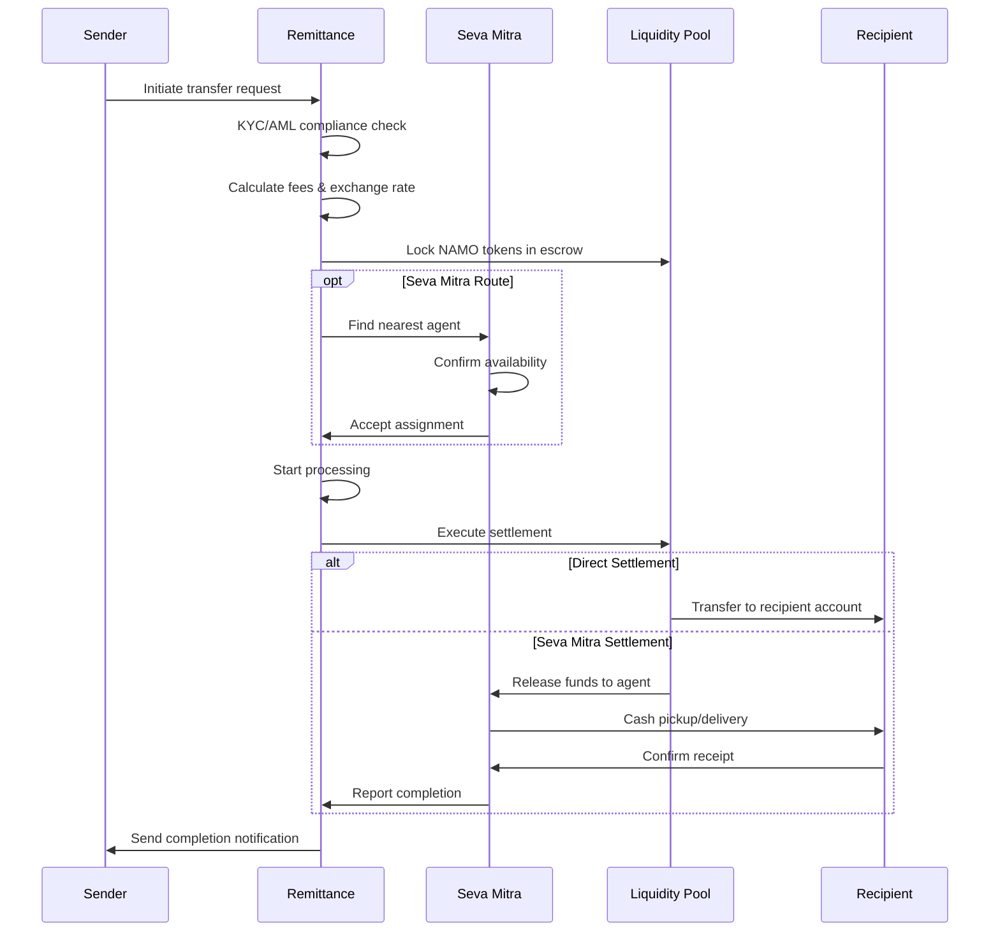
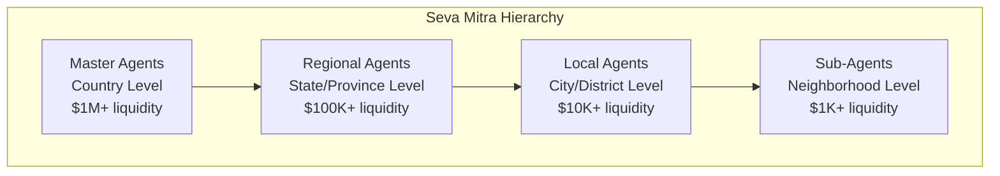
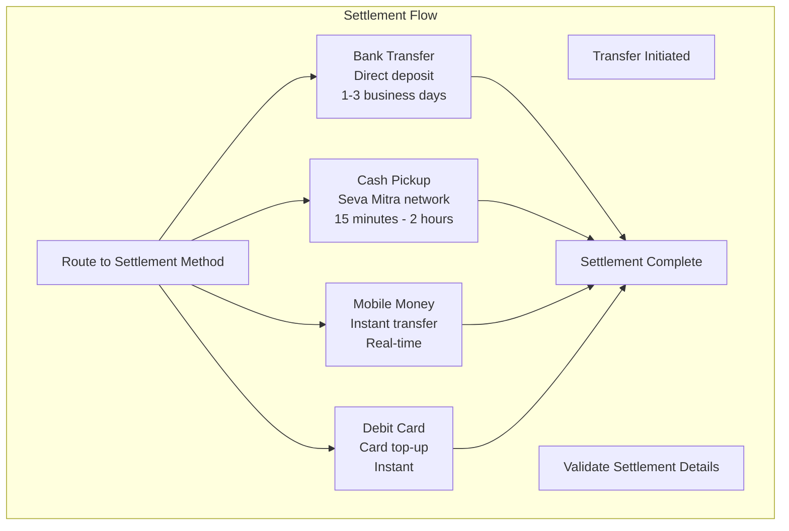

# Remittance Module Documentation

## Overview

The Remittance module provides DeshChain's international money transfer service with integrated Seva Mitra agent network. It enables secure, compliant, and cost-effective cross-border transfers using NAMO tokens as the settlement layer while supporting traditional fiat currencies at both ends of the transaction.

## Module Architecture



## International Transfer Process

### 1. Transfer Lifecycle



### 2. Transfer Structure

```go
type RemittanceTransfer struct {
    Id                   string                // Unique transfer ID
    SenderAddress        string                // Sender blockchain address
    RecipientAddress     string                // Recipient identifier
    
    // Geographic Information
    SenderCountry        string                // Sender's country code
    RecipientCountry     string                // Recipient's country code
    
    // Financial Details
    Amount               sdk.Coin              // NAMO amount
    SourceCurrency       string                // Original currency (USD, EUR, etc.)
    DestinationCurrency  string                // Target currency (INR, PHP, etc.)
    ExchangeRate         sdk.Dec               // Applied exchange rate
    Fees                 []Fee                 // Breakdown of all fees
    RecipientAmount      sdk.Coin              // Final amount to recipient
    
    // Transfer Configuration
    Status               TransferStatus        // Current status
    CorridorId           string                // Settlement corridor
    SettlementMethod     string                // bank_transfer, cash_pickup, mobile_money
    PurposeCode          string                // Regulatory purpose code
    Memo                 string                // Transfer note
    
    // Timestamps
    CreatedAt            time.Time             // Creation time
    UpdatedAt            time.Time             // Last update
    ExpiresAt            time.Time             // Transfer expiry
    CompletedAt          *time.Time            // Completion time
    CancelledAt          *time.Time            // Cancellation time
    RefundedAt           *time.Time            // Refund time
    
    // Additional Information
    RecipientInfo        *RecipientInfo        // Recipient details
    SettlementDetails    *SettlementDetails    // Settlement instructions
    ComplianceInfo       *ComplianceInfo       // KYC/AML data
    StatusHistory        []StatusUpdate        // Status change log
    
    // Seva Mitra Integration
    UsesSevaMitra        bool                  // Using agent network
    SevaMitraAgentId     string                // Assigned agent ID
    SevaMitraCommission  sdk.Coin              // Agent commission
    SevaMitraLocation    string                // Agent location
    
    // Partner Information
    PartnerId            string                // Settlement partner ID
}
```

## Seva Mitra Agent Network

### 1. Agent Management System

The Seva Mitra network provides local cash pickup and delivery services:



### 2. Seva Mitra Agent Structure

```go
type SevaMitraAgent struct {
    AgentId              string                // Unique agent identifier
    AgentAddress         string                // Blockchain address
    AgentName            string                // Agent/Business name
    
    // Location & Contact
    Country              string                // Country code
    State                string                // State/Province
    City                 string                // City
    Address              string                // Physical address
    Phone                string                // Contact number
    Email                string                // Email address
    
    // Financial Configuration
    BaseCommissionRate   sdk.Dec               // Base commission rate (%)
    VolumeBonus          sdk.Dec               // Volume-based bonus rate
    MinimumCommission    sdk.Coin              // Minimum commission per transfer
    MaximumCommission    sdk.Coin              // Maximum commission per transfer
    LiquidityLimit       sdk.Coin              // Available liquidity
    DailyLimit           sdk.Coin              // Daily transaction limit
    
    // Operational Details
    SupportedCurrencies  []string              // Supported fiat currencies
    SupportedMethods     []string              // Settlement methods
    OperatingHours       OperatingHours        // Business hours
    Languages            []string              // Supported languages
    
    // Performance Metrics
    TotalTransactions    uint64                // Lifetime transactions
    TotalVolume          sdk.Coin              // Lifetime volume
    TotalCommissionsEarned sdk.Coin            // Total commissions
    SuccessRate          sdk.Dec               // Completion rate
    AverageProcessingTime sdk.Dec              // Average processing time
    
    // Status & Metadata
    Status               AgentStatus           // Current status
    CreatedAt            time.Time             // Registration date
    UpdatedAt            time.Time             // Last update
    SuspendedUntil       *time.Time            // Suspension end time
    Metadata             map[string]string     // Additional data
}
```

### 3. Agent Status Types

```go
type AgentStatus int32

const (
    AGENT_STATUS_PENDING_VERIFICATION AgentStatus = 0  // Awaiting verification
    AGENT_STATUS_ACTIVE               AgentStatus = 1  // Operational
    AGENT_STATUS_SUSPENDED            AgentStatus = 2  // Temporarily suspended
    AGENT_STATUS_INACTIVE             AgentStatus = 3  // Inactive by choice
    AGENT_STATUS_TERMINATED           AgentStatus = 4  // Permanently terminated
)
```

### 4. Commission Structure

```go
type SevaMitraCommission struct {
    CommissionId     string           // Commission record ID
    AgentId          string           // Agent ID
    TransferId       string           // Associated transfer
    
    BaseCommission   sdk.Coin         // Base commission earned
    VolumeBonus      sdk.Coin         // Volume-based bonus
    TotalCommission  sdk.Coin         // Total commission
    
    Status           CommissionStatus // Payment status
    EarnedAt         time.Time        // When earned
    PaidAt           *time.Time       // When paid
}

// Commission calculation example
func (k Keeper) CalculateSevaMitraCommission(
    agentID string, 
    transferAmount sdk.Coin,
) (baseCommission, volumeBonus sdk.Coin, err error) {
    
    agent, err := k.GetSevaMitraAgent(ctx, agentID)
    if err != nil {
        return sdk.Coin{}, sdk.Coin{}, err
    }
    
    // Base commission (typically 1-3% of transfer amount)
    baseCommissionAmount := agent.BaseCommissionRate.MulInt(transferAmount.Amount)
    baseCommission = sdk.NewCoin(transferAmount.Denom, baseCommissionAmount.TruncateInt())
    
    // Apply min/max limits
    if baseCommission.IsLT(agent.MinimumCommission) {
        baseCommission = agent.MinimumCommission
    }
    if baseCommission.IsGT(agent.MaximumCommission) {
        baseCommission = agent.MaximumCommission
    }
    
    // Volume bonus for high-volume agents
    volumeBonus = sdk.NewCoin(transferAmount.Denom, sdk.ZeroInt())
    if agent.TotalVolume.Amount.GT(sdk.NewInt(100000)) { // $100k+ threshold
        volumeBonusAmount := agent.VolumeBonus.MulInt(transferAmount.Amount)
        volumeBonus = sdk.NewCoin(transferAmount.Denom, volumeBonusAmount.TruncateInt())
    }
    
    return baseCommission, volumeBonus, nil
}
```

## Settlement Methods

### 1. Supported Settlement Types

```go
const (
    SettlementMethodBankTransfer  = "bank_transfer"   // Direct bank deposit
    SettlementMethodCashPickup    = "cash_pickup"     // Seva Mitra cash pickup
    SettlementMethodMobileMoney   = "mobile_money"    // Mobile wallet deposit
    SettlementMethodDebitCard     = "debit_card"      // Card top-up
    SettlementMethodHomeDelivery  = "home_delivery"   // Door-to-door delivery
    SettlementMethodBillPayment   = "bill_payment"    // Utility bill payment
)
```

### 2. Settlement Details Structure

```go
type SettlementDetails struct {
    Method               string                // Settlement method
    
    // Bank Transfer Details
    BankName             string                // Bank name
    AccountNumber        string                // Account number
    RoutingNumber        string                // Routing/SWIFT code
    AccountHolderName    string                // Account holder name
    
    // Mobile Money Details
    MobileProvider       string                // Provider name
    MobileNumber         string                // Mobile number
    
    // Cash Pickup Details
    PickupLocation       string                // Pickup location
    PickupInstructions   string                // Special instructions
    RequireID            bool                  // ID verification required
    
    // Additional Metadata
    SpecialInstructions  string                // Additional instructions
    NotificationMethod   string                // SMS, email, call
}
```

### 3. Settlement Processing



## Compliance & KYC Integration

### 1. Regulatory Compliance Framework

```go
type ComplianceInfo struct {
    // KYC Status
    SenderKYCLevel       int32                 // KYC verification level
    RecipientKYCLevel    int32                 // Recipient KYC level
    
    // AML Screening
    AMLCheckPassed       bool                  // AML screening result
    SanctionsCheckPassed bool                  // Sanctions list check
    PEPCheckPassed       bool                  // PEP screening
    
    // Risk Assessment
    RiskScore            int32                 // 0-100 risk score
    RiskFactors          []string              // Risk factors identified
    
    // Documentation
    DocumentsRequired    []string              // Required documents
    DocumentsProvided    []string              // Provided documents
    
    // Regulatory Reporting
    ReportingRequired    bool                  // Needs regulatory reporting
    ReportingSubmitted   bool                  // Report submitted
    
    ComplianceOfficer    string                // Reviewing officer
    ReviewedAt           *time.Time            // Review timestamp
}
```

### 2. Purpose Codes

```go
const (
    PurposePersonalTransfer    = "P001"    // Personal/family support
    PurposeEducationExpenses   = "P002"    // Education fees
    PurposeMedicalExpenses     = "P003"    // Medical treatment
    PurposeBusinessPayment     = "B001"    // Business payment
    PurposeInvestment          = "B002"    // Investment purpose
    PurposePropertyPurchase    = "B003"    // Real estate
    PurposeGiftDonation        = "G001"    // Gift/donation
    PurposeEmergencyAssistance = "E001"    // Emergency support
)
```

## Corridor Management

### 1. Transfer Corridors

Transfer corridors define the supported routes between countries:

```go
type RemittanceCorridor struct {
    CorridorId           string                // Corridor identifier
    SourceCountry        string                // Origin country
    DestinationCountry   string                // Destination country
    SourceCurrencies     []string              // Supported source currencies
    DestinationCurrencies []string             // Supported destination currencies
    
    // Operational Parameters
    MinAmount            sdk.Coin              // Minimum transfer amount
    MaxAmount            sdk.Coin              // Maximum transfer amount
    DailyLimit           sdk.Coin              // Daily volume limit
    
    // Fee Structure
    BaseFeeRate          sdk.Dec               // Base fee percentage
    FlatFee              sdk.Coin              // Flat fee component
    ExchangeMarkup       sdk.Dec               // Exchange rate markup
    
    // Settlement Configuration
    SettlementMethods    []string              // Available settlement methods
    ProcessingTime       map[string]string     // Processing times by method
    
    // Regulatory
    ComplianceLevel      string                // Required compliance level
    RequiredDocuments    []string              // Required documentation
    
    // Partner Information
    PartnerIds           []string              // Settlement partner IDs
    
    IsActive             bool                  // Corridor status
    CreatedAt            time.Time             // Creation time
    UpdatedAt            time.Time             // Last update
}
```

### 2. Major Corridor Examples

```go
// India → Philippines corridor
var INRtoPHP = RemittanceCorridor{
    CorridorId:            "IN-PH-001",
    SourceCountry:         "IN",
    DestinationCountry:    "PH", 
    SourceCurrencies:      []string{"INR", "USD"},
    DestinationCurrencies: []string{"PHP"},
    MinAmount:             sdk.NewCoin("inr", sdk.NewInt(1000)),     // ₹1,000
    MaxAmount:             sdk.NewCoin("inr", sdk.NewInt(10000000)), // ₹10M
    BaseFeeRate:           sdk.NewDecWithPrec(15, 3),               // 1.5%
    FlatFee:               sdk.NewCoin("inr", sdk.NewInt(50)),      // ₹50
    SettlementMethods:     []string{"bank_transfer", "cash_pickup", "mobile_money"},
    ProcessingTime: map[string]string{
        "bank_transfer": "1-2 business days",
        "cash_pickup":   "15 minutes - 2 hours",
        "mobile_money":  "instant",
    },
}
```

## Liquidity Management

### 1. Liquidity Pool Structure

```go
type LiquidityPool struct {
    PoolId               string                // Pool identifier
    CorridorId           string                // Associated corridor
    BaseCurrency         string                // Base currency (NAMO)
    QuoteCurrency        string                // Quote currency (INR, USD, etc.)
    
    // Liquidity Reserves
    BaseReserve          sdk.Coin              // NAMO reserves
    QuoteReserve         sdk.Coin              // Fiat currency reserves
    TotalLiquidity       sdk.Coin              // Total pool liquidity
    
    // Pool Parameters
    FeeRate              sdk.Dec               // Pool fee rate
    SlippageTolerance    sdk.Dec               // Maximum slippage
    MinimumLiquidity     sdk.Coin              // Minimum liquidity threshold
    
    // Provider Information
    LiquidityProviders   []LiquidityProvider   // Active LPs
    TotalShares          sdk.Int               // Total LP shares
    
    // Performance Metrics
    TotalVolume          sdk.Coin              // Lifetime volume
    TotalFees            sdk.Coin              // Fees collected
    APY                  sdk.Dec               // Annual percentage yield
    
    IsActive             bool                  // Pool status
    CreatedAt            time.Time             // Creation time
    UpdatedAt            time.Time             // Last update
}
```

### 2. Automated Market Making

DeshChain uses AMM pools for efficient liquidity provision:

```go
// Constant product formula: x * y = k
func (k Keeper) GetExchangeRate(
    ctx context.Context, 
    fromCurrency, toCurrency string,
) (sdk.Dec, error) {
    
    pool, err := k.GetLiquidityPool(ctx, fromCurrency, toCurrency)
    if err != nil {
        return sdk.ZeroDec(), err
    }
    
    // Calculate rate using constant product formula
    // Rate = QuoteReserve / BaseReserve
    if pool.BaseReserve.IsZero() {
        return sdk.ZeroDec(), types.ErrInsufficientLiquidity
    }
    
    rate := sdk.NewDecFromInt(pool.QuoteReserve.Amount).
            Quo(sdk.NewDecFromInt(pool.BaseReserve.Amount))
    
    return rate, nil
}
```

## Transaction Types

### 1. MsgInitiateTransfer
Start a new international transfer.

```go
type MsgInitiateTransfer struct {
    Sender               string                // Sender address
    RecipientAddress     string                // Recipient identifier
    SenderCountry        string                // Sender's country
    RecipientCountry     string                // Recipient's country
    Amount               sdk.Coin              // Transfer amount
    SourceCurrency       string                // Original currency
    DestinationCurrency  string                // Target currency
    SettlementMethod     string                // Settlement method
    PurposeCode          string                // Regulatory purpose
    Memo                 string                // Transfer note
    ExpiresAt            time.Time             // Expiry time
    RecipientInfo        RecipientInfo         // Recipient details
    SettlementDetails    SettlementDetails     // Settlement info
    PreferSevaMitra      bool                  // Use agent network
    SevaMitraLocation    string                // Preferred agent location
}
```

### 2. MsgConfirmTransfer  
Confirm receipt of transfer.

```go
type MsgConfirmTransfer struct {
    Recipient            string                // Recipient address
    TransferId           string                // Transfer ID
    ConfirmationCode     string                // Confirmation code
    SettlementProof      string                // Settlement evidence
}
```

### 3. MsgCancelTransfer
Cancel a pending transfer.

```go
type MsgCancelTransfer struct {
    Sender               string                // Sender address
    TransferId           string                // Transfer ID
    Reason               string                // Cancellation reason
}
```

### 4. MsgRegisterSevaMitraAgent
Register as a Seva Mitra agent.

```go
type MsgRegisterSevaMitraAgent struct {
    AgentAddress         string                // Agent blockchain address
    AgentName            string                // Agent/business name
    Country              string                // Country code
    State                string                // State/province
    City                 string                // City
    Address              string                // Physical address
    Phone                string                // Contact number
    Email                string                // Email address
    BaseCommissionRate   sdk.Dec               // Commission rate
    LiquidityLimit       sdk.Coin              // Available liquidity
    SupportedCurrencies  []string              // Supported currencies
    SupportedMethods     []string              // Settlement methods
    OperatingHours       OperatingHours        // Business hours
}
```

## Query Endpoints

### 1. QueryTransfer
Get transfer details by ID.

**Request**: `/deshchain/remittance/v1/transfer/{transfer_id}`

**Response**:
```json
{
  "transfer": {
    "id": "REM-2024-001234",
    "sender_address": "deshchain1...",
    "recipient_address": "recipient@email.com",
    "sender_country": "IN",
    "recipient_country": "PH", 
    "amount": "50000000000 unamo",
    "source_currency": "INR",
    "destination_currency": "PHP",
    "exchange_rate": "2.85",
    "recipient_amount": "142500 php",
    "status": "TRANSFER_STATUS_PROCESSING",
    "settlement_method": "cash_pickup",
    "uses_seva_mitra": true,
    "seva_mitra_agent_id": "SM-MNL-001",
    "created_at": "2024-07-25T10:30:00Z"
  }
}
```

### 2. QueryCorridors  
Get available transfer corridors.

**Request**: `/deshchain/remittance/v1/corridors?source_country=IN&destination_country=PH`

**Response**:
```json
{
  "corridors": [
    {
      "corridor_id": "IN-PH-001",
      "source_country": "IN",
      "destination_country": "PH",
      "source_currencies": ["INR", "USD"],
      "destination_currencies": ["PHP"],
      "min_amount": "1000 inr",
      "max_amount": "10000000 inr",
      "base_fee_rate": "0.015",
      "settlement_methods": ["bank_transfer", "cash_pickup", "mobile_money"],
      "processing_time": {
        "bank_transfer": "1-2 business days",
        "cash_pickup": "15 minutes - 2 hours"
      }
    }
  ]
}
```

### 3. QuerySevaMitraAgents
Find available Seva Mitra agents.

**Request**: `/deshchain/remittance/v1/seva-mitra/agents?country=PH&city=Manila&currency=PHP`

**Response**:
```json
{
  "agents": [
    {
      "agent_id": "SM-MNL-001",
      "agent_name": "Manila Remittance Center",
      "country": "PH",
      "city": "Manila",
      "supported_currencies": ["PHP", "USD"],
      "success_rate": "98.5",
      "average_processing_time": "45.2",
      "total_transactions": 1247,
      "status": "AGENT_STATUS_ACTIVE"
    }
  ]
}
```

### 4. QueryExchangeRates
Get current exchange rates.

**Request**: `/deshchain/remittance/v1/rates?from=INR&to=PHP`

**Response**:
```json
{
  "exchange_rates": [
    {
      "from_currency": "INR", 
      "to_currency": "PHP",
      "rate": "2.85",
      "last_updated": "2024-07-25T10:30:00Z",
      "liquidity_available": "5000000000 unamo"
    }
  ]
}
```

## Events

### 1. Transfer Initiated Event
```json
{
  "type": "initiate_transfer",
  "attributes": [
    {"key": "transfer_id", "value": "REM-2024-001234"},
    {"key": "sender", "value": "deshchain1..."},
    {"key": "recipient_country", "value": "PH"},
    {"key": "amount", "value": "50000000000 unamo"},
    {"key": "settlement_method", "value": "cash_pickup"},
    {"key": "uses_seva_mitra", "value": "true"}
  ]
}
```

### 2. Seva Mitra Agent Registered Event
```json
{
  "type": "seva_mitra_agent_registered",
  "attributes": [
    {"key": "agent_id", "value": "SM-MNL-001"},
    {"key": "agent_name", "value": "Manila Remittance Center"},
    {"key": "country", "value": "PH"},
    {"key": "city", "value": "Manila"}
  ]
}
```

## Best Practices

### For Senders
1. **Complete KYC**: Higher KYC levels enable larger transfers
2. **Choose Settlement Method**: Consider speed vs cost tradeoffs
3. **Verify Recipient Details**: Double-check all recipient information
4. **Monitor Exchange Rates**: Time transfers for better rates
5. **Keep Records**: Save transaction receipts for tracking

### For Seva Mitra Agents
1. **Maintain Liquidity**: Ensure adequate currency reserves
2. **Quick Response**: Fast processing improves success rates
3. **Accurate Records**: Maintain detailed transaction logs
4. **Customer Service**: Provide excellent recipient experience
5. **Compliance**: Follow all local regulations and reporting

### For Recipients
1. **Valid Documentation**: Ensure ID documents are current
2. **Accurate Information**: Provide correct pickup/settlement details
3. **Timely Collection**: Collect funds within the specified timeframe
4. **Confirmation Codes**: Keep confirmation codes secure
5. **Report Issues**: Contact support for any transfer problems

## CLI Commands

### Query Commands
```bash
# View transfer details
deshchaind query remittance transfer [transfer-id]

# List available corridors
deshchaind query remittance corridors --source-country IN --destination-country PH

# Find Seva Mitra agents
deshchaind query remittance seva-mitra-agents --country PH --city Manila

# Check exchange rates
deshchaind query remittance exchange-rates --from INR --to PHP

# View transfer history
deshchaind query remittance transfers --sender [address] --limit 10
```

### Transaction Commands
```bash
# Initiate international transfer
deshchaind tx remittance initiate-transfer \
  --recipient recipient@email.com \
  --source-country IN \
  --destination-country PH \
  --amount 50000000000unamo \
  --source-currency INR \
  --destination-currency PHP \
  --settlement-method cash_pickup \
  --purpose P001 \
  --memo "Family support" \
  --prefer-seva-mitra true \
  --from [sender-key]

# Confirm transfer receipt
deshchaind tx remittance confirm-transfer \
  --transfer-id REM-2024-001234 \
  --confirmation-code ABC123 \
  --settlement-proof "Receipt-789" \
  --from [recipient-key]

# Cancel pending transfer
deshchaind tx remittance cancel-transfer \
  --transfer-id REM-2024-001234 \
  --reason "Recipient unavailable" \
  --from [sender-key]

# Register as Seva Mitra agent
deshchaind tx remittance register-seva-mitra-agent \
  --agent-name "Manila Remittance Center" \
  --country PH \
  --city Manila \
  --commission-rate 0.025 \
  --liquidity-limit 1000000000000unamo \
  --supported-currencies "PHP,USD" \
  --from [agent-key]
```

## Integration Examples

### International Transfer
```javascript
import { RemittanceClient } from '@deshchain/remittance-sdk'

async function sendInternationalTransfer() {
  const client = new RemittanceClient(rpcEndpoint)
  
  // Initiate transfer
  const transfer = await client.initiateTransfer({
    recipientAddress: 'recipient@email.com',
    senderCountry: 'IN',
    recipientCountry: 'PH',
    amount: { denom: 'unamo', amount: '50000000000' },
    sourceCurrency: 'INR',
    destinationCurrency: 'PHP',
    settlementMethod: 'cash_pickup',
    purposeCode: 'P001',
    memo: 'Family support',
    preferSevaMitra: true,
    sevaMitraLocation: 'Manila'
  })
  
  console.log(`Transfer ID: ${transfer.id}`)
  console.log(`Recipient amount: ${transfer.recipientAmount}`)
  console.log(`Agent: ${transfer.sevaMitraAgentId}`)
}
```

### Seva Mitra Agent Registration
```javascript
async function registerSevaMitraAgent() {
  const client = new RemittanceClient(rpcEndpoint)
  
  // Register as agent
  await client.registerSevaMitraAgent({
    agentName: 'Manila Remittance Center',
    country: 'PH',
    state: 'Metro Manila',
    city: 'Manila',
    phone: '+63-2-1234-5678',
    baseCommissionRate: '0.025', // 2.5%
    liquidityLimit: { denom: 'unamo', amount: '1000000000000' },
    supportedCurrencies: ['PHP', 'USD'],
    supportedMethods: ['cash_pickup', 'home_delivery']
  })
  
  console.log('Agent registration submitted for verification')
}
```

## FAQ

**Q: What countries and currencies are supported?**
A: DeshChain supports major remittance corridors including India, Philippines, Bangladesh, Nepal, and others. Supported currencies include INR, PHP, USD, EUR, and local currencies.

**Q: How does the Seva Mitra network work?**
A: Seva Mitra agents are local partners who provide cash pickup and delivery services. They earn commissions for completed transfers and are verified by DeshChain.

**Q: What are the transfer limits?**
A: Limits depend on KYC level and corridor. Typical limits range from $500 (basic KYC) to $50,000+ (full KYC) per transaction.

**Q: How long do transfers take?**
A: Processing times vary by settlement method: instant for mobile money, 15 minutes to 2 hours for cash pickup, and 1-2 business days for bank transfers.

**Q: What fees are charged?**
A: Fees include base transfer fee (1-3%), exchange rate markup (0.5-1.5%), and optional Seva Mitra commission (1-2%). Total fees typically range from 2-6%.

**Q: Is KYC required for all transfers?**
A: KYC requirements vary by amount and jurisdiction. Small transfers may require basic verification, while larger amounts need full KYC compliance.

---

For more information, see the [Module Overview](../MODULE_OVERVIEW.md) or explore other [DeshChain Modules](../MODULE_OVERVIEW.md#module-categories).