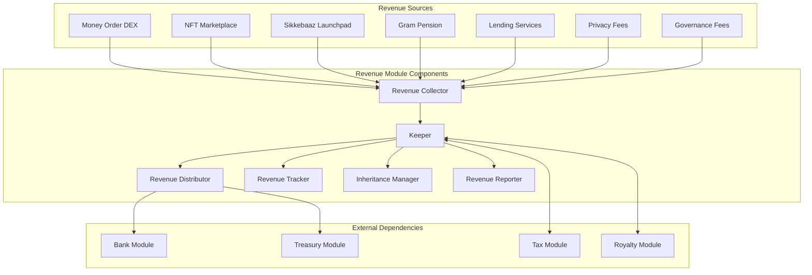
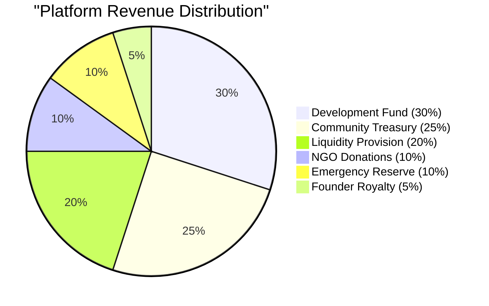
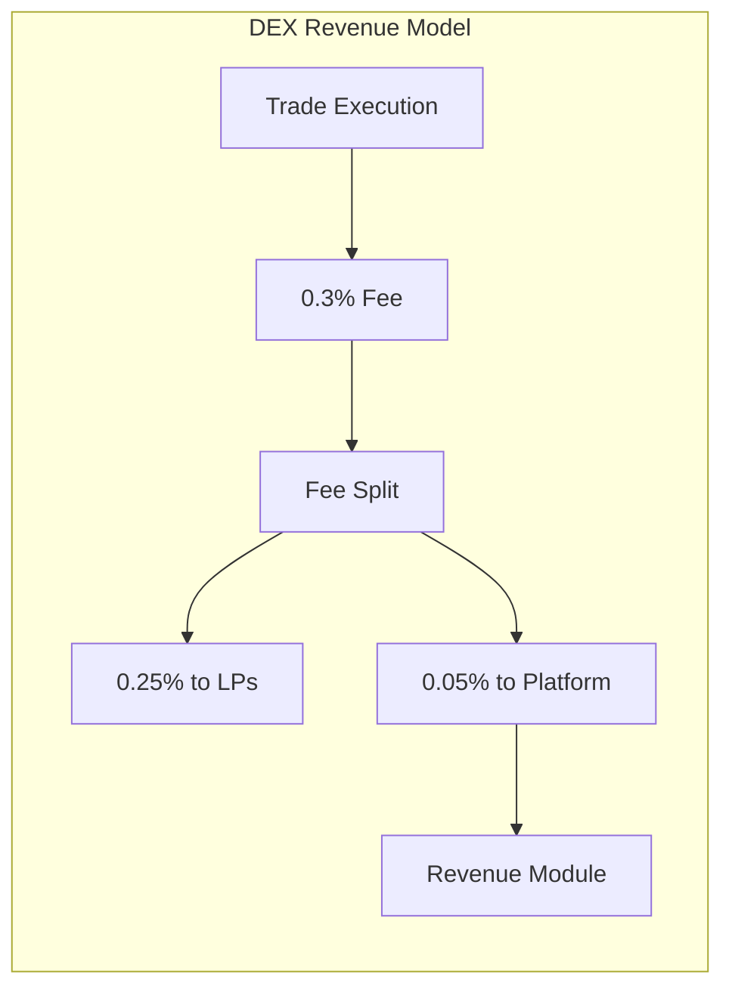
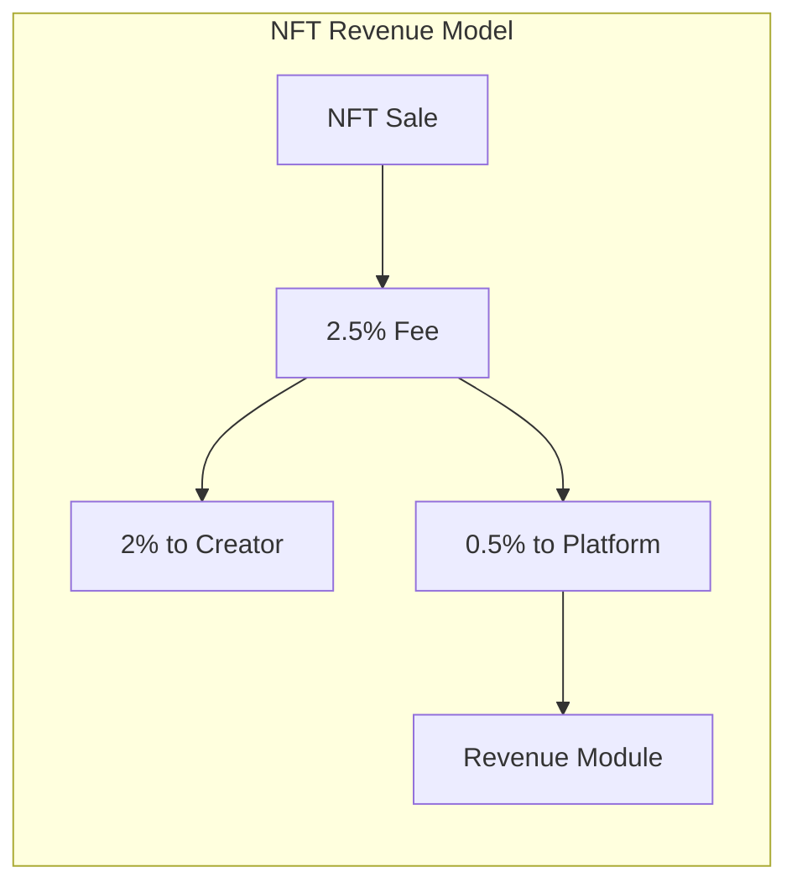
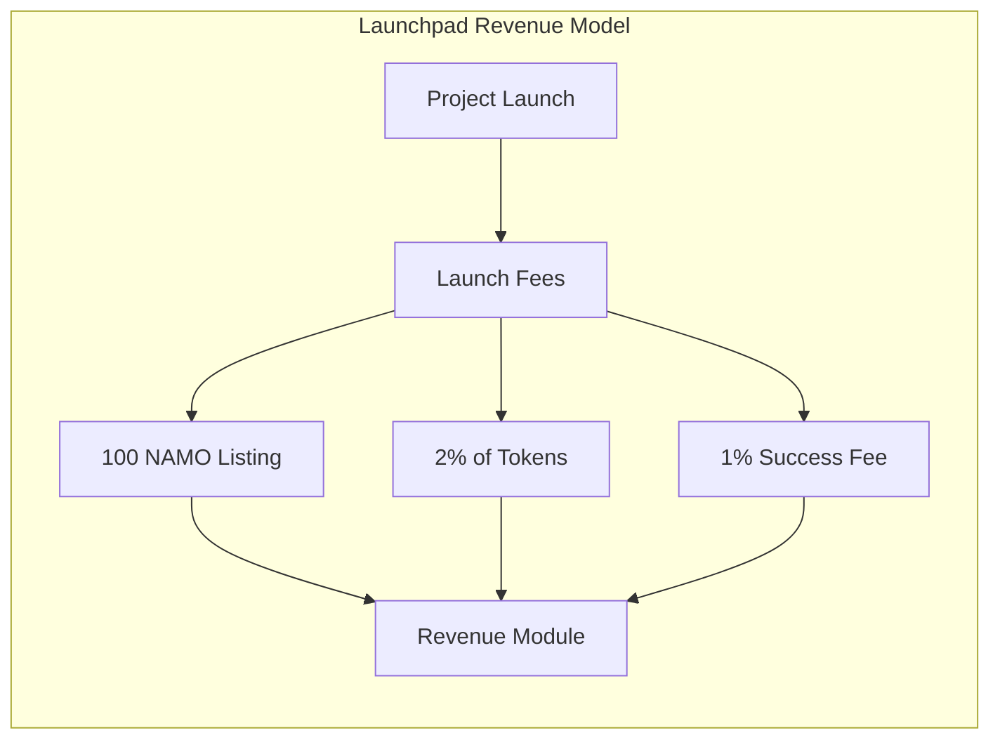
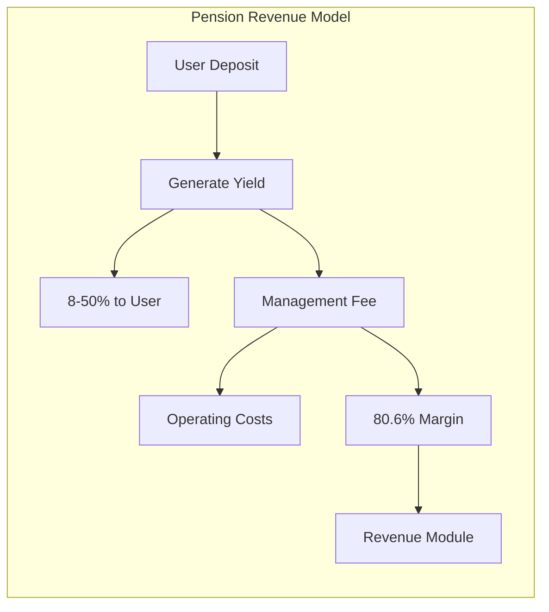
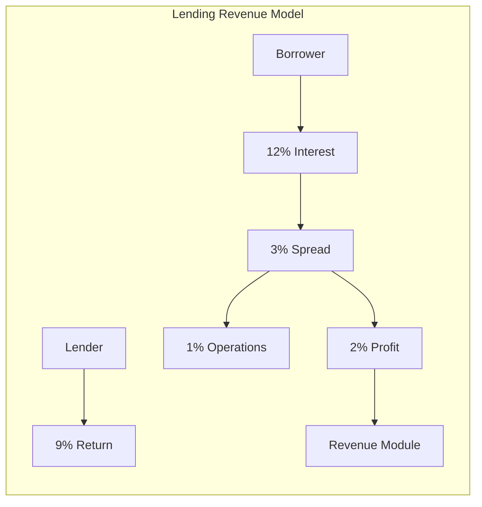
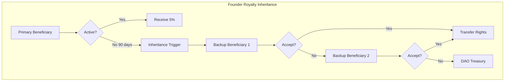
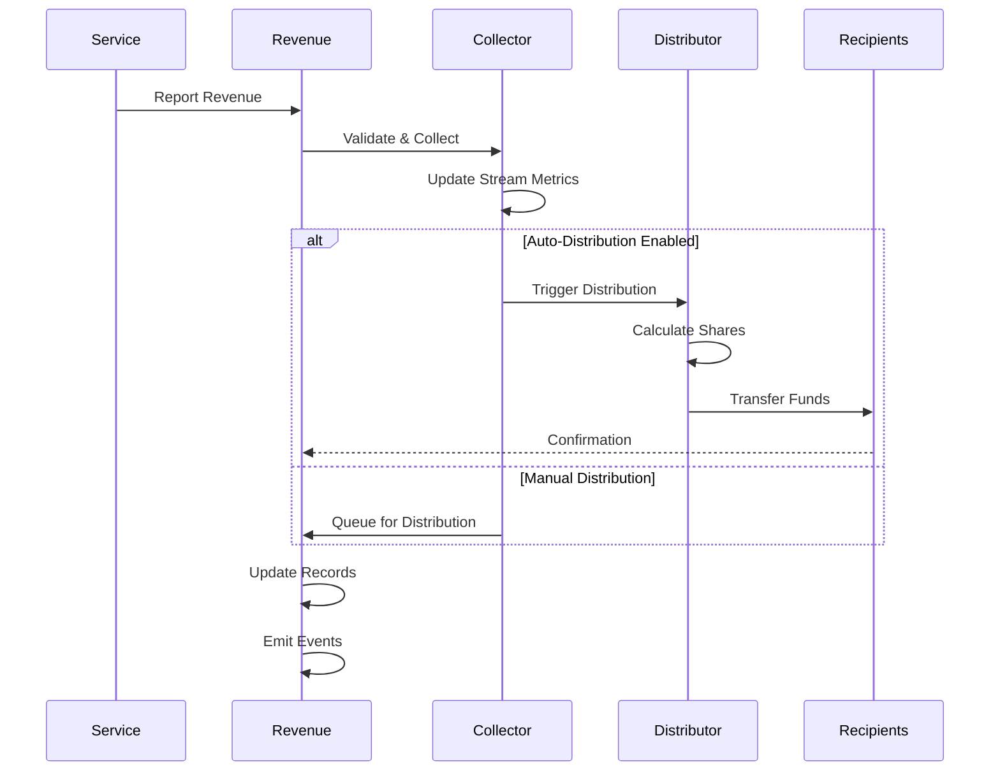
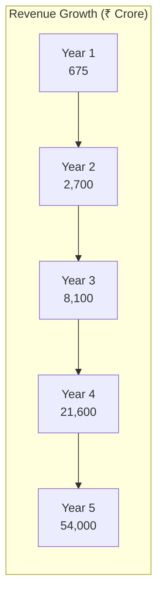

# Revenue Module Documentation

## Overview

The Revenue module manages DeshChain's platform revenue collection and distribution system. It handles revenues from multiple streams including DEX trading, NFT marketplace, launchpad fees, and financial services, distributing them according to a predefined model that emphasizes development, community growth, and social impact.

## Module Architecture



## Revenue Distribution Model

### Platform Revenue Distribution



## Revenue Streams

### 1. Money Order DEX Trading



**Revenue Details**:
- Trading Fee: 0.3% per trade
- Platform Share: 0.05% (1/6 of total fee)
- Projected Year 1: ₹50 Crore
- Growth Rate: 300% annually

### 2. Bharat Kala NFT Marketplace



**Revenue Details**:
- Marketplace Fee: 2.5% per sale
- Platform Share: 0.5%
- Additional: Minting fees, featured listings
- Projected Year 1: ₹30 Crore

### 3. Sikkebaaz Launchpad



**Revenue Details**:
- Listing Fee: 100 NAMO per project
- Token Allocation: 2% of total supply
- Success Fee: 1% of funds raised
- Projected Year 1: ₹75 Crore

### 4. Gram Pension Scheme



**Revenue Details**:
- Management Model: Yield optimization
- User Returns: 8-50% dynamic
- Platform Margin: 80.6% of spread
- Projected Year 1: ₹200 Crore

### 5. Lending Services



**Revenue Details**:
- Interest Spread: 3% average
- Net Margin: 2% after costs
- Products: Agriculture, education, business loans
- Projected Year 1: ₹120 Crore

### 6. Privacy & Governance Fees

**Privacy Fees**:
- Basic Privacy: ₹50 per transaction
- Enhanced Privacy: ₹150 per transaction
- Anonymous Transfers: ₹500 per transaction

**Governance Fees**:
- Proposal Submission: 100 NAMO
- Priority Voting: 50 NAMO
- Validator Registration: 1000 NAMO

## Revenue Stream Configuration

```go
type RevenueStream struct {
    ID                  string
    Name                string
    Type                StreamType
    TotalCollected      sdk.Coins
    MonthlyRevenue      sdk.Coins
    LastCollection      time.Time
    IsActive            bool
    CollectionAddress   sdk.AccAddress
    MinCollection       sdk.Coins
    AutoDistribute      bool
}

type StreamType string

const (
    StreamTypeDEX        StreamType = "dex_trading"
    StreamTypeNFT        StreamType = "nft_marketplace"
    StreamTypeLaunchpad  StreamType = "launchpad"
    StreamTypePension    StreamType = "pension"
    StreamTypeLending    StreamType = "lending"
    StreamTypePrivacy    StreamType = "privacy"
    StreamTypeGovernance StreamType = "governance"
    StreamTypeOther      StreamType = "other"
)
```

## Founder Royalty System

### Inheritance Mechanism



### Royalty Configuration

```go
type FounderRoyaltyConfig struct {
    Beneficiary         sdk.AccAddress
    BackupBeneficiaries []sdk.AccAddress
    RoyaltyPercentage   sdk.Dec          // 0.05 (5%)
    TotalEarned         sdk.Coins
    UnclaimedAmount     sdk.Coins
    LastClaimTime       time.Time
    InheritanceLockDays int64            // 90 days
    IsActive            bool
}
```

## Module Parameters

```go
type Params struct {
    // Distribution Percentages
    DevelopmentShare    sdk.Dec  // 0.30 (30%)
    CommunityShare      sdk.Dec  // 0.25 (25%)
    LiquidityShare      sdk.Dec  // 0.20 (20%)
    NGOShare            sdk.Dec  // 0.10 (10%)
    EmergencyShare      sdk.Dec  // 0.10 (10%)
    FounderShare        sdk.Dec  // 0.05 (5%)
    
    // Collection Configuration
    MinCollectionAmount sdk.Int  // Minimum amount to trigger distribution
    AutoDistribute      bool     // Enable automatic distribution
    DistributionPeriod  int64    // Seconds between distributions
    
    // Tracking Configuration
    TrackMonthly        bool     // Enable monthly tracking
    RetentionPeriod     int64    // How long to keep records
}
```

## Revenue Collection Process



## Distribution Records

```go
type DistributionRecord struct {
    ID                  uint64
    StreamID            string
    TotalAmount         sdk.Coins
    Distributions       []Distribution
    Timestamp           time.Time
    BlockHeight         int64
    TxHash              string
}

type Distribution struct {
    Recipient           string
    Category            DistributionCategory
    Amount              sdk.Coins
    Percentage          sdk.Dec
}

type DistributionCategory string

const (
    CategoryDevelopment  DistributionCategory = "development"
    CategoryCommunity    DistributionCategory = "community"
    CategoryLiquidity    DistributionCategory = "liquidity"
    CategoryNGO          DistributionCategory = "ngo"
    CategoryEmergency    DistributionCategory = "emergency"
    CategoryFounder      DistributionCategory = "founder"
)
```

## Transaction Types

### 1. MsgCollectRevenue
Collects revenue from a service module.

```go
type MsgCollectRevenue struct {
    Collector       string
    StreamID        string
    Amount          sdk.Coins
    Description     string
}
```

### 2. MsgDistributeRevenue
Manually triggers revenue distribution.

```go
type MsgDistributeRevenue struct {
    Authority       string
    StreamID        string  // Optional, empty for all streams
}
```

### 3. MsgClaimFounderRoyalty
Claims accumulated founder royalty.

```go
type MsgClaimFounderRoyalty struct {
    Beneficiary     string
    Amount          sdk.Coins  // Optional, empty for all
}
```

### 4. MsgUpdateBeneficiary
Updates founder royalty beneficiary.

```go
type MsgUpdateBeneficiary struct {
    CurrentBeneficiary  string
    NewBeneficiary      string
    BackupBeneficiaries []string
}
```

## Query Endpoints

### 1. QueryParams
Returns revenue module parameters.

**Request**: `/deshchain/revenue/v1/params`

**Response**:
```json
{
  "params": {
    "development_share": "0.30",
    "community_share": "0.25",
    "liquidity_share": "0.20",
    "ngo_share": "0.10",
    "emergency_share": "0.10",
    "founder_share": "0.05"
  }
}
```

### 2. QueryRevenueStream
Returns specific revenue stream details.

**Request**: `/deshchain/revenue/v1/stream/{stream_id}`

**Response**:
```json
{
  "stream": {
    "id": "dex_trading",
    "name": "Money Order DEX Trading Fees",
    "total_collected": "500000000000",
    "monthly_revenue": "41666666666",
    "last_collection": "2024-07-22T10:30:00Z",
    "is_active": true
  }
}
```

### 3. QueryAllStreams
Returns all revenue streams with statistics.

**Request**: `/deshchain/revenue/v1/streams`

**Response**:
```json
{
  "streams": [
    {
      "id": "dex_trading",
      "total_collected": "500000000000",
      "monthly_revenue": "41666666666"
    },
    {
      "id": "nft_marketplace",
      "total_collected": "300000000000",
      "monthly_revenue": "25000000000"
    }
  ],
  "total_platform_revenue": "2000000000000",
  "monthly_platform_revenue": "166666666666"
}
```

### 4. QueryDistributionHistory
Returns distribution history.

**Request**: `/deshchain/revenue/v1/distributions?limit=10`

**Response**:
```json
{
  "distributions": [
    {
      "id": "12345",
      "timestamp": "2024-07-22T00:00:00Z",
      "total_amount": "100000000000",
      "breakdown": {
        "development": "30000000000",
        "community": "25000000000",
        "liquidity": "20000000000",
        "ngo": "10000000000",
        "emergency": "10000000000",
        "founder": "5000000000"
      }
    }
  ]
}
```

### 5. QueryFounderRoyalty
Returns founder royalty details.

**Request**: `/deshchain/revenue/v1/founder-royalty`

**Response**:
```json
{
  "config": {
    "beneficiary": "deshchain1...",
    "backup_beneficiaries": ["deshchain2...", "deshchain3..."],
    "total_earned": "1000000000000",
    "unclaimed_amount": "50000000000",
    "last_claim_time": "2024-07-01T00:00:00Z",
    "is_active": true
  }
}
```

## Events

### 1. Revenue Collected Event
```json
{
  "type": "revenue_collected",
  "attributes": [
    {"key": "stream_id", "value": "dex_trading"},
    {"key": "amount", "value": "1000000000"},
    {"key": "collector", "value": "{address}"},
    {"key": "timestamp", "value": "2024-07-22T10:30:00Z"}
  ]
}
```

### 2. Revenue Distributed Event
```json
{
  "type": "revenue_distributed",
  "attributes": [
    {"key": "distribution_id", "value": "12345"},
    {"key": "total_amount", "value": "100000000000"},
    {"key": "recipients", "value": "6"},
    {"key": "timestamp", "value": "2024-07-22T00:00:00Z"}
  ]
}
```

### 3. Founder Royalty Claimed Event
```json
{
  "type": "founder_royalty_claimed",
  "attributes": [
    {"key": "beneficiary", "value": "{address}"},
    {"key": "amount", "value": "5000000000"},
    {"key": "total_earned", "value": "1000000000000"}
  ]
}
```

## Revenue Projections

### 5-Year Revenue Forecast



### Revenue Mix Evolution

| Year | DEX | NFT | Launchpad | Pension | Lending | Other |
|------|-----|-----|-----------|---------|---------|-------|
| 1 | 7% | 4% | 11% | 30% | 18% | 30% |
| 2 | 10% | 8% | 15% | 25% | 22% | 20% |
| 3 | 15% | 12% | 18% | 20% | 25% | 10% |
| 4 | 20% | 15% | 15% | 18% | 27% | 5% |
| 5 | 25% | 18% | 12% | 15% | 28% | 2% |

## Integration with Other Modules

### 1. Tax Module
- Revenue module handles platform fees
- Tax module handles transaction tax
- Both contribute to NGO donations

### 2. Royalty Module
- Handles 0.10% transaction tax royalty
- Separate from 5% platform revenue royalty
- Both inheritable with same mechanism

### 3. Treasury Module
- Receives development and community allocations
- Manages distribution through governance
- Tracks utilization of funds

### 4. Bank Module
- Handles actual fund transfers
- Maintains module accounts
- Enforces balance constraints

## Security Considerations

1. **Revenue Validation**
   - Source authentication required
   - Amount verification against expectations
   - Duplicate collection prevention

2. **Distribution Security**
   - Multi-signature for manual distributions
   - Time delays for large amounts
   - Audit trail for all movements

3. **Inheritance Protection**
   - 90-day inactivity requirement
   - Multiple backup beneficiaries
   - DAO fallback mechanism

## Best Practices

### For Service Modules
1. **Regular Collection**: Report revenue promptly
2. **Accurate Tracking**: Maintain detailed records
3. **Event Emission**: Emit proper events
4. **Error Handling**: Handle collection failures

### For Platform Operators
1. **Monitor Streams**: Track all revenue sources
2. **Optimize Distribution**: Time distributions efficiently
3. **Audit Regularly**: Verify distribution accuracy
4. **Plan Growth**: Scale infrastructure with revenue

### For Beneficiaries
1. **Claim Regularly**: Don't accumulate large unclaimed amounts
2. **Update Beneficiaries**: Keep inheritance info current
3. **Monitor Earnings**: Track royalty accumulation
4. **Tax Compliance**: Report earnings appropriately

## CLI Commands

### Query Commands
```bash
# Query revenue parameters
deshchaind query revenue params

# Query specific stream
deshchaind query revenue stream [stream-id]

# Query all streams
deshchaind query revenue streams

# Query distribution history
deshchaind query revenue distributions --limit 50

# Query founder royalty
deshchaind query revenue founder-royalty
```

### Transaction Commands
```bash
# Collect revenue (service modules only)
deshchaind tx revenue collect [stream-id] [amount] --from [key]

# Distribute revenue manually
deshchaind tx revenue distribute --stream [stream-id] --from [key]

# Claim founder royalty
deshchaind tx revenue claim-royalty [amount] --from [key]

# Update beneficiary
deshchaind tx revenue update-beneficiary [new-address] \
  --backups [addr1,addr2] --from [key]
```

## FAQ

**Q: How is platform revenue different from transaction tax?**
A: Transaction tax (2.5%) is collected on all transfers. Platform revenue comes from specific services like DEX trading, NFT sales, and lending.

**Q: Can revenue distribution percentages change?**
A: Only through governance proposals with community approval.

**Q: What happens to unclaimed founder royalties?**
A: They accumulate until claimed. After 90 days of inactivity, inheritance process can be triggered.

**Q: How often is revenue distributed?**
A: Can be automatic (configurable period) or manual. Default is daily automatic distribution.

**Q: Are revenue streams auditable?**
A: Yes, all collections and distributions are recorded on-chain with full transparency.

---

For more information, see the [Module Overview](../MODULE_OVERVIEW.md) or explore other [DeshChain Modules](../MODULE_OVERVIEW.md#module-categories).