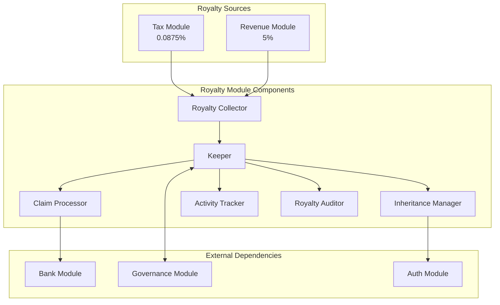
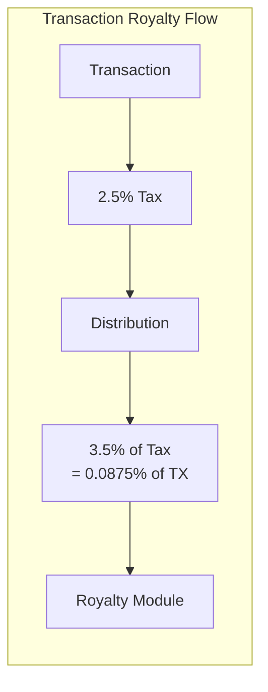
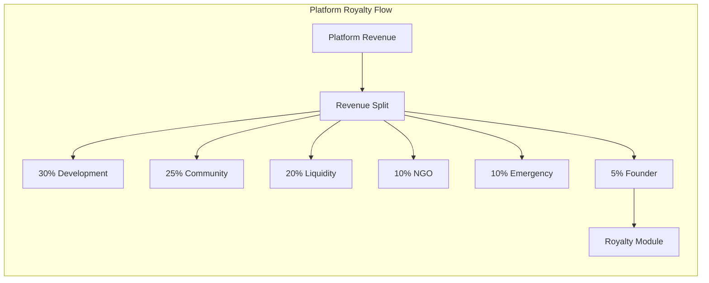
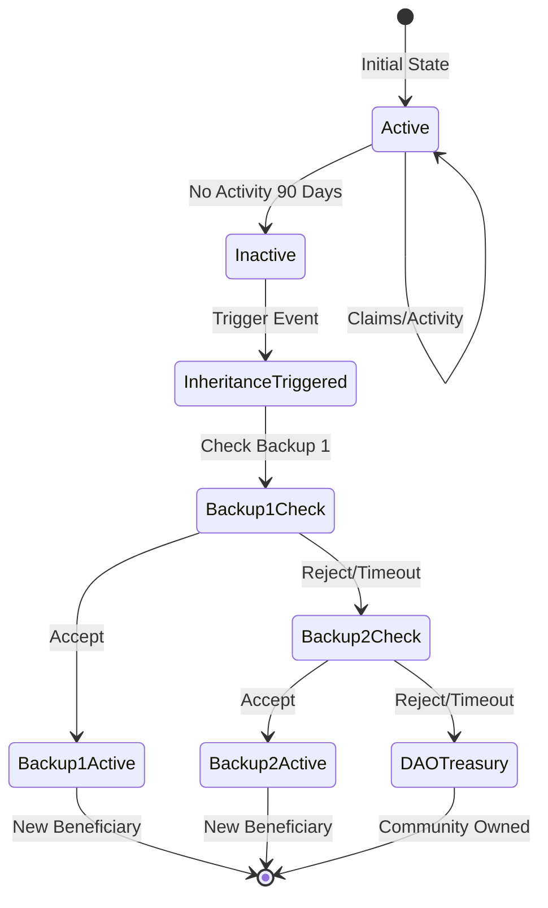
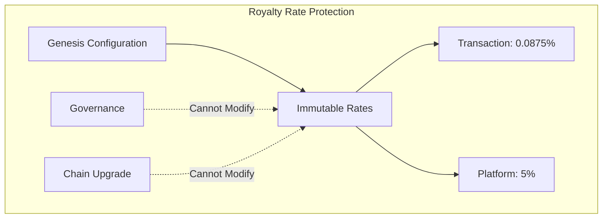
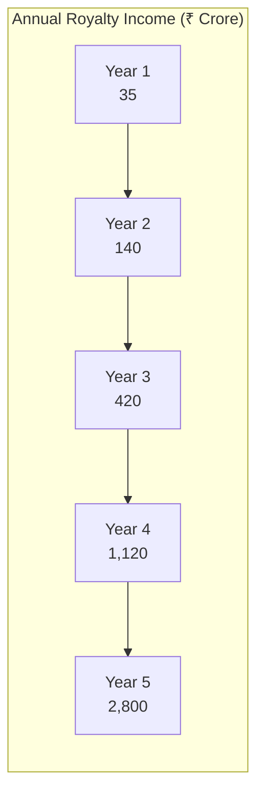
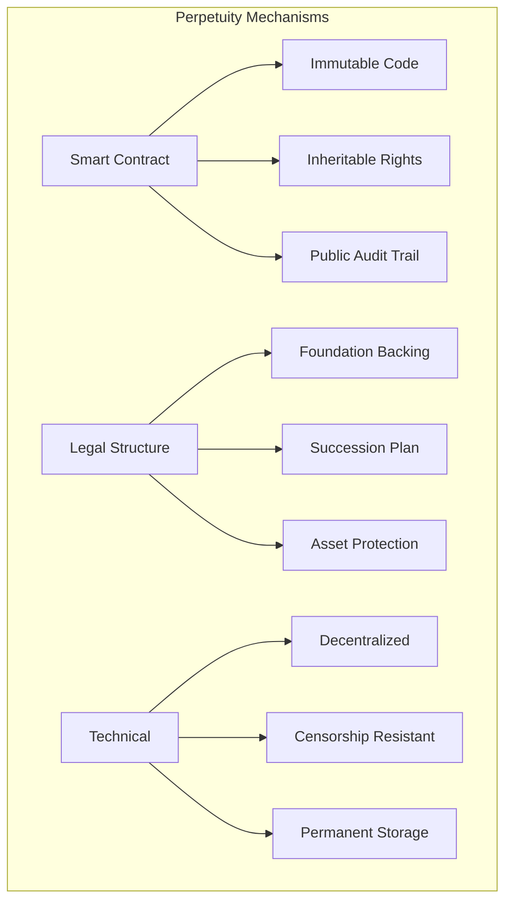

# Royalty Module Documentation

## Overview

The Royalty module implements DeshChain's perpetual royalty system, ensuring sustainable founder compensation through a dual-stream model. It manages a 0.10% transaction tax royalty (0.0875% effective) and a 5% platform revenue share, both designed to be inheritable and perpetual, creating long-term alignment between founder dedication and platform success.

## Module Architecture



## Dual Royalty Model

### 1. Transaction Tax Royalty (0.10%)



**Details**:
- Effective Rate: 0.0875% of all transactions
- Source: 3.5% share of the 2.5% transaction tax
- Collection: Automatic via tax module
- Accumulation: Real-time in royalty pool

### 2. Platform Revenue Royalty (5%)



**Details**:
- Rate: 5% of all platform revenues
- Sources: DEX, NFT, Launchpad, Lending, etc.
- Collection: Automatic via revenue module
- Accumulation: Per revenue event

## Inheritance Mechanism

### Inheritance Flow



### Inheritance Configuration

```go
type InheritanceConfig struct {
    // Beneficiary Configuration
    PrimaryBeneficiary      sdk.AccAddress
    BackupBeneficiaries     []sdk.AccAddress  // Priority ordered
    
    // Timing Configuration
    InactivityPeriod        time.Duration     // 90 days default
    AcceptancePeriod        time.Duration     // 30 days to accept
    
    // Activity Tracking
    LastActivityTime        time.Time
    LastClaimTime           time.Time
    ConsecutiveMissedClaims int32
    
    // Inheritance State
    InheritanceTriggered    bool
    TriggerReason           InheritanceTrigger
    CurrentHeir             sdk.AccAddress
    InheritanceStartTime    time.Time
}

type InheritanceTrigger string

const (
    TriggerInactivity    InheritanceTrigger = "inactivity"
    TriggerVoluntary     InheritanceTrigger = "voluntary"
    TriggerGovernance    InheritanceTrigger = "governance"
    TriggerEmergency     InheritanceTrigger = "emergency"
)
```

## Module Parameters

```go
type Params struct {
    // Royalty Rates (Immutable)
    TransactionTaxRate      sdk.Dec   // 0.000875 (0.0875%)
    PlatformRevenueRate     sdk.Dec   // 0.05 (5%)
    
    // Claim Configuration
    MinClaimAmount          sdk.Int   // 100 NAMO minimum
    ClaimCooldownPeriod     int64     // 24 hours between claims
    AutoClaimEnabled        bool      // Enable automatic claims
    
    // Inheritance Configuration
    InactivityThreshold     int64     // 90 days (7,776,000 seconds)
    AcceptancePeriod        int64     // 30 days (2,592,000 seconds)
    BackupBeneficiaryLimit  int32     // Maximum 3 backups
    
    // Security Configuration
    RoyaltyPaused           bool      // Emergency pause (governance only)
    MaxAccumulationLimit    sdk.Int   // Safety cap per period
}
```

## Royalty Accumulation

### Transaction Royalty Tracking

```go
type TransactionRoyalty struct {
    Period              string        // YYYY-MM-DD
    TransactionCount    uint64
    TotalVolume         sdk.Coins
    RoyaltyCollected    sdk.Coins
    EffectiveRate       sdk.Dec
    BlockHeight         int64
}
```

### Platform Revenue Tracking

```go
type PlatformRoyalty struct {
    StreamID            string
    StreamName          string
    Period              string        // YYYY-MM
    GrossRevenue        sdk.Coins
    RoyaltyAmount       sdk.Coins
    CollectionTime      time.Time
    Source              RevenueSource
}

type RevenueSource string

const (
    SourceDEX          RevenueSource = "dex_trading"
    SourceNFT          RevenueSource = "nft_marketplace"
    SourceLaunchpad    RevenueSource = "launchpad"
    SourceLending      RevenueSource = "lending"
    SourcePrivacy      RevenueSource = "privacy_fees"
    SourceGovernance   RevenueSource = "governance"
    SourceOther        RevenueSource = "other"
)
```

## Balance Management

```go
type RoyaltyBalance struct {
    // Current Beneficiary
    Beneficiary             sdk.AccAddress
    
    // Transaction Royalties
    TransactionRoyaltyTotal sdk.Coins
    TransactionUnclaimed    sdk.Coins
    TransactionClaimed      sdk.Coins
    
    // Platform Royalties
    PlatformRoyaltyTotal    sdk.Coins
    PlatformUnclaimed       sdk.Coins
    PlatformClaimed         sdk.Coins
    
    // Combined Metrics
    TotalRoyalties          sdk.Coins
    TotalUnclaimed          sdk.Coins
    LastClaimTime           time.Time
    NextClaimAvailable      time.Time
    
    // Historical Data
    LifetimeEarnings        sdk.Coins
    MonthlyAverage          sdk.Coins
    YearlyProjection        sdk.Coins
}
```

## Transaction Types

### 1. MsgClaimRoyalty
Claims accumulated royalty payments.

```go
type MsgClaimRoyalty struct {
    Beneficiary     string
    Amount          sdk.Coins    // Optional, empty claims all
    RoyaltyType     RoyaltyType  // TRANSACTION, PLATFORM, or ALL
}

type RoyaltyType string

const (
    RoyaltyTypeTransaction RoyaltyType = "transaction"
    RoyaltyTypePlatform    RoyaltyType = "platform"
    RoyaltyTypeAll         RoyaltyType = "all"
)
```

### 2. MsgUpdateBeneficiary
Updates beneficiary and backup addresses.

```go
type MsgUpdateBeneficiary struct {
    CurrentBeneficiary      string
    NewBeneficiary          string
    BackupBeneficiaries     []string
    TransferAccumulated     bool      // Transfer existing balance
}
```

### 3. MsgTriggerInheritance
Manually triggers inheritance process.

```go
type MsgTriggerInheritance struct {
    Initiator       string
    Reason          InheritanceTrigger
    Evidence        string    // Required for governance trigger
}
```

### 4. MsgAcceptInheritance
Accepts inheritance as designated heir.

```go
type MsgAcceptInheritance struct {
    Heir            string
    AcceptTerms     bool
}
```

## Query Endpoints

### 1. QueryParams
Returns royalty module parameters.

**Request**: `/deshchain/royalty/v1/params`

**Response**:
```json
{
  "params": {
    "transaction_tax_rate": "0.000875",
    "platform_revenue_rate": "0.05",
    "min_claim_amount": "100000000",
    "claim_cooldown_period": "86400",
    "inactivity_threshold": "7776000"
  }
}
```

### 2. QueryRoyaltyBalance
Returns current royalty balance details.

**Request**: `/deshchain/royalty/v1/balance`

**Response**:
```json
{
  "balance": {
    "beneficiary": "deshchain1...",
    "transaction_unclaimed": "12345678900",
    "platform_unclaimed": "98765432100",
    "total_unclaimed": "111111111000",
    "last_claim_time": "2024-07-20T10:00:00Z",
    "next_claim_available": "2024-07-21T10:00:00Z",
    "lifetime_earnings": "999999999999"
  }
}
```

### 3. QueryInheritanceStatus
Returns inheritance configuration and status.

**Request**: `/deshchain/royalty/v1/inheritance`

**Response**:
```json
{
  "config": {
    "primary_beneficiary": "deshchain1...",
    "backup_beneficiaries": [
      "deshchain2...",
      "deshchain3..."
    ],
    "last_activity": "2024-07-22T10:00:00Z",
    "inheritance_triggered": false,
    "days_until_trigger": 45
  }
}
```

### 4. QueryRoyaltyHistory
Returns historical royalty data.

**Request**: `/deshchain/royalty/v1/history?period=monthly&limit=12`

**Response**:
```json
{
  "history": [
    {
      "period": "2024-07",
      "transaction_royalties": "1000000000",
      "platform_royalties": "5000000000",
      "total": "6000000000",
      "claimed": "5500000000"
    }
  ],
  "summary": {
    "average_monthly": "6000000000",
    "yearly_projection": "72000000000"
  }
}
```

## Events

### 1. Royalty Collected Event
```json
{
  "type": "royalty_collected",
  "attributes": [
    {"key": "source", "value": "transaction_tax"},
    {"key": "amount", "value": "875000"},
    {"key": "beneficiary", "value": "{address}"},
    {"key": "total_accumulated", "value": "12345678900"}
  ]
}
```

### 2. Royalty Claimed Event
```json
{
  "type": "royalty_claimed",
  "attributes": [
    {"key": "beneficiary", "value": "{address}"},
    {"key": "amount_claimed", "value": "100000000000"},
    {"key": "royalty_type", "value": "all"},
    {"key": "remaining_unclaimed", "value": "0"}
  ]
}
```

### 3. Inheritance Triggered Event
```json
{
  "type": "inheritance_triggered",
  "attributes": [
    {"key": "current_beneficiary", "value": "{address}"},
    {"key": "trigger_reason", "value": "inactivity"},
    {"key": "days_inactive", "value": "91"},
    {"key": "inheritance_pool", "value": "500000000000"}
  ]
}
```

### 4. Beneficiary Updated Event
```json
{
  "type": "beneficiary_updated",
  "attributes": [
    {"key": "old_beneficiary", "value": "{address}"},
    {"key": "new_beneficiary", "value": "{address}"},
    {"key": "update_type", "value": "inheritance"},
    {"key": "transferred_balance", "value": "500000000000"}
  ]
}
```

## Security Features

### 1. Immutability Protection


### 2. Activity Monitoring
```go
type ActivityMonitor struct {
    // Claim Activity
    LastClaimTime           time.Time
    ClaimFrequency          time.Duration
    AverageClaimAmount      sdk.Coins
    
    // Transaction Activity  
    LastTransactionTime     time.Time
    TransactionFrequency    time.Duration
    
    // Governance Activity
    LastVoteTime            time.Time
    ProposalParticipation   int32
    
    // Combined Score
    ActivityScore           int32  // 0-100
    IsActive                bool
}
```

### 3. Multi-Signature Claims
For large claims (> 1M NAMO), additional security:
- Multi-signature approval required
- Time delay implementation
- Notification to backup beneficiaries

## Revenue Projections

### 5-Year Royalty Projections



### Royalty Stream Breakdown

| Year | Transaction Royalty | Platform Royalty | Total |
|------|-------------------|------------------|-------|
| 1 | ₹15 Cr | ₹20 Cr | ₹35 Cr |
| 2 | ₹60 Cr | ₹80 Cr | ₹140 Cr |
| 3 | ₹180 Cr | ₹240 Cr | ₹420 Cr |
| 4 | ₹480 Cr | ₹640 Cr | ₹1,120 Cr |
| 5 | ₹1,200 Cr | ₹1,600 Cr | ₹2,800 Cr |

## Integration Points

### 1. Tax Module Integration
- Receives 3.5% of transaction tax (0.0875% of transactions)
- Automatic collection on every transaction
- Real-time accumulation

### 2. Revenue Module Integration
- Receives 5% of all platform revenues
- Per-stream tracking and attribution
- Batch collection support

### 3. Bank Module Integration
- Manages royalty pool accounts
- Handles claim transfers
- Enforces minimum balances

### 4. Governance Module Integration
- Emergency inheritance triggers
- Beneficiary dispute resolution
- Parameter updates (non-rate)

## Perpetuity Guarantees

### Legal Framework


## Best Practices

### For Beneficiaries
1. **Regular Claims**: Claim monthly to show activity
2. **Update Heirs**: Keep backup beneficiaries current
3. **Monitor Balance**: Track accumulation rates
4. **Tax Planning**: Consider tax implications
5. **Security**: Use hardware wallets for claims

### For Platform Operators
1. **Monitor Collection**: Ensure all sources contribute
2. **Audit Trails**: Maintain complete records
3. **Inheritance Prep**: Test inheritance mechanisms
4. **Communication**: Notify beneficiaries of changes
5. **Security**: Regular security audits

### For Developers
1. **Integration**: Properly integrate royalty collection
2. **Events**: Emit appropriate events
3. **Testing**: Test inheritance scenarios
4. **Documentation**: Keep docs updated
5. **Monitoring**: Track royalty metrics

## CLI Commands

### Query Commands
```bash
# Query royalty parameters
deshchaind query royalty params

# Query royalty balance
deshchaind query royalty balance

# Query inheritance status
deshchaind query royalty inheritance

# Query royalty history
deshchaind query royalty history --period monthly --limit 12

# Query activity status
deshchaind query royalty activity
```

### Transaction Commands
```bash
# Claim royalties
deshchaind tx royalty claim [amount] --type all --from [key]

# Update beneficiary
deshchaind tx royalty update-beneficiary [new-address] \
  --backups [addr1,addr2,addr3] \
  --transfer-balance \
  --from [key]

# Trigger inheritance (authorized only)
deshchaind tx royalty trigger-inheritance \
  --reason governance \
  --evidence [evidence] \
  --from [key]

# Accept inheritance
deshchaind tx royalty accept-inheritance --from [key]
```

## FAQ

**Q: Why two separate royalty streams?**
A: Transaction royalty ensures consistent income from platform usage, while platform royalty captures value from business growth.

**Q: Can royalty rates ever change?**
A: No, both rates are immutable and hardcoded into the protocol.

**Q: What happens if no heirs accept inheritance?**
A: After all backup beneficiaries decline or timeout, royalties go to DAO treasury.

**Q: How is perpetuity guaranteed?**
A: Through immutable smart contracts, legal structures, and technical decentralization.

**Q: Are royalties taxable?**
A: Yes, beneficiaries should consult tax advisors for their jurisdiction.

---

For more information, see the [Module Overview](../MODULE_OVERVIEW.md) or explore other [DeshChain Modules](../MODULE_OVERVIEW.md#module-categories).