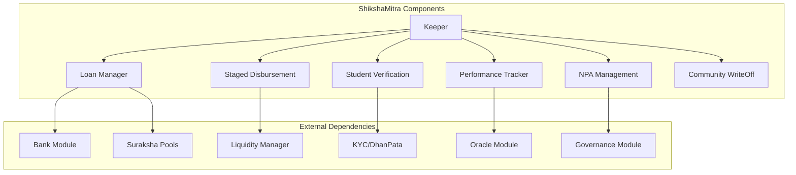
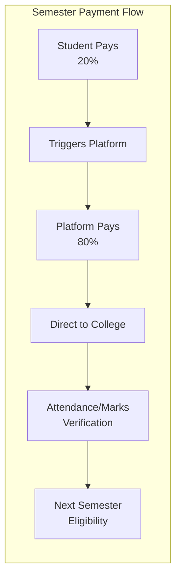
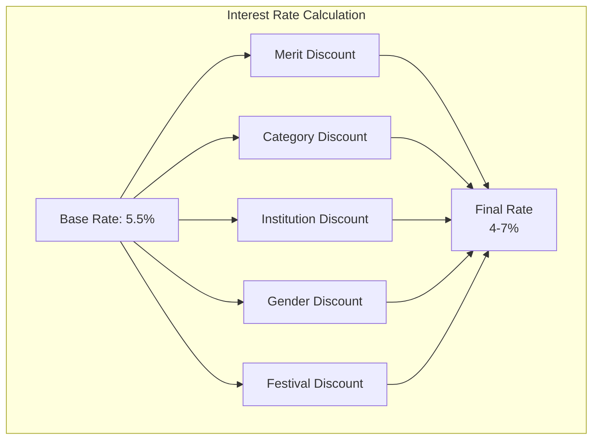
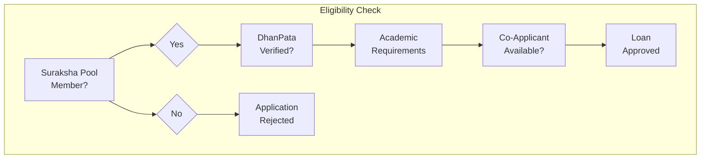
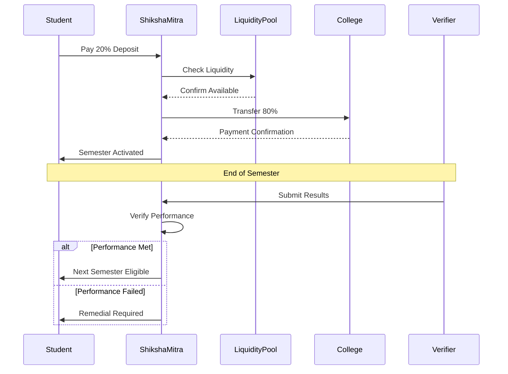
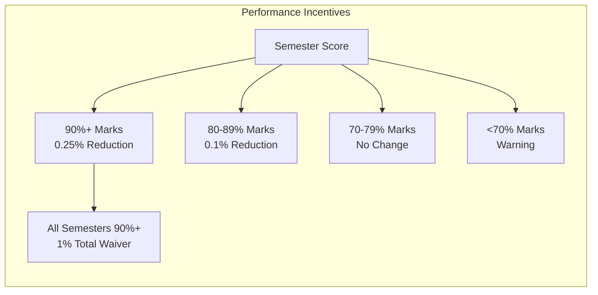
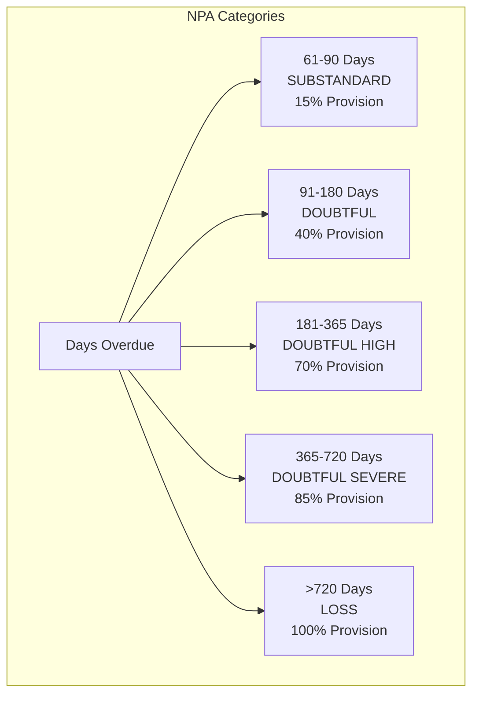
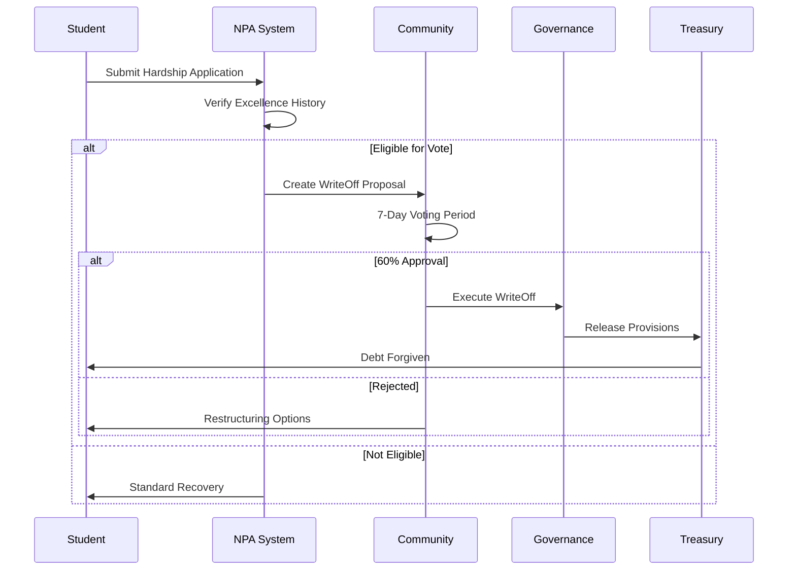

# ShikshaMitra Module Documentation

## Overview

The ShikshaMitra (Education Friend) module implements DeshChain's revolutionary blockchain-based education lending system. It offers interest rates of 4-7% (compared to 10-15% from banks), features innovative staged disbursement with 80-20 co-payment model, performance-based incentives, and community-governed writeoff mechanisms, making quality education accessible to all Indians.

## Module Architecture



## Revolutionary Features

### 1. Staged Disbursement System (80-20 Model)



**Key Benefits**:
- Prevents fund misuse
- Ensures education continuity
- Reduces default risk
- Motivates academic performance

### 2. Interest Rate Structure



**Discount Matrix**:

| Category | Discount | Criteria |
|----------|----------|----------|
| Merit 90%+ | -1.0% | Previous year marks |
| Merit 80-89% | -0.5% | Previous year marks |
| Merit 70-79% | -0.25% | Previous year marks |
| IIT/IIM/NIT | -1.5% | Premier institutions |
| Women Students | -0.5% | Gender equality |
| Reserved Category | -1.0% | Social inclusion |
| Festival Period | -0.25% | Special occasions |

## Loan Products

### 1. Undergraduate Loans

```go
type UndergraduateLoan struct {
    MaxAmount           sdk.Int   // 1000000 (₹10 Lakhs)
    CourseDuration      int32     // 3-4 years
    SemesterCount       int32     // 6-8 semesters
    BaseInterestRate    sdk.Dec   // 0.055 (5.5%)
    MoratoriumPeriod    int32     // Course + 6 months
}
```

### 2. Postgraduate Loans

```go
type PostgraduateLoan struct {
    MaxAmount           sdk.Int   // 2000000 (₹20 Lakhs)
    CourseDuration      int32     // 2 years
    SemesterCount       int32     // 4 semesters
    BaseInterestRate    sdk.Dec   // 0.05 (5%)
    MoratoriumPeriod    int32     // Course + 6 months
}
```

### 3. Professional Course Loans

```go
type ProfessionalLoan struct {
    MaxAmount           sdk.Int   // 1500000 (₹15 Lakhs)
    CourseTypes         []string  // ["MBA", "B.Tech", "M.Tech", "Medical"]
    SemesterCount       int32     // Varies by course
    BaseInterestRate    sdk.Dec   // 0.045 (4.5%)
    StipendAdjustment   bool      // For courses with stipends
}
```

### 4. Study Abroad Loans

```go
type StudyAbroadLoan struct {
    MaxAmount           sdk.Int   // 2000000 (₹20 Lakhs)
    CurrencySupport     []string  // ["USD", "EUR", "GBP", "AUD"]
    ForexProtection     bool      // Hedge against currency fluctuation
    BaseInterestRate    sdk.Dec   // 0.06 (6%)
    CollateralRequired  bool      // For amounts > ₹7.5 Lakhs
}
```

## Eligibility & Verification

### Student Eligibility Criteria



### Academic Requirements

```go
type AcademicRequirements struct {
    MinimumPercentage   sdk.Dec   // 50% for general courses
    MinimumAttendance   sdk.Dec   // 75% mandatory
    BacklogLimit        int32     // Maximum 2 active backlogs
    ProgressValidation  bool      // Semester-wise verification
}
```

## Staged Disbursement Implementation

### Disbursement Flow



### Semester-wise Fee Structure

```go
type SemesterFee struct {
    SemesterNumber      int32
    TotalFee            sdk.Coin
    StudentContribution sdk.Coin  // 20% of total
    PlatformShare       sdk.Coin  // 80% of total
    DueDate             time.Time
    PaymentStatus       PaymentStatus
}
```

## Performance-Based Incentives

### Academic Performance Rewards



### Interest Rate Adjustments

```go
func CalculatePerformanceDiscount(results []SemesterResult) sdk.Dec {
    totalDiscount := sdk.ZeroDec()
    excellentCount := 0
    
    for _, result := range results {
        if result.Percentage.GTE(sdk.NewDec(90)) && 
           result.Attendance.GTE(sdk.NewDec(75)) {
            totalDiscount = totalDiscount.Add(sdk.NewDecWithPrec(25, 4)) // 0.25%
            excellentCount++
        }
    }
    
    // Excellence bonus: All semesters 90%+
    if excellentCount == len(results) && len(results) >= 4 {
        totalDiscount = totalDiscount.Add(sdk.NewDec(1)) // Additional 1%
    }
    
    // Floor rate: 2% minimum
    if baseRate.Sub(totalDiscount).LT(sdk.NewDec(2)) {
        return sdk.NewDec(2)
    }
    
    return baseRate.Sub(totalDiscount)
}
```

## Community WriteOff Mechanism

### NPA Classification System



### Community Voting Process



### WriteOff Eligibility

```go
type WriteOffEligibility struct {
    // Academic Excellence History
    ExcellentSemesters  int32     // Minimum 2
    ExcellenceRate      sdk.Dec   // 60%+ of completed semesters
    AverageScore        sdk.Dec   // 80%+ overall
    
    // Community Standing
    PoolMembership      bool      // Must be active member
    MinimumStake        sdk.Int   // 500 NAMO for voting
    
    // Hardship Verification
    DocumentedHardship  bool      // Medical, family emergency, etc.
    EmploymentStatus    string    // Unemployed, underemployed
    
    // Voting Requirements
    QuorumRequired      sdk.Dec   // 30% of eligible voters
    ApprovalThreshold   sdk.Dec   // 60% yes votes
}
```

## Module Parameters

```go
type Params struct {
    // Interest Rates
    BaseInterestRate        sdk.Dec   // 0.055 (5.5%)
    MinInterestRate         sdk.Dec   // 0.02 (2%)
    MaxInterestRate         sdk.Dec   // 0.07 (7%)
    
    // Loan Limits
    MaxUndergraduateLoan    sdk.Int   // 1000000 (₹10 Lakhs)
    MaxPostgraduateLoan     sdk.Int   // 2000000 (₹20 Lakhs)
    MaxProfessionalLoan     sdk.Int   // 1500000 (₹15 Lakhs)
    MaxStudyAbroadLoan      sdk.Int   // 2000000 (₹20 Lakhs)
    
    // Disbursement
    StudentContribution     sdk.Dec   // 0.20 (20%)
    PlatformContribution    sdk.Dec   // 0.80 (80%)
    
    // Performance
    ExcellenceThreshold     sdk.Dec   // 0.90 (90%)
    MinAttendance           sdk.Dec   // 0.75 (75%)
    PerformanceDiscount     sdk.Dec   // 0.0025 (0.25%)
    
    // NPA Management
    SubstandardDays         int32     // 61 days
    DoubtfulDays            int32     // 91 days
    LossDays                int32     // 720 days
    
    // Community Voting
    VotingPeriod            int64     // 604800 (7 days)
    QuorumRequired          sdk.Dec   // 0.30 (30%)
    ApprovalThreshold       sdk.Dec   // 0.60 (60%)
}
```

## Transaction Types

### 1. MsgApplyEducationLoan
Initial loan application.

```go
type MsgApplyEducationLoan struct {
    Student             string
    CoApplicant         string
    CourseType          CourseType
    InstitutionName     string
    CourseDuration      int32
    TotalCourseFee      sdk.Coin
    AcademicRecord      AcademicRecord
}
```

### 2. MsgRequestSemesterDisbursement
Semester-wise disbursement request.

```go
type MsgRequestSemesterDisbursement struct {
    Student             string
    LoanID              string
    SemesterNumber      int32
    SemesterFee         sdk.Coin
    StudentPayment      sdk.Coin    // 20% deposit proof
    CollegeAccount      string
}
```

### 3. MsgSubmitPerformance
Submit semester performance for incentives.

```go
type MsgSubmitPerformance struct {
    Authority           string       // College/University
    Student             string
    LoanID              string
    SemesterNumber      int32
    MarksPercentage     sdk.Dec
    Attendance          sdk.Dec
    ResultHash          string
}
```

### 4. MsgInitiateWriteOff
Initiate community writeoff process.

```go
type MsgInitiateWriteOff struct {
    Student             string
    LoanID              string
    HardshipCategory    string
    Documentation       []string
    RequestedRelief     sdk.Dec      // Percentage of loan
}
```

### 5. MsgVoteWriteOff
Community vote on writeoff proposal.

```go
type MsgVoteWriteOff struct {
    Voter               string
    ProposalID          string
    Vote                VoteOption   // YES, NO, ABSTAIN
    Justification       string
}
```

## Query Endpoints

### 1. QueryLoanDetails
Get education loan details.

**Request**: `/deshchain/shikshamitra/v1/loan/{loan_id}`

**Response**:
```json
{
  "loan": {
    "id": "EDU-2024-001",
    "student": "deshchain1...",
    "course_type": "ENGINEERING",
    "institution": "IIT Delhi",
    "total_sanctioned": "800000",
    "disbursed_amount": "400000",
    "current_semester": 5,
    "interest_rate": "4.5%",
    "performance_discount": "0.75%",
    "repayment_start": "2026-01-01"
  }
}
```

### 2. QueryDisbursementSchedule
Get semester disbursement schedule.

**Request**: `/deshchain/shikshamitra/v1/disbursement-schedule/{loan_id}`

**Response**:
```json
{
  "schedule": [
    {
      "semester": 1,
      "total_fee": "100000",
      "student_share": "20000",
      "platform_share": "80000",
      "status": "COMPLETED",
      "payment_date": "2024-01-15"
    },
    {
      "semester": 2,
      "total_fee": "100000",
      "student_share": "20000",
      "platform_share": "80000",
      "status": "PENDING",
      "due_date": "2024-07-15"
    }
  ]
}
```

### 3. QueryPerformanceHistory
Get student performance history.

**Request**: `/deshchain/shikshamitra/v1/performance/{loan_id}`

**Response**:
```json
{
  "performance": {
    "overall_average": "85.5%",
    "excellent_semesters": 3,
    "total_discount_earned": "1.0%",
    "current_interest_rate": "4.5%",
    "semesters": [
      {
        "number": 1,
        "percentage": "92%",
        "attendance": "85%",
        "discount_earned": "0.25%"
      }
    ]
  }
}
```

### 4. QueryNPAStatus
Get NPA classification status.

**Request**: `/deshchain/shikshamitra/v1/npa-status`

**Response**:
```json
{
  "npa_summary": {
    "total_loans": 10000,
    "performing_loans": 9500,
    "substandard": 300,
    "doubtful": 150,
    "loss": 50,
    "provision_required": "5000000",
    "writeoff_proposals_active": 5
  }
}
```

### 5. QueryWriteOffProposal
Get writeoff proposal details.

**Request**: `/deshchain/shikshamitra/v1/writeoff/{proposal_id}`

**Response**:
```json
{
  "proposal": {
    "id": "WRITEOFF-2024-001",
    "student": "deshchain1...",
    "loan_amount": "500000",
    "outstanding": "450000",
    "requested_relief": "315000",
    "hardship_reason": "medical_emergency",
    "excellence_score": "85%",
    "votes": {
      "yes": 1200,
      "no": 300,
      "abstain": 100
    },
    "status": "VOTING",
    "ends_at": "2024-07-29T00:00:00Z"
  }
}
```

## Events

### 1. Loan Sanctioned Event
```json
{
  "type": "education_loan_sanctioned",
  "attributes": [
    {"key": "loan_id", "value": "EDU-2024-001"},
    {"key": "student", "value": "{address}"},
    {"key": "amount", "value": "800000"},
    {"key": "interest_rate", "value": "4.5%"},
    {"key": "institution", "value": "IIT Delhi"}
  ]
}
```

### 2. Disbursement Event
```json
{
  "type": "semester_disbursed",
  "attributes": [
    {"key": "loan_id", "value": "EDU-2024-001"},
    {"key": "semester", "value": "5"},
    {"key": "student_paid", "value": "20000"},
    {"key": "platform_paid", "value": "80000"},
    {"key": "college_account", "value": "{address}"}
  ]
}
```

### 3. Performance Reward Event
```json
{
  "type": "performance_discount_applied",
  "attributes": [
    {"key": "loan_id", "value": "EDU-2024-001"},
    {"key": "semester", "value": "4"},
    {"key": "marks", "value": "92%"},
    {"key": "discount", "value": "0.25%"},
    {"key": "new_rate", "value": "4.25%"}
  ]
}
```

### 4. WriteOff Approved Event
```json
{
  "type": "writeoff_approved",
  "attributes": [
    {"key": "proposal_id", "value": "WRITEOFF-2024-001"},
    {"key": "loan_id", "value": "EDU-2023-100"},
    {"key": "amount_forgiven", "value": "315000"},
    {"key": "votes_yes", "value": "1200"},
    {"key": "votes_no", "value": "300"}
  ]
}
```

## Success Metrics

### Platform Statistics
- Average interest rate: 5.2% (vs 12% market)
- Default rate: <2% (vs 8-10% banks)
- Student satisfaction: 95%
- Average processing time: 48 hours
- Semester completion rate: 92%

### Student Benefits
- Interest savings: ₹2-5 Lakhs per loan
- No hidden charges
- Performance rewards up to 2% discount
- Community support for genuine hardship
- Direct college payments prevent misuse

## Integration Benefits

### 1. With Suraksha Pools
- Only pool members eligible
- Liquidity from unified pool
- Community governance
- Shared risk management

### 2. With DhanPata KYC
- Instant verification
- Paperless process
- Secure documentation
- Co-applicant validation

### 3. With Performance Oracle
- Automated result verification
- Real-time discount calculation
- Transparent tracking
- Merit recognition

## Best Practices

### For Students
1. **Join Suraksha Pool First**: Essential for eligibility
2. **Maintain Excellence**: Maximize discounts
3. **Pay 20% Promptly**: Unlock platform payment
4. **Track Performance**: Monitor discount eligibility
5. **Document Hardship**: If facing genuine difficulties

### For Institutions
1. **Direct Integration**: Receive payments directly
2. **Result Submission**: Enable student rewards
3. **Verify Attendance**: Ensure eligibility
4. **Support Students**: Help in difficulty
5. **Maintain Standards**: Quality education

### For Community Members
1. **Active Participation**: Vote on proposals
2. **Fair Assessment**: Consider merit and hardship
3. **Stake Tokens**: Maintain voting eligibility
4. **Monitor NPAs**: Protect pool health
5. **Support Excellence**: Reward good students

## CLI Commands

### Query Commands
```bash
# Query loan details
deshchaind query shikshamitra loan [loan-id]

# Check disbursement schedule
deshchaind query shikshamitra disbursement-schedule [loan-id]

# View performance history
deshchaind query shikshamitra performance [loan-id]

# Check NPA status
deshchaind query shikshamitra npa-status

# View writeoff proposal
deshchaind query shikshamitra writeoff [proposal-id]
```

### Transaction Commands
```bash
# Apply for education loan
deshchaind tx shikshamitra apply-loan \
  --course [type] \
  --institution [name] \
  --duration [years] \
  --total-fee [amount] \
  --from [key]

# Request semester disbursement
deshchaind tx shikshamitra request-disbursement \
  --loan-id [id] \
  --semester [number] \
  --fee [amount] \
  --payment-proof [hash] \
  --from [key]

# Submit performance results (institution)
deshchaind tx shikshamitra submit-performance \
  --loan-id [id] \
  --semester [number] \
  --marks [percentage] \
  --attendance [percentage] \
  --from [key]

# Initiate writeoff (student)
deshchaind tx shikshamitra initiate-writeoff \
  --loan-id [id] \
  --reason [category] \
  --relief [percentage] \
  --docs [hashes] \
  --from [key]

# Vote on writeoff (community)
deshchaind tx shikshamitra vote-writeoff \
  --proposal [id] \
  --vote [yes|no|abstain] \
  --reason [text] \
  --from [key]
```

## FAQ

**Q: Why must I be a Suraksha Pool member?**
A: Pool membership ensures community participation, provides liquidity, and creates shared responsibility for loan performance.

**Q: How does the 80-20 model work?**
A: You pay 20% of semester fees upfront, which triggers the platform to pay the remaining 80% directly to your college.

**Q: Can I get a loan for any course?**
A: Most recognized courses are eligible. Premier institutions get additional discounts.

**Q: What happens if I can't repay?**
A: If you have excellent academic history and genuine hardship, the community can vote to write off part of your loan.

**Q: How are interest rates so low?**
A: Blockchain efficiency, no middlemen, community governance, and performance incentives reduce costs and risks.

---

For more information, see the [Module Overview](../MODULE_OVERVIEW.md) or explore other [DeshChain Modules](../MODULE_OVERVIEW.md#module-categories).