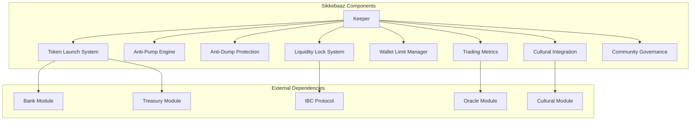
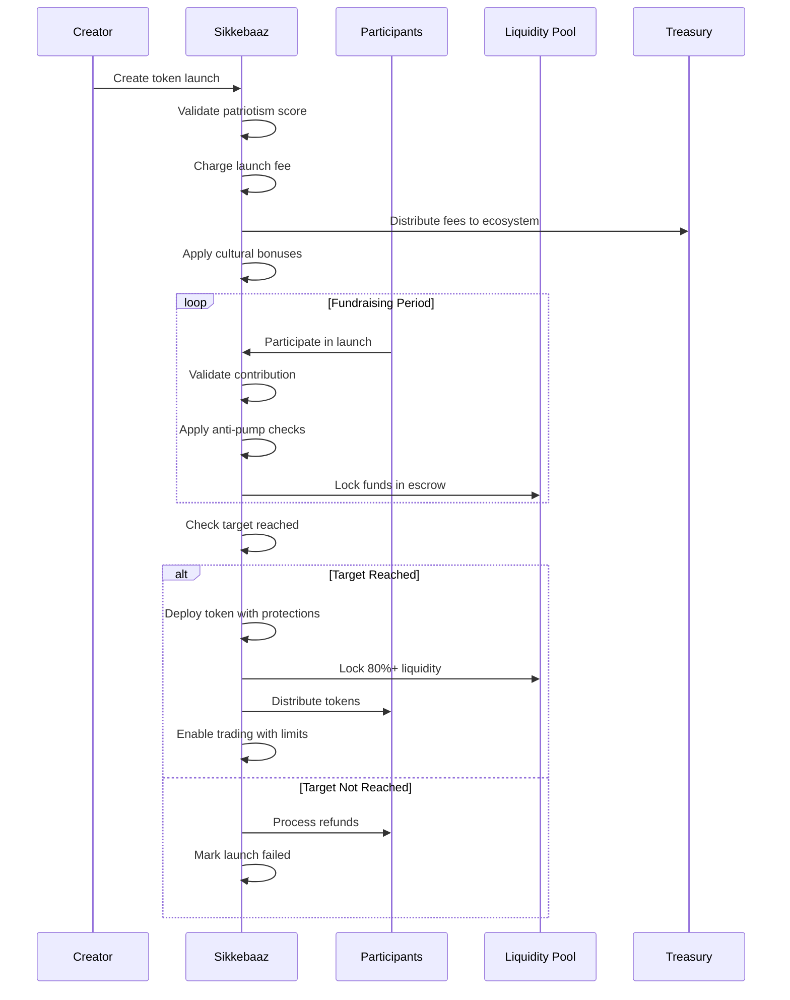
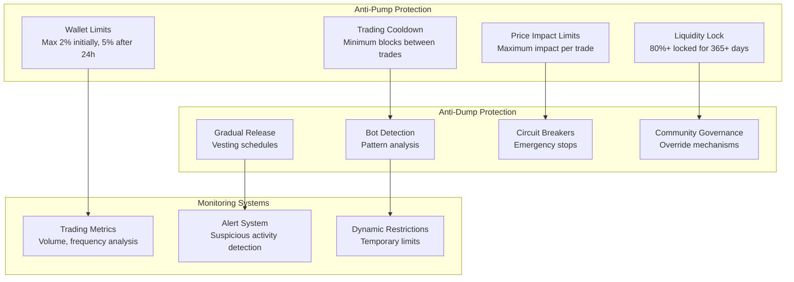

# Sikkebaaz Module Documentation

## Overview

The Sikkebaaz module provides DeshChain's revolutionary memecoin launchpad with comprehensive anti-pump & dump protection. Named after the Hindi term for "coin maker," it enables community-driven token creation while implementing the industry's most advanced investor protection mechanisms, cultural integration, and charity allocation system.

## Module Architecture



## Token Launch System

### 1. Launch Lifecycle



### 2. Token Launch Structure

```go
type TokenLaunch struct {
    LaunchID              string         // Unique launch identifier
    Creator               string         // Creator wallet address
    
    // Token Information
    TokenName             string         // "DesiCoin"
    TokenSymbol           string         // "DESI"
    TokenDescription      string         // Token description
    TokenLogo             string         // IPFS hash of logo
    Decimals              uint32         // Token decimals (default 18)
    TotalSupply           sdk.Int        // Total token supply
    
    // Launch Configuration
    LaunchType            string         // public, whitelist, private
    TargetAmount          sdk.Int        // Fundraising target (in NAMO)
    MinContribution       sdk.Int        // Minimum contribution per wallet
    MaxContribution       sdk.Int        // Maximum contribution per wallet
    LaunchDuration        time.Duration  // Launch duration
    TradingDelay          uint64         // Delay before trading starts (seconds)
    
    // Anti-Pump Configuration
    AntiPumpConfig        AntiPumpConfig // Comprehensive protection config
    
    // Geographic & Cultural
    CreatorPincode        string         // Creator's PIN code
    CulturalTheme         string         // Cultural theme
    CulturalQuote         string         // Associated cultural quote
    PatriotismScore       uint32         // Creator's patriotism score
    
    // Financial Tracking
    RaisedAmount          sdk.Int        // Current raised amount
    ParticipantCount      uint64         // Number of participants
    LaunchFee             sdk.Int        // Platform fee paid
    CharityAllocation     sdk.Int        // Local charity allocation
    
    // Festival Integration
    FestivalBonus         bool           // Festival bonus applied
    FestivalName          string         // Active festival name
    
    // Status & Timestamps
    Status                LaunchStatus   // Current status
    CreatedAt             time.Time      // Creation timestamp
    UpdatedAt             time.Time      // Last update
    LaunchStartTime       time.Time      // Launch start time
    LaunchEndTime         time.Time      // Launch end time
    CompletedAt           *time.Time     // Completion time
    
    // Governance
    Whitelist             []string       // Whitelisted addresses
    TeamTokens            []TeamAllocation // Team token allocations
    VestingSchedule       []VestingPeriod  // Vesting schedule
}
```

### 3. Launch Types

```go
const (
    LaunchTypePublic    = "public"     // Open to everyone
    LaunchTypeWhitelist = "whitelist"  // Whitelist-only participation
    LaunchTypePrivate   = "private"    // Invitation-only
    LaunchTypeFair      = "fair"       // No pre-allocations, fair launch
)

const (
    LaunchStatusPending    = "pending"     // Being prepared
    LaunchStatusActive     = "active"      // Currently fundraising
    LaunchStatusSuccessful = "successful"  // Target reached, deployed
    LaunchStatusFailed     = "failed"      // Target not reached
    LaunchStatusCancelled  = "cancelled"   // Cancelled by creator
    LaunchStatusRefunded   = "refunded"    // Funds refunded
)
```

## Anti-Pump & Dump Protection

### 1. Comprehensive Protection Framework



### 2. Anti-Pump Configuration

```go
type AntiPumpConfig struct {
    // Wallet Limits
    MaxWalletPercent      uint32    // Max wallet % of supply (basis points)
    MaxWalletPercentAfter uint32    // Max wallet % after 24h (basis points)
    
    // Trading Restrictions
    CooldownPeriod        uint64    // Seconds between sells
    MaxDailySellPercent   uint32    // Max daily sell % per wallet
    MaxPriceImpact        sdk.Dec   // Maximum price impact per trade
    
    // Liquidity Protection
    MinLiquidityPercent   uint32    // Minimum liquidity to lock (%)
    LiquidityLockDays     uint32    // Days to lock liquidity
    
    // Bot Protection
    MinBlocksBetweenTx    uint32    // Minimum blocks between transactions
    MaxTxPerBlock         uint32    // Maximum transactions per block
    
    // Emergency Features
    CircuitBreakerEnabled bool      // Enable emergency stops
    MaxVolatility         sdk.Dec   // Maximum price volatility
    SuspiciousActivityThreshold uint32 // Violation count threshold
}
```

### 3. Wallet Limits System

```go
type WalletLimits struct {
    TokenAddress     string    // Token contract address
    WalletAddress    string    // Wallet address
    MaxAmount        sdk.Int   // Maximum tokens this wallet can hold
    CurrentAmount    sdk.Int   // Current token balance
    LastTxTime       time.Time // Last transaction timestamp
    LastTxBlock      int64     // Last transaction block height
    ViolationCount   uint32    // Number of violations
    IsRestricted     bool      // Temporary restriction status
    RestrictedUntil  time.Time // Restriction expiry
}

// Dynamic wallet limits based on launch stage
func (tl *TokenLaunch) GetCurrentWalletLimit(currentTime time.Time) uint32 {
    if tl.CompletedAt == nil {
        return tl.AntiPumpConfig.MaxWalletPercent // 200 basis points = 2%
    }
    
    hoursSinceLaunch := currentTime.Sub(*tl.CompletedAt).Hours()
    if hoursSinceLaunch < 24 {
        return tl.AntiPumpConfig.MaxWalletPercent        // 2% for first 24h
    }
    
    return tl.AntiPumpConfig.MaxWalletPercentAfter       // 5% after 24h
}
```

### 4. Trading Validation Process

```go
func (k Keeper) ValidateAntiPumpTrade(
    ctx sdk.Context,
    tokenAddress, trader string,
    amount sdk.Int,
    isSource bool,
) error {
    // 1. Check wallet restrictions
    walletLimits, _ := k.getWalletLimits(ctx, tokenAddress, trader)
    if walletLimits.IsRestricted {
        return types.ErrWalletLimitExceeded
    }
    
    // 2. Check block-based cooldown (bot protection)
    blocksSinceLastTx := ctx.BlockHeight() - walletLimits.LastTxBlock
    if blocksSinceLastTx < int64(types.MinBlocksBetweenTx) {
        walletLimits.ViolationCount++
        if walletLimits.ViolationCount >= 3 {
            walletLimits.IsRestricted = true
            return types.ErrBotDetected
        }
    }
    
    // 3. Check wallet limits for buy transactions
    if !isSource {
        newAmount := walletLimits.CurrentAmount.Add(amount)
        if newAmount.GT(walletLimits.MaxAmount) {
            return types.ErrWalletLimitExceeded
        }
    }
    
    // 4. Check cooldown for sell transactions
    if isSource {
        launch, _ := k.getTokenLaunchByAddress(ctx, tokenAddress)
        timeSinceLastTx := ctx.BlockTime().Sub(walletLimits.LastTxTime)
        if timeSinceLastTx.Seconds() < float64(launch.AntiPumpConfig.CooldownPeriod) {
            return types.ErrCooldownPeriodActive
        }
    }
    
    // 5. Check price impact
    if err := k.ValidatePriceImpact(ctx, tokenAddress, amount); err != nil {
        return err
    }
    
    return nil
}
```

## Liquidity Lock System

### 1. Automated Liquidity Locking

```go
type LiquidityLock struct {
    TokenAddress     string    // Token address
    LockOwner        string    // Lock owner (creator)
    LPTokenAddress   string    // LP token address
    LockedAmount     sdk.Int   // Amount of liquidity locked
    LockDate         time.Time // When locked
    UnlockDate       time.Time // When unlockable
    IsWithdrawn      bool      // Whether withdrawn
    LockType         string    // "launch", "additional", "extended"
    Description      string    // Lock description
}

// Minimum 80% liquidity lock for 365 days
func (k Keeper) lockLaunchLiquidity(
    ctx sdk.Context,
    launch *types.TokenLaunch,
) error {
    // Calculate minimum liquidity to lock (80%)
    minLockPercent := launch.AntiPumpConfig.MinLiquidityPercent
    liquidityAmount := launch.RaisedAmount.MulRaw(int64(minLockPercent)).QuoRaw(100)
    
    // Create liquidity lock
    lock := types.LiquidityLock{
        TokenAddress:   launch.TokenSymbol,
        LockOwner:      launch.Creator,
        LPTokenAddress: launch.TokenSymbol + "-NAMO-LP",
        LockedAmount:   liquidityAmount,
        LockDate:       ctx.BlockTime(),
        UnlockDate:     ctx.BlockTime().AddDate(0, 0, int(launch.AntiPumpConfig.LiquidityLockDays)),
        IsWithdrawn:    false,
        LockType:       "launch",
        Description:    fmt.Sprintf("Launch liquidity lock for %s", launch.TokenName),
    }
    
    k.setLiquidityLock(ctx, lock)
    return nil
}
```

## Cultural Integration

### 1. Cultural Theme System

Sikkebaaz integrates deep cultural elements into token launches:

```go
type CulturalTheme struct {
    ThemeID          string   // "diwali", "holi", "independence"
    ThemeName        string   // "Diwali Prosperity"
    Description      string   // Theme description
    AvailableQuotes  []string // Cultural quotes for this theme
    BonusMultiplier  sdk.Dec  // Bonus multiplier for this theme
    SeasonalBonus    bool     // Whether seasonal bonus applies
    RegionalRelevance map[string]bool // PIN code regions where relevant
}

// Cultural quote integration
type CulturalQuote struct {
    QuoteID      string // Unique quote identifier
    Text         string // Hindi/Sanskrit text
    Translation  string // English translation
    Author       string // Author/source
    Theme        string // Associated theme
    Region       string // Regional relevance
    Festival     string // Associated festival
    Context      string // When to use
}
```

### 2. Patriotism Score System

```go
const (
    MinPatriotismScore = 50  // Minimum required score
    MaxPatriotismScore = 100 // Maximum possible score
)

type PatriotismScore struct {
    WalletAddress      string    // User wallet
    BaseScore          uint32    // Base patriotism score
    CulturalActivity   uint32    // Cultural participation bonus
    CommunityService   uint32    // Community service bonus
    LocalContribution  uint32    // Local charity contribution bonus
    FestivalParticipation uint32 // Festival participation bonus
    TotalScore         uint32    // Final calculated score
    LastUpdated        time.Time // Last score update
    ScoreHistory       []ScoreUpdate // Score change history
}

// Patriotism score calculation factors:
// - Cultural module participation (+10-20 points)
// - Local NGO donations (+5-15 points)  
// - Festival participation (+5-10 points)
// - Community governance participation (+5-10 points)
// - Educational contributions (+3-8 points)
// - Local business support (+2-5 points)
```

### 3. Festival Bonus System

```go
type FestivalBonus struct {
    LaunchID      string    // Associated launch
    FestivalName  string    // Festival name
    BonusRate     sdk.Dec   // Bonus percentage
    BonusAmount   sdk.Int   // Bonus amount granted
    AppliedAt     time.Time // When applied
    CulturalQuote string    // Associated quote
    ThemeColors   []string  // UI theme colors
    SpecialOffers []string  // Special launch offers
}

// Active festivals get 10% bonus to target amount
func (k Keeper) applyFestivalBonus(ctx sdk.Context, launch *types.TokenLaunch) {
    if k.culturalKeeper.IsActiveFestival(ctx) {
        festivalName := k.culturalKeeper.GetCurrentFestival(ctx)
        bonusRate := sdk.MustNewDecFromStr("0.10") // 10%
        
        bonusAmount := launch.TargetAmount.ToDec().Mul(bonusRate).TruncateInt()
        launch.TargetAmount = launch.TargetAmount.Add(bonusAmount)
        launch.FestivalBonus = true
    }
}
```

## Community Governance

### 1. Launch Governance Model

```go
type LaunchGovernance struct {
    LaunchID           string              // Associated launch
    GovernanceType     string              // "creator", "community", "dao"
    VotingPower        map[string]sdk.Dec  // Voting power by holder
    Proposals          []GovernanceProposal // Active proposals
    EmergencyMultisig  []string            // Emergency multisig signers
    CommunityOverride  bool                // Community can override creator
    MinVotingThreshold sdk.Dec             // Minimum voting threshold
}

type GovernanceProposal struct {
    ProposalID      string                 // Unique proposal ID
    ProposalType    string                 // Type of proposal
    Title           string                 // Proposal title
    Description     string                 // Detailed description
    Proposer        string                 // Who proposed
    VotingPeriod    time.Duration          // Voting duration
    Votes           map[string]VoteOption  // Votes cast
    Status          ProposalStatus         // Current status
    ExecutionTime   *time.Time             // When executed
}

const (
    ProposalTypeExtendLock     = "extend_liquidity_lock"
    ProposalTypeAddLiquidity   = "add_liquidity"
    ProposalTypeUpdateLimits   = "update_wallet_limits"
    ProposalTypeEmergencyStop  = "emergency_stop"
    ProposalTypeBurnTokens     = "burn_tokens"
    ProposalTypeCharityDonation = "charity_donation"
)
```

### 2. Creator Rewards System

```go
type CreatorReward struct {
    Creator           string    // Creator address
    TokenAddress      string    // Token address
    RewardRate        sdk.Dec   // Reward rate (0.1% of trading volume)
    AccumulatedReward sdk.Int   // Unclaimed rewards
    LastClaimedAt     time.Time // Last claim timestamp
    TotalClaimed      sdk.Int   // Total rewards claimed
    IsActive          bool      // Reward system active
}

// Creators earn 0.1% of all trading volume on their token
func (k Keeper) updateCreatorRewards(
    ctx sdk.Context,
    tokenAddress string,
    tradingVolume sdk.Int,
) {
    reward, found := k.getCreatorReward(ctx, tokenAddress)
    if !found {
        return
    }
    
    newReward := tradingVolume.ToDec().Mul(reward.RewardRate).TruncateInt()
    reward.AccumulatedReward = reward.AccumulatedReward.Add(newReward)
    
    k.setCreatorReward(ctx, reward)
}
```

## Transaction Types

### 1. MsgCreateTokenLaunch
Create a new token launch.

```go
type MsgCreateTokenLaunch struct {
    Creator              string        // Creator address
    TokenName            string        // Token name
    TokenSymbol          string        // Token symbol
    TokenDescription     string        // Token description
    TokenLogo            string        // IPFS hash of logo
    TotalSupply          sdk.Int       // Total supply
    TargetAmount         sdk.Int       // Fundraising target
    LaunchType           string        // Launch type
    LaunchDuration       time.Duration // Launch duration
    MinContribution      sdk.Int       // Minimum contribution
    MaxContribution      sdk.Int       // Maximum contribution
    AntiPumpConfig       AntiPumpConfig // Anti-pump configuration
    CulturalTheme        string        // Cultural theme
    CreatorPincode       string        // Creator PIN code
    Whitelist            []string      // Whitelist (if applicable)
    TeamAllocations      []TeamAllocation // Team allocations
}
```

### 2. MsgParticipateInLaunch
Participate in a token launch.

```go
type MsgParticipateInLaunch struct {
    Participant      string   // Participant address
    LaunchID         string   // Launch identifier
    ContributionAmount sdk.Int // Contribution amount in NAMO
    ReferralCode     string   // Referral code (optional)
}
```

### 3. MsgClaimTokens
Claim purchased tokens after successful launch.

```go
type MsgClaimTokens struct {
    Claimer          string   // Claimer address
    LaunchID         string   // Launch identifier
    ClaimAmount      sdk.Int  // Amount to claim (optional, default all)
}
```

## Query Endpoints

### 1. QueryTokenLaunch
Get token launch details.

**Request**: `/deshchain/sikkebaaz/v1/launch/{launch_id}`

**Response**:
```json
{
  "token_launch": {
    "launch_id": "LAUNCH-001",
    "creator": "deshchain1...",
    "token_name": "DesiCoin",
    "token_symbol": "DESI",
    "token_description": "The ultimate desi memecoin celebrating Indian culture",
    "total_supply": "1000000000000000000000000000",
    "target_amount": "50000000000 unamo",
    "raised_amount": "35000000000 unamo",
    "participant_count": 1247,
    "status": "active",
    "cultural_theme": "independence_day",
    "cultural_quote": "स्वराज्य मेरा जन्मसिद्ध अधिकार है",
    "patriotism_score": 85,
    "festival_bonus": true,
    "launch_end_time": "2024-08-15T23:59:59Z",
    "anti_pump_config": {
      "max_wallet_percent": 200,
      "cooldown_period": 300,
      "min_liquidity_percent": 80,
      "liquidity_lock_days": 365
    }
  }
}
```

### 2. QueryAntiPumpStatus
Get anti-pump protection status for a token.

**Request**: `/deshchain/sikkebaaz/v1/antipump/{token_address}`

**Response**:
```json
{
  "anti_pump_status": {
    "token_address": "DESI",
    "is_liquidity_locked": true,
    "liquidity_lock_expires": "2025-08-15T10:00:00Z",
    "wallet_limit_percent": 200,
    "cooldown_period": 300,
    "trading_enabled": true,
    "price_impact_limit": "0.05",
    "circuit_breaker_active": false,
    "trading_metrics": {
      "total_volume": "1000000000000 unamo",
      "daily_volume": "50000000000 unamo",
      "total_trades": 15678,
      "unique_traders": 3456,
      "current_price": "0.00005",
      "market_cap": "50000000000000 unamo"
    }
  }
}
```

### 3. QueryWalletLimits
Get wallet limits for a specific token and wallet.

**Request**: `/deshchain/sikkebaaz/v1/wallet-limits/{token_address}/{wallet_address}`

**Response**:
```json
{
  "wallet_limits": {
    "token_address": "DESI",
    "wallet_address": "deshchain1...",
    "max_amount": "20000000000000000000000000",
    "current_amount": "15000000000000000000000000",
    "is_restricted": false,
    "violation_count": 0,
    "last_tx_time": "2024-07-25T14:30:00Z",
    "can_buy_amount": "5000000000000000000000000",
    "cooldown_remaining": 0
  }
}
```

### 4. QueryLaunchStatistics
Get overall Sikkebaaz platform statistics.

**Request**: `/deshchain/sikkebaaz/v1/stats`

**Response**:
```json
{
  "platform_stats": {
    "total_launches": 1247,
    "successful_launches": 1156,
    "total_raised": "125000000000000 unamo",
    "total_participants": 45678,
    "total_charity_donated": "12500000000000 unamo",
    "average_success_rate": "92.7",
    "total_tokens_created": 1156,
    "total_liquidity_locked": "100000000000000 unamo",
    "anti_pump_violations_prevented": 15234,
    "top_cultural_themes": [
      {"theme": "independence_day", "launches": 234},
      {"theme": "diwali", "launches": 189},
      {"theme": "holi", "launches": 156}
    ]
  }
}
```

## Events

### 1. Token Launch Events
```json
{
  "type": "token_launched",
  "attributes": [
    {"key": "launch_id", "value": "LAUNCH-001"},
    {"key": "creator", "value": "deshchain1..."},
    {"key": "token_symbol", "value": "DESI"},
    {"key": "target_amount", "value": "50000000000 unamo"},
    {"key": "cultural_theme", "value": "independence_day"},
    {"key": "pincode", "value": "110001"}
  ]
}
```

### 2. Anti-Pump Protection Events
```json
{
  "type": "anti_pump_violation_prevented",
  "attributes": [
    {"key": "token_address", "value": "DESI"},
    {"key": "violator", "value": "deshchain1..."},
    {"key": "violation_type", "value": "wallet_limit_exceeded"},
    {"key": "attempted_amount", "value": "100000000000000000000000000"},
    {"key": "max_allowed", "value": "20000000000000000000000000"}
  ]
}
```

## Best Practices

### For Token Creators
1. **Cultural Integration**: Choose meaningful cultural themes and quotes
2. **Patriotism Score**: Maintain high patriotism score through community participation
3. **Anti-Pump Config**: Set reasonable protection parameters
4. **Community Engagement**: Build genuine community before and after launch
5. **Local Impact**: Support local causes through PIN code-based charity allocation

### For Participants
1. **Due Diligence**: Research token utility and community
2. **Cultural Values**: Support projects aligned with positive cultural values
3. **Contribution Limits**: Stay within anti-pump wallet limits
4. **Long-term Holding**: Understand vesting and trading restrictions
5. **Community Participation**: Engage in token governance

### For Developers
1. **Anti-Pump Integration**: Respect and enforce protection mechanisms
2. **Cultural Sensitivity**: Handle cultural themes appropriately
3. **Security First**: Implement additional security layers
4. **Community Tools**: Build tools for community governance
5. **Analytics**: Provide transparency through metrics and reporting

## CLI Commands

### Query Commands
```bash
# View token launch
deshchaind query sikkebaaz launch [launch-id]

# Check anti-pump status
deshchaind query sikkebaaz antipump [token-address]

# View wallet limits
deshchaind query sikkebaaz wallet-limits [token-address] [wallet-address]

# Check platform statistics
deshchaind query sikkebaaz stats

# View creator rewards
deshchaind query sikkebaaz creator-rewards [creator-address]
```

### Transaction Commands
```bash
# Create token launch
deshchaind tx sikkebaaz create-launch \
  --token-name "DesiCoin" \
  --token-symbol "DESI" \
  --total-supply 1000000000000000000000000000 \
  --target-amount 50000000000unamo \
  --cultural-theme independence_day \
  --pincode 110001 \
  --launch-type public \
  --from [creator-key]

# Participate in launch
deshchaind tx sikkebaaz participate \
  --launch-id LAUNCH-001 \
  --amount 1000000000unamo \
  --from [participant-key]

# Claim tokens
deshchaind tx sikkebaaz claim-tokens \
  --launch-id LAUNCH-001 \
  --from [participant-key]
```

## Integration Examples

### Token Launch Creation
```javascript
import { SikkebaazClient } from '@deshchain/sikkebaaz-sdk'

async function createTokenLaunch() {
  const client = new SikkebaazClient(rpcEndpoint)
  
  // Create culturally integrated token launch
  const launch = await client.createTokenLaunch({
    tokenName: 'DesiCoin',
    tokenSymbol: 'DESI',
    tokenDescription: 'Celebrating Indian entrepreneurship',
    totalSupply: '1000000000000000000000000000',
    targetAmount: { denom: 'unamo', amount: '50000000000' },
    culturalTheme: 'independence_day',
    culturalQuote: 'स्वराज्य मेरा जन्मसिद्ध अधिकार है',
    creatorPincode: '110001',
    antiPumpConfig: {
      maxWalletPercent: 200,        // 2%
      cooldownPeriod: 300,          // 5 minutes
      minLiquidityPercent: 80,      // 80%
      liquidityLockDays: 365        // 1 year
    }
  })
  
  console.log(`Launch created: ${launch.launchId}`)
  console.log(`Cultural quote: ${launch.culturalQuote}`)
}
```

### Anti-Pump Monitoring
```javascript
async function monitorAntiPumpStatus() {
  const client = new SikkebaazClient(rpcEndpoint)
  
  // Check anti-pump protection status
  const status = await client.getAntiPumpStatus('DESI')
  
  console.log(`Liquidity locked: ${status.isLiquidityLocked}`)
  console.log(`Wallet limit: ${status.walletLimitPercent / 100}%`)
  console.log(`Trading enabled: ${status.tradingEnabled}`)
  
  // Check if user can make a trade
  const walletLimits = await client.getWalletLimits('DESI', userAddress)
  const canBuyAmount = walletLimits.maxAmount - walletLimits.currentAmount
  
  console.log(`Can buy up to: ${canBuyAmount} tokens`)
}
```

## FAQ

**Q: How does Sikkebaaz prevent pump and dump schemes?**
A: Through comprehensive protection: wallet limits (2-5% max), liquidity locks (80%+ for 1+ years), trading cooldowns, price impact limits, and bot detection.

**Q: What makes Sikkebaaz different from other launchpads?**
A: Cultural integration, patriotism score requirements, local charity allocation, festival bonuses, and the industry's strongest anti-pump protection.

**Q: How is the patriotism score calculated?**
A: Based on cultural participation, community service, local contributions, festival participation, and governance engagement.

**Q: Can wallet limits be bypassed?**
A: No, limits are enforced at the blockchain level and automatically adjust based on time since launch and community governance.

**Q: How does the charity allocation work?**
A: 2-5% of raised funds automatically go to verified NGOs in the creator's PIN code area through the Treasury module.

**Q: What happens if a launch fails to reach its target?**
A: All participant funds are automatically refunded, and no tokens are created. Launch fees are non-refundable.

---

For more information, see the [Module Overview](../MODULE_OVERVIEW.md) or explore other [DeshChain Modules](../MODULE_OVERVIEW.md#module-categories).