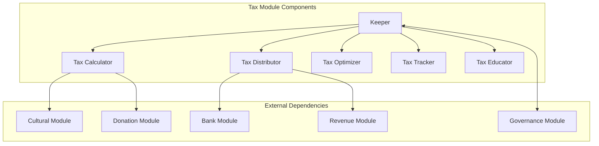
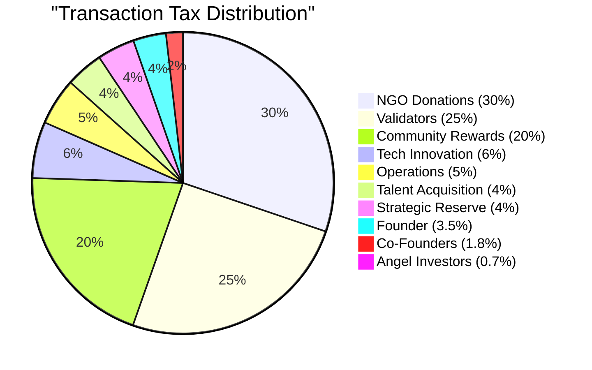
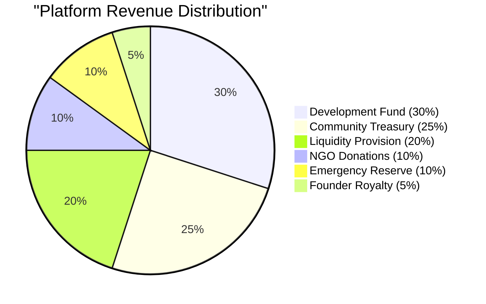
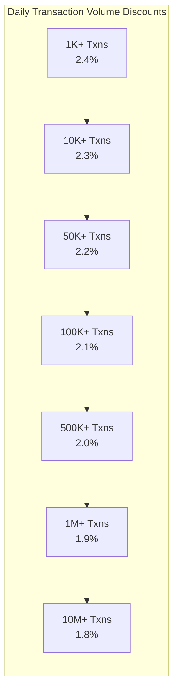
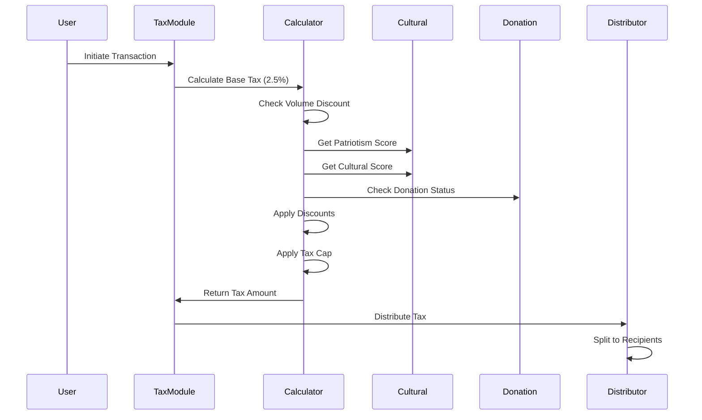
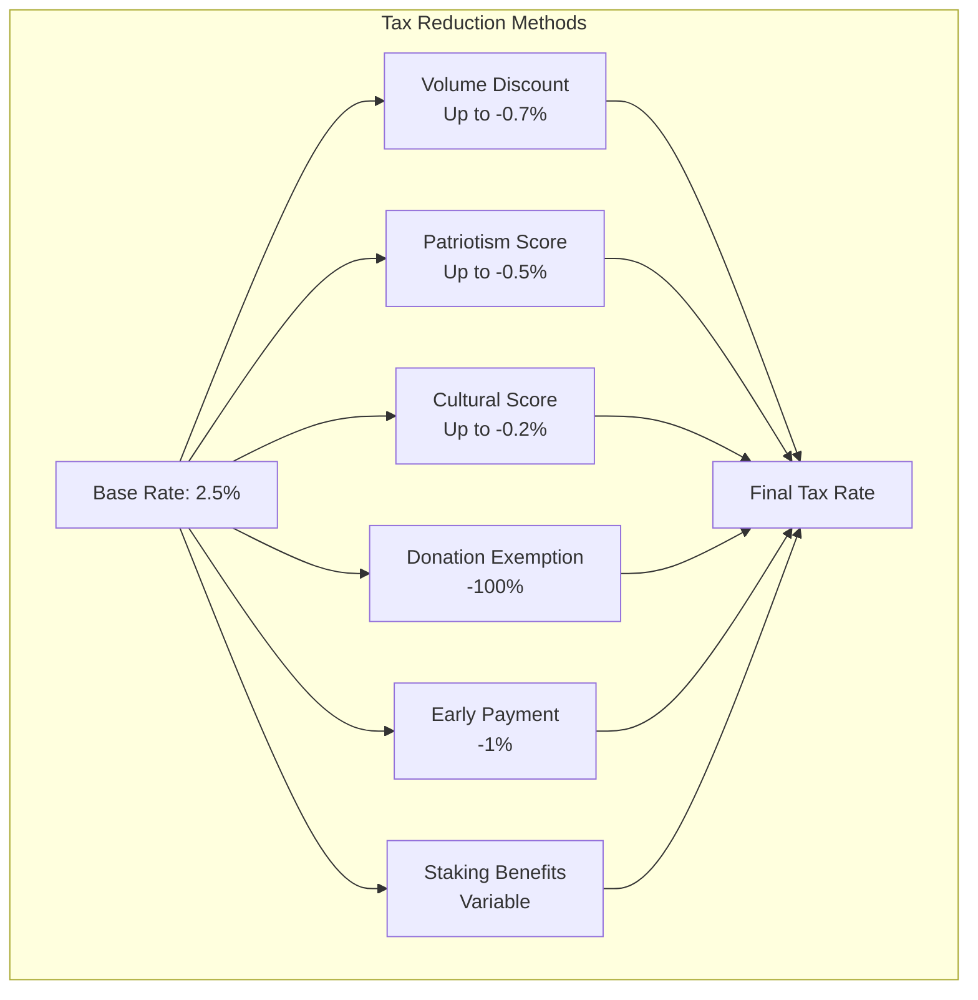
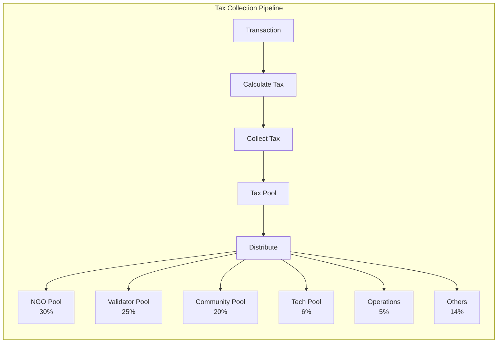
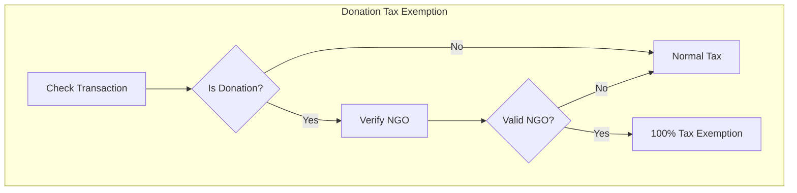
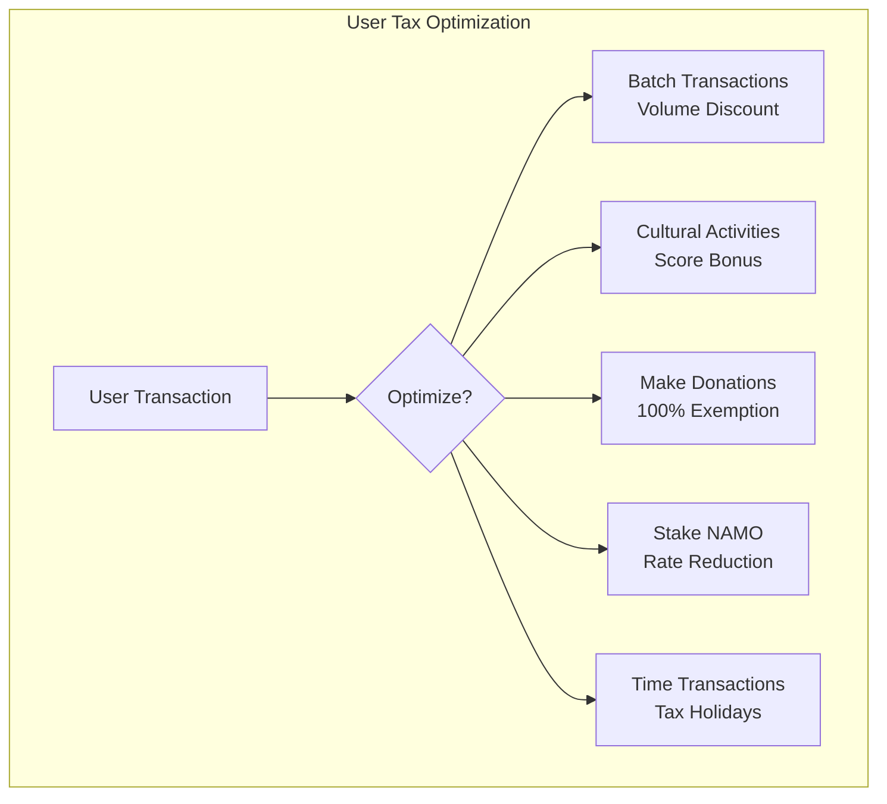

# Tax Module Documentation

## Overview

The Tax module implements DeshChain's revolutionary 2.5% transaction tax system with sophisticated distribution mechanisms, volume-based discounts, and social impact focus. It ensures sustainable platform revenue while dedicating 40% of all fees to charity, making it one of the most socially responsible blockchain tax systems.

## Module Architecture



## Tax System Overview

### Base Tax Rate: 2.5%

The system implements a universal 2.5% transaction tax with multiple optimization opportunities and social impact focus.

## Tax Distribution Model

### Transaction Tax Distribution (2.5%)



### Platform Revenue Distribution



## Progressive Tax System

### Volume-Based Discounts



### Transaction Amount Brackets

| Transaction Amount | Tax Policy | Effective Rate |
|-------------------|------------|----------------|
| ₹0 - ₹40,000 | Full 2.5% rate | 2.5% |
| ₹40,001 - ₹4,00,000 | ₹1,000 cap | 2.5% → 0.25% |
| Above ₹4,00,000 | Flat ₹1,000 | < 0.25% |

## Tax Calculation Engine

### Tax Calculation Flow



### Tax Optimization Factors



## Module Parameters

```go
type Params struct {
    // Base Tax Configuration
    BaseTaxRate              sdk.Dec   // 0.025 (2.5%)
    MaxTaxAmount            sdk.Int   // 1000 (₹1,000 cap)
    TaxCapThreshold         sdk.Int   // 40000 (₹40,000)
    
    // Volume Discount Configuration
    VolumeDiscountEnabled    bool
    VolumeThresholds        []VolumeThreshold
    
    // Discount Configuration
    PatriotismDiscountRate   sdk.Dec   // 0.005 per 100 score
    CulturalDiscountRate     sdk.Dec   // 0.002 per 100 score
    DonationExemptionRate    sdk.Dec   // 1.0 (100% exemption)
    EarlyPaymentDiscount     sdk.Dec   // 0.01 (1%)
    
    // Distribution Percentages
    NGOShare                sdk.Dec   // 0.30 (30%)
    ValidatorShare          sdk.Dec   // 0.25 (25%)
    CommunityShare          sdk.Dec   // 0.20 (20%)
    TechInnovationShare     sdk.Dec   // 0.06 (6%)
    OperationsShare         sdk.Dec   // 0.05 (5%)
    
    // System Configuration
    TaxResetPeriod          int64     // 86400 (24 hours)
    GracePeriod             int64     // 604800 (7 days)
    MinTaxAmount            sdk.Int   // 1 (₹1 minimum)
}
```

## Tax Collection & Distribution

### Real-Time Collection Process



### Distribution Mechanism

```go
type TaxDistribution struct {
    TransactionID    string
    TotalTax        sdk.Coin
    Distributions   []Distribution
    Timestamp       time.Time
}

type Distribution struct {
    Recipient       string
    Category        DistributionCategory
    Amount          sdk.Coin
    Percentage      sdk.Dec
    Description     string
}
```

## Special Tax Features

### 1. Donation Exemption System



### 2. Patriotism & Cultural Scoring

```go
type UserTaxProfile struct {
    Address             string
    PatriotismScore     int32    // 0-1000
    CulturalScore       int32    // 0-1000
    VolumeHistory       []VolumeRecord
    TaxPaid             sdk.Coins
    DiscountsReceived   sdk.Coins
    ComplianceScore     int32    // 0-100
}
```

### 3. Tax Holidays & Events

```go
type TaxHoliday struct {
    Name            string
    StartTime       time.Time
    EndTime         time.Time
    DiscountRate    sdk.Dec
    Categories      []TransactionCategory
    Reason          string
}
```

## Transaction Types

### 1. MsgUpdateTaxParams
Updates tax module parameters (governance only).

```go
type MsgUpdateTaxParams struct {
    Authority       string
    NewParams       Params
}
```

### 2. MsgClaimTaxRefund
Claims eligible tax refunds.

```go
type MsgClaimTaxRefund struct {
    Claimant        string
    RefundType      RefundType
    Evidence        string
}
```

### 3. MsgRegisterTaxExemption
Registers for tax exemption (NGOs, special categories).

```go
type MsgRegisterTaxExemption struct {
    Applicant       string
    ExemptionType   ExemptionType
    Documentation   []Document
}
```

## Query Endpoints

### 1. QueryParams
Returns current tax module parameters.

**Request**: `/deshchain/tax/v1/params`

**Response**:
```json
{
  "params": {
    "base_tax_rate": "0.025",
    "max_tax_amount": "1000",
    "ngo_share": "0.30",
    "validator_share": "0.25",
    "community_share": "0.20"
  }
}
```

### 2. QueryTaxCalculation
Calculates tax for a hypothetical transaction.

**Request**: `/deshchain/tax/v1/calculate?amount=100000&user={address}`

**Response**:
```json
{
  "base_amount": "100000",
  "base_tax": "2500",
  "volume_discount": "100",
  "patriotism_discount": "50",
  "cultural_discount": "20",
  "final_tax": "2330",
  "effective_rate": "0.0233",
  "distribution": {
    "ngo": "699",
    "validators": "582",
    "community": "466"
  }
}
```

### 3. QueryUserTaxProfile
Returns user's tax profile and history.

**Request**: `/deshchain/tax/v1/profile/{address}`

**Response**:
```json
{
  "profile": {
    "address": "deshchain1...",
    "patriotism_score": 450,
    "cultural_score": 320,
    "total_tax_paid": "1234567",
    "discounts_received": "45678",
    "compliance_score": 95,
    "current_volume_tier": "10K+",
    "effective_tax_rate": "0.0218"
  }
}
```

### 4. QueryTaxDistribution
Returns tax distribution statistics.

**Request**: `/deshchain/tax/v1/distribution?period=daily`

**Response**:
```json
{
  "period": "2024-07-22",
  "total_collected": "15000000",
  "distributions": {
    "ngo_donations": "4500000",
    "validator_rewards": "3750000",
    "community_pool": "3000000",
    "tech_innovation": "900000",
    "operations": "750000"
  }
}
```

## Events

### 1. Tax Collected Event
```json
{
  "type": "tax_collected",
  "attributes": [
    {"key": "transaction_id", "value": "{tx_hash}"},
    {"key": "payer", "value": "{address}"},
    {"key": "amount", "value": "2330"},
    {"key": "base_rate", "value": "0.025"},
    {"key": "effective_rate", "value": "0.0233"},
    {"key": "discounts_applied", "value": "volume,patriotism"}
  ]
}
```

### 2. Tax Distributed Event
```json
{
  "type": "tax_distributed",
  "attributes": [
    {"key": "batch_id", "value": "{batch_id}"},
    {"key": "total_amount", "value": "15000000"},
    {"key": "recipients", "value": "6"},
    {"key": "ngo_amount", "value": "4500000"},
    {"key": "timestamp", "value": "2024-07-22T12:00:00Z"}
  ]
}
```

### 3. Tax Exemption Event
```json
{
  "type": "tax_exemption_applied",
  "attributes": [
    {"key": "transaction_id", "value": "{tx_hash}"},
    {"key": "beneficiary", "value": "{address}"},
    {"key": "exemption_type", "value": "donation"},
    {"key": "amount_exempted", "value": "25000"}
  ]
}
```

## Tax Optimization Strategies

### For Individual Users



### For Businesses

1. **Volume Aggregation**: Batch transactions for volume discounts
2. **Tax Planning**: Utilize tax holidays and promotional periods
3. **Donation Strategy**: Integrate CSR with tax benefits
4. **Compliance Rewards**: Maintain high compliance for benefits

## Integration with Other Modules

### 1. Cultural Module Integration
- Retrieves patriotism scores for discounts
- Updates cultural engagement metrics
- Rewards cultural participation with tax benefits

### 2. Donation Module Integration
- Verifies donation transactions
- Applies 100% tax exemption
- Tracks charitable contributions

### 3. Revenue Module Integration
- Shares platform revenue for distribution
- Implements founder royalty system
- Manages perpetual revenue streams

### 4. Governance Module Integration
- Allows parameter updates through proposals
- Manages tax holiday declarations
- Controls emergency tax measures

## Security Considerations

1. **Anti-Gaming Measures**
   - Volume manipulation detection
   - Score gaming prevention
   - Donation fraud detection
   - Transaction splitting limits

2. **Audit Trail**
   - Complete tax calculation logs
   - Distribution tracking
   - Exemption verification
   - Compliance monitoring

3. **Emergency Controls**
   - Tax rate adjustment caps
   - Distribution pause mechanism
   - Recovery procedures
   - Governance overrides

## Tax Education System

### Educational Components

```go
type TaxEducator struct {
    OptimizationTips    []OptimizationTip
    ComplianceGuides    []ComplianceGuide
    TaxCalculators      []Calculator
    VideoTutorials      []Tutorial
    FAQs                []FAQ
}
```

### User Education Features
1. **Tax Calculator**: Interactive tax estimation
2. **Optimization Advisor**: Personalized tax tips
3. **Compliance Tracker**: Real-time compliance status
4. **Educational Rewards**: Learn and earn program

## Best Practices

### For Users
1. **Understand Brackets**: Know tax cap thresholds
2. **Build Scores**: Engage in cultural activities
3. **Track Volume**: Monitor daily transaction volume
4. **Time Transactions**: Use tax holidays wisely
5. **Stay Compliant**: Maintain good standing

### For Developers
1. **Pre-Calculate Tax**: Show users tax before confirmation
2. **Implement Optimization**: Suggest tax-saving strategies
3. **Handle Exemptions**: Properly process special cases
4. **Monitor Events**: Track tax-related events
5. **Cache Calculations**: Optimize repeated calculations

### For Validators
1. **Verify Distribution**: Ensure correct tax allocation
2. **Monitor Collection**: Track tax collection metrics
3. **Report Anomalies**: Flag suspicious patterns
4. **Maintain Records**: Keep distribution logs
5. **Participate Governance**: Vote on tax proposals

## CLI Commands

### Query Commands
```bash
# Query tax parameters
deshchaind query tax params

# Calculate tax for amount
deshchaind query tax calculate [amount] --user [address]

# Query user tax profile
deshchaind query tax profile [address]

# Query tax distribution stats
deshchaind query tax distribution --period [daily|weekly|monthly]

# Check tax exemption status
deshchaind query tax exemption-status [address]
```

### Transaction Commands
```bash
# Claim tax refund
deshchaind tx tax claim-refund [refund-type] --evidence [path] --from [key]

# Register for exemption
deshchaind tx tax register-exemption [type] --docs [paths] --from [key]

# Update tax parameters (governance)
deshchaind tx tax update-params [params-file] --from [key]
```

## FAQ

**Q: Why 2.5% tax rate?**
A: Balances platform sustainability with user affordability while enabling 40% charity allocation.

**Q: How do I reduce my tax rate?**
A: Increase transaction volume, build patriotism/cultural scores, make donations, or stake NAMO.

**Q: Are there tax-free transactions?**
A: Yes, verified donations to registered NGOs are 100% tax-exempt.

**Q: How is tax distributed?**
A: Automatically and transparently according to preset percentages, with real-time tracking.

**Q: Can tax rates change?**
A: Only through governance proposals with community approval.

---

For more information, see the [Module Overview](../MODULE_OVERVIEW.md) or explore other [DeshChain Modules](../MODULE_OVERVIEW.md#module-categories).