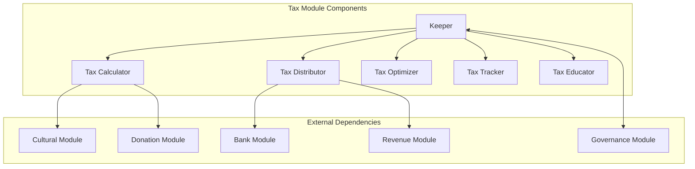
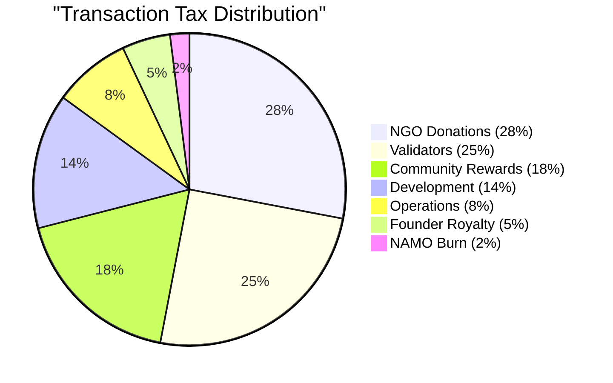
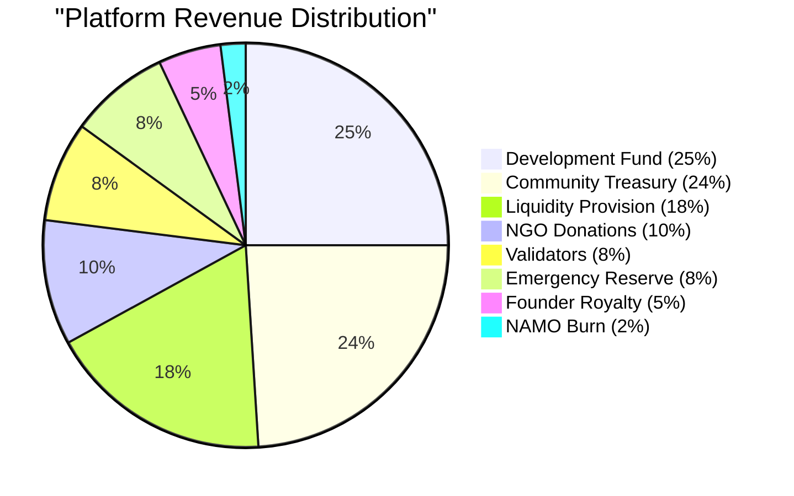
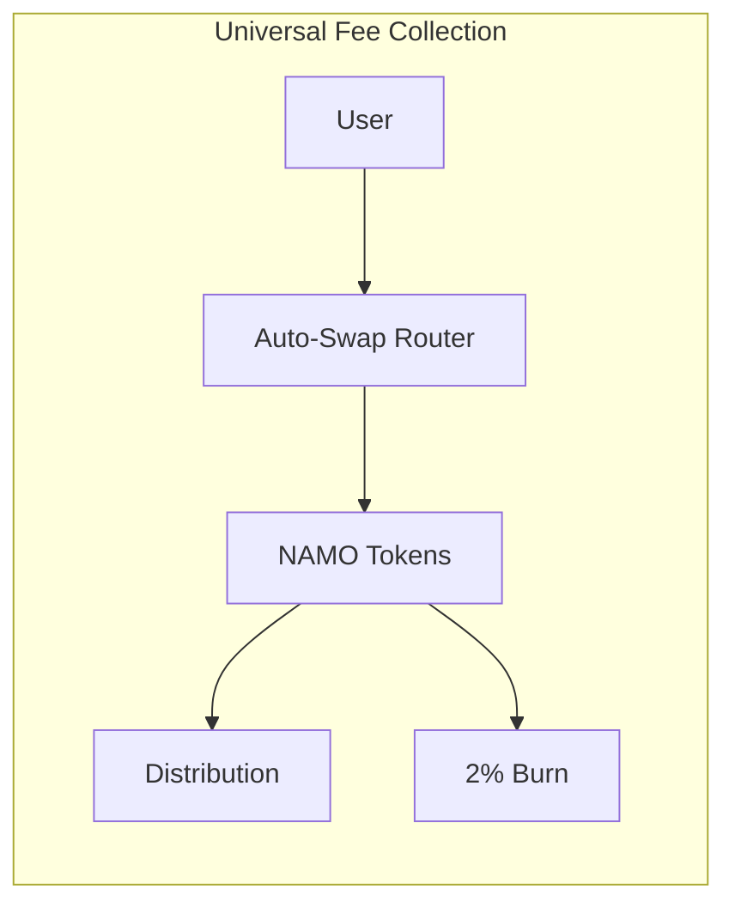
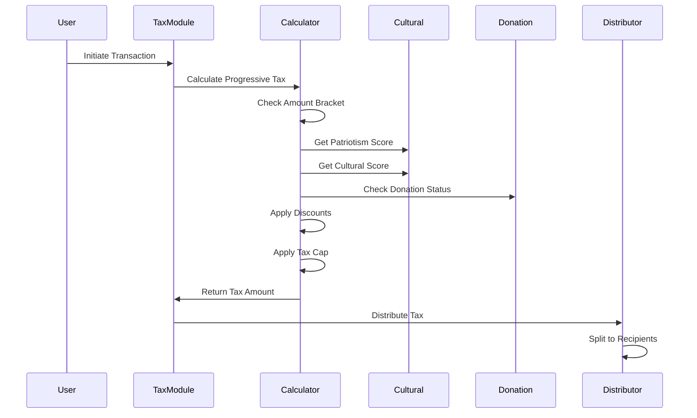
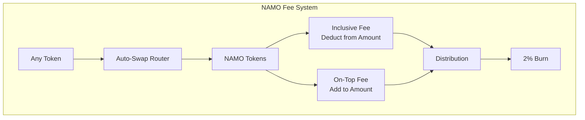
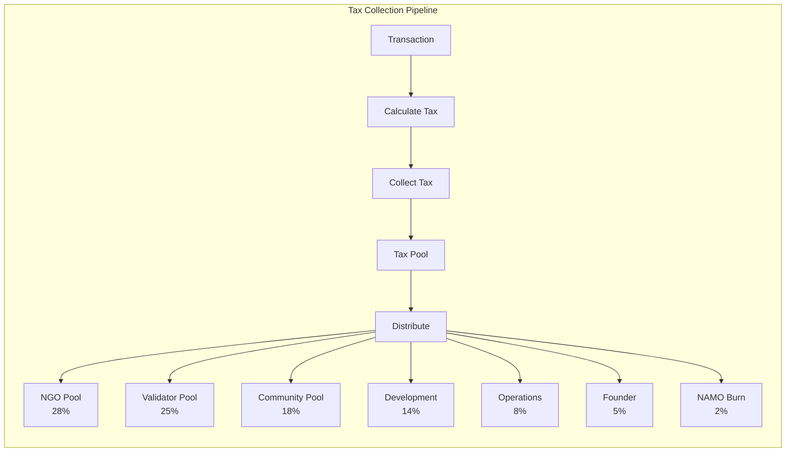
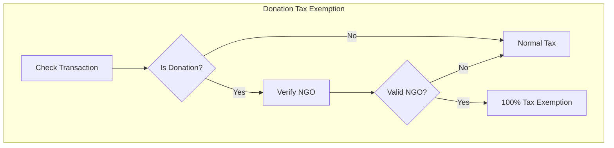
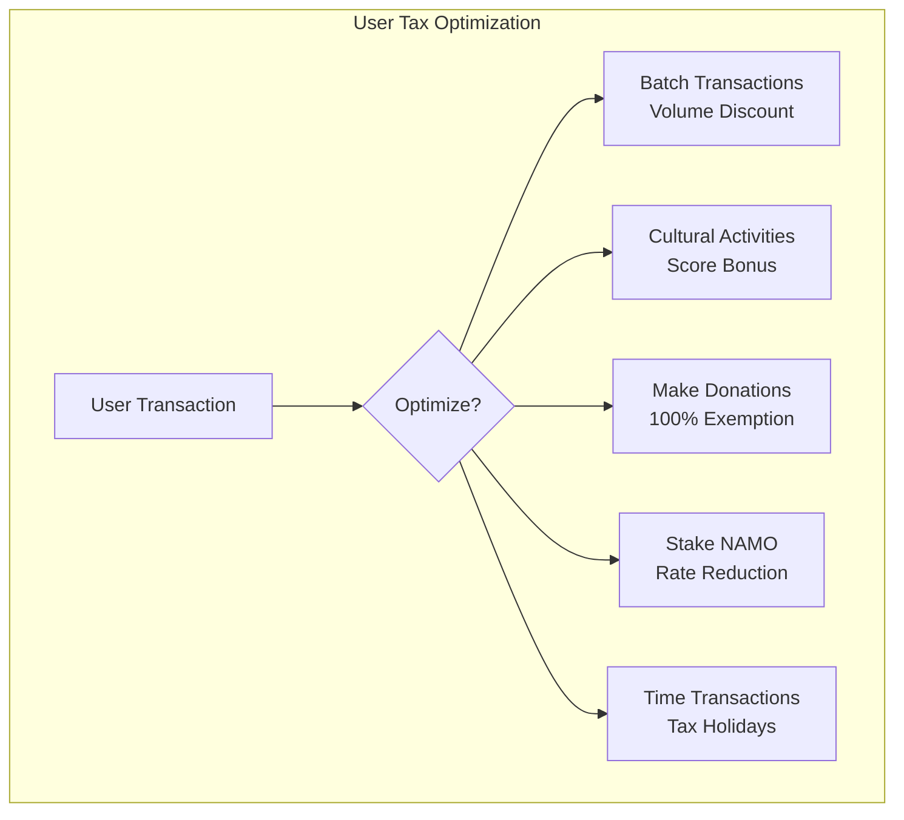

# Tax Module Documentation

## Overview

The Tax module implements DeshChain's revolutionary progressive tax system with FREE transactions under ₹100, micro fees for small amounts, and percentage-based rates with a ₹1,000 cap. All fees are collected in NAMO tokens with automatic swapping. It ensures sustainable platform revenue while dedicating significant portions to charity and validators, making it one of the most socially responsible and user-friendly blockchain tax systems.

## Module Architecture



## Tax System Overview

### Progressive Tax Structure

The system implements a user-friendly progressive tax structure:
- **FREE** for transactions < ₹100
- Fixed micro fees for ₹100-1,000 range
- Percentage-based fees with ₹1,000 maximum cap
- All fees collected in NAMO tokens
- 2% deflationary burn from all revenues

## Tax Distribution Model

### Transaction Tax Distribution



### Platform Revenue Distribution



## Progressive Tax System

### Transaction Amount Brackets

| Transaction Amount | Tax Policy | Example |
|-------------------|------------|----------------|
| < ₹100 | **FREE** | Send ₹50 = ₹0 fee |
| ₹100 - ₹500 | ₹0.01 fixed | Send ₹300 = ₹0.01 fee |
| ₹500 - ₹1,000 | ₹0.05 fixed | Send ₹750 = ₹0.05 fee |
| ₹1,000 - ₹10,000 | 0.25% | Send ₹5,000 = ₹12.50 fee |
| ₹10,000 - ₹1 lakh | 0.50% | Send ₹50,000 = ₹250 fee |
| ₹1 lakh - ₹10 lakh | 0.30% | Send ₹5 lakh = ₹1,500 fee (capped) |
| > ₹10 lakh | 0.20% | Send ₹50 lakh = ₹1,000 fee (capped) |

**Maximum Fee Cap: ₹1,000** - No matter how large the transaction!

### NAMO Universal Fee Currency



## Tax Calculation Engine

### Tax Calculation Flow



### Fee Collection Features



## Module Parameters

```go
type Params struct {
    // Progressive Tax Configuration
    FreeTaxThreshold        sdk.Int   // 100 (₹100 - FREE transactions)
    MicroFee1               sdk.Int   // 10000 (₹0.01 for ₹100-500)
    MicroFee2               sdk.Int   // 50000 (₹0.05 for ₹500-1000)
    MaxTaxAmount            sdk.Int   // 1000000000 (₹1,000 cap in micro units)
    
    // Tax Rate Brackets
    Rate1                   sdk.Dec   // 0.0025 (0.25% for ₹1K-10K)
    Rate2                   sdk.Dec   // 0.005 (0.50% for ₹10K-1L)
    Rate3                   sdk.Dec   // 0.003 (0.30% for ₹1L-10L)
    Rate4                   sdk.Dec   // 0.002 (0.20% for > ₹10L)
    
    // NAMO Integration
    UniversalFeeNAMO        bool      // true (all fees in NAMO)
    AutoSwapEnabled         bool      // true (auto-swap to NAMO)
    BurnRate                sdk.Dec   // 0.02 (2% burn)
    
    // Distribution Percentages
    NGOShare                sdk.Dec   // 0.28 (28%)
    ValidatorShare          sdk.Dec   // 0.25 (25%)
    CommunityShare          sdk.Dec   // 0.18 (18%)
    DevelopmentShare        sdk.Dec   // 0.14 (14%)
    OperationsShare         sdk.Dec   // 0.08 (8%)
    FounderRoyalty          sdk.Dec   // 0.05 (5%)
    NAMOBurnShare           sdk.Dec   // 0.02 (2%)
    
    // System Configuration
    InclusiveFeeOption      bool      // true (user can choose)
    DonationExemptionRate   sdk.Dec   // 1.0 (100% exemption)
}
```

## Tax Collection & Distribution

### Real-Time Collection Process



### Distribution Mechanism

```go
type TaxDistribution struct {
    TransactionID    string
    TotalTax        sdk.Coin
    Distributions   []Distribution
    Timestamp       time.Time
}

type Distribution struct {
    Recipient       string
    Category        DistributionCategory
    Amount          sdk.Coin
    Percentage      sdk.Dec
    Description     string
}
```

## Special Tax Features

### 1. Donation Exemption System



### 2. Patriotism & Cultural Scoring

```go
type UserTaxProfile struct {
    Address             string
    PatriotismScore     int32    // 0-1000
    CulturalScore       int32    // 0-1000
    VolumeHistory       []VolumeRecord
    TaxPaid             sdk.Coins
    DiscountsReceived   sdk.Coins
    ComplianceScore     int32    // 0-100
}
```

### 3. NAMO Auto-Swap Router

```go
type NAMOSwapRouter struct {
    SupportedTokens    []string   // DINR, DUSD, USDT, etc.
    SwapPriority       []string   // DEX → Oracle → Fixed rates
    SlippageProtection sdk.Dec    // Max 0.5%
    InclusiveOption    bool       // Deduct from amount or add on top
}

// Automatic conversion of any token to NAMO for fees
func (nsr *NAMOSwapRouter) SwapForNAMOFee(
    ctx sdk.Context,
    userAddr sdk.AccAddress,
    feeAmount sdk.Coin,
    userToken sdk.Coin,
    inclusive bool,
) (sdk.Coin, error)
```

## Transaction Types

### 1. MsgUpdateTaxParams
Updates tax module parameters (governance only).

```go
type MsgUpdateTaxParams struct {
    Authority       string
    NewParams       Params
}
```

### 2. MsgClaimTaxRefund
Claims eligible tax refunds.

```go
type MsgClaimTaxRefund struct {
    Claimant        string
    RefundType      RefundType
    Evidence        string
}
```

### 3. MsgRegisterTaxExemption
Registers for tax exemption (NGOs, special categories).

```go
type MsgRegisterTaxExemption struct {
    Applicant       string
    ExemptionType   ExemptionType
    Documentation   []Document
}
```

## Query Endpoints

### 1. QueryParams
Returns current tax module parameters.

**Request**: `/deshchain/tax/v1/params`

**Response**:
```json
{
  "params": {
    "free_tax_threshold": "100",
    "micro_fee_1": "10000",
    "micro_fee_2": "50000",
    "max_tax_amount": "1000000000",
    "universal_fee_namo": true,
    "auto_swap_enabled": true,
    "burn_rate": "0.02",
    "ngo_share": "0.28",
    "validator_share": "0.25",
    "founder_royalty": "0.05"
  }
}
```

### 2. QueryTaxCalculation
Calculates tax for a hypothetical transaction.

**Request**: `/deshchain/tax/v1/calculate?amount=100000&user={address}`

**Response**:
```json
{
  "base_amount": "100000",
  "bracket": "10K-1L",
  "tax_rate": "0.005",
  "calculated_tax": "500000",
  "tax_in_namo": "60241",
  "namo_rate": "8.30",
  "inclusive_option": true,
  "distribution": {
    "ngo": "140000",
    "validators": "125000",
    "community": "90000",
    "development": "70000",
    "founder": "25000",
    "burn": "10000"
  }
}
```

### 3. QueryUserTaxProfile
Returns user's tax profile and history.

**Request**: `/deshchain/tax/v1/profile/{address}`

**Response**:
```json
{
  "profile": {
    "address": "deshchain1...",
    "patriotism_score": 450,
    "cultural_score": 320,
    "total_tax_paid": "1234567",
    "discounts_received": "45678",
    "compliance_score": 95,
    "current_bracket": "10K-1L",
    "effective_tax_rate": "0.0045",
    "fees_paid_in_namo": "1234567",
    "namo_saved_via_swap": "45678"
  }
}
```

### 4. QueryTaxDistribution
Returns tax distribution statistics.

**Request**: `/deshchain/tax/v1/distribution?period=daily`

**Response**:
```json
{
  "period": "2024-07-22",
  "total_collected": "15000000",
  "distributions": {
    "ngo_donations": "4500000",
    "validator_rewards": "3750000",
    "community_pool": "3000000",
    "tech_innovation": "900000",
    "operations": "750000"
  }
}
```

## Events

### 1. Tax Collected Event
```json
{
  "type": "tax_collected",
  "attributes": [
    {"key": "transaction_id", "value": "{tx_hash}"},
    {"key": "payer", "value": "{address}"},
    {"key": "amount", "value": "2330"},
    {"key": "base_rate", "value": "0.025"},
    {"key": "effective_rate", "value": "0.0233"},
    {"key": "discounts_applied", "value": "volume,patriotism"}
  ]
}
```

### 2. Tax Distributed Event
```json
{
  "type": "tax_distributed",
  "attributes": [
    {"key": "batch_id", "value": "{batch_id}"},
    {"key": "total_amount", "value": "15000000"},
    {"key": "recipients", "value": "6"},
    {"key": "ngo_amount", "value": "4500000"},
    {"key": "timestamp", "value": "2024-07-22T12:00:00Z"}
  ]
}
```

### 3. Tax Exemption Event
```json
{
  "type": "tax_exemption_applied",
  "attributes": [
    {"key": "transaction_id", "value": "{tx_hash}"},
    {"key": "beneficiary", "value": "{address}"},
    {"key": "exemption_type", "value": "donation"},
    {"key": "amount_exempted", "value": "25000"}
  ]
}
```

## Tax Optimization Strategies

### For Individual Users



### For Businesses

1. **Volume Aggregation**: Batch transactions for volume discounts
2. **Tax Planning**: Utilize tax holidays and promotional periods
3. **Donation Strategy**: Integrate CSR with tax benefits
4. **Compliance Rewards**: Maintain high compliance for benefits

## Integration with Other Modules

### 1. Cultural Module Integration
- Retrieves patriotism scores for discounts
- Updates cultural engagement metrics
- Rewards cultural participation with tax benefits

### 2. Donation Module Integration
- Verifies donation transactions
- Applies 100% tax exemption
- Tracks charitable contributions

### 3. Revenue Module Integration
- Shares platform revenue for distribution
- Implements founder royalty system
- Manages perpetual revenue streams

### 4. Governance Module Integration
- Allows parameter updates through proposals
- Manages tax holiday declarations
- Controls emergency tax measures

## Security Considerations

1. **Anti-Gaming Measures**
   - Volume manipulation detection
   - Score gaming prevention
   - Donation fraud detection
   - Transaction splitting limits

2. **Audit Trail**
   - Complete tax calculation logs
   - Distribution tracking
   - Exemption verification
   - Compliance monitoring

3. **Emergency Controls**
   - Tax rate adjustment caps
   - Distribution pause mechanism
   - Recovery procedures
   - Governance overrides

## Tax Education System

### Educational Components

```go
type TaxEducator struct {
    OptimizationTips    []OptimizationTip
    ComplianceGuides    []ComplianceGuide
    TaxCalculators      []Calculator
    VideoTutorials      []Tutorial
    FAQs                []FAQ
}
```

### User Education Features
1. **Tax Calculator**: Interactive tax estimation
2. **Optimization Advisor**: Personalized tax tips
3. **Compliance Tracker**: Real-time compliance status
4. **Educational Rewards**: Learn and earn program

## Best Practices

### For Users
1. **Understand Brackets**: Know tax cap thresholds
2. **Build Scores**: Engage in cultural activities
3. **Track Volume**: Monitor daily transaction volume
4. **Time Transactions**: Use tax holidays wisely
5. **Stay Compliant**: Maintain good standing

### For Developers
1. **Pre-Calculate Tax**: Show users tax before confirmation
2. **Implement Optimization**: Suggest tax-saving strategies
3. **Handle Exemptions**: Properly process special cases
4. **Monitor Events**: Track tax-related events
5. **Cache Calculations**: Optimize repeated calculations

### For Validators
1. **Verify Distribution**: Ensure correct tax allocation
2. **Monitor Collection**: Track tax collection metrics
3. **Report Anomalies**: Flag suspicious patterns
4. **Maintain Records**: Keep distribution logs
5. **Participate Governance**: Vote on tax proposals

## CLI Commands

### Query Commands
```bash
# Query tax parameters
deshchaind query tax params

# Calculate tax for amount
deshchaind query tax calculate [amount] --user [address]

# Query user tax profile
deshchaind query tax profile [address]

# Query tax distribution stats
deshchaind query tax distribution --period [daily|weekly|monthly]

# Check tax exemption status
deshchaind query tax exemption-status [address]
```

### Transaction Commands
```bash
# Claim tax refund
deshchaind tx tax claim-refund [refund-type] --evidence [path] --from [key]

# Register for exemption
deshchaind tx tax register-exemption [type] --docs [paths] --from [key]

# Update tax parameters (governance)
deshchaind tx tax update-params [params-file] --from [key]
```

## FAQ

**Q: Why progressive tax rates?**
A: FREE transactions under ₹100 encourage adoption, micro fees for small amounts remain affordable, and percentage-based rates with ₹1,000 cap ensure fairness for all transaction sizes.

**Q: Why are all fees in NAMO?**
A: Universal NAMO fees simplify the ecosystem, enable deflationary burns, and create consistent value accrual to the native token.

**Q: Are there tax-free transactions?**
A: Yes, verified donations to registered NGOs are 100% tax-exempt.

**Q: How is tax distributed?**
A: Automatically and transparently: NGO 28%, Validators 25%, Community 18%, Development 14%, Operations 8%, Founder 5%, NAMO Burn 2%.

**Q: Can tax rates change?**
A: Only through governance proposals with community approval.

---

For more information, see the [Module Overview](../MODULE_OVERVIEW.md) or explore other [DeshChain Modules](../MODULE_OVERVIEW.md#module-categories).