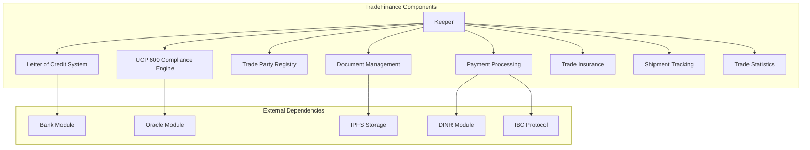
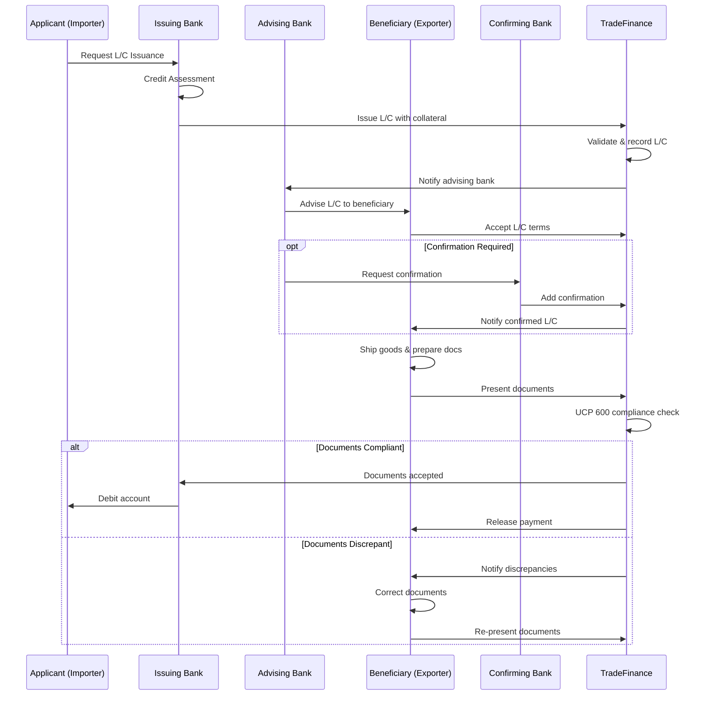
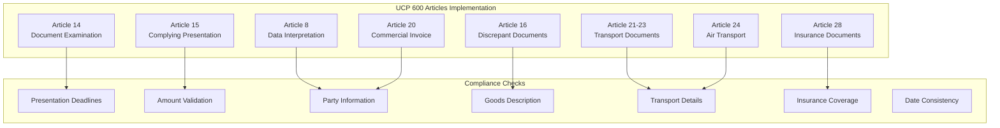

# TradeFinance Module Documentation

## Overview

The TradeFinance module provides DeshChain's comprehensive international trade finance infrastructure, implementing blockchain-based Letters of Credit (L/C), bank guarantees, trade documents, and full UCP 600 compliance. It digitizes traditional trade finance instruments while maintaining regulatory compliance and international banking standards.

## Module Architecture



## Letter of Credit System

### 1. L/C Lifecycle Management



### 2. Letter of Credit Structure

```go
type LetterOfCredit struct {
    LcId                    string         // Unique L/C identifier
    LcNumber                string         // Human-readable L/C number
    Status                  string         // issued, accepted, documents_presented, etc.
    
    // Parties
    ApplicantId             string         // Importer/buyer ID
    BeneficiaryId           string         // Exporter/seller ID
    IssuingBankId           string         // Issuing bank ID
    AdvisingBankId          string         // Advising bank ID
    ConfirmingBankId        string         // Confirming bank ID (optional)
    
    // Financial Terms
    Amount                  sdk.Coin       // L/C amount
    Currency                string         // Currency code
    PaymentTerms            string         // sight, deferred, acceptance
    DeferredPaymentDays     uint32         // Days for deferred payment
    
    // Dates
    IssueDate               time.Time      // L/C issue date
    ExpiryDate              time.Time      // L/C expiry date
    LatestShipmentDate      time.Time      // Latest shipment date
    PresentationDeadline    time.Time      // Document presentation deadline
    
    // Shipping Terms
    Incoterms               string         // FOB, CIF, FCA, etc.
    PortOfLoading           string         // Port of loading
    PortOfDischarge         string         // Port of discharge
    PartialShipmentAllowed  bool          // Partial shipment allowed
    TransshipmentAllowed    bool          // Transshipment allowed
    CountryOfOrigin         string         // Country of origin
    
    // Goods & Documents
    GoodsDescription        string         // Description of goods
    RequiredDocuments       []string       // Required documents list
    SpecialConditions       []string       // Special conditions
    
    // Financial Details
    Collateral              sdk.Coin       // Posted collateral
    FeesPaid                sdk.Coin       // Fees paid to date
    CommissionRate          sdk.Dec        // Bank commission rate
    
    // Status Tracking
    DocumentsPresentedCount uint32         // Number of presentations
    DiscrepanciesCount      uint32         // Total discrepancies found
    PaymentExecuted         bool           // Payment executed flag
    
    // Timestamps
    CreatedAt               time.Time
    UpdatedAt               time.Time
    CompletedAt             *time.Time
    CancelledAt             *time.Time
}
```

### 3. L/C Status Types

```go
const (
    LCStatusDraft              = "draft"                // Being prepared
    LCStatusIssued             = "issued"               // Issued by bank
    LCStatusAdvised            = "advised"              // Advised to beneficiary
    LCStatusAccepted           = "accepted"             // Accepted by beneficiary
    LCStatusConfirmed          = "confirmed"            // Confirmed by bank
    LCStatusDocumentsPresented = "documents_presented"  // Documents submitted
    LCStatusDocumentsCompliant = "documents_compliant"  // Documents accepted
    LCStatusDocumentsDiscrepant = "documents_discrepant" // Documents rejected
    LCStatusPaymentExecuted    = "payment_executed"     // Payment made
    LCStatusCompleted          = "completed"            // L/C completed
    LCStatusCancelled          = "cancelled"            // L/C cancelled
    LCStatusExpired            = "expired"              // L/C expired
)
```

## UCP 600 Compliance Engine

### 1. International Standards Compliance

DeshChain implements full UCP 600 (Uniform Customs and Practice for Documentary Credits) compliance:



### 2. Compliance Check Result

```go
type UCP600ComplianceResult struct {
    IsCompliant      bool                    // Overall compliance status
    OverallStatus    string                  // compliant, discrepant, rejected
    Discrepancies    []UCP600Discrepancy     // Found discrepancies
    DocumentReviews  []DocumentReview        // Individual document reviews
    ComplianceScore  int                     // 0-100 compliance score
    ProcessingTime   time.Duration           // Time taken for examination
    ExaminationDate  time.Time               // When examination occurred
    DeadlineStatus   DeadlineComplianceCheck // Deadline compliance
}

type UCP600Discrepancy struct {
    ID          string                     // Discrepancy identifier
    Type        UCP600DiscrepancyType      // Type of discrepancy
    Category    string                     // major, minor, technical
    Severity    UCP600DiscrepancySeverity  // Severity level
    DocumentID  string                     // Affected document
    Article     string                     // UCP 600 article reference
    Description string                     // Detailed description
    Suggestion  string                     // How to correct
    IsWaivable  bool                      // Can be waived by applicant
    Impact      string                     // Impact on transaction
    DetectedAt  time.Time                 // When detected
}
```

### 3. Document Examination Process

```go
// Automated UCP 600 compliance checking
func (uce *UCP600ComplianceEngine) PerformUCP600Compliance(
    ctx sdk.Context,
    lcID string,
    presentationID string,
) (*UCP600ComplianceResult, error) {
    
    // Article 14: Standard for examination (max 5 banking days)
    result.DeadlineStatus = uce.checkPresentationDeadlines(ctx, lc, presentation)
    
    // Article 15: Complying presentation requirements
    uce.checkComplyingPresentation(ctx, lc, presentation, result)
    
    // Article 16: Discrepant documents identification
    uce.examineDocuments(ctx, lc, presentation, result)
    
    // Article 20: Commercial invoice validation
    uce.validateCommercialInvoice(ctx, lc, presentation, result)
    
    // Articles 20-27: Transport documents validation
    uce.validateTransportDocuments(ctx, lc, presentation, result)
    
    // Article 28: Insurance documents validation
    uce.validateInsuranceDocuments(ctx, lc, presentation, result)
    
    // Calculate final compliance score and status
    result.ComplianceScore = uce.calculateComplianceScore(result)
    
    return result, nil
}
```

## Trade Party Registry

### 1. Party Management System

```go
type TradeParty struct {
    PartyId          string         // Unique party identifier
    PartyType        string         // importer, exporter, bank, insurer
    BusinessName     string         // Legal business name
    RegistrationNo   string         // Business registration number
    
    // Contact Information
    ContactPerson    string         // Primary contact
    EmailAddress     string         // Email address
    PhoneNumber      string         // Phone number
    Address          TradeAddress   // Physical address
    
    // Business Details
    Industry         string         // Industry classification
    AnnualTurnover   sdk.Coin      // Annual turnover
    YearsInBusiness  uint32        // Years in operation
    
    // Verification Status
    KYCStatus        string         // KYC verification level
    AMLCompliance    bool          // AML compliance status
    Licenses         []BusinessLicense // Business licenses
    Certifications   []Certification   // Industry certifications
    
    // Credit Information
    CreditRating     string         // Credit rating (AAA, AA, etc.)
    CreditLimit      sdk.Coin      // Maximum credit exposure
    OutstandingCredit sdk.Coin     // Current outstanding credit
    
    // Performance Metrics
    TotalTransactions uint64        // Lifetime transactions
    TotalTradeValue  sdk.Coin      // Lifetime trade value
    SuccessRate      sdk.Dec       // Success rate percentage
    AverageProcessingTime sdk.Dec  // Average processing days
    DisputeRate      sdk.Dec       // Dispute rate percentage
    
    // Banking Information
    BankingLicenses  []BankingLicense // Banking licenses (for banks)
    SwiftCode        string          // SWIFT code (for banks)
    CorrespondentBanks []string      // Correspondent bank network
    
    // Insurance Information (for insurers)
    InsuranceLicenses []InsuranceLicense // Insurance licenses
    CoverageTypes    []string           // Types of coverage offered
    MaxCoverageAmount sdk.Coin         // Maximum coverage per policy
    
    // Blockchain Information
    WalletAddress    string         // DeshChain wallet address
    
    // Status & Timestamps
    Status           string         // active, suspended, inactive
    CreatedAt        time.Time
    UpdatedAt        time.Time
    VerifiedAt       *time.Time
    LastActivityAt   time.Time
}
```

### 2. Party Verification Levels

```go
const (
    // KYC Levels
    KYCLevelBasic    = "basic"     // Basic information verified
    KYCLevelStandard = "standard"  // Standard due diligence completed
    KYCLevelEnhanced = "enhanced"  // Enhanced due diligence completed
    KYCLevelPremium  = "premium"   // Premium verification with ongoing monitoring
    
    // Party Types
    PartyTypeImporter = "importer"
    PartyTypeExporter = "exporter"
    PartyTypeBank     = "bank"
    PartyTypeInsurer  = "insurer"
    PartyTypeShipper  = "shipper"
    PartyTypeLogistics = "logistics"
    PartyTypeInspector = "inspector"
)
```

## Document Management System

### 1. Trade Document Structure

```go
type TradeDocument struct {
    Id                  string         // Document identifier
    LcId               string         // Associated L/C ID
    DocumentType       string         // Type of document
    DocumentNumber     string         // Document reference number
    IssuerPartyId      string         // Document issuer
    
    // Content & Storage
    ContentHash        string         // IPFS hash of document
    ContentType        string         // MIME type
    FileSize           uint64         // File size in bytes
    DigitalSignature   string         // Digital signature
    
    // Document Details
    Amount             sdk.Coin       // Document amount
    Currency           string         // Currency
    GoodsDescription   string         // Description of goods
    Quantity           string         // Quantity details
    UnitPrice          sdk.Dec        // Unit price
    
    // Party Information
    BuyerInfo          string         // Buyer details
    SellerInfo         string         // Seller details
    ShipperInfo        string         // Shipper details
    ConsigneeInfo      string         // Consignee details
    
    // Transport Information
    VesselName         string         // Vessel/flight name
    VoyageNumber       string         // Voyage/flight number
    PortOfLoading      string         // Loading port/airport
    PortOfDischarge    string         // Discharge port/airport
    DepartureAirport   string         // Departure airport (air transport)
    DestinationAirport string         // Destination airport
    
    // Dates
    DocumentDate       time.Time      // Document issue date
    OnBoardDate        time.Time      // On board date
    ShipmentDate       time.Time      // Shipment date
    
    // Document Specific Fields
    BillOfLadingNumber string         // B/L number
    AWBNumber          string         // Air waybill number
    InsuranceAmount    sdk.Coin       // Insurance amount
    InsuranceCoverage  string         // Insurance coverage details
    CountryOfOrigin    string         // Country of origin
    PackingDetails     string         // Packing information
    FreightStatus      string         // Freight payment status
    
    // Quality & Condition
    IsClean            bool           // Clean document (no adverse remarks)
    Endorsements       []string       // Document endorsements
    Amendments         []string       // Document amendments
    
    // Compliance Status
    UCP600Compliant    bool           // UCP 600 compliant
    ComplianceNotes    string         // Compliance notes
    DiscrepanciesFound []string       // Found discrepancies
    
    // Verification
    VerifiedBy         string         // Verifier party ID
    VerificationDate   *time.Time     // When verified
    VerificationNotes  string         // Verification notes
    
    // Timestamps
    CreatedAt          time.Time
    UpdatedAt          time.Time
    ExpiresAt          *time.Time     // Document expiry
}
```

### 2. Document Types

```go
const (
    DocTypeCommercialInvoice    = "commercial_invoice"
    DocTypeBillOfLading         = "bill_of_lading"
    DocTypeSeaWaybill          = "sea_waybill"
    DocTypeAirWaybill          = "air_waybill"
    DocTypeInsuranceCertificate = "insurance_certificate"
    DocTypeInsurancePolicy     = "insurance_policy"
    DocTypeCertificateOfOrigin = "certificate_of_origin"
    DocTypePackingList         = "packing_list"
    DocTypeInspectionCertificate = "inspection_certificate"
    DocTypeBankGuarantee       = "bank_guarantee"
    DocTypeStandbyLC           = "standby_lc"
)
```

## Transaction Types

### 1. MsgIssueLc
Issue a new Letter of Credit.

```go
type MsgIssueLc struct {
    Creator                 string        // Issuing bank address
    ApplicantId            string        // Importer ID
    BeneficiaryId          string        // Exporter ID
    IssuingBank            string        // Issuing bank address
    IssuingBankId          string        // Issuing bank ID
    AdvisingBankId         string        // Advising bank ID
    Amount                 sdk.Coin      // L/C amount
    ExpiryDate             time.Time     // L/C expiry
    LatestShipmentDate     time.Time     // Latest shipment date
    PaymentTerms           string        // Payment terms
    DeferredPaymentDays    uint32        // Days for deferred payment
    Incoterms              string        // Shipping terms
    PortOfLoading          string        // Port of loading
    PortOfDischarge        string        // Port of discharge
    PartialShipmentAllowed bool          // Partial shipment allowed
    TransshipmentAllowed   bool          // Transshipment allowed
    GoodsDescription       string        // Goods description
    RequiredDocuments      []string      // Required documents
    Collateral             sdk.Coin      // Collateral amount
    SpecialConditions      []string      // Special conditions
}
```

### 2. MsgPresentDocuments
Present documents for L/C payment.

```go
type MsgPresentDocuments struct {
    Presenter           string                 // Presenter address
    LcId               string                 // L/C identifier
    PresentationDate   time.Time             // Presentation date
    Documents          []DocumentSubmission   // Submitted documents
    PresentorNotes     string                // Presentation notes
}

type DocumentSubmission struct {
    DocumentType    string    // Type of document
    ContentHash     string    // IPFS hash
    DocumentNumber  string    // Document reference
    IssueDate       time.Time // Document issue date
    Metadata        map[string]string // Additional metadata
}
```

### 3. MsgRegisterTradeParty
Register a new trade party.

```go
type MsgRegisterTradeParty struct {
    Creator          string        // Creator address
    PartyType        string        // Party type
    BusinessName     string        // Business name
    RegistrationNo   string        // Registration number
    ContactPerson    string        // Contact person
    EmailAddress     string        // Email
    PhoneNumber      string        // Phone
    Address          TradeAddress  // Business address
    Industry         string        // Industry classification
    WalletAddress    string        // Blockchain wallet
}
```

## Query Endpoints

### 1. QueryLetterOfCredit
Get Letter of Credit details.

**Request**: `/deshchain/tradefinance/v1/lc/{lc_id}`

**Response**:
```json
{
  "letter_of_credit": {
    "lc_id": "LC00001234",
    "lc_number": "DESH/LC/2024/1234",
    "status": "documents_presented",
    "applicant_id": "IMP-001",
    "beneficiary_id": "EXP-001",
    "issuing_bank_id": "BANK-001",
    "advising_bank_id": "BANK-002",
    "amount": "1000000000000 dinr",
    "currency": "dinr",
    "issue_date": "2024-07-25T10:00:00Z",
    "expiry_date": "2024-10-25T23:59:59Z",
    "latest_shipment_date": "2024-10-15T23:59:59Z",
    "payment_terms": "sight",
    "incoterms": "FOB",
    "port_of_loading": "Mumbai Port",
    "port_of_discharge": "New York Port",
    "goods_description": "Cotton textiles, 1000 pieces",
    "required_documents": [
      "commercial_invoice",
      "bill_of_lading",
      "certificate_of_origin"
    ],
    "collateral": "1100000000000 dinr",
    "fees_paid": "50000000000 dinr"
  }
}
```

### 2. QueryUCP600Compliance
Get UCP 600 compliance check result.

**Request**: `/deshchain/tradefinance/v1/compliance/{lc_id}/{presentation_id}`

**Response**:
```json
{
  "compliance_result": {
    "is_compliant": false,
    "overall_status": "discrepant",
    "compliance_score": 85,
    "processing_time": "2.5s",
    "examination_date": "2024-07-25T14:30:00Z",
    "discrepancies": [
      {
        "id": "DISC-001",
        "type": "amount_excessive",
        "category": "major",
        "severity": "major",
        "document_id": "DOC-INV-001",
        "article": "Article 20",
        "description": "Invoice amount exceeds LC amount",
        "suggestion": "Ensure invoice amount does not exceed LC value",
        "is_waivable": true,
        "impact": "Payment may be delayed pending approval"
      }
    ],
    "document_reviews": [
      {
        "document_id": "DOC-INV-001",
        "document_type": "commercial_invoice",
        "status": "discrepant",
        "is_compliant": false,
        "review_time": "1.2s",
        "ucp600_articles": ["Article 20"]
      }
    ]
  }
}
```

### 3. QueryTradeParty
Get trade party information.

**Request**: `/deshchain/tradefinance/v1/party/{party_id}`

**Response**:
```json
{
  "trade_party": {
    "party_id": "EXP-001",
    "party_type": "exporter",
    "business_name": "Global Textiles Ltd",
    "registration_no": "REG123456",
    "contact_person": "John Smith",
    "email_address": "contact@globaltextiles.com",
    "kyc_status": "enhanced",
    "credit_rating": "AA",
    "total_transactions": 156,
    "total_trade_value": "50000000000000 dinr",
    "success_rate": "98.5",
    "status": "active",
    "verified_at": "2024-01-15T10:00:00Z"
  }
}
```

### 4. QueryTradeStatistics
Get trade finance statistics.

**Request**: `/deshchain/tradefinance/v1/stats`

**Response**:
```json
{
  "trade_stats": {
    "total_lcs_issued": 1247,
    "active_lcs": 234,
    "total_trade_value": "125000000000000 dinr",
    "total_fees_collected": "1250000000000 dinr",
    "average_lc_amount": "100000000000 dinr",
    "compliance_rate": "94.5",
    "average_processing_days": 3.2,
    "top_trade_corridors": [
      {
        "corridor": "India-USA",
        "volume": "25000000000000 dinr",
        "count": 312
      }
    ]
  }
}
```

## Events

### 1. Letter of Credit Events
```json
{
  "type": "lc_issued",
  "attributes": [
    {"key": "lc_id", "value": "LC00001234"},
    {"key": "lc_number", "value": "DESH/LC/2024/1234"},
    {"key": "issuing_bank", "value": "BANK-001"},
    {"key": "applicant", "value": "IMP-001"},
    {"key": "beneficiary", "value": "EXP-001"},
    {"key": "amount", "value": "1000000000000 dinr"}
  ]
}
```

### 2. Document Presentation Events
```json
{
  "type": "documents_presented",
  "attributes": [
    {"key": "lc_id", "value": "LC00001234"},
    {"key": "presentation_id", "value": "PRES-001"},
    {"key": "presenter", "value": "EXP-001"},
    {"key": "document_count", "value": "5"},
    {"key": "presentation_date", "value": "2024-07-25T14:30:00Z"}
  ]
}
```

## Best Practices

### For Importers/Applicants
1. **Complete Due Diligence**: Verify exporter credentials and capabilities
2. **Precise L/C Terms**: Specify exact requirements to avoid discrepancies
3. **Adequate Collateral**: Maintain sufficient collateral for L/C issuance
4. **Monitor Shipments**: Track goods and document preparation
5. **Discrepancy Management**: Review discrepancies promptly for waiver decisions

### For Exporters/Beneficiaries
1. **Document Preparation**: Ensure all documents comply with L/C terms
2. **UCP 600 Compliance**: Follow international standards for documents
3. **Timely Presentation**: Present documents within prescribed deadlines
4. **Quality Control**: Maintain clean shipping documents without adverse remarks
5. **Bank Relationships**: Work closely with advising/confirming banks

### For Banks
1. **Risk Assessment**: Conduct thorough credit assessment before L/C issuance
2. **Document Examination**: Follow UCP 600 guidelines for document review
3. **Compliance Monitoring**: Maintain AML/KYC compliance for all parties
4. **Technology Integration**: Leverage blockchain for transparency and efficiency
5. **Correspondent Networks**: Maintain strong correspondent banking relationships

## CLI Commands

### Query Commands
```bash
# View L/C details
deshchaind query tradefinance lc [lc-id]

# Check UCP 600 compliance
deshchaind query tradefinance compliance [lc-id] [presentation-id]

# View trade party
deshchaind query tradefinance party [party-id]

# Check trade statistics
deshchaind query tradefinance stats

# List L/Cs by party
deshchaind query tradefinance lcs-by-party [party-id]
```

### Transaction Commands
```bash
# Issue Letter of Credit
deshchaind tx tradefinance issue-lc \
  --applicant-id IMP-001 \
  --beneficiary-id EXP-001 \
  --advising-bank-id BANK-002 \
  --amount 1000000000000dinr \
  --expiry-date "2024-12-31T23:59:59Z" \
  --goods-description "Cotton textiles" \
  --required-documents "commercial_invoice,bill_of_lading" \
  --collateral 1100000000000dinr \
  --from [issuing-bank-key]

# Present documents
deshchaind tx tradefinance present-documents \
  --lc-id LC00001234 \
  --documents "doc1.json,doc2.json" \
  --from [beneficiary-key]

# Register trade party
deshchaind tx tradefinance register-party \
  --party-type exporter \
  --business-name "Global Exports Ltd" \
  --registration-no REG123456 \
  --contact-person "John Smith" \
  --email contact@globalexports.com \
  --from [party-key]
```

## Integration Examples

### L/C Issuance Workflow
```javascript
import { TradeFinanceClient } from '@deshchain/tradefinance-sdk'

async function issueLc() {
  const client = new TradeFinanceClient(rpcEndpoint)
  
  // Issue Letter of Credit
  const lc = await client.issueLc({
    applicantId: 'IMP-001',
    beneficiaryId: 'EXP-001',
    advisingBankId: 'BANK-002',
    amount: { denom: 'dinr', amount: '1000000000000' },
    expiryDate: '2024-12-31T23:59:59Z',
    goodsDescription: 'Cotton textiles, 1000 pieces',
    requiredDocuments: [
      'commercial_invoice',
      'bill_of_lading',
      'certificate_of_origin'
    ],
    collateral: { denom: 'dinr', amount: '1100000000000' }
  })
  
  console.log(`L/C issued: ${lc.lcId}`)
  console.log(`L/C number: ${lc.lcNumber}`)
}
```

### Document Presentation with UCP 600 Check
```javascript
async function presentDocuments() {
  const client = new TradeFinanceClient(rpcEndpoint)
  
  // Present documents
  const presentation = await client.presentDocuments({
    lcId: 'LC00001234',
    documents: [
      {
        documentType: 'commercial_invoice',
        contentHash: 'QmXYZ...',
        documentNumber: 'INV-001',
        issueDate: '2024-07-20T10:00:00Z'
      },
      {
        documentType: 'bill_of_lading',
        contentHash: 'QmABC...',
        documentNumber: 'BL-001',
        issueDate: '2024-07-22T15:30:00Z'
      }
    ]
  })
  
  // Check UCP 600 compliance
  const compliance = await client.checkUCP600Compliance(
    'LC00001234',
    presentation.presentationId
  )
  
  console.log(`Compliance status: ${compliance.overallStatus}`)
  console.log(`Compliance score: ${compliance.complianceScore}`)
  
  if (!compliance.isCompliant) {
    console.log('Discrepancies found:')
    compliance.discrepancies.forEach(d => {
      console.log(`- ${d.description} (${d.article})`)
    })
  }
}
```

## FAQ

**Q: What international standards does DeshChain TradeFinance support?**
A: Full UCP 600 (Uniform Customs and Practice for Documentary Credits) compliance, SWIFT messaging standards, and major Incoterms (FOB, CIF, FCA, etc.).

**Q: How are trade documents stored and verified?**
A: Documents are stored on IPFS with content hashes recorded on blockchain. Digital signatures and automated UCP 600 compliance checking ensure authenticity and compliance.

**Q: What types of Letters of Credit are supported?**
A: Sight L/Cs, deferred payment L/Cs, acceptance L/Cs, confirmed L/Cs, and standby L/Cs with full documentary credit functionality.

**Q: How does the UCP 600 compliance engine work?**
A: Automated examination of all presented documents against UCP 600 articles, checking for discrepancies in amounts, dates, parties, goods descriptions, and transport details.

**Q: What fees are involved in trade finance operations?**
A: L/C issuance fees, document examination fees, amendment fees, and confirmation fees - all payable in DINR with transparent fee structures.

**Q: How are disputes handled in trade finance?**
A: Multi-party dispute resolution with expert panels, automated compliance checking, and clear escalation procedures following international banking practices.

---

For more information, see the [Module Overview](../MODULE_OVERVIEW.md) or explore other [DeshChain Modules](../MODULE_OVERVIEW.md#module-categories).