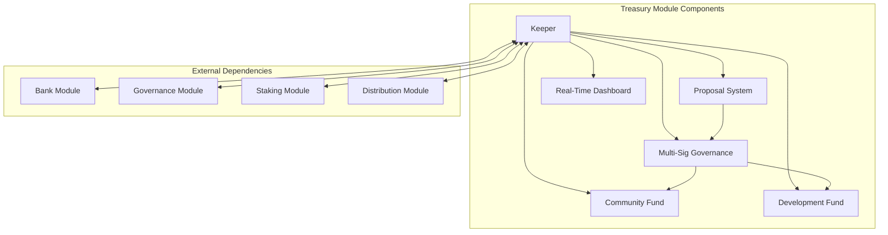
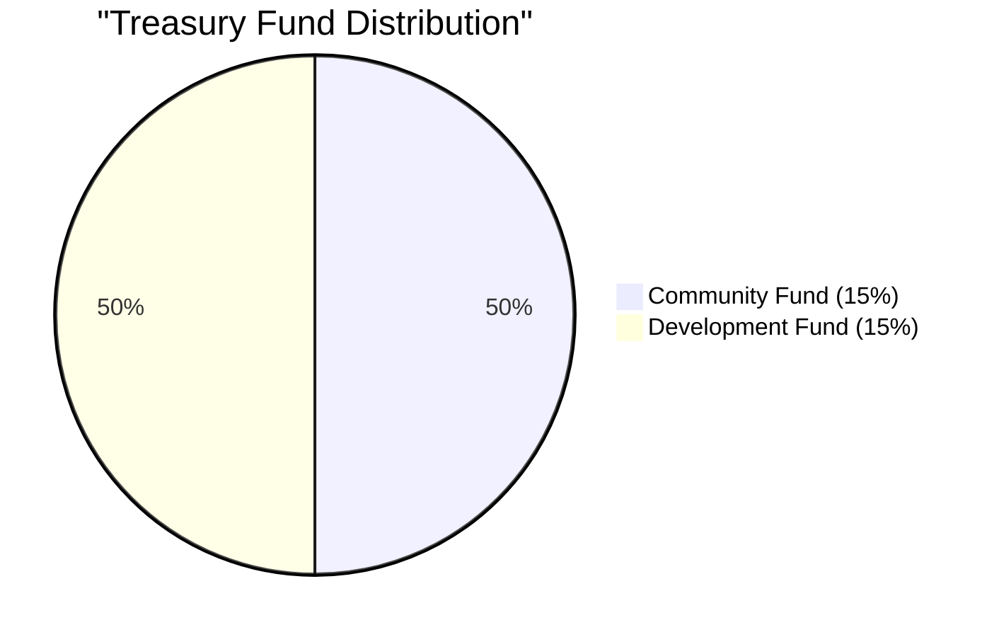
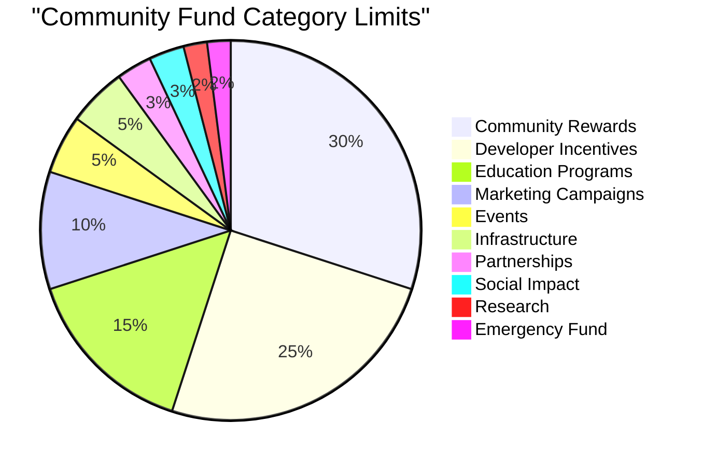
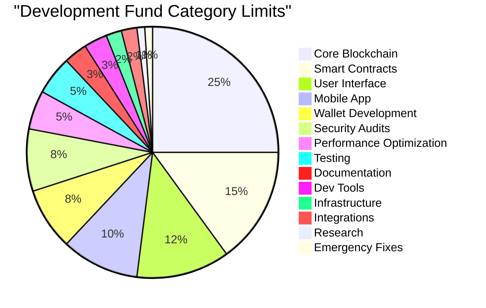
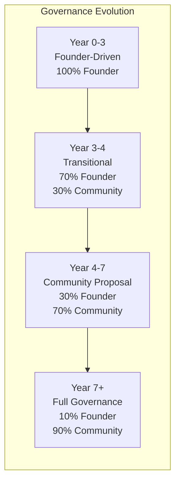
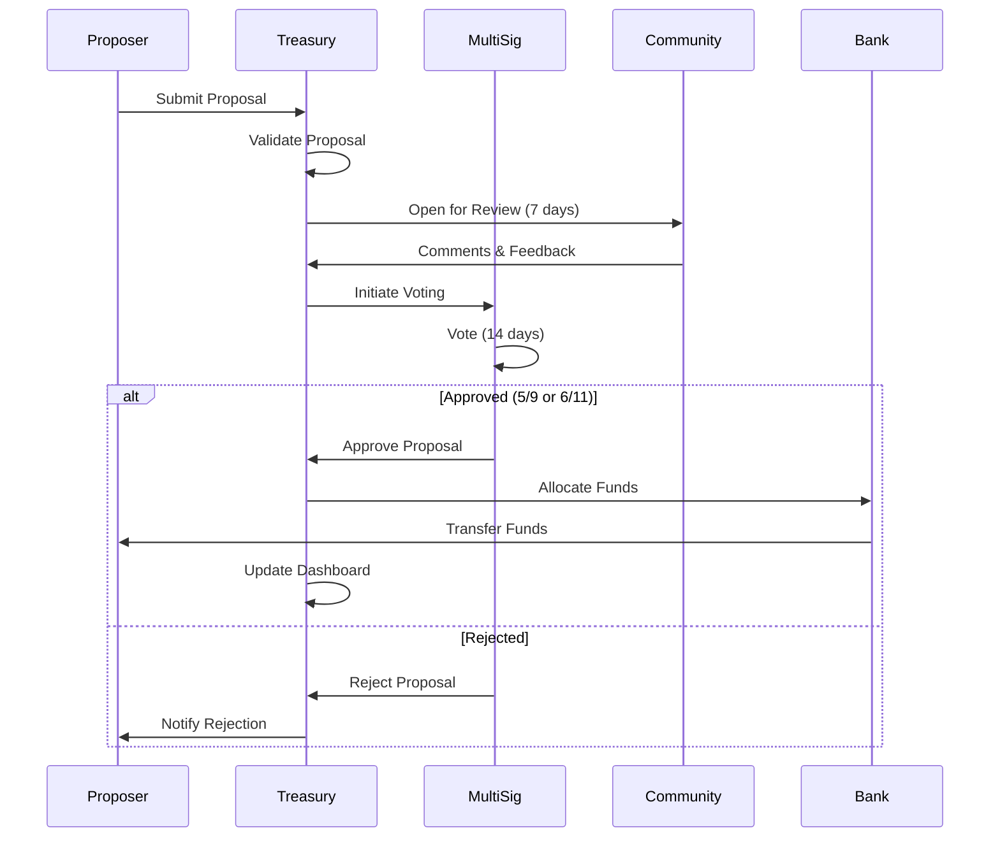
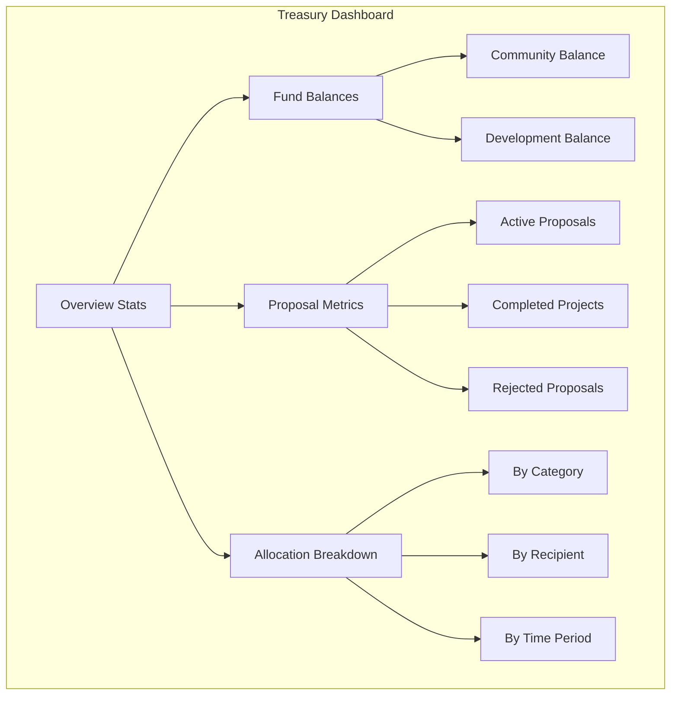
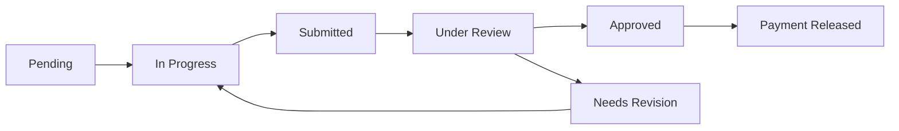

# Treasury Module Documentation

## Overview

The Treasury module manages DeshChain's community and development funds, implementing a transparent, governance-driven system for fund allocation and tracking. It oversees 428,588,298 NAMO tokens (30% of total supply) split between community initiatives and platform development, with sophisticated multi-signature controls and real-time transparency features.

## Module Architecture



## Fund Structure

### Total Treasury Allocation: 428,588,298 NAMO (30%)



### Community Fund: 214,294,149 NAMO



### Development Fund: 214,294,149 NAMO



## Governance Model

### Phased Governance System



### Multi-Signature Structure

#### Community Fund Multi-Sig
- **Required Signatures**: 5 out of 9
- **Signer Composition**:
  - 3 Core Team Members
  - 3 Community Representatives
  - 2 Independent Advisors
  - 1 Legal Representative

#### Development Fund Multi-Sig
- **Required Signatures**: 6 out of 11
- **Signer Composition**:
  - 4 Core Developers
  - 3 Technical Advisors
  - 2 Security Experts
  - 1 Operations Lead
  - 1 Community Dev Representative

## Proposal Lifecycle



## Module Parameters

```go
type Params struct {
    // Fund Parameters
    CommunityFundBalance     sdk.Coins
    DevelopmentFundBalance   sdk.Coins
    
    // Governance Parameters
    CommunityQuorum          int32  // 5 out of 9
    DevelopmentQuorum        int32  // 6 out of 11
    ReviewPeriod            int64  // 7 days (community), 14 days (dev)
    VotingPeriod            int64  // 14 days (community), 21 days (dev)
    ExecutionPeriod         int64  // 7 days (community), 14 days (dev)
    
    // Threshold Parameters
    MinProposalAmount       sdk.Int  // 10,000 NAMO
    MaxProposalAmount       sdk.Int  // 10% of fund balance
    AuditThreshold          sdk.Int  // 1M NAMO (community), 2M (dev)
    
    // Dashboard Parameters
    UpdateFrequency         int64  // 300 seconds (5 minutes)
    HistoryRetention        int64  // 365 days
    TransparencyThreshold   int32  // 8/10 minimum score
}
```

## Proposal System

### Proposal Types

#### 1. Community Proposals
```go
type CommunityProposal struct {
    ID               uint64
    Title            string
    Description      string
    Category         ProposalCategory
    AmountRequested  sdk.Coins
    Recipient        sdk.AccAddress
    Milestones       []Milestone
    CreateTime       time.Time
    Status           ProposalStatus
    Votes            []Vote
    ExecutionRecords []ExecutionRecord
}
```

#### 2. Development Proposals
```go
type DevelopmentProposal struct {
    ID                uint64
    Title             string
    TechnicalSpec     string
    Category          DevCategory
    AmountRequested   sdk.Coins
    TeamLead          sdk.AccAddress
    TeamMembers       []sdk.AccAddress
    Deliverables      []Deliverable
    Timeline          []Phase
    CreateTime        time.Time
    Status            ProposalStatus
    TechnicalReviews  []TechnicalReview
    Votes             []Vote
}
```

### Proposal Categories

**Community Categories**:
- COMMUNITY_REWARDS
- DEVELOPER_INCENTIVES
- EDUCATION_PROGRAMS
- MARKETING_CAMPAIGNS
- EVENTS
- INFRASTRUCTURE
- PARTNERSHIPS
- SOCIAL_IMPACT
- RESEARCH
- EMERGENCY

**Development Categories**:
- CORE_BLOCKCHAIN
- SMART_CONTRACTS
- USER_INTERFACE
- MOBILE_APP
- WALLET_DEVELOPMENT
- SECURITY_AUDITS
- PERFORMANCE_OPT
- TESTING
- DOCUMENTATION
- DEV_TOOLS

## Real-Time Dashboard

### Dashboard Metrics



### Update Mechanism

```go
type DashboardMetrics struct {
    // Fund Metrics
    TotalTreasuryBalance      sdk.Coins
    CommunityFundBalance      sdk.Coins
    DevelopmentFundBalance    sdk.Coins
    AllocatedAmount          sdk.Coins
    SpentAmount              sdk.Coins
    
    // Proposal Metrics
    ActiveProposals          int32
    CompletedProposals       int32
    RejectedProposals        int32
    AverageApprovalTime      time.Duration
    
    // Category Breakdown
    CategoryAllocations      map[string]sdk.Coins
    TopRecipients           []RecipientInfo
    
    // Time Series Data
    MonthlyAllocations      []MonthlyData
    QuarterlyReports        []QuarterlyReport
    AnnualSummaries         []AnnualSummary
    
    // Predictive Analytics
    ProjectedSpend          sdk.Coins
    RemainingRunway         time.Duration
    CategoryTrends          []TrendData
    
    LastUpdateTime          time.Time
}
```

## Transaction Types

### 1. MsgSubmitProposal
Submits a new treasury proposal.

```go
type MsgSubmitProposal struct {
    Proposer        string
    FundType        string  // "community" or "development"
    Title           string
    Description     string
    Category        string
    AmountRequested sdk.Coins
    Recipient       string
    Milestones      []Milestone
}
```

### 2. MsgVoteProposal
Casts a vote on a treasury proposal.

```go
type MsgVoteProposal struct {
    ProposalID      uint64
    Voter           string
    Vote            VoteOption  // YES, NO, ABSTAIN
    Justification   string
}
```

### 3. MsgExecuteProposal
Executes an approved proposal.

```go
type MsgExecuteProposal struct {
    ProposalID      uint64
    Executor        string
}
```

### 4. MsgUpdateMilestone
Updates milestone completion status.

```go
type MsgUpdateMilestone struct {
    ProposalID      uint64
    MilestoneID     uint64
    Status          MilestoneStatus
    Evidence        string
    Updater         string
}
```

## Query Endpoints

### 1. QueryParams
Returns treasury module parameters.

**Request**: `/deshchain/treasury/v1/params`

**Response**:
```json
{
  "params": {
    "community_quorum": 5,
    "development_quorum": 6,
    "review_period": "604800",
    "voting_period": "1209600",
    "min_proposal_amount": "10000000000"
  }
}
```

### 2. QueryFundBalance
Returns current fund balances.

**Request**: `/deshchain/treasury/v1/funds/{fund_type}`

**Response**:
```json
{
  "fund_type": "community",
  "total_balance": "214294149000000",
  "available_balance": "180000000000000",
  "allocated_amount": "30000000000000",
  "spent_amount": "4294149000000"
}
```

### 3. QueryProposal
Returns proposal details.

**Request**: `/deshchain/treasury/v1/proposal/{proposal_id}`

**Response**:
```json
{
  "proposal": {
    "id": "42",
    "title": "Developer Hackathon Series",
    "category": "DEVELOPER_INCENTIVES",
    "amount_requested": "5000000000000",
    "status": "VOTING",
    "votes": {
      "yes": 4,
      "no": 1,
      "abstain": 0
    },
    "voting_end_time": "2024-12-01T00:00:00Z"
  }
}
```

### 4. QueryDashboard
Returns real-time dashboard metrics.

**Request**: `/deshchain/treasury/v1/dashboard`

**Response**:
```json
{
  "metrics": {
    "total_treasury_balance": "428588298000000",
    "community_fund_balance": "180000000000000",
    "development_fund_balance": "190000000000000",
    "active_proposals": 12,
    "completed_proposals": 156,
    "monthly_allocation": "15000000000000",
    "top_categories": [
      {"category": "DEVELOPER_INCENTIVES", "amount": "50000000000000"},
      {"category": "CORE_BLOCKCHAIN", "amount": "45000000000000"}
    ]
  }
}
```

## Events

### 1. Proposal Submitted Event
```json
{
  "type": "proposal_submitted",
  "attributes": [
    {"key": "proposal_id", "value": "42"},
    {"key": "proposer", "value": "{address}"},
    {"key": "fund_type", "value": "community"},
    {"key": "amount", "value": "5000000000000"},
    {"key": "category", "value": "DEVELOPER_INCENTIVES"}
  ]
}
```

### 2. Proposal Approved Event
```json
{
  "type": "proposal_approved",
  "attributes": [
    {"key": "proposal_id", "value": "42"},
    {"key": "final_votes", "value": "5/9"},
    {"key": "allocated_amount", "value": "5000000000000"},
    {"key": "execution_deadline", "value": "2024-12-08T00:00:00Z"}
  ]
}
```

### 3. Funds Disbursed Event
```json
{
  "type": "funds_disbursed",
  "attributes": [
    {"key": "proposal_id", "value": "42"},
    {"key": "recipient", "value": "{address}"},
    {"key": "amount", "value": "1000000000000"},
    {"key": "milestone", "value": "1"},
    {"key": "remaining_milestones", "value": "4"}
  ]
}
```

## Security Features

### 1. Multi-Signature Protection
- All fund movements require multi-sig approval
- Different thresholds for different fund types
- Time-locked execution periods

### 2. Audit Requirements
- Proposals > 1M NAMO require external audit
- Quarterly audits of treasury operations
- Public audit reports on dashboard

### 3. Transparency Enforcement
- All proposals publicly visible
- Vote justifications required
- Real-time fund tracking
- Immutable transaction history

### 4. Emergency Controls
- Pause mechanism for critical issues
- Emergency fund allocation (2% reserved)
- Governance override for security threats

## Integration with Other Modules

### 1. Bank Module
- Handles actual token transfers
- Maintains module account balances
- Enforces transfer restrictions

### 2. Governance Module
- Manages proposal voting mechanics
- Enforces voting periods and quorums
- Handles vote tallying

### 3. Staking Module
- Validator participation in multi-sig
- Stake-weighted voting for future phases
- Slashing for multi-sig misbehavior

### 4. Distribution Module
- Receives portion of transaction fees
- Distributes validator rewards
- Funds community pool

## Milestone Management

### Milestone Structure
```go
type Milestone struct {
    ID              uint64
    Description     string
    Deliverables    []string
    DueDate         time.Time
    PaymentAmount   sdk.Coins
    Status          MilestoneStatus
    CompletionProof string
    ReviewedBy      []sdk.AccAddress
    PaymentTx       string
}
```

### Milestone Workflow


## Best Practices

### For Proposers
1. **Clear Proposals**: Include detailed descriptions and measurable outcomes
2. **Realistic Budgets**: Request only what's needed with justification
3. **Milestone Planning**: Break large projects into verifiable milestones
4. **Community Engagement**: Gather feedback before formal submission
5. **Documentation**: Provide comprehensive supporting documents

### For Multi-Sig Signers
1. **Due Diligence**: Thoroughly review proposals before voting
2. **Timely Response**: Vote within the designated period
3. **Transparent Reasoning**: Provide clear justification for votes
4. **Conflict Disclosure**: Declare any conflicts of interest
5. **Security**: Maintain secure key management practices

### For Developers
1. **API Integration**: Use official SDKs for treasury queries
2. **Event Monitoring**: Subscribe to treasury events for updates
3. **Error Handling**: Implement proper error handling for treasury operations
4. **Rate Limiting**: Respect API rate limits for dashboard queries
5. **Caching**: Cache dashboard data appropriately

## CLI Commands

### Query Commands
```bash
# Query module parameters
deshchaind query treasury params

# Query fund balance
deshchaind query treasury fund-balance [community|development]

# Query proposal
deshchaind query treasury proposal [proposal-id]

# Query dashboard metrics
deshchaind query treasury dashboard

# List all proposals
deshchaind query treasury proposals --status [active|completed|rejected]
```

### Transaction Commands
```bash
# Submit proposal
deshchaind tx treasury submit-proposal [fund-type] [amount] \
  --title "Proposal Title" \
  --description "Description" \
  --category "DEVELOPER_INCENTIVES" \
  --from [key]

# Vote on proposal
deshchaind tx treasury vote [proposal-id] [yes|no|abstain] \
  --justification "Reason for vote" \
  --from [key]

# Execute approved proposal
deshchaind tx treasury execute [proposal-id] --from [key]

# Update milestone
deshchaind tx treasury update-milestone [proposal-id] [milestone-id] \
  --status [completed|in-progress] \
  --evidence "Proof of completion" \
  --from [key]
```

## FAQ

**Q: Who can submit treasury proposals?**
A: Any NAMO token holder with a minimum balance of 10,000 NAMO can submit proposals.

**Q: How long does the approval process take?**
A: Community proposals: 7-day review + 14-day voting + 7-day execution = 28 days total. Development proposals take up to 49 days.

**Q: Can approved proposals be cancelled?**
A: Yes, through a governance vote or if milestones are not met within specified timeframes.

**Q: How are multi-sig signers selected?**
A: Initially appointed by the foundation, transitioning to community election as per the governance phases.

**Q: What happens to unspent allocated funds?**
A: They return to the treasury after the execution period expires or project completion.

---

For more information, see the [Module Overview](../MODULE_OVERVIEW.md) or explore other [DeshChain Modules](../MODULE_OVERVIEW.md#module-categories).