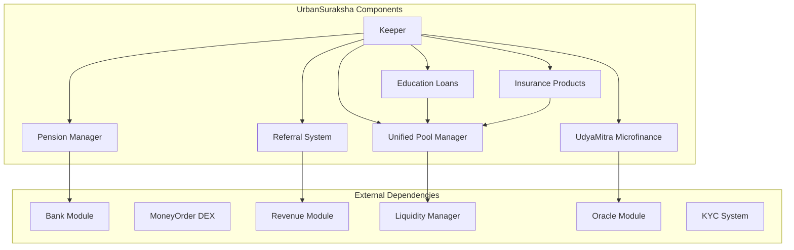
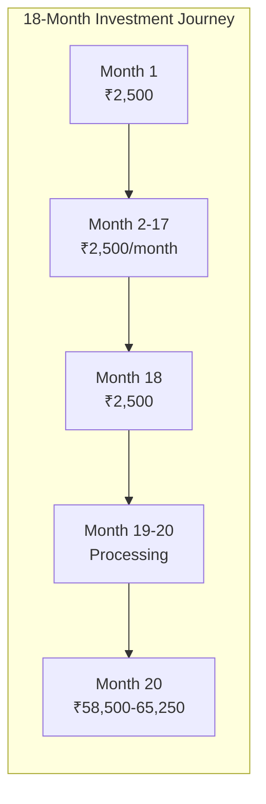
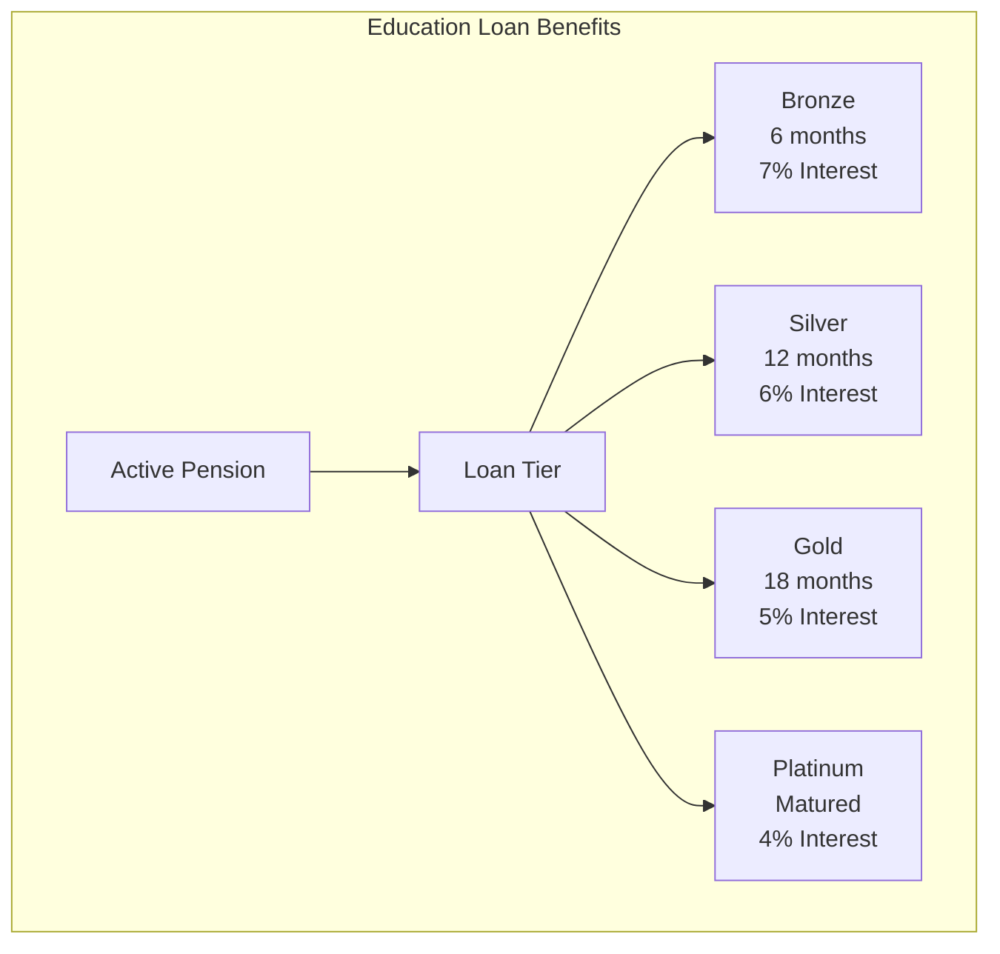
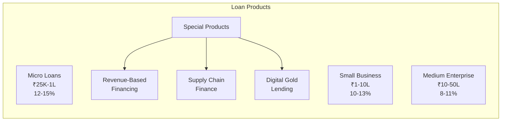
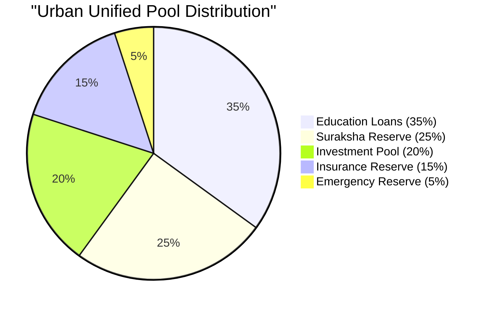
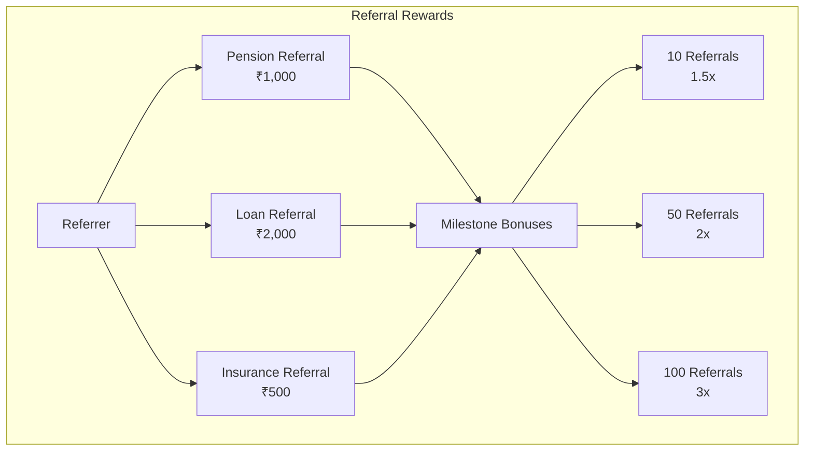
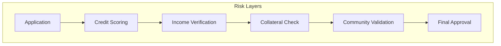
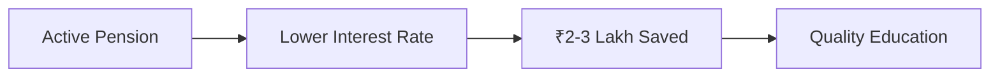

# UrbanSuraksha Module Documentation

## Overview

The UrbanSuraksha (Urban Protection) module implements DeshChain's comprehensive urban investment protocol designed for India's middle class. It combines pension schemes, education loans, insurance products, and SME microfinance into an integrated platform offering 30-45% returns on pension investments while providing complete financial security for urban families.

## Module Architecture



## Product Suite Overview

### 1. Urban Pension Scheme



**Key Features**:
- Monthly Contribution: ₹2,500
- Duration: 18 months
- Total Investment: ₹45,000
- Base Return: 30%
- Performance Bonus: Up to 15%
- Total Returns: ₹58,500 - ₹65,250

### 2. Education Loan Integration



### 3. Insurance Products

| Product | Coverage Range | Premium Discount |
|---------|---------------|------------------|
| Life Insurance | ₹10-50 Lakhs | 20% for pension holders |
| Health Insurance | ₹5-25 Lakhs | 15% for pension holders |
| Accident Cover | ₹5-10 Lakhs | 25% for pension holders |
| Critical Illness | ₹10-20 Lakhs | 30% for pension holders |

### 4. UdyaMitra SME Microfinance



## Unified Pool Management

### Pool Allocation Strategy



### Pool Dynamics

```go
type UnifiedPoolAllocation struct {
    // Core Reserves
    SurakshaReserve     sdk.Dec  // 0.25 (25%) - Pension payouts
    EducationLoanPool   sdk.Dec  // 0.35 (35%) - Education financing
    InsuranceReserve    sdk.Dec  // 0.15 (15%) - Claim coverage
    InvestmentPool      sdk.Dec  // 0.20 (20%) - Yield generation
    EmergencyReserve    sdk.Dec  // 0.05 (5%)  - Crisis management
    
    // Utilization Metrics
    CurrentUtilization  map[string]sdk.Dec
    OptimalUtilization  map[string]sdk.Dec
    RebalanceThreshold  sdk.Dec  // 5% deviation triggers rebalance
}
```

## Module Parameters

```go
type Params struct {
    // Pension Configuration
    MonthlyContribution         sdk.Int   // 2500 (₹2,500)
    ContributionMonths          int32     // 18 months
    MaturityMonth               int32     // 20th month
    BaseReturnRate              sdk.Dec   // 0.30 (30%)
    MaxPerformanceBonus         sdk.Dec   // 0.15 (15%)
    
    // Education Loan Configuration
    MinEducationLoan            sdk.Int   // 50000 (₹50,000)
    MaxEducationLoan            sdk.Int   // 2000000 (₹20 Lakhs)
    BaseEducationRate           sdk.Dec   // 0.07 (7%)
    PensionDiscountTiers        []DiscountTier
    
    // Insurance Configuration
    InsuranceDiscountRate       sdk.Dec   // 0.20 (20% base discount)
    MinInsuranceCoverage        sdk.Int   // Various by product
    MaxInsuranceCoverage        sdk.Int   // Various by product
    
    // UdyaMitra Configuration
    MinBusinessLoan             sdk.Int   // 25000 (₹25,000)
    MaxBusinessLoan             sdk.Int   // 5000000 (₹50 Lakhs)
    BaseBusinessRate            sdk.Dec   // 0.12 (12%)
    SocialImpactDiscounts       []ImpactDiscount
    
    // Pool Configuration
    PoolDeploymentRatio         sdk.Dec   // 0.70 (70%)
    MinPoolBuffer               sdk.Int   // Emergency minimum
    RebalanceFrequency          int64     // 86400 (daily)
}
```

## UdyaMitra Microfinance System

### Social Impact Discounts

```go
type ImpactDiscount struct {
    Category            string
    DiscountRate        sdk.Dec
    MaxLoanAmount       sdk.Int
    RequiredProof       []string
}

// Default Impact Discounts
var DefaultImpactDiscounts = []ImpactDiscount{
    {Category: "women_entrepreneur", DiscountRate: 0.01, MaxLoanAmount: 5000000},
    {Category: "tribal_entrepreneur", DiscountRate: 0.015, MaxLoanAmount: 2500000},
    {Category: "traditional_handicrafts", DiscountRate: 0.02, MaxLoanAmount: 1000000},
    {Category: "rural_enterprise", DiscountRate: 0.005, MaxLoanAmount: 5000000},
    {Category: "green_business", DiscountRate: 0.01, MaxLoanAmount: 10000000},
    {Category: "export_oriented", DiscountRate: 0.005, MaxLoanAmount: 50000000},
}
```

### Advanced Lending Products

#### 1. Revenue-Based Financing (RBF)
```go
type RBFLoan struct {
    BusinessID          string
    LoanAmount          sdk.Coin
    RevenueShareRate    sdk.Dec      // 3-8% of monthly revenue
    CapMultiple         sdk.Dec      // 1.3x - 1.8x of loan amount
    MinMonthlyRevenue   sdk.Int      // Eligibility criteria
    MaxRepaymentMonths  int32        // 24-48 months
}
```

#### 2. Supply Chain Finance
```go
type SupplyChainFinance struct {
    BuyerRating         int32        // AAA to D
    SupplierID          string
    InvoiceAmount       sdk.Coin
    DiscountRate        sdk.Dec      // 0.8-1.2% per month
    PaymentTerms        int32        // 30-90 days
    AutoApproval        bool         // Based on buyer rating
}
```

#### 3. Digital Gold Lending
```go
type GoldLoan struct {
    GoldWeight          sdk.Dec      // In grams
    PurityCertificate   string       // 22K, 24K etc
    LTVRatio            sdk.Dec      // 0.75 (75% of gold value)
    InterestRate        sdk.Dec      // 0.10 (10% annual)
    TenureMonths        int32        // 3-12 months
}
```

## Referral System

### Multi-Tier Referral Structure



### Referral Tracking
```go
type ReferralProfile struct {
    ReferrerID              string
    TotalReferrals          int32
    ActiveReferrals         int32
    
    // Category Breakdown
    PensionReferrals        int32
    LoanReferrals           int32
    InsuranceReferrals      int32
    
    // Rewards
    TotalEarned             sdk.Coins
    PendingRewards          sdk.Coins
    CurrentMultiplier       sdk.Dec
    
    // Performance
    ConversionRate          float64
    AverageTicketSize       sdk.Int
    LifetimeValue           sdk.Int
}
```

## Transaction Types

### 1. MsgEnrollUrbanPension
Enrolls in urban pension scheme.

```go
type MsgEnrollUrbanPension struct {
    Participant         string
    MonthlyCommitment   sdk.Coin
    BankAccountHash     string
    EmploymentProof     string
    IncomeRange         string
}
```

### 2. MsgApplyEducationLoan
Applies for education loan with pension benefits.

```go
type MsgApplyEducationLoan struct {
    Applicant           string
    LoanAmount          sdk.Coin
    InstitutionName     string
    CourseDetails       string
    PensionSchemeID     string    // For interest discount
}
```

### 3. MsgPurchaseInsurance
Purchases insurance with pension holder discount.

```go
type MsgPurchaseInsurance struct {
    Purchaser           string
    InsuranceType       InsuranceProduct
    CoverageAmount      sdk.Int
    TenureYears         int32
    PensionSchemeID     string    // For discount
    Nominees            []Nominee
}
```

### 4. MsgApplyBusinessLoan
Applies for UdyaMitra business loan.

```go
type MsgApplyBusinessLoan struct {
    BusinessOwner       string
    LoanAmount          sdk.Coin
    BusinessType        string
    YearsInOperation    int32
    AnnualRevenue       sdk.Int
    ImpactCategory      string    // For social discounts
    LoanProduct         LoanProductType
}
```

### 5. MsgSubmitReferral
Submits a referral for rewards.

```go
type MsgSubmitReferral struct {
    Referrer            string
    ReferredUser        string
    ProductType         string
    ReferralCode        string
}
```

## Query Endpoints

### 1. QueryUrbanScheme
Returns urban pension scheme details.

**Request**: `/deshchain/urbansuraksha/v1/scheme/{scheme_id}`

**Response**:
```json
{
  "scheme": {
    "id": "URBAN-2024-001",
    "participant": "deshchain1...",
    "monthly_contribution": "2500",
    "contributions_made": 12,
    "total_invested": "30000",
    "current_value": "39000",
    "projected_maturity": "65250",
    "performance_bonus": "12%"
  }
}
```

### 2. QueryEducationLoanEligibility
Checks education loan eligibility and rates.

**Request**: `/deshchain/urbansuraksha/v1/education-loan-eligibility/{address}`

**Response**:
```json
{
  "eligibility": {
    "is_eligible": true,
    "max_loan_amount": "2000000",
    "interest_rate": "5%",
    "pension_tier": "gold",
    "discount_applied": "2%",
    "monthly_emi": "17500"
  }
}
```

### 3. QueryInsuranceQuote
Gets insurance quote with discounts.

**Request**: `/deshchain/urbansuraksha/v1/insurance-quote`

**Body**:
```json
{
  "product_type": "health",
  "coverage_amount": "1000000",
  "age": 35,
  "pension_holder": true
}
```

**Response**:
```json
{
  "quote": {
    "base_premium": "15000",
    "pension_discount": "2250",
    "final_premium": "12750",
    "coverage_details": {...}
  }
}
```

### 4. QueryUdyamitraLoanOptions
Returns available business loan options.

**Request**: `/deshchain/urbansuraksha/v1/udyamitra-options?category=women_entrepreneur`

**Response**:
```json
{
  "loan_options": [
    {
      "product": "working_capital",
      "min_amount": "100000",
      "max_amount": "2500000",
      "base_rate": "12%",
      "category_discount": "1%",
      "final_rate": "11%"
    },
    {
      "product": "rbf",
      "revenue_share": "5%",
      "cap_multiple": "1.5x",
      "max_tenure": "36 months"
    }
  ]
}
```

### 5. QueryPoolStatus
Returns unified pool utilization status.

**Request**: `/deshchain/urbansuraksha/v1/pool-status`

**Response**:
```json
{
  "pool_status": {
    "total_value": "100000000",
    "allocations": {
      "education_loans": {
        "allocated": "35000000",
        "utilized": "28000000",
        "utilization_rate": "80%"
      },
      "suraksha_reserve": {
        "allocated": "25000000",
        "utilized": "0",
        "utilization_rate": "0%"
      }
    },
    "rebalance_needed": false
  }
}
```

## Events

### 1. Urban Pension Enrolled Event
```json
{
  "type": "urban_pension_enrolled",
  "attributes": [
    {"key": "participant", "value": "{address}"},
    {"key": "scheme_id", "value": "URBAN-2024-001"},
    {"key": "monthly_amount", "value": "2500"},
    {"key": "employment_verified", "value": "true"}
  ]
}
```

### 2. Education Loan Approved Event
```json
{
  "type": "education_loan_approved",
  "attributes": [
    {"key": "borrower", "value": "{address}"},
    {"key": "loan_amount", "value": "1500000"},
    {"key": "interest_rate", "value": "5%"},
    {"key": "pension_discount", "value": "2%"},
    {"key": "institution", "value": "IIT Delhi"}
  ]
}
```

### 3. Insurance Purchased Event
```json
{
  "type": "insurance_purchased",
  "attributes": [
    {"key": "policy_holder", "value": "{address}"},
    {"key": "product", "value": "health"},
    {"key": "coverage", "value": "1000000"},
    {"key": "premium_saved", "value": "2250"}
  ]
}
```

### 4. Business Loan Disbursed Event
```json
{
  "type": "business_loan_disbursed",
  "attributes": [
    {"key": "business_owner", "value": "{address}"},
    {"key": "loan_type", "value": "working_capital"},
    {"key": "amount", "value": "500000"},
    {"key": "interest_rate", "value": "11%"},
    {"key": "impact_category", "value": "women_entrepreneur"}
  ]
}
```

### 5. Referral Reward Event
```json
{
  "type": "referral_reward_earned",
  "attributes": [
    {"key": "referrer", "value": "{address}"},
    {"key": "reward_amount", "value": "2000"},
    {"key": "product_type", "value": "loan"},
    {"key": "total_referrals", "value": "25"},
    {"key": "multiplier_applied", "value": "1.5x"}
  ]
}
```

## Risk Management

### 1. Pension Risk Mitigation
- Conservative 70% pool deployment
- 30% reserve maintenance
- Monthly performance tracking
- Guaranteed minimum returns

### 2. Loan Risk Management


### 3. Insurance Risk Pooling
- Actuarial modeling for pricing
- Reinsurance partnerships
- Claim ratio monitoring
- Reserve adequacy testing

## Integration Benefits

### 1. Pension + Education Loan


### 2. Pension + Insurance
- 20-30% premium savings
- Guaranteed insurability
- Simplified underwriting
- Integrated payments

### 3. Complete Financial Security
- Retirement planning via pension
- Children's education secured
- Family protection via insurance
- Business growth via loans

## Best Practices

### For Participants
1. **Start Early**: Maximize compound benefits
2. **Stay Consistent**: Never miss contributions
3. **Utilize Benefits**: Take education loans when needed
4. **Buy Insurance**: Lock in lower premiums
5. **Refer Friends**: Earn additional income

### For Business Owners
1. **Build History**: Start with small loans
2. **Maintain Records**: Digital bookkeeping
3. **Explore Products**: RBF for growth phases
4. **Social Impact**: Qualify for discounts
5. **Community Engagement**: Better validation

### For Developers
1. **Pool Monitoring**: Real-time utilization tracking
2. **Risk Analytics**: Predictive modeling
3. **Integration APIs**: Seamless product access
4. **Performance Optimization**: Handle scale
5. **Security First**: Protect user funds

## CLI Commands

### Query Commands
```bash
# Query urban pension scheme
deshchaind query urbansuraksha scheme [scheme-id]

# Check education loan eligibility
deshchaind query urbansuraksha education-eligibility [address]

# Get insurance quote
deshchaind query urbansuraksha insurance-quote --type [health|life|accident] --coverage [amount]

# View business loan options
deshchaind query urbansuraksha udyamitra-options --category [category]

# Check pool status
deshchaind query urbansuraksha pool-status
```

### Transaction Commands
```bash
# Enroll in urban pension
deshchaind tx urbansuraksha enroll-pension [amount] \
  --employment-proof [hash] \
  --income-range [range] \
  --from [key]

# Apply for education loan
deshchaind tx urbansuraksha apply-education-loan [amount] \
  --institution [name] \
  --course [details] \
  --pension-id [id] \
  --from [key]

# Purchase insurance
deshchaind tx urbansuraksha purchase-insurance \
  --type [health|life] \
  --coverage [amount] \
  --tenure [years] \
  --from [key]

# Apply for business loan
deshchaind tx urbansuraksha apply-business-loan [amount] \
  --business-type [type] \
  --category [impact-category] \
  --from [key]
```

## FAQ

**Q: How is UrbanSuraksha different from GramSuraksha?**
A: UrbanSuraksha has higher contributions (₹2,500 vs ₹1,000), integrated financial products, and targets urban middle class with stable incomes.

**Q: Can I switch from GramSuraksha to UrbanSuraksha?**
A: Yes, you can have both schemes running simultaneously or migrate after maturity.

**Q: What happens to education loan if I stop pension contributions?**
A: Existing loans continue at current rates, but new loans will have standard rates.

**Q: Are the insurance products mandatory?**
A: No, they're optional add-ons with attractive discounts for pension holders.

**Q: How are business loans different from bank loans?**
A: Lower rates, faster approval, social impact discounts, and innovative products like RBF.

---

For more information, see the [Module Overview](../MODULE_OVERVIEW.md) or explore other [DeshChain Modules](../MODULE_OVERVIEW.md#module-categories).