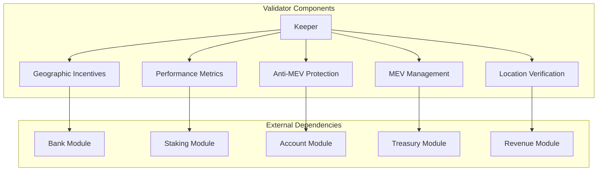
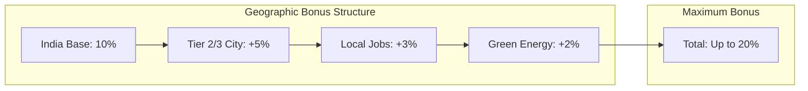
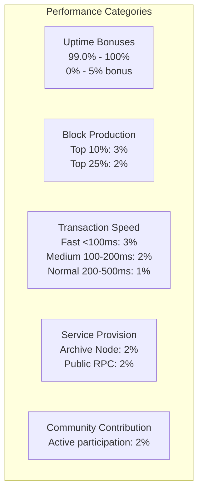
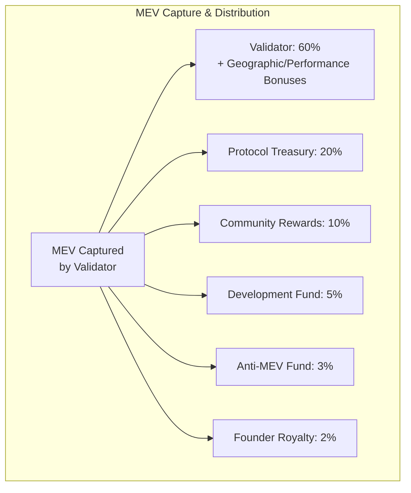
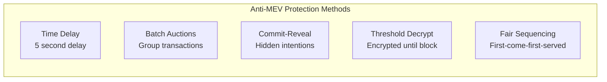
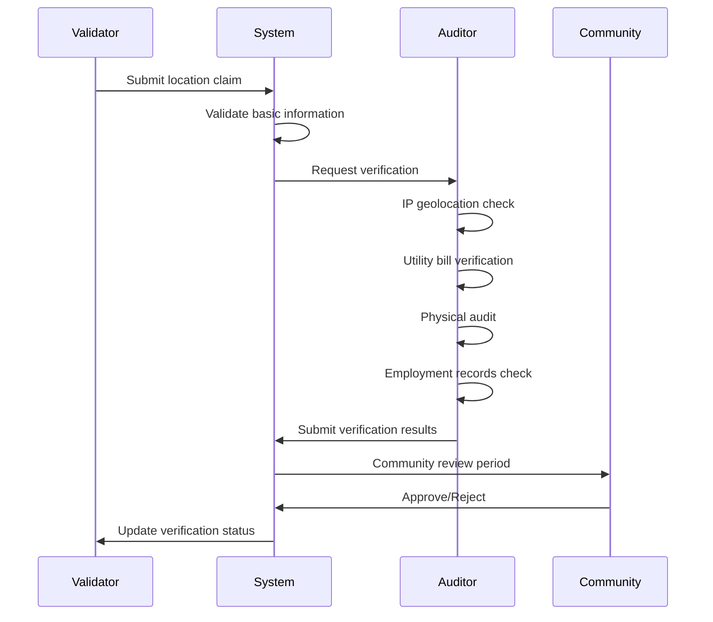

# Validator Module Documentation

## Overview

The Validator module manages DeshChain's unique validator incentive system that prioritizes India-based validators while maintaining network security and performance. It implements geographic incentives, performance bonuses, MEV (Maximum Extractable Value) management, and advanced anti-MEV protection mechanisms to create a fair and culturally-aligned validator ecosystem.

## Module Architecture



## Geographic Incentive System

### 1. India-First Validator Incentives



### 2. Geographic Incentive Parameters

```go
type GeographicIncentives struct {
    IndiaBase        sdk.Dec  // 10% base bonus for India
    Tier2CityBonus   sdk.Dec  // 5% additional for Tier 2/3 cities
    EmploymentBonus  sdk.Dec  // 3% for hiring 5+ local employees
    GreenEnergyBonus sdk.Dec  // 2% for renewable energy usage
}

// Default incentive structure
func DefaultGeographicIncentives() GeographicIncentives {
    return GeographicIncentives{
        IndiaBase:        sdk.NewDecWithPrec(10, 2), // 10%
        Tier2CityBonus:   sdk.NewDecWithPrec(5, 2),  // 5%
        EmploymentBonus:  sdk.NewDecWithPrec(3, 2),  // 3%
        GreenEnergyBonus: sdk.NewDecWithPrec(2, 2),  // 2%
    }
}
```

### 3. Validator Location Verification

```go
type ValidatorLocation struct {
    Country             string  // Must be "India" for bonuses
    State               string  // Indian state
    City                string  // City name
    CityTier            int     // 1, 2, or 3
    DataCenterAddress   string  // Physical address
    IPAddress           string  // Server IP address
    LocalEmployees      int     // Number of local employees
    RenewableEnergyPerc int     // % renewable energy (0-100)
    Verified            bool    // Verification status
    VerificationDate    int64   // Verification timestamp
}
```

### 4. City Tier Classification

```go
// Tier 1 Cities (No tier bonus)
var Tier1Cities = []string{
    "mumbai", "delhi", "bangalore", "kolkata",
    "chennai", "hyderabad", "pune", "ahmedabad",
}

// Tier 2 Cities (5% bonus)
var Tier2Cities = []string{
    "jaipur", "lucknow", "kanpur", "nagpur",
    "indore", "bhopal", "patna", "vadodara",
    // ... (extensive list in code)
}

// Tier 3 Cities (5% bonus)
// All other Indian cities default to Tier 3
```

## Performance-Based Bonuses

### 1. Performance Metrics



### 2. Performance Calculation

```go
type PerformanceMetrics struct {
    UptimeThresholds      map[string]sdk.Dec  // Uptime-based bonuses
    BlockProductionBonus  map[string]sdk.Dec  // Efficiency bonuses
    TransactionSpeedBonus map[string]sdk.Dec  // Speed bonuses
    CommunityBonus        sdk.Dec             // Community participation
    ArchiveNodeBonus      sdk.Dec             // Full node bonus
    PublicRPCBonus        sdk.Dec             // Public RPC bonus
}

// Calculate total performance multiplier
func (pm PerformanceMetrics) CalculatePerformanceMultiplier(
    data ValidatorPerformanceData) sdk.Dec {
    
    multiplier := sdk.OneDec() // Start with 1.0
    
    // Add uptime bonus
    multiplier = multiplier.Add(pm.getUptimeBonus(data.UptimePercentage))
    
    // Add efficiency bonus
    multiplier = multiplier.Add(pm.getEfficiencyBonus(
        data.EfficiencyRank, data.TotalValidators))
    
    // Add speed bonus
    multiplier = multiplier.Add(pm.getSpeedBonus(data.AverageResponseTime))
    
    // Add service bonuses
    if data.ProvidesArchiveNode {
        multiplier = multiplier.Add(pm.ArchiveNodeBonus)
    }
    if data.ProvidesPublicRPC {
        multiplier = multiplier.Add(pm.PublicRPCBonus)
    }
    
    // Add community bonus
    if pm.hasCommunityContributions(data.CommunityContributions) {
        multiplier = multiplier.Add(pm.CommunityBonus)
    }
    
    return multiplier
}
```

### 3. Community Contribution System

```go
type CommunityContribution struct {
    Type        string    // documentation, tools, support, education
    Description string    // Contribution description
    Verified    bool      // Verification status
    Points      int       // Contribution score
    Date        time.Time // Contribution date
}

// Contribution types and points
const (
    ContributionTypeDocumentation = "documentation" // 5 points
    ContributionTypeTools         = "tools"         // 10 points
    ContributionTypeSupport       = "support"       // 3 points
    ContributionTypeEducation     = "education"     // 8 points
    ContributionTypeBugReports    = "bug_reports"   // 5 points
    ContributionTypeNetworkHealth = "network_health" // 15 points
)
```

## MEV Management System

### 1. MEV Distribution Model



### 2. MEV Capture Methods

```go
// Ethical MEV Methods (Bonus to anti-MEV score)
const (
    MEVMethodArbitrage    = "arbitrage"     // +0.05 score
    MEVMethodLiquidation  = "liquidation"   // +0.03 score
    MEVMethodDEXAgg       = "dex_aggregation" // +0.04 score
    MEVMethodFlashLoan    = "flash_loan"    // +0.02 score
)

// Unethical MEV Methods (Penalty to anti-MEV score)
const (
    MEVMethodFrontRun     = "front_run"     // -0.10 score
    MEVMethodBackRun      = "back_run"      // -0.05 score
    MEVMethodSandwich     = "sandwich"      // -0.15 score
)
```

### 3. MEV Performance Tracking

```go
type ValidatorMEVPerformance struct {
    ValidatorAddress      string
    
    // MEV capture metrics
    TotalMEVCaptured      sdk.Coin  // Total MEV captured
    BlocksWithMEV         int64     // Blocks containing MEV
    TotalBlocksProduced   int64     // Total blocks produced
    MEVEfficiency         sdk.Dec   // MEV per block ratio
    
    // Anti-MEV behavior metrics
    ProtectedTransactions int64     // Transactions protected
    MEVAttacksPrevented   int64     // Attacks prevented
    AntiMEVScore          sdk.Dec   // Ethical behavior score (0-1)
    
    // Ethical practices
    EthicalMEVPractices   bool      // Uses ethical methods
    TransparencyScore     sdk.Dec   // Transparency score
    CommunityBenefit      sdk.Dec   // Community benefit score
    
    PeriodStart           time.Time
    PeriodEnd             time.Time
    LastUpdated           time.Time
}
```

## Anti-MEV Protection

### 1. Protection Mechanisms



### 2. Protection Implementation

```go
func (k Keeper) ImplementAntiMEVProtection(ctx context.Context, 
    protectionMethod string, transactionHash string) error {
    
    switch protectionMethod {
    case ProtectionMethodTimeDelay:
        return k.ApplyTimeDelayProtection(ctx, transactionHash)
    case ProtectionMethodBatchAuction:
        return k.ApplyBatchAuctionProtection(ctx, transactionHash)
    case ProtectionMethodCommitReveal:
        return k.ApplyCommitRevealProtection(ctx, transactionHash)
    case ProtectionMethodThresholdDecrypt:
        return k.ApplyThresholdDecryptProtection(ctx, transactionHash)
    case ProtectionMethodSequencerQueue:
        return k.ApplySequencerQueueProtection(ctx, transactionHash)
    }
    
    return fmt.Errorf("unknown protection method: %s", protectionMethod)
}
```

### 3. MEV Opportunity Detection

```go
type MEVOpportunity struct {
    TransactionHash   string    // Transaction identifier
    OpportunityType   string    // arbitrage, liquidation, etc.
    EstimatedProfit   sdk.Coin  // Expected profit
    RiskLevel         string    // low, medium, high
    EthicalScore      sdk.Dec   // Ethical rating (0-1)
    DetectionTime     time.Time // When detected
    ExpirationTime    time.Time // When expires
}

// Analyze transaction for MEV opportunities
func (k Keeper) AnalyzeTransactionForMEV(ctx context.Context, 
    tx sdk.Tx) *MEVOpportunity {
    
    // Check for arbitrage opportunities
    if k.HasArbitrageOpportunity(ctx, tx) {
        return &MEVOpportunity{
            OpportunityType: MEVMethodArbitrage,
            EstimatedProfit: sdk.NewCoin("namo", sdk.NewInt(1000)),
            RiskLevel:       "low",
            EthicalScore:    sdk.NewDecWithPrec(80, 2), // 80%
            ExpirationTime:  ctx.BlockTime().Add(10 * time.Second),
        }
    }
    
    return nil
}
```

## Verification System

### 1. Geographic Verification Process



### 2. Required Verification Items

```go
type VerificationItem struct {
    Type        string  // Verification type
    Description string  // What needs verification
    Required    bool    // Is this mandatory?
    Completed   bool    // Verification status
    Evidence    string  // Evidence hash/URL
    Verifier    string  // Verifier address
}

// Required verification for India bonus
func GetRequiredVerificationItems() []VerificationItem {
    return []VerificationItem{
        {
            Type:        "ip_verification",
            Description: "IP address geolocation verification",
            Required:    true,
        },
        {
            Type:        "utility_bills",
            Description: "Local electricity/internet bills",
            Required:    true,
        },
        {
            Type:        "datacenter_registration",
            Description: "Government registration of data center",
            Required:    true,
        },
        {
            Type:        "physical_audit",
            Description: "Physical verification by local auditor",
            Required:    true,
        },
        {
            Type:        "employment_records",
            Description: "Payroll records for local employees",
            Required:    false, // Only if claiming employment bonus
        },
        {
            Type:        "green_energy_certificate",
            Description: "Renewable energy usage certification",
            Required:    false, // Only if claiming green bonus
        },
    }
}
```

## Module Parameters

```go
type ValidatorParams struct {
    // Geographic incentives
    GeographicIncentives    GeographicIncentives
    
    // Performance bonuses
    PerformanceMetrics      PerformanceMetrics
    
    // MEV distribution
    MEVDistributionParams   MEVDistributionParams
    
    // Verification requirements
    VerificationRequired    bool
    VerificationPeriod      time.Duration  // 1 year validity
    
    // Community thresholds
    MinCommunityPoints      int            // 10 points minimum
    
    // Reporting periods
    PerformanceReportPeriod string         // "monthly"
    MEVReportPeriod        string         // "weekly"
}
```

## Query Endpoints

### 1. QueryValidatorIncentives
Get validator's total incentive multiplier.

**Request**: `/deshchain/validator/v1/incentives/{validator_address}`

**Response**:
```json
{
  "validator_address": "deshchain1...",
  "geographic_multiplier": "1.20",
  "performance_multiplier": "1.15",
  "total_multiplier": "1.38",
  "estimated_annual_bonus": "500000 NAMO",
  "verification_status": "verified",
  "last_updated": "2024-07-25T10:30:00Z"
}
```

### 2. QueryMEVPerformance
Get validator's MEV performance metrics.

**Request**: `/deshchain/validator/v1/mev/{validator_address}`

**Response**:
```json
{
  "validator_address": "deshchain1...",
  "total_mev_captured": "10000 NAMO",
  "blocks_with_mev": 150,
  "mev_efficiency": "0.75",
  "anti_mev_score": "0.85",
  "ethical_practices": true,
  "period_start": "2024-07-01T00:00:00Z",
  "period_end": "2024-07-31T23:59:59Z"
}
```

### 3. QueryGeographicVerification
Get verification status and details.

**Request**: `/deshchain/validator/v1/verification/{validator_address}`

**Response**:
```json
{
  "validator_address": "deshchain1...",
  "location": {
    "country": "India",
    "state": "Maharashtra",
    "city": "Pune",
    "city_tier": 2
  },
  "verification_status": "verified",
  "verification_items": [
    {
      "type": "ip_verification",
      "completed": true,
      "verifier": "deshchain1..."
    }
  ],
  "expiry_date": "2025-07-25T10:30:00Z"
}
```

### 4. QueryPerformanceLeaderboard
Get top performing validators.

**Request**: `/deshchain/validator/v1/leaderboard?category=performance&limit=10`

**Response**:
```json
{
  "leaderboard": [
    {
      "validator_address": "deshchain1...",
      "performance_score": "1.25",
      "uptime": "99.95%",
      "efficiency_rank": 1,
      "community_contributions": 5
    }
  ],
  "total_validators": 150,
  "last_updated": "2024-07-25T10:30:00Z"
}
```

## Events

### 1. MEV Capture Event
```json
{
  "type": "mev_captured",
  "attributes": [
    {"key": "validator", "value": "deshchain1..."},
    {"key": "amount", "value": "1000 NAMO"},
    {"key": "method", "value": "arbitrage"},
    {"key": "block_height", "value": "12345"}
  ]
}
```

### 2. Geographic Bonus Applied Event
```json
{
  "type": "geographic_bonus_applied",
  "attributes": [
    {"key": "validator", "value": "deshchain1..."},
    {"key": "multiplier", "value": "1.20"},
    {"key": "city_tier", "value": "2"},
    {"key": "employment_bonus", "value": "true"}
  ]
}
```

### 3. Verification Status Changed Event
```json
{
  "type": "verification_status_changed",
  "attributes": [
    {"key": "validator", "value": "deshchain1..."},
    {"key": "old_status", "value": "pending"},
    {"key": "new_status", "value": "verified"},
    {"key": "verifier", "value": "deshchain1..."}
  ]
}
```

## Best Practices

### For Validators
1. **Geographic Setup**: Establish operations in India for maximum incentives
2. **Performance Optimization**: Maintain high uptime and fast response times
3. **Community Engagement**: Actively contribute to documentation and tools
4. **Ethical MEV**: Focus on beneficial MEV extraction methods
5. **Verification Compliance**: Complete all required verification steps

### For Verifiers
1. **Thorough Audits**: Conduct comprehensive physical and digital verification
2. **Documentation**: Maintain detailed records of verification process
3. **Regular Updates**: Re-verify validators annually
4. **Transparency**: Provide clear verification reports
5. **Independence**: Maintain objectivity in verification decisions

### For Network Health
1. **Balanced Distribution**: Encourage geographic distribution within India
2. **Performance Monitoring**: Regular assessment of validator performance
3. **MEV Transparency**: Monitor and report MEV extraction activities
4. **Anti-MEV Implementation**: Deploy protection mechanisms for users
5. **Community Oversight**: Enable community participation in governance

## CLI Commands

### Query Commands
```bash
# Check validator incentives
deshchaind query validator incentives [validator-address]

# View MEV performance
deshchaind query validator mev-performance [validator-address]

# Check verification status
deshchaind query validator verification [validator-address]

# View performance leaderboard
deshchaind query validator leaderboard --category performance --limit 10

# Get MEV leaderboard
deshchaind query validator mev-leaderboard --limit 10
```

### Transaction Commands
```bash
# Submit location verification
deshchaind tx validator submit-location-verification \
  --country "India" \
  --state "Maharashtra" \
  --city "Pune" \
  --datacenter-address "..." \
  --local-employees 10 \
  --renewable-energy 75 \
  --from [key]

# Report MEV capture
deshchaind tx validator report-mev-capture \
  --amount "1000namo" \
  --method "arbitrage" \
  --from [validator-key]

# Implement anti-MEV protection
deshchaind tx validator implement-protection \
  --method "time_delay" \
  --transaction-hash "0x..." \
  --from [validator-key]
```

## Integration Examples

### Geographic Bonus Calculation
```javascript
import { ValidatorClient } from '@deshchain/validator-sdk'

async function calculateValidatorBonuses(validatorAddress) {
  const client = new ValidatorClient(rpcEndpoint)
  
  // Get validator incentives
  const incentives = await client.getValidatorIncentives(validatorAddress)
  
  // Calculate annual bonus value
  const baseEarnings = sdk.NewCoin("namo", sdk.NewInt(1000000)) // 1M NAMO
  const bonusValue = baseEarnings.amount.mul(
    incentives.total_multiplier.sub(sdk.OneDec())
  )
  
  console.log(`Annual bonus: ${bonusValue} NAMO`)
  console.log(`Geographic multiplier: ${incentives.geographic_multiplier}`)
  console.log(`Performance multiplier: ${incentives.performance_multiplier}`)
}
```

### MEV Protection Integration
```javascript
async function protectUserTransaction(txHash, protectionMethod) {
  const client = new ValidatorClient(rpcEndpoint)
  
  // Implement protection
  await client.implementAntiMEVProtection({
    transactionHash: txHash,
    protectionMethod: protectionMethod, // 'time_delay', 'batch_auction', etc.
    fromAddress: validatorAddress
  })
  
  console.log(`Protected transaction ${txHash} with ${protectionMethod}`)
}
```

## FAQ

**Q: How much bonus can an India-based validator earn?**
A: Up to 20% geographic bonus + up to 17% performance bonus = maximum ~40% total bonus on validator rewards.

**Q: What verification is required for India bonuses?**
A: IP geolocation, utility bills, government registration, physical audit. Employment and green energy verification for additional bonuses.

**Q: How is MEV distributed?**
A: 60% to validator (with bonuses), 20% protocol treasury, 10% community, 5% development, 3% anti-MEV fund, 2% founder royalty.

**Q: What makes MEV extraction ethical?**
A: Arbitrage, liquidations, and DEX aggregation benefit the network. Front-running, back-running, and sandwich attacks harm users.

**Q: How often are performance metrics updated?**
A: Real-time for MEV, daily for basic performance, monthly for comprehensive performance reports.

---

For more information, see the [Module Overview](../MODULE_OVERVIEW.md) or explore other [DeshChain Modules](../MODULE_OVERVIEW.md#module-categories).