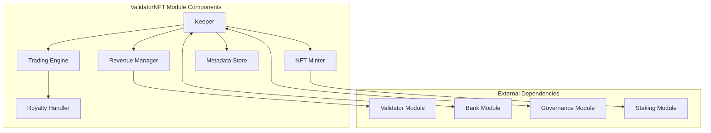

# Validator NFT Module Documentation

## Overview

The Validator NFT module implements the revolutionary "Bharat Guardians" NFT collection for DeshChain's genesis validators. This module manages the minting, trading, and utility of exclusive NFTs granted to the first 21 validators, creating a unique blend of cultural heritage, economic incentives, and community recognition.

## Module Architecture



## Revenue Distribution Model

### Tiered Distribution System

The module implements a sophisticated revenue distribution model that rewards early validators while maintaining fairness:

```go
type RevenueDistribution struct {
    TotalValidators    uint32
    GenesisValidators  []string  // First 21
    TotalRevenue       sdk.Coins
    DistributionType   DistributionType
}

type DistributionType int

const (
    EqualAll DistributionType = iota      // ≤21 validators
    OnePercentEach                         // 22-100 validators  
    GenesisPremiumPlusEqual               // >100 validators
)
```

### Distribution Logic

#### Scenario 1: ≤ 21 Validators
- All validators receive equal share of revenue
- No special treatment needed as all are genesis

#### Scenario 2: 22-100 Validators
- Each validator receives exactly 1% of total revenue
- Simple and predictable distribution

#### Scenario 3: > 100 Validators
- Genesis validators (1-21): 1% guaranteed each (21% total)
- All validators: Equal share of remaining 79%
- Genesis validators get both their 1% AND share of 79%

## NFT Collection: Bharat Guardians

### NFT Metadata Structure

```go
type GenesisValidatorNFT struct {
    TokenID         uint64
    Rank            uint32
    ValidatorAddr   string
    SanskritName    string
    EnglishName     string
    Title           string
    MintHeight      int64
    SpecialPowers   []string
    Tradeable       bool
    CurrentOwner    string
    TradeHistory    []TradeRecord
}

type TradeRecord struct {
    From        string
    To          string
    Price       sdk.Coins
    BlockHeight int64
    TxHash      string
}
```

### The Grand Master - Param Rakshak (#1)

```yaml
Sanskrit: परम रक्षक
English: The Supreme Guardian
Special Powers:
  - 2x Governance voting weight
  - Genesis Crown badge on all interfaces
  - Golden validator dashboard theme
  - Priority block proposal rights
  - Exclusive Grand Master Discord channel
  - Annual physical collectible (gold coin)
  - Special event hosting privileges
```

### Genesis Validators (#2-21)

The remaining 20 genesis validators receive NFTs organized into thematic categories:

#### Warrior Class (Ranks 2-7)
- Maha Senani (महा सेनानी) - The Great General
- Dharma Palak (धर्म पालक) - Keeper of Righteousness
- Shakti Stambh (शक्ति स्तंभ) - Pillar of Power
- Vijay Dhwaj (विजय ध्वज) - Victory Banner
- Surya Kiran (सूर्य किरण) - Sun Ray
- Chandra Rekha (चंद्र रेखा) - Moon Beam

#### Elemental Guardians (Ranks 8-13)
- Agni Veer (अग्नि वीर) - Fire Warrior
- Vayu Gati (वायु गति) - Wind Speed
- Jal Rakshak (जल रक्षक) - Water Guardian
- Prithvi Pal (पृथ्वी पाल) - Earth Protector
- Akash Deep (आकाश दीप) - Sky Lamp
- Indra Dhanush (इंद्र धनुष) - Rainbow Warrior

#### Royal Beasts (Ranks 14-20)
- Vajra Mukut (वज्र मुकुट) - Diamond Crown
- Naga Raja (नाग राज) - Serpent King
- Garuda Paksh (गरुड़ पक्ष) - Eagle Wing
- Simha Garjan (सिंह गर्जन) - Lion's Roar
- Gaja Bal (गज बल) - Elephant Strength
- Ashwa Tej (अश्व तेज) - Horse Speed
- Mayur Chand (मयूर चंद) - Peacock Pride

#### The National Guardian (#21)
- Bharat Gaurav (भारत गौरव) - Pride of India

## NFT Trading System

### Trading Parameters

```go
type TradingParams struct {
    MinimumPrice         sdk.Coins  // 10,000 NAMO
    RoyaltyPercentage    sdk.Dec    // 5%
    TradingEnabled       bool       // true
    CooldownPeriod       int64      // 24 hours between trades
    MaxPriceMultiplier   sdk.Dec    // 100x min price
}
```

### Trade Execution

```go
func (k Keeper) ExecuteNFTTrade(
    ctx sdk.Context,
    tokenID uint64,
    seller sdk.AccAddress,
    buyer sdk.AccAddress,
    price sdk.Coins,
) error {
    // Validate ownership
    nft := k.GetNFT(ctx, tokenID)
    if nft.CurrentOwner != seller.String() {
        return ErrNotOwner
    }
    
    // Validate price
    if price.IsAllLT(k.GetMinimumPrice(ctx)) {
        return ErrPriceTooLow
    }
    
    // Calculate royalty (5% to original validator)
    royalty := price.MulFloat(0.05)
    netPrice := price.Sub(royalty)
    
    // Execute payment
    k.bankKeeper.SendCoins(ctx, buyer, seller, netPrice)
    k.bankKeeper.SendCoins(ctx, buyer, 
        sdk.AccAddress(nft.ValidatorAddr), royalty)
    
    // Transfer NFT ownership
    nft.CurrentOwner = buyer.String()
    k.SetNFT(ctx, nft)
    
    // Transfer validator rights
    k.TransferValidatorRights(ctx, seller, buyer)
    
    return nil
}
```

## NFT Utility & Benefits

### Governance Enhancements

```go
type GovernanceMultiplier struct {
    Rank       uint32
    Multiplier sdk.Dec
}

var GovernanceWeights = map[uint32]sdk.Dec{
    1:  sdk.NewDec(2),    // Param Rakshak: 2x
    2:  sdk.NewDecWithPrec(15, 1),  // 1.5x
    3:  sdk.NewDecWithPrec(13, 1),  // 1.3x
    // ... continues with decreasing multipliers
    21: sdk.NewDecWithPrec(11, 1),  // 1.1x
}
```

### Visual Customization

Each NFT unlocks unique visual themes:
- Custom validator dashboard UI
- Animated 3D character model
- Particle effects and auras
- Special badges and titles
- Exclusive color schemes

### Revenue Rights

NFT ownership includes:
- Validator slot ownership
- Revenue share percentage
- Commission rate settings
- Delegation management
- Performance metrics access

## Module Parameters

```go
type Params struct {
    // NFT Configuration
    NFTMintingEnabled    bool
    MaxGenesisNFTs       uint32  // 21
    TradingEnabled       bool
    
    // Trading Parameters
    MinimumTradePrice    sdk.Coins
    RoyaltyRate          sdk.Dec
    TradeCooldown        time.Duration
    
    // Revenue Configuration
    GenesisBonus         sdk.Dec  // 0.01 (1% each)
    DistributionEnabled  bool
    
    // Governance
    MaxVotingMultiplier  sdk.Dec  // 2.0
    ProposalRightsNFT    bool
}
```

## Transaction Types

### 1. MsgMintGenesisNFT
Mints NFT for genesis validators (automated at genesis).

```go
type MsgMintGenesisNFT struct {
    Authority     string
    ValidatorAddr string
    Rank          uint32
}
```

### 2. MsgTransferNFT
Transfers NFT ownership with payment.

```go
type MsgTransferNFT struct {
    TokenID      uint64
    FromAddress  string
    ToAddress    string
    Price        sdk.Coins
}
```

### 3. MsgUpdateNFTMetadata
Updates NFT display preferences (owner only).

```go
type MsgUpdateNFTMetadata struct {
    TokenID       uint64
    Owner         string
    DisplayName   string
    PreferredTheme string
}
```

## Query Endpoints

### 1. QueryNFT
Returns NFT details by token ID.

**Request**: `/deshchain/validatornft/v1/nft/{token_id}`

**Response**:
```json
{
  "nft": {
    "token_id": "1",
    "rank": 1,
    "sanskrit_name": "परम रक्षक",
    "english_name": "Param Rakshak",
    "current_owner": "deshchain1...",
    "validator_address": "deshchainvaloper1...",
    "mint_height": "1",
    "trade_count": 5,
    "last_price": "50000000000unamo"
  }
}
```

### 2. QueryGenesisValidators
Returns all genesis validators with NFT status.

**Request**: `/deshchain/validatornft/v1/genesis-validators`

### 3. QueryRevenueShare
Returns revenue distribution for a validator.

**Request**: `/deshchain/validatornft/v1/revenue/{validator_address}`

### 4. QueryMarketStats
Returns NFT market statistics.

**Request**: `/deshchain/validatornft/v1/market-stats`

## Events

### 1. NFT Minted Event
```json
{
  "type": "genesis_nft_minted",
  "attributes": [
    {"key": "token_id", "value": "1"},
    {"key": "rank", "value": "1"},
    {"key": "validator", "value": "deshchainvaloper1..."},
    {"key": "name", "value": "Param Rakshak"}
  ]
}
```

### 2. NFT Transferred Event
```json
{
  "type": "nft_transferred",
  "attributes": [
    {"key": "token_id", "value": "1"},
    {"key": "from", "value": "deshchain1..."},
    {"key": "to", "value": "deshchain1..."},
    {"key": "price", "value": "50000000000unamo"},
    {"key": "royalty", "value": "2500000000unamo"}
  ]
}
```

### 3. Revenue Distributed Event
```json
{
  "type": "validator_revenue_distributed",
  "attributes": [
    {"key": "distribution_type", "value": "genesis_premium_plus_equal"},
    {"key": "total_validators", "value": "150"},
    {"key": "total_amount", "value": "1000000000000unamo"},
    {"key": "genesis_share", "value": "15270000000unamo"},
    {"key": "regular_share", "value": "5270000000unamo"}
  ]
}
```

## Security Considerations

1. **NFT Ownership Verification**
   - Only current owner can initiate trades
   - Ownership verified on-chain
   - No off-chain ownership claims

2. **Price Manipulation Protection**
   - Minimum price floor (10,000 NAMO)
   - Maximum price ceiling (100x floor)
   - Cooldown period between trades

3. **Validator Rights Protection**
   - Automated rights transfer with NFT
   - Cannot separate NFT from validator slot
   - Commission rates preserved

4. **Royalty Enforcement**
   - Automatic 5% royalty calculation
   - Direct payment to original validator
   - Cannot bypass royalty payment

## Best Practices

### For Validators
1. Secure NFT in hardware wallet
2. Set reasonable trade prices
3. Monitor revenue distribution
4. Participate in governance
5. Maintain high uptime for reputation

### For NFT Traders
1. Research validator performance
2. Understand revenue projections
3. Factor in royalty costs
4. Consider governance value
5. Plan for long-term holding

### For Developers
1. Use official SDK for NFT queries
2. Subscribe to transfer events
3. Implement proper error handling
4. Cache NFT metadata locally
5. Respect rate limits on queries

## CLI Commands

### Query Commands
```bash
# Query NFT details
deshchaind query validatornft nft [token-id]

# List all genesis validators
deshchaind query validatornft genesis-validators

# Check revenue share
deshchaind query validatornft revenue [validator-address]

# Market statistics
deshchaind query validatornft market-stats
```

### Transaction Commands
```bash
# Transfer NFT (with payment)
deshchaind tx validatornft transfer [token-id] [to-address] [price] --from [key]

# Update NFT display settings
deshchaind tx validatornft update-metadata [token-id] [display-name] [theme] --from [key]
```

## FAQ

**Q: Can I separate the NFT from validator rights?**
A: No, the NFT and validator rights are inseparable. Transferring the NFT automatically transfers all associated validator rights.

**Q: What happens to revenue during NFT transfer?**
A: Revenue distribution immediately redirects to the new owner from the next distribution cycle.

**Q: Can genesis NFTs be burned or destroyed?**
A: No, genesis NFTs are permanent and can only be transferred, never destroyed.

**Q: How is the 5% royalty distributed?**
A: The royalty goes directly to the original validator who first received the NFT at genesis, forever.

**Q: Can I own multiple genesis NFTs?**
A: Yes, but each NFT maintains its individual validator slot and revenue stream.

---

For more information, see the [Module Overview](../MODULE_OVERVIEW.md) or explore other [DeshChain Modules](../MODULE_OVERVIEW.md#module-categories).