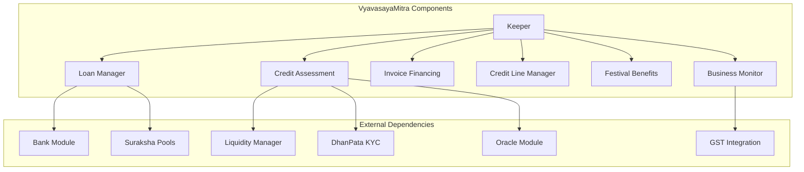
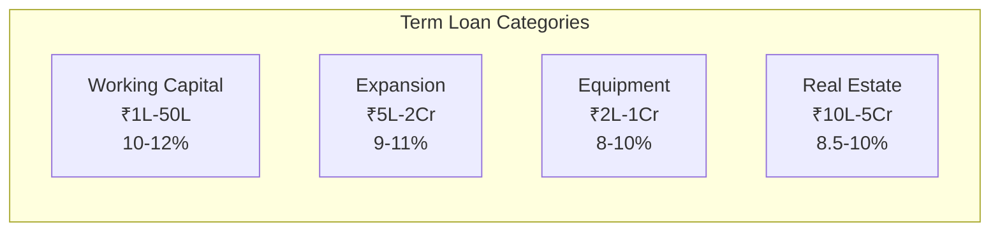
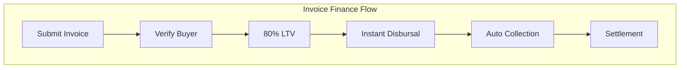
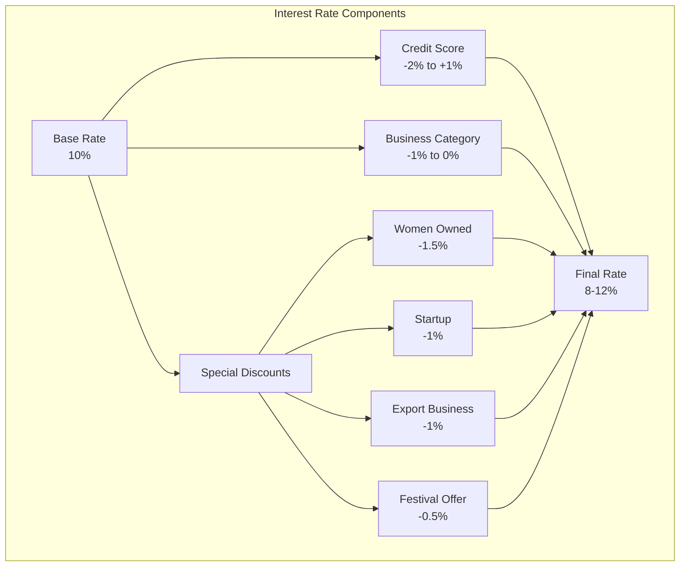
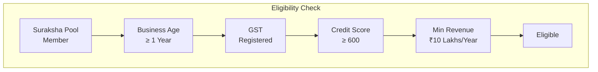
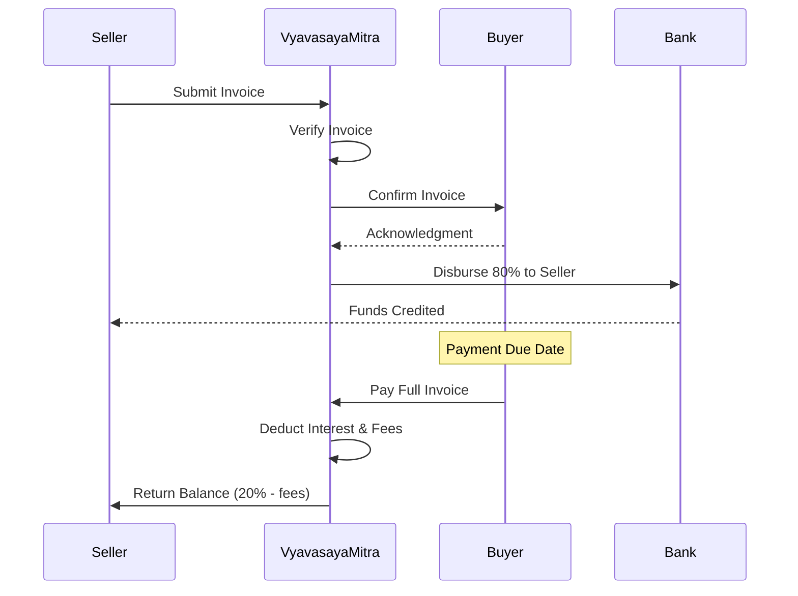
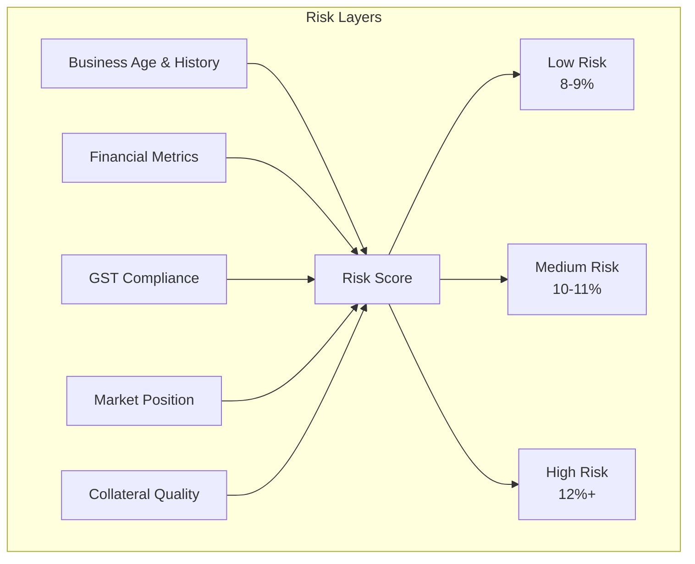

# VyavasayaMitra Module Documentation

## Overview

The VyavasayaMitra (Business Friend) module implements DeshChain's comprehensive business lending platform designed for SMEs and MSMEs. It offers competitive interest rates of 8-12% (compared to 15-24% from traditional sources), features invoice financing, credit lines, and special provisions for women entrepreneurs and startups, all while requiring Suraksha Pool membership for access.

## Module Architecture



## Business Loan Products

### 1. Term Loans



### 2. Invoice Financing



**Key Features**:
- 80% Loan-to-Value ratio
- Interest rates: 0.8-1.2% per month
- Maximum tenure: 90 days
- Automated collection tracking
- Buyer credit verification

### 3. Credit Line Facility

```go
type CreditLine struct {
    CreditLimit         sdk.Coin
    UtilizedAmount      sdk.Coin
    AvailableCredit     sdk.Coin
    ValidityDate        time.Time
    InterestRate        sdk.Dec
    IsActive            bool
    
    // Usage Tracking
    DrawdownHistory     []Drawdown
    RepaymentHistory    []Repayment
    UtilizationRate     sdk.Dec
}
```

**Benefits**:
- Pre-approved limit up to ₹1 Crore
- Draw funds as needed
- Pay interest only on utilized amount
- Revolving credit facility
- Lower rates than overdrafts

## Interest Rate Structure

### Base Rate Calculation



### Credit Score Impact

| Credit Score | Rate Adjustment | Risk Category |
|--------------|----------------|---------------|
| 800-900 | -2.0% | Excellent |
| 700-799 | -1.0% | Good |
| 650-699 | 0% | Average |
| 600-649 | +0.5% | Fair |
| Below 600 | +1.0% | High Risk |

## Business Categories & Benefits

### 1. Supported Business Types

```go
enum BusinessType {
    RETAIL          // Shops, stores
    MANUFACTURING   // Production units
    SERVICES        // Service providers
    TRADING         // Traders, distributors
    STARTUP         // New ventures
    MSME            // Micro, Small, Medium
    EXPORT          // Export businesses
    TECHNOLOGY      // Tech companies
}
```

### 2. Special Category Benefits

#### Women Entrepreneurs
```go
type WomenEntrepreneurBenefits struct {
    InterestDiscount    sdk.Dec   // 1.5% reduction
    ProcessingFeeWaiver bool      // 50% waiver
    CollateralRelaxation sdk.Dec  // 10% lower requirement
    MentorshipProgram   bool      // Free access
    NetworkingEvents    bool      // Priority invites
}
```

#### Startups
```go
type StartupBenefits struct {
    InterestDiscount    sdk.Dec   // 1% reduction
    MoratoriumPeriod    int32     // 6 months
    FlexibleRepayment   bool      // Step-up EMIs
    TechnicalSupport    bool      // Free consultancy
    IncubationAccess    bool      // Partner incubators
}
```

#### Export Businesses
```go
type ExportBenefits struct {
    InterestDiscount    sdk.Dec   // 1% reduction
    ForexProtection     bool      // Hedging support
    LetterOfCredit      bool      // LC facilitation
    ExportCredit        bool      // Pre/Post shipment
    PriorityProcessing  bool      // 24-hour approval
}
```

## Eligibility & Assessment

### Business Eligibility Criteria



### Credit Assessment Framework

```go
type CreditAssessment struct {
    // Business Metrics (40%)
    BusinessAge         int32     // Years in operation
    RevenueGrowth       sdk.Dec   // YoY growth
    ProfitMargins       sdk.Dec   // Net margins
    CashFlow            sdk.Dec   // Operating cash flow
    
    // Compliance (20%)
    GSTFilingScore      int32     // 0-100
    TaxCompliance       bool      // ITR filing
    StatutoryDues       bool      // No pending dues
    
    // Market Position (20%)
    MerchantRating      sdk.Dec   // 0-5 scale
    CustomerBase        int32     // Active customers
    MarketShare         sdk.Dec   // In segment
    
    // Financial Ratios (20%)
    DebtEquityRatio     sdk.Dec   // Leverage
    CurrentRatio        sdk.Dec   // Liquidity
    AssetTurnover       sdk.Dec   // Efficiency
    
    // Final Score
    CreditScore         int32     // 300-900
    RiskCategory        string    // Low/Medium/High
}
```

## Module Parameters

```go
type Params struct {
    // Interest Rates
    BaseInterestRate        sdk.Dec   // 0.10 (10%)
    MinInterestRate         sdk.Dec   // 0.08 (8%)
    MaxInterestRate         sdk.Dec   // 0.12 (12%)
    
    // Loan Limits
    MinLoanAmount           sdk.Int   // 100000 (₹1 Lakh)
    MaxTermLoan             sdk.Int   // 50000000 (₹5 Crore)
    MaxCreditLine           sdk.Int   // 10000000 (₹1 Crore)
    MaxInvoiceFinance       sdk.Int   // 5000000 (₹50 Lakhs)
    
    // Credit Line
    CreditUtilizationLimit  sdk.Dec   // 0.80 (80%)
    CreditLineValidity      int64     // 31536000 (1 year)
    
    // Invoice Finance
    InvoiceLTVRatio         sdk.Dec   // 0.80 (80%)
    MaxInvoiceTenure        int32     // 90 days
    InvoiceInterestRate     sdk.Dec   // 0.01 (1% per month)
    
    // Collateral
    MinCollateralRatio      sdk.Dec   // 1.50 (150%)
    CollateralTypes         []string  // ["property", "equipment", "inventory"]
    
    // Assessment
    MinCreditScore          int32     // 600
    MinBusinessAge          int32     // 12 months
    MinAnnualRevenue        sdk.Int   // 1000000 (₹10 Lakhs)
    
    // Special Discounts
    WomenDiscount           sdk.Dec   // 0.015 (1.5%)
    StartupDiscount         sdk.Dec   // 0.01 (1%)
    ExportDiscount          sdk.Dec   // 0.01 (1%)
}
```

## Invoice Financing System

### Invoice Finance Flow



### Invoice Verification

```go
type InvoiceFinancing struct {
    InvoiceID           string
    SellerID            string
    BuyerID             string
    InvoiceAmount       sdk.Coin
    InvoiceDate         time.Time
    DueDate             time.Time
    
    // Financing Details
    AdvanceAmount       sdk.Coin    // 80% of invoice
    InterestRate        sdk.Dec     // Monthly rate
    ProcessingFee       sdk.Coin
    
    // Verification
    BuyerConfirmed      bool
    DocumentHash        string
    GSTInvoiceNumber    string
    
    // Status
    Status              InvoiceStatus
    DisbursementDate    time.Time
    CollectionDate      time.Time
}
```

## Business Monitoring System

### Real-Time Business Tracking

```go
type BusinessMonitoring struct {
    BusinessID          string
    
    // Monthly Metrics
    MonthlyRevenue      sdk.Coin
    MonthlyExpenses     sdk.Coin
    CashBalance         sdk.Coin
    
    // GST Integration
    GSTFilingStatus     bool
    GSTSalesReported    sdk.Coin
    GSTPurchases        sdk.Coin
    
    // Growth Indicators
    RevenueGrowthRate   sdk.Dec
    CustomerGrowthRate  sdk.Dec
    
    // Risk Indicators
    DelayedPayments     int32
    BouncedCheques      int32
    LegalNotices        int32
    
    // Credit Behavior
    LoanUtilization     sdk.Dec
    RepaymentScore      int32
    
    LastUpdated         time.Time
}
```

## Festival Benefits System

### Dynamic Festival Offers

```go
type FestivalOffer struct {
    FestivalID          string
    FestivalName        string        // "Diwali", "Holi", etc.
    
    // Benefits
    InterestReduction   sdk.Dec       // 0.5-1% reduction
    ProcessingFeeWaiver sdk.Dec       // 50-100% waiver
    
    // Eligibility
    EligibleBusinessTypes []BusinessType
    EligiblePincodes    []string
    MinCreditScore      int32
    
    // Validity
    StartDate           time.Time
    EndDate             time.Time
    
    // Special Features
    InstantApproval     bool          // For eligible businesses
    HigherLoanAmount    sdk.Dec       // 20% increase in limit
}
```

## Transaction Types

### 1. MsgApplyBusinessLoan
Apply for a business term loan.

```go
type MsgApplyBusinessLoan struct {
    Applicant           string
    BusinessProfile     BusinessProfile
    LoanAmount          sdk.Coin
    LoanPurpose         LoanPurpose
    TenureMonths        int32
    CollateralOffered   []Collateral
    FinancialDocuments  []string
}
```

### 2. MsgRequestInvoiceFinance
Request financing against an invoice.

```go
type MsgRequestInvoiceFinance struct {
    Seller              string
    InvoiceDetails      Invoice
    BuyerID             string
    RequestedAdvance    sdk.Coin
    InvoiceDocument     string
}
```

### 3. MsgDrawFromCreditLine
Draw funds from approved credit line.

```go
type MsgDrawFromCreditLine struct {
    BusinessID          string
    CreditLineID        string
    DrawdownAmount      sdk.Coin
    Purpose             string
}
```

### 4. MsgUpdateBusinessMetrics
Update monthly business metrics.

```go
type MsgUpdateBusinessMetrics struct {
    BusinessID          string
    MonthlyRevenue      sdk.Coin
    MonthlyExpenses     sdk.Coin
    NewCustomers        int32
    GSTFiled            bool
    MetricsHash         string
}
```

### 5. MsgApplyFestivalOffer
Apply for special festival benefits.

```go
type MsgApplyFestivalOffer struct {
    BusinessID          string
    FestivalOfferID     string
    LoanType            string
    RequestedAmount     sdk.Coin
}
```

## Query Endpoints

### 1. QueryBusinessProfile
Get business profile and credit score.

**Request**: `/deshchain/vyavasayamitra/v1/business/{business_id}`

**Response**:
```json
{
  "profile": {
    "business_id": "BIZ-2024-001",
    "business_name": "ABC Traders",
    "business_type": "TRADING",
    "gst_number": "29ABCDE1234F1Z5",
    "credit_score": 720,
    "merchant_rating": 4.5,
    "is_women_owned": true,
    "annual_revenue": "5000000",
    "active_loans": 1,
    "total_borrowed": "2000000"
  }
}
```

### 2. QueryLoanOptions
Get available loan options for business.

**Request**: `/deshchain/vyavasayamitra/v1/loan-options/{business_id}`

**Response**:
```json
{
  "options": [
    {
      "loan_type": "TERM_LOAN",
      "max_amount": "5000000",
      "interest_rate": "8.5%",
      "max_tenure": 60,
      "special_benefits": ["women_discount", "festival_offer"]
    },
    {
      "loan_type": "INVOICE_FINANCE",
      "max_amount": "2000000",
      "ltv_ratio": "80%",
      "interest_rate": "1% per month"
    }
  ]
}
```

### 3. QueryCreditLine
Get credit line details.

**Request**: `/deshchain/vyavasayamitra/v1/credit-line/{credit_line_id}`

**Response**:
```json
{
  "credit_line": {
    "id": "CL-2024-001",
    "business_id": "BIZ-2024-001",
    "credit_limit": "1000000",
    "utilized_amount": "300000",
    "available_credit": "700000",
    "interest_rate": "9%",
    "validity_date": "2025-07-22",
    "utilization_rate": "30%"
  }
}
```

### 4. QueryInvoiceFinance
Get invoice financing details.

**Request**: `/deshchain/vyavasayamitra/v1/invoice/{invoice_id}`

**Response**:
```json
{
  "invoice_finance": {
    "invoice_id": "INV-2024-001",
    "invoice_amount": "500000",
    "advance_disbursed": "400000",
    "interest_rate": "1%",
    "due_date": "2024-09-15",
    "buyer_confirmed": true,
    "status": "ACTIVE"
  }
}
```

### 5. QueryFestivalOffers
Get active festival offers.

**Request**: `/deshchain/vyavasayamitra/v1/festival-offers`

**Response**:
```json
{
  "offers": [
    {
      "festival_id": "DIWALI-2024",
      "festival_name": "Diwali Prosperity Offer",
      "interest_reduction": "0.75%",
      "processing_fee_waiver": "100%",
      "valid_until": "2024-11-15",
      "eligible_businesses": ["RETAIL", "TRADING", "MANUFACTURING"]
    }
  ]
}
```

## Events

### 1. Business Loan Approved Event
```json
{
  "type": "business_loan_approved",
  "attributes": [
    {"key": "loan_id", "value": "BL-2024-001"},
    {"key": "business_id", "value": "BIZ-2024-001"},
    {"key": "loan_amount", "value": "3000000"},
    {"key": "interest_rate", "value": "8.5%"},
    {"key": "tenure_months", "value": "36"},
    {"key": "special_category", "value": "women_entrepreneur"}
  ]
}
```

### 2. Invoice Finance Disbursed Event
```json
{
  "type": "invoice_finance_disbursed",
  "attributes": [
    {"key": "invoice_id", "value": "INV-2024-001"},
    {"key": "seller", "value": "{address}"},
    {"key": "advance_amount", "value": "400000"},
    {"key": "buyer", "value": "Reliance Industries"},
    {"key": "due_date", "value": "2024-09-15"}
  ]
}
```

### 3. Credit Line Drawn Event
```json
{
  "type": "credit_line_drawn",
  "attributes": [
    {"key": "credit_line_id", "value": "CL-2024-001"},
    {"key": "drawdown_amount", "value": "200000"},
    {"key": "remaining_credit", "value": "500000"},
    {"key": "utilization_rate", "value": "50%"}
  ]
}
```

### 4. Business Metrics Updated Event
```json
{
  "type": "business_metrics_updated",
  "attributes": [
    {"key": "business_id", "value": "BIZ-2024-001"},
    {"key": "revenue_growth", "value": "15%"},
    {"key": "credit_score_change", "value": "+10"},
    {"key": "new_rating", "value": "4.6"}
  ]
}
```

## Risk Management

### Multi-Layer Risk Assessment



### Early Warning System

```go
type EarlyWarningIndicators struct {
    // Payment Behavior
    DelayedEMIs         int32
    AvgDelayDays        float64
    
    // Business Health
    RevenueDecline      bool
    GSTFilingDelays     int32
    NegativeCashFlow    int32    // Consecutive months
    
    // External Factors
    IndustryDownturn    bool
    LocationRisk        string
    
    // Action Triggers
    AlertLevel          string    // Green/Yellow/Red
    RequiredAction      string
}
```

## Integration Benefits

### 1. With Suraksha Pools
- Mandatory membership ensures commitment
- Shared liquidity reduces costs
- Community support during difficulties
- Better recovery rates

### 2. With GST System
- Real-time revenue verification
- Compliance monitoring
- Automated credit assessment
- Fraud prevention

### 3. With DhanPata
- Instant KYC verification
- Multi-signatory support
- Transaction history import
- Secure documentation

## Success Metrics

### Platform Performance
- Average interest rate: 9.5%
- Loan approval time: 48-72 hours
- Invoice finance TAT: 4 hours
- Default rate: <3%
- Women entrepreneur loans: 35%

### Business Impact
- Average interest savings: ₹2-5 Lakhs/year
- Business growth post-loan: 25-40%
- Job creation: 3-5 per loan
- Export growth: 30% for beneficiaries

## Best Practices

### For Businesses
1. **Maintain GST Compliance**: Improves credit score
2. **Update Metrics Monthly**: Better rates
3. **Build Credit History**: Start small
4. **Use Invoice Finance**: Better cash flow
5. **Apply During Festivals**: Extra benefits

### For Women Entrepreneurs
1. **Claim Benefits**: 1.5% discount automatic
2. **Network Events**: Attend priority events
3. **Mentorship**: Utilize free programs
4. **Certification**: Get women-owned certified
5. **Growth Planning**: Access consultancy

### For Platform Operators
1. **Risk Monitoring**: Daily assessment
2. **Festival Planning**: Prepare offers
3. **GST Integration**: Maintain sync
4. **Collection Efficiency**: Automate follows
5. **Member Verification**: Ensure pool membership

## CLI Commands

### Query Commands
```bash
# Query business profile
deshchaind query vyavasayamitra business [business-id]

# Check loan options
deshchaind query vyavasayamitra loan-options [business-id]

# View credit line
deshchaind query vyavasayamitra credit-line [credit-line-id]

# Check invoice finance
deshchaind query vyavasayamitra invoice [invoice-id]

# View festival offers
deshchaind query vyavasayamitra festival-offers
```

### Transaction Commands
```bash
# Apply for business loan
deshchaind tx vyavasayamitra apply-loan \
  --amount [amount] \
  --purpose [purpose] \
  --tenure [months] \
  --collateral [details] \
  --from [key]

# Request invoice finance
deshchaind tx vyavasayamitra invoice-finance \
  --invoice [details] \
  --buyer [id] \
  --amount [advance] \
  --from [key]

# Draw from credit line
deshchaind tx vyavasayamitra draw-credit \
  --credit-line [id] \
  --amount [amount] \
  --purpose [text] \
  --from [key]

# Update business metrics
deshchaind tx vyavasayamitra update-metrics \
  --revenue [amount] \
  --expenses [amount] \
  --gst-filed [true/false] \
  --from [key]
```

## FAQ

**Q: Why is Suraksha Pool membership mandatory?**
A: It ensures borrowers are committed community members, provides liquidity, and creates mutual accountability.

**Q: How quickly can I get invoice financing?**
A: Once buyer confirms, funds are disbursed within 4 hours.

**Q: What if my business is less than 1 year old?**
A: Check our startup category with special provisions and reduced documentation.

**Q: Can I get multiple types of loans?**
A: Yes, you can have term loan, credit line, and invoice financing simultaneously up to eligibility.

**Q: How are festival offers applied?**
A: Automatically applied to eligible applications during the festival period.

---

For more information, see the [Module Overview](../MODULE_OVERVIEW.md) or explore other [DeshChain Modules](../MODULE_OVERVIEW.md#module-categories).